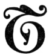

  
[Intangible Textual Heritage](../../index)  [New Thought](../index) 
[Index](index)  [Previous](tsoa26)  [Next](tsoa28) 

------------------------------------------------------------------------

[Buy this Book at
Amazon.com](https://www.amazon.com/exec/obidos/ASIN/1604590467/internetsacredte)

------------------------------------------------------------------------

[Buy this Book on
Kindle](https://www.amazon.com/exec/obidos/ASIN/B0025VL4BQ/internetsacredte)

------------------------------------------------------------------------

  
*The Secret of the Ages*, by Robert Collier, \[1926\], at Intangible
Textual Heritage

------------------------------------------------------------------------

p. 418 p. 419

### XVI

### Unappropriated Millions

"Somebody said that it couldn't be done,  
   But he with a chuckle replied  
 That 'maybe it couldn't,' but he would be one  
   Who wouldn't say so till he'd tried.  
 So he buckled right in with the trace of a grin  
   On his face. If he worried he hid it.  
 He started to sing as he tackled the thing  
   That couldn't be done, and he did it."  
                         —Edgar A.
Guest. [\*](#fn_9)

|                    |
|--------------------|
|  |

The main difference between the mind of
today and that of our great-great-grandfathers was that in their day
conditions were comparatively static, whereas today they are dynamic.
Civilization ran along for centuries with comparatively little change.
Most people lived and died in the places where they were born. They
followed

p. 420

their fathers’ avocations. Seldom, indeed, did one of them break out of
the class into which he had been born. Almost as seldom did they even
*think* of trying to. No wonder, then, that civilization made little
progress.

Today we are in the presence of continual change. Men are imbued with
that divine unrest which is never satisfied with conditions as they are,
which is always striving for improvement. And thought is the vital force
behind all this change.

Your ability to think is your connecting link with Universal Mind, that
enables you to draw upon It for inspiration, for energy, for power. Mind
is the energy in *static* form. Thought is the energy in *dynamic* form.

And because life is dynamic—not static; because it is ever moving
forward

p. 421

\[paragraph continues\] —not standing
still; your success or failure depends entirely upon the *quality* of
your thought.

For thought is creative energy. It brings into being the things that you
think. Think the things you would see manifested, see them, *believe*
them, and you can leave it to your subconscious mind to bring them into
being.

Your mind is a marvelous storage battery of power on which you can draw
for whatever things you need to make your life what you would have it
be. It has within it all power, all resource, all energy—but YOU are the
one that must use it. All that power is static unless you make it
dynamic. In the moment of creative thinking your conscious mind becomes
a Creator—it partakes of the power of Universal Mind. And there is
nothing static about one who

p. 422

shares that All-power. The resistless Life Energy within him pushes him
on to new growth, new aspirations. Just as the sap flowing through the
branches of the trees pushes off the old dead leaves to make way for the
new life, just so you must push away the old dead thoughts of poverty
and lack and disease, before you can bring on the new life of health and
happiness and unlimited supply.

This life is in all of us, constantly struggling for an outlet. Repress
it—and you die. Doctors will tell you that the only reason people grow
old is because their systems get clogged. The tiny pores in your
arteries get stopped up. You don't throw off the old. You don't struggle
hard enough, and the result is you fall an easy victim to failure and
sickness and death.

p. 423

Remember the story of Sinbad the Sailor, and the Old Man of the Sea? The
Old Man's weight was as nothing when Sinbad first took him on his
shoulders, but he clung there and clung there, slowly but surely sapping
Sinbad's strength, and he would finally have killed him as he had killed
so many others if Sinbad, by calling to his aid all his mental as well
as his physical resources, had not succeeded in shaking him off.

Most of us have some Old Man of the Sea riding us, and because he clings
tightly and refuses to be easily shaken off, we let him stay there,
sapping our energies, using up our vitality, when to rid us of him it is
only necessary to call to our aid ALL our resources, mental as well as
physical, for one supreme effort.

When a storm arises, the hardy mariner doesn't turn off steam and drift
helplessly

p. 424

before the wind. That might be the easy way, but that way danger lies.
He turns on more steam and fights against the gale. And so should you.
There is a something within you that thrives on difficulties. You prize
that more which costs an effort to win. You need to blaze new trails, to
encounter unusual hardships, in order to reach your hidden mental
resources, just as the athlete needs to exert himself to the utmost to
reach his "second wind."

Have you ever seen a turtle thrown on its back? For a while it threshes
around wildly, reaching for something outside to take hold of that shell
put it on its feet. Just as we humans always look for help outside
ourselves first. But presently he draws all his forces within his shell,
rests a bit to regain his strength, and then throws his whole

p. 425

force to one side—legs, head, tail, and all—*and over he goes!*

So it is with us. When we realize that the power to meet any emergency
is within ourselves, when we stop looking outside for help and
intelligently call upon Mind in our need, we shall find that we are
tapping Infinite Resource. We shall find that we have but to center all
those resources on the one thing we want most—to get anything from life
that it has.

As Emerson put it, when we once find the way to get in touch with
Universal Mind we are—

". . . owner of the sphere,  
 Of the seven stars and the solar year,  
 Of Cæsar's hand and Plato's brain,  
 Of the Lord Christ's heart and Shakespeare's strain."

------------------------------------------------------------------------

### Footnotes

[419:\*](tsoa27.htm#fr_9) From "The Path to
Home." The Reilly & Lee Co.

------------------------------------------------------------------------

[Next: XVII. The Secret of Power](tsoa28)
