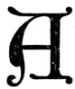

  
[Intangible Textual Heritage](../../index)  [New Thought](../index) 
[Index](index)  [Previous](tsoa31)  [Next](tsoa33) 

------------------------------------------------------------------------

[Buy this Book at
Amazon.com](https://www.amazon.com/exec/obidos/ASIN/1604590467/internetsacredte)

------------------------------------------------------------------------

[Buy this Book on
Kindle](https://www.amazon.com/exec/obidos/ASIN/B0025VL4BQ/internetsacredte)

------------------------------------------------------------------------

  
*The Secret of the Ages*, by Robert Collier, \[1926\], at Intangible
Textual Heritage

------------------------------------------------------------------------

p. 457

p. 458 p. 459

### XIX

### The Master Mind

"One who never turned his back but marched breast forward,  
 Never doubted clouds would break,  
 Never dreamed though right were worsted  
 Wrong would triumph,  
 Held we fall to rise, are baffled to fight better,  
 Sleep to wake."  
                                    —BROWNING.

|                    |
|--------------------|
|  |

Among your friends there is one of those
men who doesn't have much use for the word "can't." You marvel at his
capacity for work. You'll admire him the more the longer you know him.

You'll always respect him.

For he not only has made good, but he always will make good. He has
found and appropriated to himself the

p. 460

\[paragraph continues\] "Talisman of
Napoleon"—*absolute confidence in himself*.

The world loves a leader. All over the world, in every walk of life,
people are eagerly seeking for some one to follow. They want some one
else to do their thinking for them; they need some one to hearten them
to action; they like to have some one else on whom to lay the blame when
things go wrong; they want some one big enough to share the glory with
them when success crowns his efforts.

But to instill confidence in them, that leader must have utter
confidence in himself. A Roosevelt or a Mussolini who did not believe in
himself would he inconceivable. It is that which makes men
invincible—the Consciousness of their own Power. They put no limit upon
their own capacities—therefore

p. 461

they have no limit. For Universal Mind sees all, knows all, and can do
all, and we share in this absolute power to the exact extent to which we
permit ourselves. Our mental attitude is the magnet that attracts from
Universal Mind everything we may need to bring our desires into being.
We make that magnet strong or weak as we have confidence in or doubt of
our abilities. We draw to ourselves unlimited power or limit ourselves
to humble positions according to our own beliefs.

A long time ago Emerson wrote: "There is one mind common to all
individual men. Every man is an inlet to the same *and to all* of the
same. He that is once admitted to the right of reason is made a freeman
of the whole estate. What Plato has thought, he may think; what a saint
has felt, he may feel;

p. 462

what at any time has befallen any man, he can understand. Who hath
access to this Universal Mind, *is a party to all that is or can be
done*, for this is the only and sovereign agent."

The great German physicist, Nernst, found that the longer an electric
current was made to flow through a filament of oxide of magnesium, the
greater became the conductivity of the filament.

In the same way, the more you call upon and use your subconscious mind,
the greater becomes its conductivity in passing along to you the
infinite resources of Universal Mind. The wisdom of a Solomon, the skill
of a Michael Angelo, the genius of an Edison, the daring of a Napoleon,
*all* may be yours. It rests with you only to form the contact with
Universal Mind in order to draw from it what you will.

p. 463

Think of this power as something that you can connect with any time. It
has the answer to all of your problems. It offers you freedom from fear,
from worry, from sickness, from accident. No man and no thing can
interfere with your use of this power or diminish your spare of it. No
one, that is, but yourself.

Don Carlos Musser expresses it well in "You Are":

"Because of the law of gravitation the apple falls to the ground.
Because of the law of growth the acorn becomes a mighty oak. Because of
the law of causation, a man is 'as he thinketh in his heart.' Nothing
can happen without its adequate cause."

Success does not come to you by accident. It comes as the logical result
of the operation of law. Mind, working

p. 464

through your brain and your body, makes your world. That it is not a
better world and a bigger one, is due to your limited thoughts and
beliefs. They dam back the flood of ideas that Mind is constantly
striving to manifest through you. God never made a failure or a nobody.
He offers to the highest and the lowest alike, all that is necessary to
happiness and success. The difference is entirely in the extent to which
each of us AVAILS himself of that generosity.

There is no reason why you should hesitate to aspire to any position,
any honor, any goal, for the Mind within you is fully able to meet any
need. It is no more difficult for it to handle a great problem than a
small one. Mind is just as much present in your little everyday affairs
as in those of a big business or a great nation. Don't set it doing
trifling

p. 465

rums in arithmetic when it might just as well be solving problems of
moment to yourself and the world.

*Start something!* Use your initiative. Give your mind something to work
upon. The greatest of all success secrets is initiative. It is the one
quality which more than any other has put men in high places.

Conceive something. Conceive it first in your own mind. Make the pattern
there and your subconscious mind will draw upon the plastic substance or
energy all about you to make that model real.

Drive yourself. Force yourself. It is the dreamer, the man with
imagination, who has made the world move. Without him, we would still be
in the Stone Age.

Galileo looked at the moon and dreamed of how he might reach it. The
telescope was the fruition of that dream.

p. 466

\[paragraph continues\] Watt dreamed of
what might be done with steam—and our great locomotives and engines of
today are the result. Franklin dreamed of harnessing the lightning—and
today we have man-made thunderbolts.

Initiative, plus imagination, will take you anywhere. Imagination opens
the eyes of the mind, and there is nothing good you can image there that
is not possible of fulfillment in your daily life.

Imagination is the connecting link between the human and the Divine,
between the formed universe and formless energy. It is, of all things
human, the most God-like. It is our part of Divinity. Through it we
share in the creative power of Universal Mind. Through it we can turn
the most drab existence into a thing of life and beauty. It is the means
by which we avail ourselves

p. 467

of all the good which Universal Mind is constantly offering to us in
such profusion. It is the means by which we can reach any goal, win any
prize.

What was it gave us the submarine, the aeroplane, wireless, electricity?
Imagination. What was it that enabled man to build the Simplon Tunnel,
the Panama Canal, the Hell Gate span? Imagination. What is it that makes
us successful and happy, or poor and friendless? Imagination—or the lack
of it.

It was imagination that sent Spanish and English and French adventurers
to this new world. It was imagination that urged the early settlers
westward—ever westward. It was imagination that built out railroads, our
towns, our great cities.

Parents foolishly try to discourage imagination in their children, when
all it needs is proper guidance. For imagination

p. 468

forms the world from which their future will take its shape. Restrain
the one and you constrict the other. Develop the one in the right way,
and there is no limit to the other. Uncontrolled, the imagination is
like a rudderless ship. Or even, at times, like the lightning. But
properly controlled, it is like the ship that carries riches from port
to port. Or like the electric current, carrying unlimited power for
industry and progress.

Do you want happiness? Do you want success? Do you want position, power,
riches? *Image them!* How did God first make man? "In his image created
He him." He "imaged" man in His Mind.

And that is the way everything has been made since time began. It was
first imaged in Mind. That is the way everything

p. 469

you want must start—with a mental image.

So use your imagination! Picture in it your Heart's Desire. Imagine
it—daydream it so vividly, so clearly, that you will actually BELIEVE
you HAVE it. In the moment that you carry this conviction to your
subconscious mind—in that moment your dream will become a reality. It
may be a while before you realize it, but the important part is done.
You have created the model. You can safely leave it to your subconscious
mind to do the rest.

When Jesus adjured His disciples—"Whatsoever ye desire, when ye pray,
believe that ye RECEIVE it," He was not only telling them a great truth,
but he was teaching what we moderns would call excellent psychology as
well. For this "belief" is what acts upon the subconscious

p. 470

mind. It is through this "belief" that formless energy is compressed
into material form.

Every man wants to get out of the rut, to grow, to develop into
something better. Here is the open road—open to you whether you have
schooling, training, position, wealth, or not. Remember this: Your
subconscious mind knew more from the time you were a baby than is in all
the books in all the colleges and libraries of the world.

So don't let lack of training, lack of education, hold you back. Your
mind can meet every need—and will do so if you give it the chance. The
Apostles were almost all poor men, uneducated men, yet they did a work
that is unequalled in historical annals. Joan of Arc was a poor peasant
girl, unable to read or write—*yet she saved France!* The pages

p. 471

of history are dotted with poor men, uneducated men, who thought great
thoughts, who used their imaginations to master circumstances and became
rulers of men. Most great dynasties started with some poor, obscure man.
Napoleon came of a poor, humble family. He got his appointment to the
Military Academy only through very hard work and the pulling of many
political strings. Even as a Captain of Artillery he was so
poverty-stricken that he was unable to buy his equipment when offered an
appointment to India. Business today is full of successful men who have
scarcely the rudiments of ordinary education. It was only after he had
made his millions that Andrew Carnegie hired a tutor to give him the
essentials of an education.

So it isn't training and it isn't education

p. 472

that make you successful. These help, but the thing that really counts
is that gift of the Gods—*Creative Imagination!*

You have that gift. *Use it!* Make every thought, every fact, that comes
into your mind *pay you a profit*. Make it work and produce for you.
Think of things—not as they are but as they MIGHT be. Make them real,
live and interesting. Don't merely dream—but *CREATE!* Then use your
imagination to make that CREATION of advantage to mankind—and,
incidentally, yourself.

------------------------------------------------------------------------

[Next: XX. What Do You Lack?](tsoa33)
