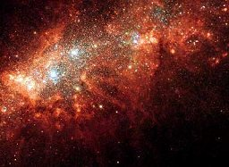

  
[Intangible Textual Heritage](../../index)  [New Thought](../index.md) 

------------------------------------------------------------------------

[Buy this Book on
Kindle](https://www.amazon.com/exec/obidos/ASIN/B002HWRL0Q/internetsacredte.md)

------------------------------------------------------------------------

<table width="75%">
<colgroup>
<col style="width: 50%" />
<col style="width: 50%" />
</colgroup>
<tbody>
<tr class="odd">
<td width="50%" data-valign="TOP"> 
Star formation in NGC 1569, Hubble Image [Public Domain Image]</td>
<td width="50%" data-valign="CENTER"><h1 id="in-tune-with-the-infinite" data-align="CENTER">In Tune With the Infinite</h1>
<h2 id="by-ralph-waldo-trine" data-align="CENTER">by Ralph Waldo Trine</h2>
<h4 id="section" data-align="CENTER">[1910]</h4></td>
</tr>
</tbody>
</table>

------------------------------------------------------------------------

[Contents](#contents)    [Start Reading](twi00.md)    [Page
Index](pageidx)    [Text \[Zipped\]](twi.txt.gz.md)

------------------------------------------------------------------------

|                                                                                                                           |
|---------------------------------------------------------------------------------------------------------------------------|
|  |

*When we are able to do away with all sense of separateness by living
continually in the realization of this oneness, not only will our bodily
ills and weaknesses vanish, but all limitations along all lines.*--[p.
86](twi07.htm#page_86.md)

This is a clearly written explanation of the New Thought philosophy.
Trine discusses how to tap into the power of the cosmos to impact
personal health, wealth, and growth. This book is essential reading for
anyone interested in this belief system.

------------------------------------------------------------------------

 [Title Page](twi00.md)  
[Front Matter](twi01.md)  
[Preface](twi02.md)  
[Contents](twi03.md)  
[Prelude](twi04.md)  
[I. The Supreme Fact of the Universe](twi05.md)  
[II. The Supreme Fact of Human Life](twi06.md)  
[IV. Fullness of Life—Bodily Health and Vigor](twi07.md)  
[V. The Secret, Power, and Effects of Love](twi08.md)  
[VI. Wisdom and Interior Illumination](twi09.md)  
[VII. The Realization of Perfect Peace](twi10.md)  
[VIII. Coming into Fullness of Power](twi11.md)  
[IX. Plenty of All Things—The Law of Prosperity](twi12.md)  
[X. How Men Have Become Prophets, Seers, Sages, and Saviours](twi13.md)  
[XI. The Basic Principle of All Religions—The Universal
Religion](twi14.md)  
[XII. Entering Now Into the Realization of the Highest Riches](twi15.md)  
