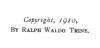

  
[Intangible Textual Heritage](../../index)  [New Thought](../index.md) 
[Index](index)  [Next](twi01.md) 

------------------------------------------------------------------------

[Buy this Book on
Kindle](https://www.amazon.com/exec/obidos/ASIN/B002HWRL0Q/internetsacredte.md)

------------------------------------------------------------------------

  
*In Tune With the Infinite*, by Ralph Waldo Trine, \[1910\], at
Intangible Textual Heritage

------------------------------------------------------------------------

# IN TUNE WITH

# THE INFINITE

##### OR, FULLNESS OF PEACE

##### POWER AND PLENTY

###### BY

## RALPH WALDO TRINE

#### NEW YORK

#### DODGE PUBLISHING COMPANY

#### 220 EAST TWENTY-THIRD STREET

#### \[1910\]

Scanned, proofed, and formatted at Intangible Textual Heritage, January
2007, by John Bruno Hare. This text is in the public domain in the
United States because it was published prior to 1923.

  [  
Click to enlarge](img/cover.jpg.md)  
Cover and Spine  

  [  
Click to enlarge](img/jacket.jpg.md)  
Dust Jacket  

 
[  
Click to enlarge](img/front.jpg.md)  
Frontispiece  

  [  
Click to enlarge](img/title.jpg.md)  
Title Page  

 
[  
Click to enlarge](img/verso.jpg.md)  
Verso  

Copyright, 1910,

BY RALPH WALDO TRINE.

------------------------------------------------------------------------

[Next: Front Matter](twi01.md)
