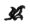

  
[Intangible Textual Heritage](../../index)  [New Thought](../index.md) 
[Index](index)  [Previous](twi00)  [Next](twi02.md) 

------------------------------------------------------------------------

[Buy this Book on
Kindle](https://www.amazon.com/exec/obidos/ASIN/B002HWRL0Q/internetsacredte.md)

------------------------------------------------------------------------

  
*In Tune With the Infinite*, by Ralph Waldo Trine, \[1910\], at
Intangible Textual Heritage

------------------------------------------------------------------------

##### IN TUNE WITH THE INFINITE

 

|                                                                                                                                                                                                                             |
|-----------------------------------------------------------------------------------------------------------------------------------------------------------------------------------------------------------------------------|
| Within yourself lies the cause of whatever enters into your life. To come into the full realization of your own awakened interior powers, is to be able to condition your life in exact accord with what you would have it. |

 

<table data-border="1" width="50%">
<colgroup>
<col style="width: 100%" />
</colgroup>
<tbody>
<tr class="odd">
<td data-valign="top" width="655">
BY RALPH WALDO TRINE

"<em>The Life Books</em>"

THE LAND OF LIVING MEN

WHAT ALL THE WORLD'S A-SEEKING

IN TUNE WITH THE INFINITE; or Fulness of Peace, Power and Plenty.

THIS MYSTICAL LIFE OF OURS 
A volume of selections for each week through the year, from the Author's complete works.

 

<em>The "Life" Booklets</em>

ON THE OPEN ROAD

THOUGHTS I MET ON THE HIGHWAY

THE WINNING OF THE BEST

THE GREATEST THING EVER KNOWN

EVERY LIVING CREATURE

CHARACTER-BUILDING THOUGHT POWER

 

<em>The Trine Calendar</em>

THE SUNLIT ROAD 
Selections for each week in the year

 

PUBLISHED IN NEW YORK BY DODGE PUBLISHING COMPANY
</td>
</tr>
</tbody>
</table>

(This material comes before the title page in the original book--JBH)

------------------------------------------------------------------------

[Next: Preface](twi02.md)
