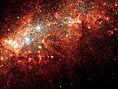

  
[Intangible Textual Heritage](../../index)  [New Thought](../index.md) 
[Index](index)  [Previous](twi02)  [Next](twi04.md) 

------------------------------------------------------------------------

[Buy this Book on
Kindle](https://www.amazon.com/exec/obidos/ASIN/B002HWRL0Q/internetsacredte.md)

------------------------------------------------------------------------

  
*In Tune With the Infinite*, by Ralph Waldo Trine, \[1910\], at
Intangible Textual Heritage

------------------------------------------------------------------------

p. 7

### CONTENTS

|        |                                                             |                           |
|--------|-------------------------------------------------------------|---------------------------|
|        |                                                             | PAGE                      |
| I.     | PRELUDE                                                     | [9](twi04.htm#page_9.md)     |
| II\.   | THE SUPREME FACT OF THE UNIVERSE                            | [11](twi05.htm#page_11.md)   |
| III\.  | THE SUPREME FACT OF HUMAN LIFE                              | [16](twi06.htm#page_16.md)   |
| IV\.   | FULLNESS OF LIFE—BODILY HEALTH AND VIGOR                    | [42](twi07.htm#page_42.md)   |
| V.     | THE SECRET, POWER, AND EFFECTS OF LOVE                      | [89](twi08.htm#page_89.md)   |
| VI\.   | WISDOM AND INTERIOR ILLUMINATION                            | [105](twi09.htm#page_105.md) |
| VII\.  | THE REALIZATION OF PERFECT PEACE                            | [135](twi10.htm#page_135.md) |
| VIII\. | COMING INTO FULLNESS OF POWER                               | [151](twi11.htm#page_151.md) |
| IX\.   | PLENTY OF ALL THINGS—THE LAW OF PROSPERITY                  | [176](twi12.htm#page_176.md) |
| X.     | HOW MEN HAVE BECOME PROPHETS, SEERS, SAGES, AND SAVIOURS    | [194](twi13.htm#page_194.md) |
| XI\.   | THE BASIC PRINCIPLE OF ALL RELIGIONS—THE UNIVERSAL RELIGION | [203](twi14.htm#page_203.md) |
| XII\.  | ENTERING NOW INTO THE REALIZATION OF THE HIGHEST RICHES     | [211](twi14.htm#page_211.md) |

------------------------------------------------------------------------

[Next: Prelude](twi04.md)
