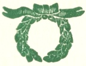
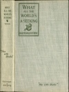
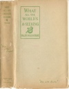
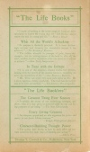
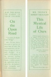
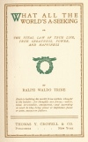
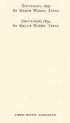

  
[Intangible Textual Heritage](../../index)  [New Thought](../index.md) 
[Index](index)  [Next](waws01.md) 

------------------------------------------------------------------------

[Buy this Book at
Amazon.com](https://www.amazon.com/exec/obidos/ASIN/0766101258/internetsacredte.md)

------------------------------------------------------------------------

*What All the World's A-Seeking*, by Ralph Waldo Trine, \[1896\], at
Intangible Textual Heritage

------------------------------------------------------------------------

p. ii

<table data-border="1" width="50%">
<colgroup>
<col style="width: 100%" />
</colgroup>
<tbody>
<tr class="odd">
<td data-valign="top" width="304">
By RALPH WALDO TRINE
</td>
</tr>
<tr class="even">
<td data-valign="top" width="304">
“<em>The Life Books</em>”

WHAT ALL THE WORLD ’S A-SEEKING

IN TUNE WITH THE INFINITE; or, Fulness of Peace, Power, and Plenty

THIS MYSTICAL LIFE OF OURS 
A volume of selections from complete works

ON THE OPEN ROAD 
Being some thoughts and a little creed of wholesome living

<em>The “Life” Booklets</em>

THE GREATEST THING EVER KNOWN

EVERY LIVING CREATURE

CHARACTER-BUILDING THOUGHT POWER

 
</td>
</tr>
<tr class="odd">
<td data-valign="top" width="304">
THOMAS Y. CROWELL &amp; CO.

NEW YORK
</td>
</tr>
</tbody>
</table>

p. iii

# WHAT ALL THE

# WORLD'S A-SEEKING

###### OR

## THE VITAL LAW OF TRUE LIFE, TRUE GREATNESS, POWER, AND HAPPINESS

 

###### BY

### RALPH WALDO TRINE

##### Each a building his world from within: thought is the builder.—for thoughts are forces,—subtle, vital, irresistible, omnipotent, and according as used do they bring power or impotence, peace or pain, success or failure.

#### THOMAS Y. CROWELL & CO.

#### PUBLISHERS NEW YORK

#### \[1896\]

Scanned at Intangible Textual Heritage, August 2007. Proofed and
formatted by John Bruno Hare. This text is in the public domain in the
United States because it was published prior to January 1st, 1923. These
files may be used for any purpose.

p. iv

COPYRIGHTS 1896  
BY RALPH WALDO TRINE

COPYRIGHT, 1899  
BY RALPH WALDO TRINE

 

 

 

 

FIFTY-FIFTH THOUSAND

[  
Click to enlarge](img/cover.jpg.md)  
Cover and Spine  

[  
Click to enlarge](img/jacket.jpg.md)  
Dust Jacket: Front and Spine  

[  
Click to enlarge](img/vjacket.jpg.md)  
Back of Dust Jacket  

[  
Click to enlarge](img/flaps.jpg.md)  
Dust Jacket Flaps  

[  
Click to enlarge](img/title.jpg.md)  
Title Page  

[  
Click to enlarge](img/verso.jpg.md)  
Verso  

DUST JACKET TEXT: BACK

#### "The Life Books"

"I know of nothing in the entire range of literature more calculated to
inspire the young than the Life Books,' and to renew the soul in young
and old."—From a Reader.

#### What All the World's A-Seeking

"Its purpose is distinctly practical. It is most fascinatingly written,
and deserves the remarkable success it has achieved."—*The Review of
Reviews*.

"The volume abounds in passages of great beauty and strength; but the
striking feature of the book is, after all, the solid, sensible, healthy
exposition of the one theme it is written to enforce."—*New York
Independent*.

#### In Tune with the Infinite

"It is one of the simplest, clearest works ever written, dealing with
the power of the interior forces in moulding the every-day conditions of
life."—*San Francisco Bulletin*.

"Mr. Trine can write well upon such topics as this. He is alive,
vigorous, cheery, confident. The work has distinctiveness in its style
and method."—*The Literary World*, London.

#### "The Life Booklets"

#### The Greatest Thing Ever Known

"It unfolds the secret of our underlying strength, and shoals what it is
that gives us power to fulfil 'the real and living purposes of our
being."—*The New Christianity*.

#### Every Living Creature

"An eloquent appeal and an able argument for justice and mercy to our
dumb fellow-creatures."—*Religio-Philosophical Journal*.

#### Character-Building Thought Power

"The author here shows us how by daily effort we may train ourselves
into right ways of thinking and acting."—Albany Press.

Thomas Y. Crowell & Co., Publishers, New York

DUST JACKET FLAP TEXT: FRONT

JUST THE BOOK  
TO CARRY IN  
YOUR POCKET

On  
the  
Open  
Road

"A creed of wholesome living."

Mr. Trine here chooses a series of texts born of daily life and
experience, and devotes a page or two to each thought. It is really a
little group of lay sermons dealing with the power of inner
forces—pithy, practical, optimistic, and inspired by the author's keen
sympathy and wide observation.

DUST JACKET FLAP TEXT: BACK

MR. TRINE'S  
RIPEST THOUGHT

This  
Mystical  
Life  
of Ours

"Will be eagerly welcomed by all readers of his well known books.
Selections from his writings have been grouped under subjects for every
week in the year. The writings of Mr. Trine are helpful and uplifting.
The plan of this book makes it particularly appropriate for a holiday
gift."

*Bookseller, Newsdealer and Stationer*.

"To have what the author himself regards as his best and ripest thought
chosen by himself, arranged in so convenient a fashion and issued in
such an artistically beautiful form—these features unite to make this
volume one of the most popular for thoughtful readers. "

*Reformed Church Messenger*.

------------------------------------------------------------------------

[Next: Preface](waws01.md)
