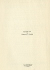

  
[Intangible Textual Heritage](../../index)  [New Thought](../index.md) 
[Index](index)  [Next](yfhu01.md) 

------------------------------------------------------------------------

  
*Your Forces and How to Use Them*, by Christian D. Larson, \[1912\], at
Intangible Textual Heritage

------------------------------------------------------------------------

p. 1

# YOUR FORCES AND HOW TO USE THEM

###### BY

## CHRISTIAN D. LARSON

###### Author of

##### "The Ideal Made Real," "The Great Within," "On The Heights," "Mastery of Fate," "Poise and Power," "How to Stay Young," "Mastery of Self," "How Great Men Succeed," "The Hidden Secret," "The Pathway of Roses," etc.

##### L. N. FOWLER & CO. 7 Imperial Arcade, Ludgate Circus LONDON, E. C.

#### THE NEW LITERATURE PUBLISHING COMPANY

#### CHICAGO.

#### \[1912\]

Scanned, Proofed and Formatted at Intangible Textual Heritage by John
Bruno Hare, July 2008. This text is in the public domain in the US
because it was published prior to 1923.

p. 2

Copyright 1912  
BY  
CHRISTIAN D. LARSON

P. F. PETTIBONE & CO.  
Printers and Binders  
Chicago

  [  
Click to enlarge](img/jacket.jpg.md)  
Dust Jacket  

  [  
Click to enlarge](img/cover.jpg.md)  
Front Cover and Spine  

  [  
Click to enlarge](img/title.jpg.md)  
Title Page  

 
[  
Click to enlarge](img/verso.jpg.md)  
Verso  

------------------------------------------------------------------------

[Next: Contents](yfhu01.md)
