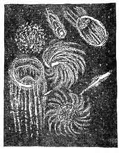

[Intangible Textual Heritage](../../index)  [Oahspe](../index.md) 

------------------------------------------------------------------------

<table width="75%">
<colgroup>
<col style="width: 50%" />
<col style="width: 50%" />
</colgroup>
<tbody>
<tr class="odd">
<td width="50%"></td>
<td width="50%"><h1 id="oahspe" data-align="CENTER">Oahspe</h1>
<h3 id="a-kosmon-bible-in-the-words-of-jehovih-and-his-angel-embassadors" data-align="CENTER">A Kosmon Bible in the Words of Jehovih and his Angel Embassadors</h3>
<h2 id="by-john-ballou-newbrough" data-align="CENTER">by John Ballou Newbrough</h2>
<h4 id="section" data-align="CENTER">[1882]</h4></td>
</tr>
</tbody>
</table>

------------------------------------------------------------------------

Oahspe, the product of automatic writing by a 19th century dentist named
John Ballou Newbrough, is a hallucinogenic reworking of cosmology and
ancient history. Written in a pseudo-archaic style, the narrative is
told from two viewpoints: that of heaven and earth. For a large part of
the book there are parallel texts from each point of view on the top and
bottom of the page (hence the page numbers 'a' and 'b').

There are many moving, lucid passages, dealing with ethical and
spiritual topics; however these must be sought out. For a large part,
Oahspe remains a sealed book. It uses a private vocabulary which is only
partially explained; and describes events of mysterious significance.
There are hundreds of pages about the deeds of a vast array of Gods and
Goddesses who roam the universe in enormous vessels. OED take note:
Newbrough was possibly the first to use the word 'Star-ship'. There are
tales of ancient prophets (such as Zoroaster, Jesus, Confucius, Moses,
etc.) which have practically no basis in any known mythology or history.
The [illustrations](oah04.md) are remarkable in that they presage
surrealism by several decades; maps and views of an incomprehensible
internal landscape.

This etext of Oahspe has been brought into conformance with the contents
of the third edition of 1912.

--J.B. Hare

------------------------------------------------------------------------

[Title Page](oah00.md)  
[Contents](oah01.md)  
[A General Statement Of The Contents Of Oahspe.](oah02.md)  
[Glossary Of Strange Words Used In This Book.](oah03.md)  
[List Of Plates](oah04.md)  
[List Of The Principal Prophets And Law-Givers](oah05.md)  
[Hints to the Reader](oah06.md)  
[Oahspe](oah07.md)  
[The Voice of Man](oah08.md)  

### Book of Jehovih

[Chapter I](oah09.md)  
[Chapter II](oah10.md)  
[Chapter III](oah11.md)  
[Chapter IV](oah12.md)  
[Chapter V](oah13.md)  
[Chapter VI](oah14.md)  
[Chapter VII](oah15.md)  
[Chapter VIII](oah16.md)  

### Book of Sethantes, Son of Jehovih

[Chapter I](oah17.md)  
[Chapter II](oah18.md)  
[Chapter III](oah19.md)  
[Chapter IV](oah20.md)  
[Chapter V](oah21.md)  
[Chapter VI](oah22.md)  
[Chapter VII](oah23.md)  
[Chapter VIII](oah24.md)  
[Chapter IX](oah25.md)  
[Chapter X](oah26.md)  
[Chapter XI](oah27.md)  
[Chapter XII](oah28.md)  
[Chapter XIII](oah29.md)  
[Chapter XIV](oah30.md)  
[Chapter XV](oah31.md)  
[Chapter XVI](oah32.md)  
[Chapter XVII](oah33.md)  
[Chapter XVIII](oah34.md)  
[Chapter XIX](oah35.md)  
[Chapter XX](oah36.md)  
[Chapter XXI](oah37.md)  
[Chapter XXII](oah38.md)  
[Chapter XXIII](oah39.md)  

### First Book of the First Lords

[Chapter I](oah40.md)  
[Chapter II](oah41.md)  
[Chapter III](oah42.md)  
[Chapter IV](oah43.md)  

### Book of Ah'shong, Son of Jehovih

[Chapter I](oah44.md)  
[Chapter II](oah45.md)  
[Chapter III](oah46.md)  
[Chapter IV](oah47.md)  
[Chapter V](oah48.md)  
[Chapter VI](oah49.md)  
[Chapter VII](oah50.md)  
[Chapter VIII](oah51.md)  
[Chapter IX](oah52.md)  

### Second Book of Lords

[Chapter I](oah53.md)  
[Chapter II](oah54.md)  

### Synopsis of Sixteen Cycles

[Chapter I](oah55.md)  
[Chapter II](oah56.md)  
[Chapter III](oah57.md)  

### Book of Aph, Son of Jehovih

[Chapter I](oah58.md)  
[Chapter II](oah59.md)  
[Chapter III](oah60.md)  
[Chapter IV](oah61.md)  
[Chapter V](oah62.md)  
[Chapter VI](oah63.md)  
[Chapter VII](oah64.md)  
[Chapter VIII](oah65.md)  
[Chapter IX](oah66.md)  
[Chapter X](oah67.md)  
[Chapter XI](oah68.md)  
[Chapter XII](oah69.md)  
[Chapter XIII](oah70.md)  
[Chapter XIV](oah71.md)  
[Chapter XV](oah72.md)  
[Chapter XVI](oah73.md)  
[Chapter XVII](oah74.md)  

### The Lord's First Book

[Chapter I](oah75.md)  
[Chapter II](oah76.md)  
[Chapter III](oah77.md)  

### Book of Sue, Son of Jehovih

[Chapter I](oah78.md)  
[Chapter II](oah79.md)  
[Chapter III](oah80.md)  
[Chapter IV](oah81.md)  
[Chapter V](oah82.md)  
[Chapter VI](oah83.md)  
[Chapter VII](oah84.md)  

### The Lords' Second Book

[Chapter I](oah85.md)  
[Chapter II](oah86.md)  
[Chapter III](oah87.md)  

### Book of Apollo, Son of Jehovih

[Chapter I](oah88.md)  
[Chapter II](oah89.md)  
[Chapter III](oah90.md)  
[Chapter IV](oah91.md)  
[Chapter V](oah92.md)  
[Chapter VI](oah93.md)  
[Chapter VII](oah94.md)  
[Chapter VIII](oah95.md)  
[Chapter IX](oah96.md)  
[Chapter X](oah97.md)  
[Chapter XI](oah98.md)  
[Chapter XII](oah99.md)  
[Chapter XIII](oah100.md)  
[Chapter XIV](oah101.md)  
[Chapter XV](oah102.md)  

### The Lord's Third Book

[Chapter I](oah103.md)  
[Chapter II](oah104.md)  
[Chapter III](oah105.md)  

### Book of Thor, Son of Jehovih

[Chapter I](oah106.md)  
[Chapter II](oah107.md)  
[Chapter III](oah108.md)  
[Chapter IV](oah109.md)  
[Chapter V](oah110.md)  
[Chapter VI](oah111.md)  

### The Lord's Fourth Book

[Chapter I](oah112.md)  
[Chapter II](oah113.md)  
[Chapter III](oah114.md)  
[Chapter IV](oah115.md)  

### Book of Osiris, Son of Jehovih

[Chapter I](oah116.md)  
[Chapter II](oah117.md)  
[Chapter III](oah118.md)  
[Chapter IV](oah119.md)  
[Chapter V](oah120.md)  
[Chapter VI](oah121.md)  
[Chapter VII](oah122.md)  
[Chapter VIII](oah123.md)  
[Chapter IX](oah124.md)  
[Chapter X](oah125.md)  
[Chapter XI](oah126.md)  
[Chapter XII](oah127.md)  
[Chapter XIII](oah128.md)  

### The Lord's Fifth Book

[Chapter I](oah129.md)  
[Chapter II](oah130.md)  
[Chapter III](oah131.md)  
[Chapter IV](oah132.md)  
[Chapter V](oah133.md)  
[Chapter VI](oah134.md)  
[Chapter VII](oah135.md)  

### Book of Fragapatti, Son of Jehovih

[Chapter I](oah136.md)  
[Chapter II](oah137.md)  
[Chapter III](oah138.md)  
[Chapter IV](oah139.md)  
[Chapter V](oah140.md)  
[Chapter VI](oah141.md)  
[Chapter VII](oah142.md)  
[Chapter VIII](oah143.md)  
[Chapter IX](oah144.md)  
[Chapter X](oah145.md)  
[Chapter XI](oah146.md)  
[Chapter XII](oah147.md)  
[Chapter XIII](oah148.md)  
[Chapter XIV](oah149.md)  
[Chapter XV](oah150.md)  
[Chapter XVI](oah151.md)  
[Chapter XVII](oah152.md)  
[Chapter XVIII](oah153.md)  
[Chapter XIX](oah154.md)  
[Chapter XX](oah155.md)  
[Chapter XXI](oah156.md)  
[Chapter XXII](oah157.md)  
[Chapter XXIII](oah158.md)  
[Chapter XXIV](oah159.md)  
[Chapter XXV](oah160.md)  
[Chapter XXVI](oah161.md)  
[Chapter XXVII](oah162.md)  
[Chapter XXVIII](oah163.md)  
[Chapter XXIX](oah164.md)  
[Chapter XXX](oah165.md)  
[Chapter XXXI](oah166.md)  
[Chapter XXXII](oah167.md)  
[Chapter XXXIII](oah168.md)  
[Chapter XXXIV](oah169.md)  
[Chapter XXXV](oah170.md)  
[Chapter XXXVI](oah171.md)  
[Chapter XXXVII](oah172.md)  
[Chapter XXXVIII](oah173.md)  
[Chapter XXXIX](oah174.md)  
[Chapter XL](oah175.md)  
[Chapter XLI](oah176.md)  
[Chapter XLII](oah177.md)  
[Chapter XLIII](oah178.md)  

### Book of God's Word

[Chapter I](oah179.md)  
[Chapter II](oah180.md)  
[Chapter III](oah181.md)  
[Chapter IV](oah182.md)  
[Chapter V](oah183.md)  
[Chapter VI](oah184.md)  
[Chapter VII](oah185.md)  
[Chapter VIII](oah186.md)  
[Chapter IX](oah187.md)  
[Chapter XI](oah188.md)  
[Chapter XII](oah189.md)  
[Chapter XIII](oah190.md)  
[Chapter XIV](oah191.md)  
[Chapter XV](oah192.md)  
[Chapter XVI](oah193.md)  
[Chapter XVII](oah194.md)  
[Chapter XVIII](oah195.md)  
[Chapter XIX](oah196.md)  
[Chapter XX](oah197.md)  
[Chapter XXI](oah198.md)  
[Chapter XXII](oah199.md)  
[Chapter XXIII](oah200.md)  
[Chapter XXIV](oah201.md)  
[Chapter XXV](oah202.md)  
[Chapter XXVI](oah203.md)  
[Chapter XXVII](oah204.md)  
[Chapter XXVIII](oah205.md)  
[Chapter XXIX](oah206.md)  
[Chapter XXX](oah207.md)  

### Book of Divinity

[Chapter I](oah208.md)  
[Chapter II](oah209.md)  
[Chapter III](oah210.md)  
[Chapter IV](oah211.md)  
[Chapter V](oah212.md)  
[Chapter VI](oah213.md)  
[Chapter VII](oah214.md)  
[Chapter VIII](oah215.md)  
[Chapter IX](oah216.md)  
[Chapter X](oah217.md)  
[Chapter XI](oah218.md)  
[Chapter XII](oah219.md)  
[Chapter XIII](oah220.md)  
[Chapter XIV](oah221.md)  
[Chapter XV](oah222.md)  
[Chapter XVI](oah223.md)  
[Chapter XVII](oah224.md)  
[Chapter XVIII](oah225.md)  

### Book of Cpenta-Armij, Daughter of Jehovih

[Chapter I](oah226.md)  
[Chapter II](oah227.md)  
[Chapter III](oah228.md)  
[Chapter IV](oah229.md)  
[Chapter V](oah230.md)  
[Chapter VI](oah231.md)  
[Chapter VII](oah232.md)  
[Chapter VIII](oah233.md)  
[Chapter IX](oah234.md)  
[Chapter X](oah235.md)  
[Chapter XI](oah236.md)  
[Chapter XII](oah237.md)  
[Chapter XIII](oah238.md)  

### God's First Book

[Chapter I](oah239.md)  
[Chapter II](oah240.md)  
[Chapter III](oah241.md)  
[Chapter IV](oah242.md)  
[Chapter V](oah243.md)  
[Chapter VI](oah244.md)  
[Chapter VII](oah245.md)  
[Chapter VIII](oah246.md)  
[Chapter IX](oah247.md)  
[Chapter X](oah248.md)  
[Chapter XI](oah249.md)  
[Chapter XII](oah250.md)  
[Chapter XIII](oah251.md)  
[Chapter XIV](oah252.md)  
[Chapter XV](oah253.md)  
[Chapter XVI](oah254.md)  
[Chapter XVII](oah255.md)  
[Chapter XVIII](oah256.md)  
[Chapter XIX](oah257.md)  
[Chapter XX](oah258.md)  
[Chapter XXI](oah259.md)  
[Chapter XXII](oah260.md)  
[Chapter XXIII](oah261.md)  
[Chapter XXIV](oah262.md)  
[Chapter XXV](oah263.md)  
[Chapter XXVI](oah264.md)  
[Chapter XXVII](oah265.md)  
[Chapter XXVIII](oah266.md)  

### Book of Wars Against Jehovih

[Chapter I](oah267.md)  
[Chapter II](oah268.md)  
[Chapter III](oah269.md)  
[Chapter IV](oah270.md)  
[Chapter V](oah271.md)  
[Chapter VI](oah272.md)  
[Chapter VII](oah273.md)  
[Chapter VIII](oah274.md)  
[Chapter IX](oah275.md)  
[Chapter X](oah276.md)  
[Chapter XI](oah277.md)  
[Chapter XII](oah278.md)  
[Chapter XIII](oah279.md)  
[Chapter XIV](oah280.md)  
[Chapter XV](oah281.md)  
[Chapter XVI](oah282.md)  
[Chapter XVII](oah283.md)  
[Chapter XVIII](oah284.md)  
[Chapter XIX](oah285.md)  
[Chapter XX](oah286.md)  
[Chapter XXI](oah287.md)  
[Chapter XXII](oah288.md)  
[Chapter XXIII](oah289.md)  
[Chapter XXIV](oah290.md)  
[Chapter XXV](oah291.md)  
[Chapter XXVI](oah292.md)  
[Chapter XXVII](oah293.md)  
[Chapter XXVIII](oah294.md)  
[Chapter XXIX](oah295.md)  
[Chapter XXX](oah296.md)  
[Chapter XXXI](oah297.md)  
[Chapter XXXII](oah298.md)  
[Chapter XXXIII](oah299.md)  
[Chapter XXXIV](oah300.md)  
[Chapter XXXV](oah301.md)  
[Chapter XXXVI](oah302.md)  
[Chapter XXXVII](oah303.md)  
[Chapter XXXVIII](oah304.md)  
[Chapter XXXIX](oah305.md)  
[Chapter XL](oah306.md)  
[Chapter XLI](oah307.md)  
[Chapter XLII](oah308.md)  
[Chapter XLIII](oah309.md)  
[Chapter XLIV](oah310.md)  
[Chapter XLV](oah311.md)  
[Chapter XLVI](oah312.md)  
[Chapter XLVII](oah313.md)  
[Chapter XLVIII](oah314.md)  
[Chapter XLIX](oah315.md)  
[Chapter L](oah316.md)  
[Chapter LI](oah317.md)  
[Chaper LII](oah318.md)  
[Chapter LIII](oah319.md)  
[Chapter LIV](oah320.md)  
[Chapter LV](oah321.md)  

### Book of Lika, Son of Jehovih

[Chapter I](oah322.md)  
[Chapter II](oah323.md)  
[Chapter III](oah324.md)  
[Chapter IV](oah325.md)  
[Chapter V](oah326.md)  
[Chapter VI](oah327.md)  
[Chapter VII](oah328.md)  
[Chapter VIII](oah329.md)  
[Chapter IX](oah330.md)  
[Chapter X](oah331.md)  
[Chapter XI](oah332.md)  
[Chapter XII](oah333.md)  
[Chapter XIII](oah334.md)  
[Chapter XIV](oah335.md)  
[Chapter XV](oah336.md)  
[Chapter XVI](oah337.md)  
[Chapter XVII](oah338.md)  
[Chapter XVIII](oah339.md)  
[Chapter XIX](oah340.md)  
[Chapter XX](oah341.md)  
[Chapter XXI](oah342.md)  
[Chapter XXII](oah343.md)  
[Chapter XXIII](oah344.md)  
[Chapter XXIV](oah345.md)  
[Chapter XXV](oah346.md)  
[Chapter XXVI](oah347.md)  

### Book of the Arc of Bon.

[Chapter I](oah348.md)  
[Chapter II](oah349.md)  
[Chapter III](oah350.md)  
[Chapter IV](oah351.md)  
[Chapter V](oah352.md)  
[Chapter VI](oah353.md)  
[Chapter VII](oah354.md)  
[Chapter VIII](oah355.md)  
[Chapter IX](oah356.md)  
[Chapter X](oah357.md)  
[Chapter XI](oah358.md)  
[Chapter XII](oah359.md)  
[Chapter XIII](oah360.md)  
[Chapter XIV](oah361.md)  
[Chapter XV](oah362.md)  
[Chapter XVI](oah363.md)  
[Chapter XVII](oah364.md)  
[Chapter XVIII](oah365.md)  
[Chapter XIX](oah366.md)  
[Chapter XX](oah367.md)  
[Chapter XXI](oah368.md)  
[Chapter XXII](oah369.md)  
[Chapter XXIII](oah370.md)  
[Chapter XXIV](oah371.md)  
[Chapter XXV](oah372.md)  
[Chapter XXVI](oah373.md)  
[Chapter XXVII](oah374.md)  
[Chapter XXVIII](oah375.md)  
[Chapter XXIX](oah376.md)  
[Chapter XXX](oah377.md)  
[Chapter XXXI](oah378.md)  

### God's Book of Ben

[The Nine Entities](oah379.md)  
[Chapter I](oah380.md)  
[Chapter II](oah381.md)  
[Chapter III](oah382.md)  
[Chapter IV](oah383.md)  
[Chapter V](oah384.md)  
[Chapter VI](oah385.md)  
[Chapter VII](oah386.md)  
[Chapter VIII](oah387.md)  
[Chapter IX](oah388.md)  
[Chapter X](oah389.md)  

### Book of Cosmology and Prophecy

[Plate 49](oah390.md)  
[Plate 50](oah391.md)  
[Plate 51](oah392.md)  
[Plate 52](oah393.md)  
[Plate 53](oah394.md)  
[Plate 54](oah395.md)  
[Plate 55](oah396.md)  
[Plate 56](oah397.md)  
[Plate 57](oah398.md)  
[Plate 58](oah399.md)  
[Plate 59](oah400.md)  
[Plate 60](oah401.md)  
[Chapter I](oah402.md)  
[Chapter II](oah403.md)  
[Chapter III](oah404.md)  
[Chapter IV](oah405.md)  
[Chapter V](oah406.md)  
[Chapter VI](oah407.md)  
[Chapter VII](oah408.md)  
[Chapter VIII](oah409.md)  
[Chapter IX](oah410.md)  
[Chapter X](oah411.md)  
[Chapter XI](oah412.md)  

### Book of Saphah

[Plate 62](oah413.md)  
[Plate 63](oah414.md)  
[Plate 64](oah415.md)  
[Se'moin](oah416.md)  
[Osiris](oah417.md)  
[Tablet of Biene](oah418.md)  
[Tablet of Kii](oah419.md)  
[Tablet of Emp'agatu](oah420.md)  
[Zerl](oah421.md)  
[Qadeth Iz](oah422.md)  
[Fonece](oah423.md)  
[I'hin](oah424.md)  
[Aribania'hiayaustoyi](oah425.md)  
[Ho'ed](oah426.md)  
[Chine. Zerl.](oah427.md)  
[Kii](oah428.md)  
[Port-Pan Algonquin](oah429.md)  
[Anubis](oah430.md)  
[Agoquim](oah431.md)  
[Baugh-Ghan-Ghad](oah432.md)  
[Emethachava](oah433.md)  
[Hi'dang](oah434.md)  
[M'hak](oah435.md)  
[Chamber of Adepts](oah436.md)  
[Chamber of Prophecy](oah437.md)  
[The Basis of the Ezra Bible](oah438.md)  
[Ahura'Mazda](oah439.md)  
[Basis of Vede](oah440.md)  
[Lords of the Hosts in Heaven](oah441.md)  
[Earthly History of the Faithists of the East](oah442.md)  

### Bon's Book of Praise

[ESK.](oah443.md)  
[TEK](oah444.md)  
[SAM](oah445.md)  
[SAR](oah446.md)  
[UNH](oah447.md)  
[YOKE](oah448.md)  
[RAK](oah449.md)  
[OTE](oah450.md)  
[TAUG](oah451.md)  
[VED](oah452.md)  
[SANG](oah453.md)  
[TUE](oah454.md)  
[AIEDS](oah455.md)  
[FUR](oah456.md)  
[SUT](oah457.md)  
[YAD](oah458.md)  
[ROE](oah459.md)  
[ROTH](oah460.md)  
[LAIS](oah461.md)  
[LOO](oah462.md)  
[SUAT](oah463.md)  
[YAT](oah464.md)  
[SIAS](oah465.md)  
[JAUS](oah466.md)  
[NIV](oah467.md)  
[VEN](oah468.md)  
[HARS](oah469.md)  
[TOO](oah470.md)  
[OR](oah471.md)  
[HOTH](oah472.md)  
[RUX](oah473.md)  
[GHOI](oah474.md)  
[DING](oah475.md)  
[GOWH](oah476.md)  
[ORD](oah477.md)  
[LEF](oah478.md)  
[E-O](oah479.md)  
[UX](oah480.md)  
[SPE](oah481.md)  
[YAD](oah482.md)  
[SON](oah483.md)  

### God's Book of Eskra

[Chapter I](oah484.md)  
[Chapter II](oah485.md)  
[Chapter III](oah486.md)  
[Chapter IV](oah487.md)  
[Chapter V](oah488.md)  
[Chapter VI](oah489.md)  
[Chapter VII](oah490.md)  
[Chapter VIII](oah491.md)  
[Chaper IX](oah492.md)  
[Chapter X](oah493.md)  
[Chapter XI](oah494.md)  
[Chapter XII](oah495.md)  
[Chapter XIII](oah496.md)  
[Chapter XIV](oah497.md)  
[Chapter XV](oah498.md)  
[Chapter XVI](oah499.md)  
[Chapter XVII](oah500.md)  
[Chapter XVIII](oah501.md)  
[Chapter XIX](oah502.md)  
[Chapter XX](oah503.md)  
[Chapter XXI](oah504.md)  
[Chapter XXII](oah505.md)  
[Chapter XXIII](oah506.md)  
[Chapter XXIV](oah507.md)  
[Chapter XXV](oah508.md)  
[Chapter XXVI](oah509.md)  
[Chapter XXVII](oah510.md)  
[Chapter XXVIII](oah511.md)  
[Chapter XXIX](oah512.md)  
[Chapter XXX](oah513.md)  
[Chapter XXXI](oah514.md)  
[Chapter XXXII](oah515.md)  
[Chapter XXXIII](oah516.md)  
[Chapter XXXIV](oah517.md)  
[Chapter XXXV](oah518.md)  
[Chapter XXXVI](oah519.md)  
[Chapter XXXVII](oah520.md)  
[Chapter XXXVIII](oah521.md)  
[Chapter XXXIX](oah522.md)  
[Chapter XL](oah523.md)  
[Chapter XLI](oah524.md)  
[Chapter XLII](oah525.md)  
[Chapter XLIII](oah526.md)  
[Chapter XLIV](oah527.md)  
[Chapter XLV](oah528.md)  
[Chapter XLVI](oah529.md)  
[Chapter XLVII](oah530.md)  
[Chapter XLVIII](oah531.md)  
[Chapter XLIX](oah532.md)  
[Chapter L](oah533.md)  
[Chapter LI](oah534.md)  
[Chapter LII](oah535.md)  
[Chapter LIII](oah536.md)  
[Chapter LIV](oah537.md)  
[Chapter LV](oah538.md)  
[Chapter LVI](oah539.md)  
[Chapter LVII](oah540.md)  
[Chapter LVIII](oah541.md)  
[Chapter LIX](oah542.md)  
[Chapter LX](oah543.md)  

### Book of Es, Daughter of Jehova

[Chapter I](oah544.md)  
[Chapter II](oah545.md)  
[Chapter III](oah546.md)  
[Chapter IV](oah547.md)  
[Chapter V](oah548.md)  
[Chapter VI](oah549.md)  
[Chapter VII](oah550.md)  
[Chapter VIII](oah551.md)  
[Chapter IX](oah552.md)  
[Chapter X](oah553.md)  
[Chapter XI](oah554.md)  
[Chapter XII](oah555.md)  
[Chapter XIII](oah556.md)  
[Chapter XIV](oah557.md)  
[Chapter XVI](oah558.md)  
[Chapter XVII](oah559.md)  
[Chapter XVIII](oah560.md)  
[Chapter XIX](oah561.md)  
[Chapter XX](oah562.md)  
[Chapter XXI](oah563.md)  

### Book of Judgement

[Chapter I](oah564.md)  
[Chapter II](oah565.md)  
[Chapter III](oah566.md)  
[Chapter IV](oah567.md)  
[Chatper V](oah568.md)  
[Chapter VI](oah569.md)  
[Chapter VII](oah570.md)  
[Chapter IX](oah571.md)  
[Chapter X](oah572.md)  
[Chapter XI](oah573.md)  
[Chapter XII](oah574.md)  
[Chapter XIII](oah575.md)  
[Chapter XIV](oah576.md)  
[Chapter XV](oah577.md)  
[Chapter XVI](oah578.md)  
[Chapter XVII](oah579.md)  
[Chapter XVIII](oah580.md)  
[Chapter XIX](oah581.md)  
[Chapter XX](oah582.md)  
[Chapter XXI](oah583.md)  
[Chapter XXII](oah584.md)  
[Chapter XXIII](oah585.md)  
[Chapter XXIV](oah586.md)  
[Chapter XXV](oah587.md)  
[Chapter XXVI](oah588.md)  
[Chapter XXVII](oah589.md)  
[Chapter XXVIII](oah590.md)  
[Chapter XXIX](oah591.md)  
[Chapter XXX](oah592.md)  
[Chapter XXXI](oah593.md)  
[Chapter XXXII](oah594.md)  
[Chapter XXXIII](oah595.md)  
[Chapter XXXIV](oah596.md)  
[Chapter XXXV](oah597.md)  
[Chapter XXXVI](oah598.md)  
[Chapter XXXVII](oah599.md)  
[Chapter XXXVIII](oah600.md)  
[Chapter XXXIX](oah601.md)  

### Book of Inspiration

[Chapter I](oah602.md)  
[Chapter II](oah603.md)  
[Chapter III](oah604.md)  
[Chapter IV](oah605.md)  
[Chapter V](oah606.md)  
[Chapter VI](oah607.md)  
[Chapter VII](oah608.md)  
[Chapter VIII](oah609.md)  
[Chapter IX](oah610.md)  
[Chapter X](oah611.md)  
[Chapter XI](oah612.md)  
[Chapter XII](oah613.md)  
[Chapter XIII](oah614.md)  
[Chapter XIV](oah615.md)  
[Chapter XV](oah616.md)  
[Chapter XVI](oah617.md)  
[Chapter XVII](oah618.md)  

### Book Of Jehovih's Kingdon On Earth

[Chapter I](oah619.md)  
[Chapter II](oah620.md)  
[Chapter III](oah621.md)  
[Chapter IV](oah622.md)  
[Chapter V](oah623.md)  
[Chapter VI](oah624.md)  
[Chapter VII](oah625.md)  
[Chapter VIII](oah626.md)  
[Chapter IX](oah627.md)  
[Chapter X](oah628.md)  
[Chapter XI](oah629.md)  
[Chapter XII](oah630.md)  
[Chapter XIII](oah631.md)  
[Chapter XIV](oah632.md)  
[Chapter XV](oah633.md)  
[Chapter XVI](oah634.md)  
[Chapter XVII](oah635.md)  
[Chapter XVIII](oah636.md)  
[Chapter XIX](oah637.md)  
[Chapter XX](oah638.md)  
[Chapter XXI](oah639.md)  
[Chapter XXII](oah640.md)  
[Chapter XXIII](oah641.md)  
[Chapter XXIX](oah642.md)  
[Chapter XXV](oah643.md)  
[Chapter XXVI](oah644.md)  

### Book of Discipline

[Chapter I](oah645.md)  
[Chapter II](oah646.md)  
[Chapter III](oah647.md)  
[Chapter IV](oah648.md)  
[Chapter V](oah649.md)  
[Chapter VI](oah650.md)  
[Chapter VII](oah651.md)  
[Chapter VIII](oah652.md)  
[Chapter IX](oah653.md)  
[Chapter X](oah654.md)  
[Chapter XI](oah655.md)  
[Chapter XII](oah656.md)  
[Chapter XIII](oah657.md)  
[Chapter XIV](oah658.md)  
