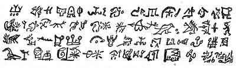
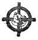

[Intangible Textual Heritage](../../index)  [Oahspe](../index.md) 
[Index](index)  [Previous](oah08)  [Next](oah10.md) 

------------------------------------------------------------------------

p. 6

# Book of Jehovih

### Chapter I

WHEREIN IS REVEALED THE THREE GREAT WORLDS, CORPOR, ATMOSPHEREA, AND
ETHEREA. AS IN OTHER BIBLES IT IS REVEALED THAT THE WORLD WAS CREATED,
SO IN THIS BIBLE IT IS REVEALED HOW THE CREATOR CREATED IT. AS OTHER
BIBLES HAVE PROCLAIMED HEAVENS FOR THE SPIRITS OF THE DEAD, BEHOLD, THIS
BIBLE REVEALETH WHERE THESE HEAVENS ARE, AND THE MANNER AND GLORY AND
WORK THAT THE SPIRITS OF THE DEAD ENJOY, WHEREBY THE WISDOM, POWER, LOVE
AND GLORY OF THE ALMIGHTY ARE MAGNIFIED FOR THE UNDERSTANDING OF MAN.

 

APOLOGY: "The universe is full; all things are members. Speech they
have: bid them speak. The recorder of the words be thou. Such is Panic
(Earth) language, the first language. What saith the bird? the beast?
the stars? the sun? All? It is their souls speaking. The soul hear thou,
and repeat it. This light leadeth thee to origin."

 

1\. ALL was. ALL is. ALL ever shall be. The ALL spake, and Motion was,
and is, and ever shall be; and, being positive, was called He and Him.
The ALL MOTION was His speech.

2\. He said, I AM! And He comprehended all things, the seen and the
unseen. Nor is there aught in all the universe but what is part of Him.

3\. He said, I am the soul of all; and the all that is seen is of My
person and My body.

4\. By virtue of My presence all things are. By virtue of My presence is
life. By virtue of My presence are the living brought forth into life. I
am the QUICKENER, the MOVER, the CREATOR, the DESTROYER. I am FIRST and
LAST.

5\. Of two apparent entities am I, nevertheless I AM BUT ONE. These
entities are the UNSEEN, which is POTENT, and the SEEN, which is of
itself IMPOTENT, and called CORPER.

6\. With these two entities, in likeness thereby of Myself, made I all
the living; for as the life is the potent part, so is the corporeal part
the impotent part.

7\. Chief over all that live on the earth I made Man; male and female
made I them. And that man might distinguish Me, I commanded him to give
Me a name; by virtue of my presence commanded I him. And man named Me
not after anything in heaven or on the earth. In obedience to My will
named he Me after the sounds the wind uttereth, and he said E-O-Ih!
Which is now pronounced Jehovih, and is written thus:

 

------------------------------------------------------------------------

[Next: Chapter II](oah10.md)
