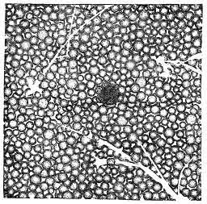

[Intangible Textual Heritage](../../index)  [Oahspe](../index) 
[Index](index)  [Previous](oah110)  [Next](oah112) 

------------------------------------------------------------------------

### Chapter VI

1\. AGAIN the earth and heaven prospered for another season of two
hundred years, and the next dan there were delivered five thousand
million souls. And new Gods and Lords succeeded; and they also
prospered, but not so well. The next harvest was four thousand million
souls.

2\. But, again, false Lords and false Gods began to set up kingdoms of
their own, in heaven, and in the cities of mortals. And, lo and behold,
every one called himself either Thor or Apollo. And the spirits who
manifested in the temples, and for the oracles, all gave one of these
names. And mortals who were obsessed, believed themselves to be the
re-incarnation of Apollo or Thor; and the obsessing spirits so called
themselves. Others, more intelligent, said: Have not the prophets
foretold there was to be a second coming of Apollo? And are not these
spirits, who appear through the sar'gis, the very person?

3\. So great became the superstition of the nations of the earth, that
in the fall of a leaf they found proof of the second coming of Apollo or
Thor. Many of the spirits deserted the second resurrection, in heaven,
and returned to the earth, to wait for information concerning the coming
event, as they supposed, though there was no event coming.

4\. Jehovih said: All corporeal worlds pass through the age of too much
belief. As I gave to man judgment, that he might examine and weigh a
matter, so runneth he into unbelief. Then My angels go to him and show
him wherein he believed too little; but, lo, he goeth to the other
extreme, believing all things, and not using his judgment.

5\. God said: Why will not men and angels be patient, and wait till a
matter is proven meritorious before they pursue it to extremes? The same
sun shineth, the same stars stand in the heavens, and the earth
traveleth steadily on her way; yea, her winds blow, her summers and
winters come as in the olden time, yet man setteth up that a great
wonder is near at hand. And no wonder cometh, and nothing new is near.

6\. How shall I stay them, O Jehovih? Their desires for Apollo call down
millions of spirits from my places of resurrection. And in trials and
hardships they fall, and become suitable prey for designing false Gods
and false Lords.

7\. But there came no other salutation than the echo of God's own words.
So God and his Lords bewailed the darkness of earth and her heavens.

8\. But high up in the etherean heavens, came the Light of Jehovih; came
the Voice of Jehovih, saying:

9\. Hear your Creator, O ye Gods and Goddesses! Behold the magnitude of
My works! I labor not for the profit of this man or that man; nay, nor
for this people nor that people; nor for the inhabitants of one star and
one heaven; but for the glory of millions of stars and millions of
heavens.

10\. Doth not one corporeal man bewail a shower of rain? and yet, his
neighbor rejoiceth thereat. One man prayeth for sunshine, and another
for shade. Think not that I labor for each one separately, but for the
perfection of the whole. Wherefore, then, shall the God of earth and his
Lords bewail the darkness that falleth on the earth in this day?

11\. I have prepared places of darkness in the etherean firmament, and
places of light; and My corporeal worlds must travel through them, for
so I created them. And these places of darkness and places of light are
as changes of seasons for My harvests.

12\. Now doth the earth pass in deep darkness, for I fructify the races
of men in new growth, corporeally, for things that shall come after. As
they absorb from the a'ji of My places, in this age, so, also, do their
souls become full of superstition and darkness.

13\. Thus went the earth into great darkness during the last six hundred
years of the cycle of Thor, and there was no harvest from her for the
etherean heavens. But the spirits deserted atmospherea in millions and
millions, and went down to the earth, to dwell with mortals, and to find
places on the corporeal earth where to live.

14\. And, save to the I'hins, the Light of Jehovih was shut out from
men; thus ambition for improvement was at an end; they became as drones
and vagabonds; and, when they died, their spirits continued to lie about
in the p. 140 places of their mortal life.
And many of these spirits persuaded mortals to suicide, and they killed
themselves by thousands and tens of thousands. Nor was there courage
more amongst men to endure anything under the sun. They wanted to be
with the spirits of the dead, to talk with them, to see them, and to be
rid of earth trials.

15\. Neither had the spirits that congregated on earth any knowledge of
the higher heavens; nor could they impart knowledge as to where they
dwelt, or how they employed their time, for, in fact, they did nothing
useful to heaven or earth, nor even to themselves.

16\. Thus ended the cycle of Thor; and it was three thousand two hundred
years.

END OF BOOK OF THOR.

 

   
Plate 7.--X'SAR'JIS

or end of the se'muan age, that is the tiem of the termination of
creating animal life. Jehovih said: Behold I quickened the earth with
living creatures; by My breath came forth all the living on the face of
the earth and in the waters thereof, and in the air above earth. And I
took the earth out of the dark regions, and brought her into the light
of My ethereal worlds. And I commanded the living to bring forth, by
cohabitation, every species after its own kind. And man was more dumb
and helpless than any other living creature. Jehovih spake unot the
angels that dwelt in His ethereal worlds, saying: Behold I have created
a new world like unto the places where ye were quickened into life; come
ye and enjoy it, and raise man upright and give him words of speech. For
these will also be angels in time to come. See Book of Jehovih, page 10,
verses 12, 13, 14.

------------------------------------------------------------------------

[Next: Chapter I](oah112)
