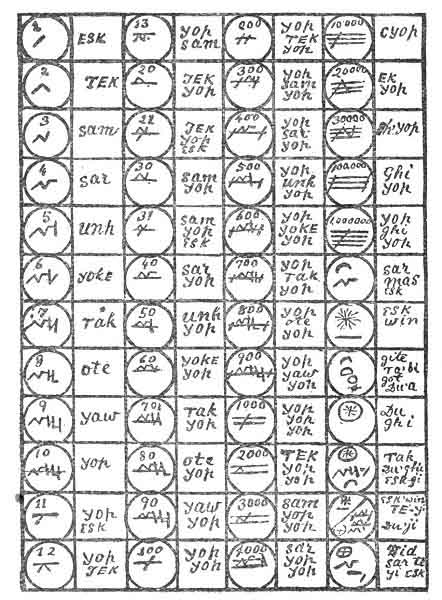

[Intangible Textual Heritage](../../index)  [Oahspe](../index.md) 
[Index](index)  [Previous](oah320)  [Next](oah322.md) 

------------------------------------------------------------------------

### Chapter LV

1\. OF the self-Gods of Uropa, and North and South Guatama, little need
be said. They established weak heavenly kingdoms and succeeded in
inciting mortals to war, but to no great destruction. Their heavenly
kingdoms were for the most part failures; their thrones were poor and
dilapidated almost from the start.

2\. Of these great divisions of the earth mortals were too scattered and
few to be profitable for false Gods. In Guatama they had not forgotten
the lessons of I'tura, the false God who p.
455 had ruined their forefathers. They were wary, and for the
most part preserved their allegiance to the Great Spirit.

3\. This much, then, of evil; now know ye of the good and faithful, and
of the changes of earth and heaven.

4\. By the pressure of ji'ay, Craoshivi had descended near the earth,
and some places bordered upon it. Darkness had overspread the land of
the earth in some regions for seven hundred years, so that the sun shone
not, save as a red ball of fire. And nebula fell in many places to a
depth of three lengths, so that even the places of the great cities of
the earth, which had been destroyed, were covered up, and it was like a
new country.

 

   
Plate 17. TABLET OF AH'IOD'ZAN. Numeration.

 

5\. The which was beneficial to Jehovih's angels, in assisting them to
deliver hosts of the chaotic spirits, whose mortal part fell in dread
war. For such was the labor of the true God in Craoshivi, Son of
Jehovih, and of his hosts of upraised angels. To gather in from every
quarter of earth and her heavens the fallen victims of the self-Gods; to
restore them to reason and to happier and holier scenes; and to teach
them righteousness and good works.

6\. Jehovih had said to God, His Son: Because one man can not lift up
the whole world he shall not grieve, nor cease doing what he can. For
his glory lieth in exerting himself to the full.

7\. Because the self-Gods have come against thee, they are against Me
also; because they have espoused to be Creators, and thus proclaimed
themselves for their own glory, they shall have their fill. Before these
times, the false Gods were content to proclaim p.
456 their own names; but lo and behold, they have made the Lord
God as the Creator, and set him up as a man, on a throne, to worship
him!

8\. And Te-in, and Sudga, and Osiris, too! All of woman born, and
knowing My breath upon them. Sufficient is it for thee, My Son, to
gather in the afflicted and distressed, and restore them and deliver
them in light and truth. Keep thou thy schools and colleges in heaven;
and thy nurseries and hospitals, and factories, and thy fleets of
swift-flying otevans and airavagnas. And send thou thy faithful
volunteers, and make the afflicted to rejoice and hold up their heads in
great joy.

9\. But to them that will not hear; and to them that curse thee and Me,
seeking to destroy Me for their own glory, be thou silent. My hand is
upon them. My ji'ay'an shower covereth earth and heaven. In their own
game shall they cast themselves in darkness and destruction.

10\. And all the while the self-Gods were at their evil deeds, the
Faithists, Jehovih's angels, worshippers of the Ever Present, All
Person, coursed the heavens along in their fire-ships, calling in the
persecuted children of Jehovih. Calling loud and cheerfully through the
heavens of the evil Gods, and over the kingdoms of the earth; calling in
these words:

11\. Come! Come! The Father's kingdom is free! Come! Come! In peace and
quietness thou shalt be thine own master! Behold, the Father's places
rise higher and higher! Not downward, to the lower kingdoms, nor to the
earth, nor to re-incarnation, the invented tale of drujas; but upward to
wisdom, goodness, love and happiness.

12\. Because ye have put away the All Person, ye have fallen in the
mire; ye have closed your eyes to yonder higher heaven. Come, O ye that
are in bondage! Cut loose from all! Fly to Him Who brought ye forth to
life! Disown the world! And self! And all the Gods and Saviors! Lords
and kings! Be Jehovih's! Sworn to peace and love! To good works and
righteousness!

13\. Come! Come! Our otevans are free! Our airiavagnas full of comfort.
O Come and be our loves! Be fellows, one with Jehovih.

14\. And they gathered in millions and thousands of millions! For
hundreds and hundreds of years they labored in the distracted regions of
hada; toiled and toiled till wearied and prostrate, tens of thousands of
times; then rested awhile, invigorated for more energetic work.

15\. But not alone nor unseen, these toiling millions, hundreds of
millions of Jehovih's angels, faithful Sons and Daughters. For the labor
built up their own spirits to be as very Gods and Goddesses in noble
endurance. Which was written in their fair faces, so the high-raised
messengers of far-off heavens, traveling past, beheld Jehovih's soul in
them. And so bore the news to other worlds of the darkness of the earth
and her evil Gods, and of the faithful, struggling hosts of Jehovih in
their up-hill work.

16\. And now the earth and her heavens crossed the boundaries of the
ji'ay'an forests, and rolled slowly towards the homes and dominions of
other etherean Gods.

END OF BOOK OF WARS AGAINST JEHOVIH.

------------------------------------------------------------------------

[Next: Chapter I](oah322.md)
