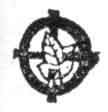
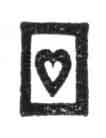
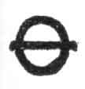
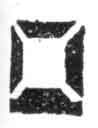
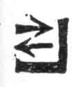
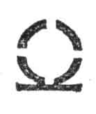
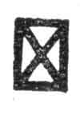
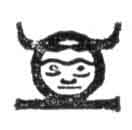

[Intangible Textual Heritage](../../index)  [Oahspe](../index.md) 
[Index](index)  [Previous](oah378)  [Next](oah380.md) 

------------------------------------------------------------------------

p. 541

## God's Book of Ben

THE NINE ENTITIES.

|                                                 |                                                                                                                                                            |
|-------------------------------------------------|------------------------------------------------------------------------------------------------------------------------------------------------------------|
|   | Jehovih, or Jehovih said: And is equivalent to THE ALL HIGHEST LIGHT. The All Knowledge.                                                                   |
|   | Tae, or Tae said: The word TAE is equivalent to the words, THE HIGHEST GENERAL EXPRESSION OF MANKIND, OR, THE UNIVERSAL VOICE WAS.                         |
|   | Corper, or corper said: Corpor signifieth whatever hath length, breadth and thickness.                                                                     |
|   | Uz, or Uz said: Uz is equivalent to THE VANISHMENT OF THINGS SEEN INTO THINGS UNSEEN. Uz is also equivalent to WORLDLINESS, or, world's people.            |
|   | Esfoma, or, Esfoma said: Equivalent to THERE IS SOMETHING IN THE WIND; or, AS THINGS SEEM TO INDICATE. Signs of the times.                                 |
|   | Es, or Es said: Equivalent to, THE UNSEEN WORLD, also to, SPIRIT WORLD. The testimony of angels. Also spirit.                                              |
|   | Ha'k, or Ha'k said: DARKNESS. Ignorance is ha'k. Darkness may be corporeal or spiritual. Dark ages; or, a time of anarchy and false philosophy.            |
|   | Kosmon, or, kosmon said: THE PRESENT ERA. All knowledge in possession of man, embracing corporeal and spiritual knowledge sufficiently proven.             |
|   | Seffas, or seffas said: Seffas is equivalent to, THE ESTABLISHED, or, THE ENFORCED; as the laws of the land, or, the religion of the land, as established. |

 

God said: These are the nine entities; or, according to the ancients,
Jehovih and His eight children, His Sons and Daughters. And these are
the same, which in all ages, poets and philosophers have made to speak
as, THE FAMILY OF THE UNIVERSE. Through them I speak. Jehovih is the
Light, that is, Knowledge. The manifestation of Knowledge in man is
Jehovih. The growth of wisdom in man, as the earth groweth older, is the
tree of light.

------------------------------------------------------------------------

[Next: Chapter I](oah380.md)
