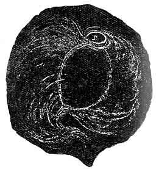
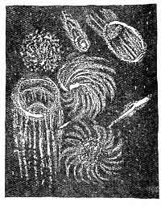
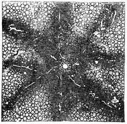

[Intangible Textual Heritage](../../index)  [Oahspe](../index) 
[Index](index)  [Previous](oah381)  [Next](oah383) 

------------------------------------------------------------------------

### Chapter III

1\. MAN said: Behold, I have struggled hard all my days, and met many
crosses and losses. To provide my son that he shall fare better, this is
goodness.

 

   
Plate 28.--FOURTH AGE OF VORTEX.  
Now called Inqua, a ball within a ball, or womb of vapour. (S, S,
satellites.)

p. 547

2\. Uz said: Vain man! Thou understandest not the creations. Thy trials,
thy losses and crosses, have built up thy soul. To provide thy son that
he shall have no trials, nor losses nor crosses, will not be good for
him. This will not be goodness. Give him experience.

3\. Man said: Then I will teach him to sin not. To tell no lies; to
steal not; to preserve his body pure. This is goodness.

4\. Uz said: What canst thou do, that is not a sin? What canst thou
teach, that is not falsehood?

5\. Thou paintest a picture, and sayest: Behold, this is my farm! In
this thou utterest falsehood. Thou givest a book to thy son, saying:
Here is a good book! This is also false. Can paper be good? Thou sayest:
Here is a book of wisdom! This is also false. Wisdom dwelleth not in
paper.

6\. How, then, canst thou teach thy son to tell no lies, since no man
can speak without lying?

7\. God said: One only is Truth, Jehovih. All else are false. One only
is without sin, Jehovih. All else do sin every day.

8\. Man said: To understand the laws of the universe, this is great
wisdom.

9\. Es inquired: What is a law of the universe?

10\. Man said: That an apple will fall to the ground.

11\. Uz said: By my hand the apple rotteth; the earth to the earth; but
moisture flieth upward.

12\. Jehovih said: By My touch the substance riseth up out of the earth
and becometh an apple. Sayest thou, law is My opposite?

13\. Man said: Why, then, there are two laws: one to make the apple rise
up and grow on a tree, and one to make it fall down again.

14\. Is this the creation? One law to pull one way, and another law in
another way?

15\. Can one law make one rose red, and another law make another rose
white? One law make one man good, and another law make another man bad?

16\. Jehovih said: I make no laws. Behold, I labor with Mine own hands.
I am everywhere present.

17\. Es said: All men may be likened unto green fruit, and on the way
toward ripeness.

18\. What more is man's earth life than a tree? It hath its winters and
summers for a season, and then the end cometh.

19\. Jehovih said: Behold, I created light and darkness, and one
followeth the other.

20\. I give dan to the earth for a season, and then I rain down ji'ay
for a season. Even so created I the soul of man; to-day, light and
joyous; to-morrow in gloom and melancholy.

21\. Man inquired: How can I know if a thing be of God or if it be of
nature? What is Jehovih more than natural law?

 

   
Plate 39.--ORGANIC WARK,  
Within the Earth's atmosphere. The origin of meteors.

 

22\. Corpor answered: What is nature, O man? Why wilt thou use a name
for the members of my body?

23\. Behold, the trees are mine; the mountains and valleys; the waters
and every living thing, and everything that liveth not; they are me.

24\. Why sayest thou nature? Now I say unto thee, the soul of all things
is Jehovih; that which thou callest nature is but the corporeal part.

25\. Man said: I mean the laws of nature. Certain combinations under
p. 548 certain conditions give the same
result. This is law.

 

   
Plate 30.--JY'AY.  
The earth (white spot) in Jy'ay.

 

26\. God said: What hast thou gained by the word law, instead of the
word Jehovih? If that that doeth a thing, doth it of its own accord,
then it is alive, and wise withal. Therefore it is Jehovih.

27\. If it do it not of itself, then it is not the doer, but the
instrument. How, then, can law do anything? Law is dead; and the dead do
nothing.

28\. Within atmospherea, becometh organic and falleth to the earth.

29\. Wark in etherea becometh an a'ji'an cloud, and shattered.

30\. Men make laws, as betwixt themselves; these laws are rules
governing action, but they are not action itself.

31\. Jehovih is action. His actions are manifested in things thou seest.
He is Light and Life. All His things are a complete whole, which is His
Person.

------------------------------------------------------------------------

[Next: Chapter IV](oah383)
