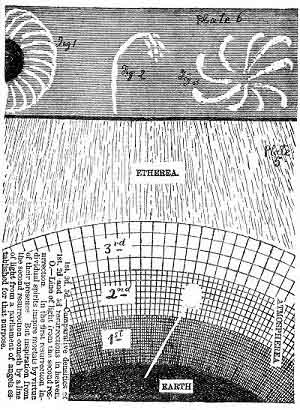

[Intangible Textual Heritage](../../index)  [Oahspe](../index.md) 
[Index](index)  [Previous](oah391)  [Next](oah393.md) 

------------------------------------------------------------------------

 

Plate 51.--Atmospherea correspondes to the place of actinic force in
preceding plate; etherea, to non-action. Figs. 1, 2, 3, enlarged
illustrations of the course and form of vortexian currents.

------------------------------------------------------------------------

[Next: Plate 52](oah393.md)
