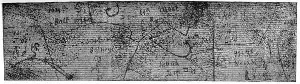
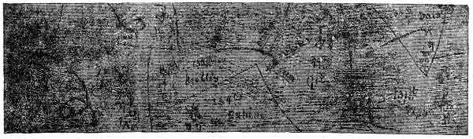

[Intangible Textual Heritage](../../index)  [Oahspe](../index.md) 
[Index](index)  [Previous](oah393)  [Next](oah395.md) 

------------------------------------------------------------------------

   
FIRST 3,000 YEARS. (CUT 1.)  
   
SECOND 3,000 YEARS. (CUT 2.)

Plate 53.--Travel of the great serpent during the first six thousand
years after man's creation. Showing also the Orian fields in etherea,
with their comparative densities and symbols.

------------------------------------------------------------------------

[Next: Plate 54](oah395.md)
