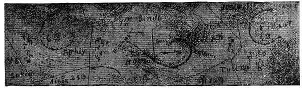
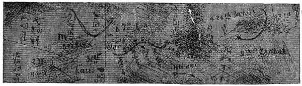

[Intangible Textual Heritage](../../index)  [Oahspe](../index.md) 
[Index](index)  [Previous](oah394)  [Next](oah396.md) 

------------------------------------------------------------------------

   
THIRD 3,000 YEARS (CUT 3.)  
   
FOURTH 3,000 YEARS (CUT 4.)

Plate 54.--Travel of the great serpent during the second six thousand
years after man's creation. Showing also the Orian fields in etherea,
with their comparative densities and symbols.

------------------------------------------------------------------------

[Next: Plate 55](oah396.md)
