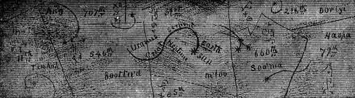
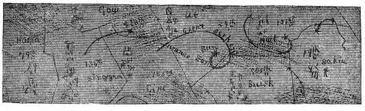

[Intangible Textual Heritage](../../index)  [Oahspe](../index.md) 
[Index](index)  [Previous](oah395)  [Next](oah397.md) 

------------------------------------------------------------------------

   
FIFTH 3,000 YEARS (CUT 5.)  
   
SIXTH 3,000 YEARS (CUT 6.)

 

Plate 55.--Travel of the great serpent during the third six thousand
years after the creation of man. Showing also the Orian fields in
etherea, with their comparative densities and symbols.

------------------------------------------------------------------------

[Next: Plate 56](oah397.md)
