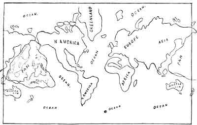

[Intangible Textual Heritage](../../index)  [Oahspe](../index) 
[Index](index)  [Previous](oah412)  [Next](oah414) 

------------------------------------------------------------------------

   
Plate 62--OUTLINE MAP SHOWING THE LOCALITY OF PAN, THE SUBMERGED
CONTINENT.

------------------------------------------------------------------------

[Next: Plate 63](oah414)
