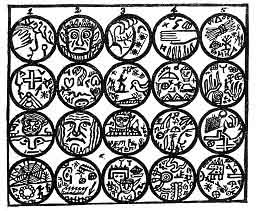
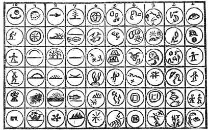

[Intangible Textual Heritage](../../index)  [Oahspe](../index.md) 
[Index](index)  [Previous](oah422)  [Next](oah424.md) 

------------------------------------------------------------------------

### Fonece

(THE SEVENTH DEGREE IN THE ORDER OF ISRAEL.)

 

   
Plate 78.--TABLET OF FONECE.  
\[Begin at 1, and read downward; then at 2, etc.\]

 

1\. MASTER: Who art thou?

2\. PUPIL: A Son of Light. Behold the sign and emblem.

3\. What sawest thou in the light?

4\. The altar of Eolin.

5\. What was the fashion thereof?

6\. The altar of incense and altar-fire rose up before me. The wind
ascended and the stars shone in the firmament. A tree grew by the
battlement and the black evil crossed the south-west. In the midst stood
the cross of Eolin, studded with pearls and diamonds.

7\. What more sawest thou?

8\. In the south-east floor of the temple, satan, black with the smoke
of blood and war, demanded my surrender. And he drew forth the flaming
sword.

9\. What didst thou?

10\. I said, I pray to none but the Ever Present Creator. In Him I have
faith. Thou I fear not.

11\. What next?

12\. I came to the chamber of industry and I was taught a useful trade.
After that I traveled north-west.

13\. And was honored for thy good work and love of peace, I suppose?

14\. Nay, Master. I was confronted by a crowned king. He bade me halt,
and ordered me to pray to the God he served. I remonstrated, saying: I
only pray to the Great Spirit, trusting only in good works done unto all
men. Thereupon he flew into a rage, saying: Thou art the worst of men;
thy soul shall feed the fires of hell. With that he hurled a javelin at
me.

15\. I escaped and traveled north, and came to a country most rich and
prosperous, where many Israelites had gone before me.

16\. Why didst thou not tarry there?

17\. I did, for a season, but warriors came and possessed the land and
drove the Israelites away.

18\. What next?

19\. I fled to the north-east, and came amongst savages, where I barely
escaped being slain and feasted upon.

20\. Which direction, then?

21\. I traveled east and came into a country old in religion and
philosophy. They had great riches for the rich and great poverty for the
poor. Their philosophers wasted their time in reading the ancients.

22\. Why didst thou not remain with them?

23\. I was too poor to live with the rich, and too ambitious to live
with the poor, who were little better than slaves.

24\. Whither next didst thou travel?

25\. Toward the north part of the middle kingdom, where I came amongst
magicians and necromancers.

26\. What of them?

27\. They consulted the stars, and the moon, and the palms of their
hands, and called up the spirits of the dead, who did appear before
them. There was no industry amongst them, and I could find no employment
with them. Neither did they assist one another.

28\. Where next?

29\. I went further south, where I came to an uninhabited country, the
most favored under the sun. It was a place of joy and praise, filled
with beautiful rivers, forests, plains and valleys, and countless
singing-birds, all things raising up the ceaseless voice of glory to
Great Eolin. Here I sat down and wept.

30\. What, wept in so fair a place?

31\. Alas, I remembered the crowded cities and warring empires. Here
there were no people, and I could not live alone, so I traveled still
further south.

32\. And certainly found a good place next?

33\. Alas, me. The country was good, the climate warm, and all things
grew abundantly without labor.

34\. And why not most excellent?

35\. Voluptuousness was an ocean for them to bathe in. And for all sins,
their priests taught them, that, if before they died, they called on
Daeves, Son of the sun and Savior of men, they would ascend to the upper
heavens on the third day after death. Not myself loving indolence nor
lust, I departed out of that country.

36\. Whither next?

37\. Toward the south-east, coming into a land afflicted with priests,
soldiers and beggars. So I fled further east.

38\. And what then?

39\. I came to a small settlement of Israelites where I was received by
warm hands. Here I prepared to settle down in peace during all my days.
But the state soon became attractive by its places of learning and the
beauty of the gardens and glory of its manufactories. There being no
idle people nor beggars amongst us, the idolaters of Hemah, Savior of
men, accused us falsely and then declared war on us, and with a powerful
army marched upon us, taking all our possessions. I escaped and turned
westward once more.

40\. Thy fate hath been hard. Why smilest thou?

41\. Because, however hard hath been my fate, it is nothing to that
which I saw had once befallen another people where I came next.

42\. What of them?

43\. This was a country once rich in ancient temples and monuments, but
now ruined and desolate. Broken pyramids and colonnades, tumbling walls,
and thorns and wolves, marked the once habitable places of mighty kings
and high priests. By the tablets on the moldering walls I read that
these people in ancient times long past were worshipers of idols and of
Gods who professed to save the souls of men. And I saw that their pride
and glory lay in ships of war and mighty weapons of death. Having myself
learned the trade of a potter, I took up an p.
616 ancient, ruined pot, and read this inscription on it: Because
I am a Faithist in the Great Spirit, Eolin, I am enslaved by these
idolaters. Alas, what is my crime?

 

   
Plate 79.  
\[Read downward, beginning with column 1. Refer to Se'moin and the other
tablets.\]

 

44\. Most pitiful place! Whence then?

45\. I met a friend whose head had been compressed in infancy in order
to make him a prophet. He took me into his private habitation and taught
me how the brain and nerves of flesh could be changed in infancy by
pressure to make the grown-up man of any character desired. Next he
taught me the monotony of sound that brings on the prophetic spell and
power to see the unseen. Thus did he expound the philosophy of miracles,
even to dying and coming to life again.

46\. Wonderful philosophy. Wilt thou show me some of these miracles?

47\. I will, O Master, but the secret of their workings I can not show.

(The pupil exhibits.)

48\. It is true, O friend! Surely, too, thou hast taught this wisdom to
the world?

49\. Nay; my teacher sent me south, to a school of prophets, where I
learned the mysteries of invocation and prayer.

50\. For what purpose hast thou visited my temple?

51\. To make pots.

52\. What, with all thy wisdom?

53\. A useful employment is the highest service to the Maker of all.

54\. Thou and thy people shall be my people; my harvests shall be thine;
and my gardens and orchards; for He whose eye seeth all, is upon me, and
I am His servant.

55\. There are three more chambers in my temple: The first preserveth
the wisdom of the ancients. The second is the chamber of industry and
inventions.

56\. In the third and last chamber are the secrets of the fullness of
worship. The name of this chamber is Om, because it is here the
recipients repose in spirit from all the cares of the earth.

(Signs and pass-words, and form of initiation, withheld from
publication, because the rites are still practiced.)

------------------------------------------------------------------------

[Next: I'hin](oah424.md)
