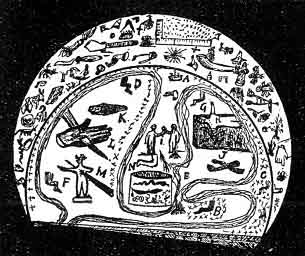

[Intangible Textual Heritage](../../index)  [Oahspe](../index.md) 
[Index](index)  [Previous](oah426)  [Next](oah428.md) 

------------------------------------------------------------------------

### Chine. Zerl.

INTERPRETATION.

1\. MASTER: Who art thou, and thy business?

2\. INITIATE: A weaver of fabric (or whatever labor he followeth) and
lover of wisdom. I have come to learn of the wisdom of the Gods and
Lords of heaven.

3\. For thy labor thou art honored by the Gods and Lord of heaven. But
erst thou canst learn of heaven thou shalt be proved in corporeal parts.
What are the elements?

4\. Earth, air and the other above the air.

5\. What is man and his destiny?

6\. Born of the earth, earthly; freed from the earth his inner part, the
soul, ascendeth and dwelleth in the soul of things.

7\. What, shall a dead man live?

8\. Yea, and rejoice that he so liveth. I have witnessed the souls of
men returned to the earth, reclothed in corporeal substance, and talked
with them face to face in presence of witnesses.

9\. Then thou fearest not to die?

10\. I am in the keeping of Hong-she, Savior of man.

11\. Who was Hong-she?

 

 

Plate 82.--A, Master. B, initiate. C, first gate. D, second gate. F,
third gate. G, fourth sacrifice. I, oath of allegiance. J, place of
death, represented by bones and skull. K, coffin. L, proof of
spirit-power to overcome pain. M, submission to have the body run
through with a lance. N, testimony that the initiate could endure all
corporeal torture unharmed. This is the inner circle. The outside or
body of the crescent representeth the jewels and places of the Gods and
Lords of heaven and their mortal representatives, together with the
tools, implements and kinds of industry to which each and every one was
assigned. These constituted the audience during the ceremonies, the
workers being stationed in the inner circle.

 

12\. The only begotten Son of the Unseen. He was the incarnate and
spiritual Son of the All Light of heaven and earth, born of the Virgin
Mi, who was descended from the far-off star, Tristya.

13\. For what purpose came He? And whither hath He gone?

14\. He was made by Great Eolin, Creator of all things, to take charge
of this corporeal world, which is His, to keep it forever. He abideth
still in spirit on this corporeal world.

15\. Where and when lived He?

16\. In the ancient days He lived in the far east.

17\. What was His labor?

18\. To do good. In Him was no evil; p. 620
He was the All First who taught the power of the spirit over the
corporeal part. All who have faith in Him, can also work miracles, nor
shall such persons ever die.

19\. What became of Him?

20\. First He was bound on the wheel of Eolin; but the spirits of heaven
unbound Him. Then His hands were thrust through with swords, but there
was no wound. He was then bound on an altar of sacrifice and burnt, but
His corporeal parts would not consume, and He walked forth unharmed.
Then a sword was thrust through His body, but it made no wound and gave
no pain. Then He was placed in a coffin and buried, but in three days he
rose up out of the grave and went forth preaching.

21\. What became of Him finally?

22\. He still abideth on the corporeal earth, and at times taketh on a
corporeal body and showeth Himself, He and His mother Mi, also.

23\. What did He preach?

24\. To do good unto others; to harm no man, woman, nor child, and to
pray only to the Great Eolin; to heal the sick by sacred words, and by
motions of the hand. It is to learn these sacred words and signs that I
have come to this holy temple.

25\. Before thou canst be intrusted with such signs and words, thou
shalt be proven on thy God and Savior, that thy faith be manifest. Know,
then, that although thou art blindfolded and seest not, yet thou art
surrounded by Gods and Lords of heaven and earth, and by a mortal priest
most holy and powerful. If thou hast faith in thine own words, and thus
knowest the Son of the Sun, thou hast little to fear. Follow, therefore,
thy attendants to the places of sacrifice, that we may bear testimony
that thou art holy. Remember, also, that all men must be tried, either
in the corporeal world or in the next; without this there is no
resurrection for them.

26\. I trust in Thee, O my Savior, Hong-she. Let the attendants lead me
forth.

(The initiate is then taken and bound down on the altar H. naked, and a
fire lighted under him, and he thrusteth his right arm down into the
flames until it be proved he hath power over fire and will not burn.)

27\. M.: By virtue of my power received from Hong-she, Son of the All
Light, Savior of men, I pronounce E'gau (i.e., he is Gau). Release him,
O ye Lords of the Heavenly Host. As the All Holy Savior of men
penetrateth the corporeal part, so shall the corporeal part be divided.

28\. I.: In Thee, O my Savior, God of this corporeal world, put I my
trust. Lead me forth, O ye of the corporeal earth, and prove my soul.

(He is next led to So-an, and there a sharp blade is thrust through his
hand and withdrawn, and, if proved, there is no wound nor blood.)

29\. M.: By Thy Light, Hong-she, descended in Fo'e'tse, angel messenger
of the corporeal world, this is my brother of Chine and legion of Zerl.
But yet a greater gift hast Thou for him. Lead him forth, O ye Lords of
the corporeal world, and thrust a sword through his body.

30\. I.: Go forth, O ye Lords of the corporeal world, ye know not what
manner the spirit is of. Forgive them, O Almighty, Hong-she, Son of
Eolin, Creator of worlds. This is Thy body, this Thy blood. Let them eat
and drink of them, in remembrance of Thee. Thy hand will deliver; my
soul shall never die!

(A sword is then thrust through the body and withdrawn, but there is no
wound nor blood.)

31\. I.: In remembrance of Him do I these things. Behold the power of
faith. By faith the All Creator created.

32\. M.: By thy words shalt thou be proven. O ye Lords of the corporeal
world, bring him sand and water and a veil. By His command shall a rose
bloom in our midst.

33\. I.: O Thou, Hong-she, only first begotten Son of Du'e Mi, Mother of
Eolin, Spouse of the All Light, offspring of the Creator of worlds, give
me of Thy power for the blessings of the corporeal world.

(Sand and water and a veil are brought before him, and he covereth the
sand and water with the veil and repeateth thus:)

34\. I.: As Gau from nothing sprang and stood triumphant on the
corporeal world; so, forth, come thou, the fibre of corporeal parts, and
clothe the spirit-rose mine eyes behold.

(The rose or roses are then beholden, fresh grown amid the sand and
water.)

35\. M.: This day Thee I crown my brother He'den'loo (Magi), of the
Savior empowered on the corporeal earth to dwell by holy land and water!

(The initiate then taketh of the water and sand and sprinkleth the
attendants.)

36\. I.: This is My blood and My Body, saith Hong-she, the All
Quickener. Take ye of them in my name.

p. 621

37\. The Lords (together): Behold the Es that ruleth over Corpor. Be
mighty in will, O children of men. Be wise of will, O children of men.
Be all truth in will, O children of men. Be all good works, O children
of men. In all your best thoughts and wise perceiving, O children of
men, learn from Es, the world unseen.

38\. (The Lords conduct him to the middle chamber, where he taketh the
oath.)

39\. I.: To celibacy I am sworn, for he who begetteth a child is bound
in spirit, after death, unto his own offspring.

40\. To the Es world I am all remembrance. To the corporeal world all
forgetful henceforth forever.

41\. All vain words do I renounce; all idle laughter do I renounce; all
love of corporeal things do I renounce with abhorrence.

42\. M.: What of the Es, the great Unseen?

43\. I.: Two heavens there are: one resteth on the corporeal earth; one
standeth high in the firmament.

44\. Betwixt the twain lieth the bridge Chinvat, where standeth
Hong-she, Savior of men. By His love can the children of men pass; by
His curse must they return to the lower heaven till purged of all
corporeal thoughts.

45\. By the trumpet, loud sounding, of Fo'e'tses, Chief of the Heavenly
Host, knowest the Son of the All Light the secrets of the souls of men.

46\. (The Gods (angels) stationed at the four gates now come forward and
salute. Then come the Lords (angels) of the outer host, with the working
tools, and, together, they sing to the Great He'jo'is.)

47\. M.: For what purpose is this coffin?

48\. I.: That I may be coffined and buried in the corporeal earth.

49\. M.: Let the lords of earth bury him in the name of Anra'mainyus (or
Ugh'sa), the all corporeal death.

50\. The initiate is then coffined and buried, and a watch set around
the grave, over which a veil is thrown, and in the darkness the angels
unearth him and set him free. Thereupon he is bestowed with regalia and
implements, and with signs and holy words, the which can not be given
outside the Sun degree of Faithists. Neither can the implements and
working tools of the Lords and Gods of the outer circle be revealed save
to such as have been duly prepared by fasting and by prayer, and by a
knowledge of the motions and positions of the corporeal worlds. Jehovih
saith: Only to the wise, the pure, and the just, do I reveal the
mysteries of My kingdoms.

------------------------------------------------------------------------

[Next: Kii](oah428.md)
