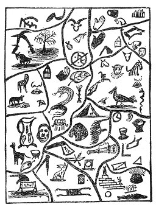

[Intangible Textual Heritage](../../index)  [Oahspe](../index.md) 
[Index](index)  [Previous](oah428)  [Next](oah430.md) 

------------------------------------------------------------------------

### Port-Pan Algonquin

THE SACRED PEOPLE, I'HINS, OR MOUND-BUILDERS.

READETH as follows:

1\. Which way, man?

2\. To the tree of knowledge.

3\. I go thither, also.

4\. Where, then, is thy treasure?

5\. I bring this pitcher and pot, a tame gowt and a dead man's skull. I
have no more.

6\. Seffas bows down in thy favor. Hast thou slain any living creature?

7\. Nay, Ong-a-pa, but housed in a mound high-built, and steep, I have
slept my nights away in peace, slaying naught.

8\. Hast thou the Hagaw'sa (the head compressed), from infancy?

9\. On my breast, engraved, the sign single standeth most honored of all
I have. When I was a child my head was thus compressed, to school the
judgment down beneath the prophetic sight. I have seen the Es world and
the angels of the dead.

p. 623

10\. Hold up thine hand, and show me, too, the leaf sign of Egoquim.
Then the burning flame of sacrifice and monstrous serpents thou wouldst
rather feed than destroy?

11\. To engrave the sacred symbols in Corpor I was well-educated. Behold
I write.

(He then displayeth his skill.)

12\. Thy skill is excellent. Go thou to the south-west corner, and in
the ark of the black hand thou shalt find a charm for venomous serpents.
Bring it hither.

13\. Alas, O Onga, ask of me any service but to deal in charms against
anything.

14\. How sleepest thy father and thy mother, and thy wife and thy sons
and daughters?

15\. On the mounds and in the mounds, O Onga. Hid are we all away from
the devouring hiss-sa (serpent), and baugh and mieuh (lions and tigers).

16\. How was it with thy forefathers and foremothers?

17\. In the mounds and on the mounds, O Onga. For a thousand generations
my ancestors killed not any living creature Egoquim had created.

18\. What is yonder building in the north-east?

19\. The temple of Egoquim.

20\. What meaneth it?

21\. It is the sacred house of Dan. (Faithists.)

22\. What are the signs?

23\. The All Light hand teacheth mortals to ever reach upward; the cup,
that all the firmament is filled by the presence of Egoquim.

24\. What is the sign of half a dog, of half a horse, and a man's head?

25\. That man at best is two beings, a beast and a spirit.

26\. What is the sign of the black hand and black onk, the slaying tool?

27\. The mortal who slayeth the wolf and serpent hath a hard time in
heaven.

28\. What is the hard time of the slaying-man in heaven?

29\. In the firmament of heaven he is haunted; the spirits of the slain
come upon him. He findeth no place. With his black hand of death
uplifted he crieth out.

30\. What is the sign of Oke-un (tent), and the sign of the black head
of the Ghi-ee (eagle), and the black mouth with black tongue projecting?

31\. That all the earth must be subdued by man. Even the blackness
(slander) that issueth out of man's mouth must also be subdued.

32\. What are the signs of the ear, the triangle and the square, the
evil quarters, the wedge and the vessels of copper?

33\. Alas, O Onga, I know not.

34\. What are the signs of the trumpet, the windlass, the hewing-ax and
the altar of fire?

35\. Alas, O Onga, I know not.

36\. What are the signs of the Az-aj (stretcher), and the basket?

37\. Alas, O Onga, I know not.

 

   
Plate 84.--PORT-PAN ALGONQUIN.  
The sacred people, I'hins, or Mound-Builders.

 

38\. What is the sign of the men ascending the Orugh (the stairs), and
lamp and the trees and the black fish?

39\. First, there was an egg, and then a fish, and then trees, then man,
and he saw the light and the sun. Then wisdom came and he learnt of
Egoquim, ever after.

40\. Thou art wise, and now, by virtue of my power and wisdom and love,
do I crown thee brother of the Hoanga (prophets). Peace be with thee,
Amen!

41\. He who taught thee all the other signs will now teach thee three
thou knowest not. After which the Oi will invest thee with cloth and
with the signs of Chaigi (words of enchantment), that when thou
travelest in far-off lands thou shalt be received as a brother.

(Signs and pass-words withheld from publication.)

------------------------------------------------------------------------

[Next: Anubis](oah430.md)
