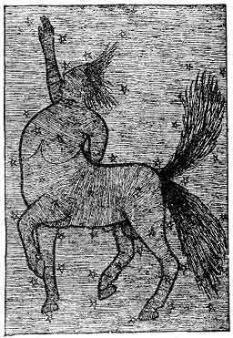

[Intangible Textual Heritage](../../index)  [Oahspe](../index.md) 
[Index](index)  [Previous](oah441)  [Next](oah443.md) 

------------------------------------------------------------------------

p. 649

### EARTHLY HISTORY OF THE FAITHISTS OF THE EAST

1\. THE VOICE WAS, THE GREAT SPIRIT, THE I AM.

2\. Zarathustra, being all pure, taught that to be a Faithist in the
Voice, as it cometh to the pure, was the highest that man could attain.

3\. Zarathustra, being all pure, taught that to build up one's own faith
in the I AM would produce the highest happiness.

4\. Zarathustra, being all pure, taught that each self must learn to
build up itself in love and wisdom, and after them, power, trusting in
the I AM.

5\. As the Voice came to Zarathustra, the all pure, Zarathustra
perceived that the I AM must have a name in order to be distinguished by
men.

6\. Zarathustra said, Or (Light) Mazd (entity of, i.e., light, per se),
and he called the HIGHEST KNOWN, Or'mazd, being The Person, The All
Master.

7\. Or'mazd spake to Zarathustra, saying: Some have I created with
desire to dance, some with desire to sing, some with desire to pray.

8\. Some have I created with faith in men, some with faith in spirits,
some with faith in Me only.

9\. Let those who have faith in men, have faith in men; let those who
have faith in spirits, have faith in spirits; let those who have faith
in Me, have faith in Me. The last are Mine. What is Mine I will gather
together.

10\. Mine shall be a people by themselves, of themselves.

11\. Or'mazd spake to Zarathustra, saying:

Mine have no Gods but Me.

Mine have no idols nor images of Me.

Mine bow down not before idols.

Mine covenant in My name secretly.

Mine remember the four sacred days of the moon.

Mine honor their parents.

Mine kill nothing I have made alive.

Mine commit not adultery.

Mine steal not, nor tell lies; nor covet anything.

Mine return good unto all men.

Zarathustra taught these words, and those who were followers styled
themselves Zarathustrians.

12\. Or'mazd spake to Zarathustra, saying: Take the ten suggestions:
what are they?

13\. Zarathustra said: My flesh is not my own substance, but Or'mazd's.
How then can I claim the ten suggestions? These, then, are not the
Zarathustrian Law. They are the Or'mazdian Law. All things come from
Him. All things are His.

14\. Zarathustra went forth, preaching, and his followers were numbered
by hundreds of thousands.

 

   
Plate 93.--THE FALSE OSIRIS.

 

15\. Zarathustra worked no miracles. He said miracles were the tricks of
spirits and mortals. The highest of all good was to do good, and be
good.

16\. God gave not to the Zarathustrians as to Israel, to move amongst
strangers, but to dwell amidst the heathen within their own countries.
And the Zarathustrians never established kings of their own.
Nevertheless they fell into constant persecution by the worshipers of
Gods and Lords.

17\. By the time of Brahma they were nearly destroyed. And again God
raised them up and established them as a mighty people. But being
non-resistants they were again nearly destroyed. And again God raised
them up through Capilya; this was in the time of Moses.

18\. And they prospered and became numerous in all of Vind'yu and
Jaffeth. For four hundred years they were a great people.

19\. And about the time the Israelites made Saul their king, darkness
came upon the Zarathustrians also.

20\. The Lords and Saviors, through the oracles, inspired the kings and
rulers to despoil the Zarathustrians. And for nine hundred years they
were p. 650 persecuted and tortured; and
millions of them put to death. So that the name of Zarathustra was
forgotten amongst men. And the great learning, and light and knowledge,
of those nations, went out, to return not for a long season.

21\. God said: Because they have persecuted and destroyed my chosen, I
will turn my face away from them, and they shall go down in darkness.
Behold, when they persecuted my chosen in the land of Egupt, I shut out
the light from them, and they perished.

22\. Let this be testimony unto all peoples, that whosoever divideth my
people or despoileth them, shall also be divided and despoiled.

23\. This is a law of Jehovih; whoso goeth away from Him shall not find
Him; to turn from Him is to curse Him; to curse Him is to curse those
that do it, and it shall be answered unto them.

END OF BOOK OF SAPHAH.

------------------------------------------------------------------------

[Next: ESK.](oah443.md)
