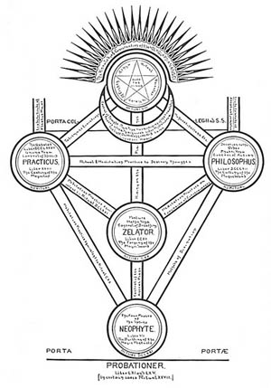

  
[Sacred texts](../index)  [Thelema](index.md) 

------------------------------------------------------------------------

## A Syllabus of the Steps Upon the Path

## A.·. A.·. Publication in Class D

51\. Let not the failure and the pain turn aside the worshippers. The
foundations of the pyramid were hewn in the living rock ere sunset; did
the king weep at dawn that the crown of the pyramid was yet unquarried
in the distant land?

52\. There was also an humming-bird that spake unto the horned cerastes,
and prayed him for poison. And the great snake of Khem the Holy One, the
royal Uræus serpent, answered him and said:

53\. I sailed over the sky of Nu in the car called Millions-of-Years,
and I saw not any creature upon Seb that was equal to me. The venom of
my fang is the inheritance of my father, and of my father's father; and
how shall I give it unto thee? Live thou and thy children as I and my
fathers have lived, even unto an hundred millions of generations, and it
may be that the mercy of the Mighty Ones may bestow upon thy children a
drop of the poison of eld.

54\. Then the humming-bird was afflicted in his spirit, and he flew unto
the flowers, and it was as if naught had been spoken between them. Yet
in a little while a serpent struck him that he died.

55\. But an Ibis that meditated upon the bank of Nile the beautiful god
listened and heard. And he laid aside his Ibis ways, and became as a
serpent, saying Peradventure in an hundred millions of millions of
generations of my children, they shall attain to a drop of the poison of
the fang of the Exalted One.

56\. And behold! ere the moon waxed thrice he became an Uræus serpent,
and the poison of the fang was established in him and his seed even for
ever and for ever.

*- Liber LXV*, Cap. V

I. *The Probationer*. His duties are laid down in Paper A, Class D.
Being without, they are vague and general. He receives Liber LXI and
LXV.

\[Certain Probationers are admitted after six months or more to Ritual
XXVIII.\]

At the end of the Probation he passes Ritual DCLXXI, which constitutes
him a Neophyte.

2\. *The Neophyte*. His duties are laid down in Paper B, Class D. He
receives Liber VII.

Examination in Liber O, caps. I-IV, Theoretical and Practical.

Examination in The Four Powers of the Sphinx. Practical.

Four tests are set.

Further, he builds up the magic Pentacle.

Finally he passes Ritual CXX, which constitutes him a Zelator.

3\. *The Zelator*. His duties are laid down in Paper C, Class D. He
receives Liber CCXX, XXVII, and DCCCXIII.

Examination in Posture and Control of Breath (see Equinox No. 1).
Practical.

Further, he is given two meditation-practices corresponding to the two
rituals DCLXXI and CXX.

(Examination is only in the knowledge of, and some little practical
acquaintance with, these meditations. The complete results, if attained,
would confer a much higher grade.)

Further, he forges the magic Sword.

No ritual admits to the grade of Practicus, which is conferred by
authority when the task of the Zelator is accomplished.

4\. *The Practicus*. His duties are laid down in Paper D, Class D.

Instruction and Examination in the Qabalah and Liber DCCLXXVII.

Instruction in Philosophical Meditation (Gnana-Yoga).

Examination in some one mode of divination: *e.g.*, Geomancy, Astrology,
the Tarot. Theoretical. He is given a meditation-practice on Expansion
of Consciousness.

He is given a meditation-practice in the destruction of thoughts.

Instruction and Examination in Control of Speech. Practical.

Further, he casts the magic Cup.

No ritual admits to the grade of Philosophus, which is conferred by
authority when the Task of the Practicus is accomplished.

5\. *The Philosophus*. His duties are laid down in Paper E, Class D.

He practices Devotion to the Order.

Instruction and Examination in Methods of Meditation by Devotion
(Bhakti-Yoga).

Instruction and Examination in Construction and Consecration of
Talismans, and in Evocation.

Theoretical and Practical.

Examination in Rising on the Planes (Liber O, caps. V, VI). Practical.

He is given a meditation-practice on the Senses, and the Sheaths of the
Self, and the Practice called Mahasatipatthana.

(See "The Sword of Song", "Science and Buddhism".)

Instruction and Examination in Control of Action.

Further, he cuts the Magic Wand.

Finally, the Title of Dominus Liminis is conferred upon him.

He is given meditation-practices on the Control of Thought, and is
instructed in Raja-Yoga.

He receives Liber Mysteriorum and obtains a perfect understanding of the
Formulae of Initiation.

He meditates upon the diverse knowledge and power that he has acquired,
and harmonises it perfectly.

Further, he lights the Magic Lamp.

At last, Ritual VIII admits him to the grade of Adeptus Minor.

6\. *The Adeptus Minor*. His duty is laid down in Paper F, Class D.

It is to follow out the instruction given in the Vision of the Eighth
Aethyr for the attainment of the Knowledge and Conversation of the Holy
Guardian Angel.

\[NOTE. This is in truth the sole task; the others are useful only as
adjuvants to and preparations for the One Work.

Moreover, once this task has been accomplished, there is no more need of
human help or instruction; for by this alone may the highest attainment
be reached.

All these grades are indeed but convenient landmarks, not necessarily
significant. A person who had attained them all might be immeasurably
the inferior of one who had attained none of them; it is Spiritual
Experience alone that counts in Result; the rest is but Method.

Yet it is important to possess knowledge and power, provided that it be
devoted wholly to that One Work.\]
