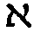
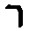
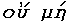
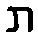
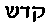

  
[Sacred texts](../index)  [Thelema](index) 

------------------------------------------------------------------------

  

## A...A... Publication in Class A. Imprimatur: N. Fra A... A...

I

> 0\. O my God! One is Thy Beginning! One is Thy Spirit, and Thy
> Permutation One!  
> 1. Let me extol Thy perfections before men.  
> 2. In the Image of a Sixfold Star that flameth across the Vault inane,
> let me re-veil Thy perfections.  
> 3. Thou hast appeared unto me as an aged God, a venerable God, the
> Lord of Time, bearing a sharp sickle.  
> 4. Thou hast appeared unto me as a jocund and ruddy God,full of
> Majesty, a King, a Father in his prime. Thou didst bear the sceptre of
> the Universe, crowned with the Wheel of the Spirit.  
> 5. Thou hast appeared unto me with sword and spear, a warrior God in
> flaming armour among Thine horsemen.  
> 6. Thou hast appeared unto me as a young and brilliant God, a god of
> music and beauty, even as a young god in his strength, playing upon
> the lyre.  
> 7. Thou hast appeared unto me as the white foam of Ocean gathered into
> limbs whiter than the foam, the limbs of a miracle of women, as a
> goddess of extreme love, bearing the girdle of gold.  
> 8. Thou hast appeared to me as a young boy mischievous and lovely,
> with Thy winged globe and its serpents set upon a staff.  
> 9. Thou hast appeared to me as an huntress among Thy dogs, as a
> goddess virginal chaste, as a moon among the faded oaks of the wood of
> years.  
> 10. But I was deceived by none of these. All these I cast aside,
> crying: Begone! So that all these faded from my vision.  
> 11. Also I welded together the Flaming Star and the Sixfold Star in
> the forge of my soul, and behold! a new star 418 that is above all
> these.  
> 12. Yet even so was I not deceived; for the crown hath twelve rays.  
> 13. And these twelve rays are one.

II  

> 0\. Now then I saw these things averse and evil; and they were not,
> even as Thou art Not.  
> 1. I saw the twin heads that ever battle against one another, so that
> all their thought is a confusion. I saw Thee in these.  
> 2. I saw the darkeners of wisdom, like black apes chattering vile
> nonsense. I saw Thee in these.  
> 3. I saw the devouring mothers of Hell, that eat up their children - O
> ye that are without understanding! I saw Thee in these.  
> 4. I saw the merciless and the unmajestic like harpies tearing their
> foul food. I saw Thee in these.  
> 5. I saw the burning ones, giants like volcanoes belching out the
> black vomit of fire and smoke in their fury. I saw Thee in these.  
> 6. I saw the petty, the quarrelsome, the selfish, - they were like
> men, O Lord, they were even like unto men. I saw Thee in these.  
> 7. I saw the ravens of death, that flew with hoarse cries upon the
> carrion earth. I saw Thee in these.  
> 8. I saw the lying spirits like frogs upon the earth, and upon the
> water, and upon the treacherous metal that corrodeth all things and
> abideth not. I saw Thee in these.  
> 9. I saw the obscene ones, bull-men linked in the abyss of
> putrefaction, that gnawed each other's tongues for pain. I saw Thee in
> these.  
> 10. I saw the Woman. O my God, I beheld the image thereof, even as a
> lovely shape that concealeth a black monkey, even as a figure that
> draweth with her hands small images of men down into hell. I saw her
> from the head to the navel a woman, from the navel to the feet of her
> a man. I saw Thee even in her.  
> 11. For mine was the keyword to the Closed Palace 418 and mine the
> reins of the Chariot of the Sphinxes, black and white.  
> But I was not deceived by anything of all these things.  
> 12. For I expanded it by my subtlety into Twelve Rays of the Crown.  
> 13. And these twelve rays were One.

III  

> 0\. Say thou that He God is one; God is the Everlasting One; nor hath
> He any Equal, or any Son, or any Companion. Nothing shall stand before
> His face.  
> 1. Even for five hundred and eleven times nightly for one and forty
> days did I cry aloud unto the Lord the affirmation of His Unity.  
> 2. Also did I glorify His wisdom, whereby He made the worlds.  
> 3. Yea, I praised Him for His intelligible essence, whereby the
> universe became light.  
> 4. I did thank Him for His manifold mercy; I did worship His
> magnificence and majesty.  
> 5. I trembled before His might.  
> 6. I delighted in the Harmony and Beauty of His Essence.  
> 7. In His Victory I pursued His enemies; yea I drave them down the
> steep; I thundered after them into the utmost abyss; yea, therein I
> partook of the glory of my Lord.  
> 8. His Splendour shone upon me; I adored His adorable splendour.  
> 9. I rested myself, admiring the Stability of Him, how the shaking of
> His Universe, the dissolution of all things, should move Him not.  
> 10. Yea, verily, I the Lord Viceregent of His Kingdom, I, Adonai, who
> speak unto my servant V.V.V.V.V. did rule and govern in His place.  
> 11. Yet also did I formulate the word of double power in the Voice of
> the Master, even the word 418.  
> 12. And all these things deceived me not, for I expanded them by my
> subtlety into the Twelve Rays of the Crown.  
> 13. And these twelve rays were One.

IV  

> 0\. Also the little child, the lover of Adonai, even V.V.V.V.V.,
> reflecting the glory of Adonai, lifted up his voice and said:  
> 1. Glory to God, and Thanksgiving to God! There is One God alone, and
> God is exceeding great. He is about us, and there is no strength save
> in Him the exalted, the great.  
> 2. Thus did V.V.V.V.V. become mad, and wend about naked.  
> 3. And all these things fled away, for he understood them all, that
> they were but as old rags upon the Divine Perfection.  
> 4. Also he pitied them all, that they were but reflections
> distorted.  
> 5. Also he smote them, lest they should bear rule over the just.  
> 6. Also he harmonized them into one picture, beautiful to behold.  
> 7. And having thus conquered them, there was a certain glamour of
> holiness even in the hollow sphere of outward brilliance.  
> 8. So that all became splendid.  
> 9. And having firmly stablished them in order and disposition,  
> 10. He proclaimed the perfection, the bride, the delight of God in His
> creation.  
> 11. But though thus he worked, he tried ever his work by the Star
> 418.  
> 12. And it deceived him not; for by his subtlety he expanded it all
> into the Twelve Rays of the Crown.  
> 13. And these twelve rays were One.

V  

> 0\. In the place of the cross the indivisible point which hath no
> points nor parts nor magnitude. Nor indeed hath it position, being
> beyond space. Nor hath it existence in time, for it is beyond Time.
> Nor hath it cause or effect, seeing that its Universe is infinite
> every way, and partaketh not of these our conceptions.  
> 1. So wrote  the
> Exempt Adept, and the laughter of the Masters of the Temple abashed
> him not.  
> 2. Nor was he ashamed, hearing the laughter of the little dogs of
> hell.  
> 3. For he abode in his place, and his falsehood was truth in his
> place.  
> 4. The little dogs cannot correct him, for they can do naught but
> bark.  
> 5. The masters cannot correct him, for they say: Come and see.  
> 6. And I came and saw, even I, Perdurabo, the Philosophus of the Outer
> College.  
> 7. Yea, even I the man beheld this wonder.  
> 8. And I could not deliver it unto myself.  
> 9. That which established me is invisible and unknowable in its
> essence.  
> 10. Only they who know IT may be known.  
> 11. For they have the genius of the mighty sword 418.  
> 12. And they are not deceived by any of these things; for by their
> subtlety do they expand them all into the Twelve Rays of the Crown.  
> 13. And these twelve rays are One.

VI  

> 0\. Deeper and deeper into the mire of things! Farther and farther
> into the never-ending Expansion of the Abyss.  
> 1. The great goddess that bendeth over the Universe is my mistress; I
> am the winged globe at her heart.  
> 2. I contract ever as she ever expandeth;  
> 3. At the end it is all one.  
> 4. Our loves have brought to birth the Father and Creator of all
> things.  
> 5. He hath established the elements; the aether, the air, the water,
> the earth, and the fire.  
> 6. He hath established the wandering stars in their courses.  
> 7. He hath ploughed with the seven stars of his Plough, that the Seven
> might move indeed, yet ever point to the unchanging One.  
> 8. He hath established the Eight Belts, wherewith he hath girdled the
> globes.  
> 9. He hath established the Trinity of Triads in all things, forcing
> fire into fire, and ordering all things in the Stable Abode of the
> Kings of Æ.  
> 10. He hath established His rule in His kingdom.  
> 11. Yet the Father also boweth unto the Power of the Star 418 and
> thereby  
> 12. In his subtlety He expandeth it all into twelve rays of the
> Crown.  
> 13. And these twelve rays are One.

VII  

> 0\. Then in the might of the Lion did I formulate unto myself that
> holy and formless fire,
> , which darteth
> and flasheth through the depths of the Universe.  
> 1. At the touch of the Fire Qadosh the earth melted into a liquor
> clear as water.  
> 2. At the touch of the Fire Qadosh the water smoked into a lucid
> air.  
> 3. At the touch of the Fire Qadosh the air ignited, and became Fire.  
> 4. At the touch of the Fire Qadosh, O Lord, the Fire dissipated into
> Space.  
> 5. At the touch of the Fire Qadosh, O Lord, the Space resolved itself
> into a Profundity of Mind.  
> 6. At the touch of the Fire Qadosh the Mind of the Father was broken
> up into the brilliance of our Lord the Sun.  
> 7. At the touch of the Fire Qadosh the Brilliance of our Lord was
> absorbed in the Naught of our Lady of the Body of the Milk of the
> Stars.  
> 8. Then only was the Fire Qadosh extinguished, when the Enterer was
> driven back from the threshold,  
> 9. And the Lord of Silence was established upon the Lotus flower.  
> 10. Then was accomplished all that which was to be accomplished.  
> 11. And All and One and Naught were slain in the slaying of the
> Warrior 418,  
> 12. In the slaying of the subtlety that expanded all these things into
> the Twelve Rays of the Crown,  
> 13. That returned unto One, and beyond One, even unto the vision of
> the Fool in his folly that chanted the word ARARITA, and beyond the
> Word and the Fool; yea, beyond the Word and the Fool.

  
copyright © Ordo Templi Orientis
