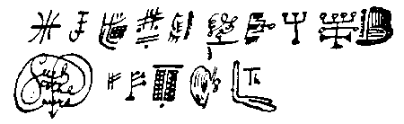

  
[Sacred texts](../index)  [Thelema](index) 

------------------------------------------------------------------------

## Sub Figura VII

### Being the Voluntary Emancipation of a certain Exempt Adept from his Adeptship. These are the Birth-Words of a Master of the Temple. A...A... Publication in Class A. Imprimatur: N. Fra A... A...  

PROLOGUE OF THE UNBORN

1.  Into my loneliness comes -
2.  The sound of a flute in dim groves that haunt the uttermost hills.
3.  Even from the brave river they reach to the edge of the wilderness.
4.  And I behold Pan.
5.  The snows are eternal above, above -
6.  And their perfume smokes upward into the nostrils of the stars.
7.  But what have I to do with these?
8.  To me only the distant flute, the abiding vision of Pan.
9.  On all sides Pan to the eye, to the ear;
10. The perfume of Pan pervading, the taste of him utterly filling my
    mouth, so that the tongue breaks forth into a weird and monstrous
    speech.
11. The embrace of him intense on every centre of pain and pleasure.
12. The sixth interior sense aflame with the inmost self of Him,
13. Myself flung down the precipice of being
14. Even to the abyss, annihilation.
15. An end to loneliness, as to all.
16. Pan! Pan! Io Pan! Io Pan!

I

1.  My God, how I love Thee!
2.  With the vehement appetite of a beast I hunt Thee through the
    Universe.
3.  Thou art standing as it were upon a pinnacle at the edge of some
    fortified city. I am a white bird, and perch upon Thee.
4.  Thou art My Lover: I see Thee as a nymph with her white limbs
    stretched by the spring.
5.  She lies upon the moss; there is none other but she:
6.  Art Thou not Pan?
7.  I am He. Speak not, O my God! Let the work be accomplished in
    silence.
8.  Let my cry of pain be crystallized into a little white fawn to run
    away into the forest!
9.  Thou art a centaur, O my God, from the violet-blossoms that crown
    Thee to the hoofs of the horse.
10. Thou art harder than tempered steel; there is no diamond beside
    Thee.
11. Did I not yield this body and soul?
12. I woo thee with a dagger drawn across my throat.
13. Let the spout of blood quench Thy blood-thirst, O my God!
14. Thou art a little white rabbit in the burrow Night.
15. I am greater than the fox and the hole.
16. Give me Thy kisses, O Lord God!
17. The lightning came and licked up the little flock of sheep.
18. There is a tongue and a flame; I see that trident walking over the
    sea.
19. A phoenix hath it for its head; below are two prongs. They spear the
    wicked.
20. I will spear Thee, O Thou little grey god, unless Thou beware!
21. From the grey to the gold; from the gold to that which is beyond the
    gold of Ophir.
22. My God! but I love Thee!
23. Why hast Thou whispered so ambiguous things? Wast Thou afraid, O
    goat-hoofed One, O horned One, O pillar of lightning?
24. From the lightning fall pearls; from the pearls black specks of
    nothing.
25. I based all on one, one on naught.
26. Afloat in the aether, O my God, my God!
27. O Thou great hooded sun of glory, cut off these eyelids!
28. Nature shall die out; she hideth me, closing mine eyelids with fear,
    she hideth me from My destruction, O Thou open eye.
29. O ever-weeping One!
30. Not Isis my mother, nor Osiris my self; but the incestuous Horus
    given over to Typhon, so may I be!
31. There thought; and thought is evil.
32. Pan! Pan! Io Pan! it is enough.
33. Fall not into death, O my soul! Think that death is the bed into
    which you are falling!
34. O how I love Thee, O my God! Especially is there a vehement parallel
    light from infinity, vilely diffracted in the haze of this mind.
35. I love Thee. I love Thee. I love Thee.
36. Thou art a beautiful thing whiter than a woman in the column of this
    vibration.
37. I shoot up vertically like an arrow, and become that Above.
38. But it is death, and the flame of the pyre.
39. Ascend in the flame of the pyre, O my soul! Thy God is like the cold
    emptiness of the utmost heaven, into which thou radiatest thy little
    light.
40. When Thou shall know me, O empty God, my flame shall utterly expire
    in Thy great N. O. X.
41. What shalt Thou be, my God, when I have ceased to love Thee?
42. A worm, a nothing, a niddering knave!
43. But Oh! I love Thee.
44. I have thrown a million flowers from the basket of the Beyond at Thy
    feet, I have anointed Thee and Thy Staff with oil and blood and
    kisses.
45. I have kindled Thy marble into life - ay! into death.
46. I have been smitten with the reek of Thy mouth, that drinketh never
    wine but life.
47. How the dew of the Universe whitens the lips!
48. Ah! trickling flow of the stars of the mother Supernal, begone!
49. I Am She that should come, the Virgin of all men.
50. I am a boy before Thee, O Thou satyr God.
51. Thou wilt inflict the punishment of pleasure - Now! Now! Now!
52. Io Pan! Io Pan! I love Thee. I love Thee.
53. O my God, spare me!
54. Now! It is done! Death.
55. I cried aloud the word - and it was a mighty spell to bind the
    Invisible, an enchantment to unbind the bound; yea, to unbind the
    bound.

II

1.  O my God! use Thou me again, alway. For ever! For ever!
2.  That which came fire from Thee cometh water from me; let therefore
    Thy Spirit lay hold on me, so that my right hand loose the
    lightning.
3.  Travelling through space, I saw the onrush of two galaxies, butting
    each other and goring like bulls upon earth. I was afraid.
4.  Thus they ceased fight, and turned upon me, and I was sorely crushed
    and torn.
5.  I had rather have been trampled by the World-Elephant.
6.  O my God! Thou art my little pet tortoise!
7.  Yet Thou sustainest the World-Elephant.
8.  I creep under Thy carapace, like a lover into the bed of his
    beautiful; I creep in, and sit in Thine heart, as cubby and cosy as
    may be.
9.  Thou shelterest me, that I hear not the trumpeting of that
    World-Elephant.
10. Thou art not worth an obol in the agora; yet Thou art not to be
    bought at the ransom of the whole Universe.
11. Thou art like a beautiful Nubian slave leaning her naked purple
    against the green pillars of marble that are above the bath.
12. Wine jets from her black nipples.
13. I drank wine awhile agone in the house of Pertinax. The cup-boy
    favoured me, and gave me of the right sweet Chian.
14. There was a Doric boy, skilled in feats of strength, an athlete. The
    full moon fled away angrily down the wrack. Ah! but we laughed.
15. I was pernicious drunk, O my God! Yet Pertinax brought me to the
    bridal.
16. I had a crown of thorns for all my dower.
17. Thou art like a goat's horn from Astor, O Thou God of mine, gnarl'd
    and crook'd and devilish strong.
18. Colder than all the ice of all the glaciers of the Naked Mountain
    was the wine it poured for me.
19. A wild country and a waning moon Clouds scudding over the sky. A
    circuit of pines, and of tall yews beyond. Thou in the midst!
20. O all ye toads and cats, rejoice! Ye slimy things, come hither!
21. Dance, dance to the Lord our God!
22. He is he! He is he! He is he!
23. Why should I go on?
24. Why? Why? comes the sudden cackle of a million imps of hell.
25. And the laughter runs.
26. But sickens not the Universe; but shakes not the stars.
27. God! how I love Thee!
28. I am walking in an asylum; all the men and women about me are
    insane.
29. Oh madness! madness! madness! desirable art thou!
30. But I love Thee, O God!
31. These men and women rave and howl; they froth out folly.
32. I begin to be afraid. I have no check; I am alone. Alone. Alone.
33. Think, O God, how I am happy in Thy love.
34. O marble Pan! O false leering face! I love Thy dark kisses, bloody
    and stinking! O marble Pan! Thy kisses are like sunlight on the blue
    Aegean; their blood is the blood of the sunset over Athens; their
    stink is like a garden of Roses of Macedonia.
35. I dreamt of sunset and roses and vines; Thou wast there, O my God,
    Thou didst habit Thyself as an Athenian courtesan, and I loved Thee.
36. Thou art no dream, O Thou too beautiful alike for sleep and waking!
37. I disperse the insane folk of the earth; I walk alone with my little
    puppets in the garden.
38. I am Gargantuan great; yon galaxy is but the smoke-ring of mine
    incense.
39. Burn Thou strange herbs, O God!
40. Brew me a magic liquor, boys, with your glances!
41. The very soul is drunken.
42. Thou art drunken, O my God, upon my kisses.
43. The Universe reels; Thou hast looked upon it.
44. Twice, and all is done.
45. Come, O my God, and let us embrace!
46. Lazily, hungrily, ardently, patiently; so will I work.
47. There shall be an End.
48. O God! O God!
49. I am a fool to love Thee; Thou art cruel, Thou withholdest Thyself.
50. Come to me now! I love Thee! I love Thee!
51. O my darling, my darling - Kiss me! Kiss me! Ah! but again.
52. Sleep, take me! Death, take me! This life is too full; it pains, it
    slays, it suffices.
53. Let me go back into the world; yea, back into the world.

III

1.  I was the priest of Ammon-Ra in the temple of Ammon-Ra at Thebai.
2.  But Bacchus came singing with his troops of vine-clad girls, of
    girls in dark mantles; and Bacchus in the midst like a fawn!
3.  God! how I ran out in my rage and scattered the chorus!
4.  But in my temple stood Bacchus as the priest of Ammon-Ra.
5.  Therefore I went wildly with the girls into Abyssinia; and there we
    abode and rejoiced.
6.  Exceedingly; yea, in good sooth!
7.  I will eat the ripe and the unripe fruit for the glory of Bacchus.
8.  Terraces of ilex, and tiers of onyx and opal and sardonyx leading up
    to the cool green porch of malachite.
9.  Within is a crystal shell, shaped like an oyster - O glory of
    Priapus! O beatitude of the Great Goddess!
10. Therein is a pearl.
11. O Pearl! thou hast come from the majesty of dread Ammon-Ra.
12. Then I the priest beheld a steady glitter in the heart of the pearl.
13. So bright we could not look! But behold! a blood-red rose upon a
    rood of glowing gold!
14. So I adored the God. Bacchus! thou art the lover of my God!
15. I who was priest of Ammon-Ra, who saw the Nile flow by for many
    moons, for many, many moons, am the young fawn of the grey land.
16. I will set up my dance in your conventicles, and my secret loves
    shall be sweet among you.
17. Thou shalt have a lover among the lords of the grey land.
18. This shall he bring unto thee, without which all is in vain; a man's
    life spilt for thy love upon My Altars.
19. Amen.
20. Let it be soon, O God, my God! I ache for Thee, I wander very lonely
    among the mad folk, in the grey land of desolation.
21. Thou shalt set up the abominable lonely Thing of wickedness. Oh joy!
    to lay that corner-stone!
22. It shall stand erect upon the high mountain; only my God shall
    commune with it.
23. I will build it of a single ruby; it shall be seen from afar off.
24. Come! let us irritate the vessels of the earth: they shall distil
    strange wine.
25. It grows under my hand: it shall cover the whole heaven.
26. Thou art behind me: I scream with a mad joy.
27. Then said Ithuriel the strong; let Us also worship this invisible
    marvel!
28. So did they, and the archangels swept over the heaven.
29. Strange and mystic, like a yellow priest invoking mighty flights of
    great grey birds from the North, so do I stand and invoke Thee!
30. Let them obscure not the sun with their wings and their clamour!
31. Take away form and its following!
32. I am still.
33. Thou art like an osprey among the rice, I am the great red pelican
    in the sunset waters.
34. I am like a black eunuch; and Thou art the scimitar. I smite off the
    head of the light one, the breaker of bread and salt.
35. Yea! I smite - and the blood makes as it were a sunset on the lapis
    lazuli of the King's Bedchamber.
36. I smite! The whole world is broken up into a mighty wind, and a
    voice cries aloud in a tongue that men cannot speak.
37. I know that awful sound of primal joy; let us follow on the wings of
    the gale even unto the holy house of Hathor; let us offer the five
    jewels of the cow upon her altar!
38. Again the inhuman voice!
39. I rear my Titan bulk into the teeth of the gale, and I smite and
    prevail, and swing me out over the sea.
40. There is a strange pale God, a god of pain and deadly wickedness.
41. My own soul bites into itself, like a scorpion ringed with fire.
42. That pallid God with face averted, that God of subtlety and
    laughter, that young Doric God, him will I serve.
43. For the end thereof is torment unspeakable.
44. Better the loneliness of the great grey sea!
45. But ill befall the folk of the grey land, my God!
46. Let me smother them with my roses!
47. Oh Thou delicious God, smile sinister!
48. I pluck Thee, O my God, like a purple plum upon a sunny tree. How
    Thou dost melt in my mouth, Thou consecrated sugar of the Stars!
49. The world is all grey before mine eyes; it is like an old worn
    wine-skin.
50. All the wine of it is on these lips.
51. Thou hast begotten me upon a marble Statue, O my God!
52. The body is icy cold with the coldness of a million moons; it is
    harder than the adamant of eternity. How shall I come forth into the
    light?
53. Thou art He, O God! O my darling! my child! my plaything! Thou art
    like a cluster of maidens, like a multitude of swans upon the lake.
54. I feel the essence of softness.
55. I am hard and strong and male; but come Thou! I shall be soft and
    weak and feminine.
56. Thou shalt crush me in the wine-press of Thy love. My blood shall
    stain Thy fiery feet with litanies of Love in Anguish.
57. There shall be a new flower in the fields, a new vintage in the
    vineyards.
58. The bees shall gather a new honey; the poets shall sing a new song.
59. I shall gain the Pain of the Goat for my prize; and the God that
    sitteth upon the shoulders of Time shall drowse.
60. Then shall all this which is written be accomplished: yea, it shall
    be accomplished.

IV

1.  I am like a maiden bathing in a clear pool of fresh water.
2.  O my God! I see Thee dark and desirable, rising through the water as
    a golden smoke.
3.  Thou art altogether golden, the hair and the eyebrows and the
    brilliant face; even into the finger-tips and toe-tips Thou art one
    rosy dream of gold.
4.  Deep into Thine eyes that are golden my soul leaps, like an
    archangel menacing the sun.
5.  My sword passes through and through Thee; crystalline moons ooze out
    of Thy beautiful body that is hidden behind the ovals of Thine eyes.
6.  Deeper, ever deeper. I fall, even as the whole Universe falls down
    the abyss of Years.
7.  For Eternity calls; the Overworld calls; the world of the Word is
    awaiting us.
8.  Be done with speech, O God! Fasten the fangs of the hound Eternity
    in this my throat!
9.  I am like a wounded bird flapping in circles.
10. Who knows where I shall fall?
11. O blessed One! O God! O my devourer!
12. Let me fall, fall down, fall away, afar, alone!
13. Let me fall!
14. Nor is there any rest, Sweet Heart, save in the cradle of royal
    Bacchus, the thigh of the most Holy One.
15. There rest, under the canopy of night.
16. Uranus chid Eros; Marsyas chid Olympas; I chid my beautiful lover
    with his sunray mane; shall I not sing?
17. Shall not mine incantations bring around me the wonderful company of
    the wood-gods, their bodies glistening with the ointment of
    moonlight and honey and myrrh?
18. Worshipful are ye, O my lovers; let us forward to the dimmest
    hollow!
19. There we will feast upon mandrake and upon moly!
20. There the lovely One shall spread us His holy banquet. In the brown
    cakes of corn we shall taste the food of the world, and be strong.
21. In the ruddy and awful cup of death we shall drink the blood of the
    world, and be drunken!
22. Ohe! the song to Iao, the song to Iao!
23. Come, let us sing to thee, Iacchus invisible, Iacchus triumphant,
    Iacchus indicible!
24. Iacchus, O Iacchus, O Iacchus, be near us!
25. Then was the countenance of all time darkened, and the true light
    shone forth.
26. There was also a certain cry in an unknown tongue, whose stridency
    troubled the still waters of my soul, so that my mind and my body
    were healed of their disease, self-knowledge.
27. Yea, an angel troubled the waters.
28. This was the cry of Him: IIIOOShBThIO-IIIIAMAMThIBI-II.
29. Nor did I sing this for a thousand times a night for a thousand
    nights before Thou camest, O my flaming God, and pierced me with Thy
    spear. Thy scarlet robe unfolded the whole heavens, so that the Gods
    said: All is burning: it is the end.
30. Also Thou didst set Thy lips to the wound and suck out a million
    eggs. And Thy mother sat upon them, and lo! stars and stars and
    ultimate Things whereof stars are the atoms.
31. Then I perceived Thee, O my God, sitting like a white cat upon the
    trellis-work of the arbour; and the hum of the spinning worlds was
    but Thy pleasure.
32. O white cat, the sparks fly from Thy fur! Thou dost crackle with
    splitting the worlds.
33. I have seen more of Thee in the white cat than I saw in the Vision
    of Aeons.
34. In the boat of Ra did I travel, but I never found upon the visible
    Universe any being like unto Thee!
35. Thou wast like a winged white horse, and I raced Thee through
    eternity against the Lord of the Gods.
36. So still we race!
37. Thou wast like a flake of snow falling in the pine-clad woods.
38. In a moment Thou wast lost in a wilderness of the like and the
    unlike.
39. But I beheld the beautiful God at the back of the blizzard - and
    Thou wast He!
40. Also I read in a great book.
41. On ancient skin was written in letters of gold: Verbum fit Verbum.
42. Also Vitriol and the hierophant's name V.V.V.V.V.
43. All this wheeled in fire, in star-fire, rare and far and utterly
    lonely - even as Thou and I, O desolate soul my God!
44. Yea, and the writing  
    
    It is well.  
    This is the voice which shook the earth.
45. Eight times he cried aloud, and by eight and by eight shall I count
    Thy favours, Oh Thou Elevenfold God 418!
46. Yea, and by many more; by the ten in the twenty-two directions; even
    as the perpendicular of the Pyramid - so shall Thy favours be.
47. If I number them, they are One.
48. Excellent is Thy love, Oh Lord! Thou art revealed by the darkness,
    and he who gropeth in the horror of the groves shall haply catch
    Thee, even as a snake that seizeth on a little singing-bird.
49. I have caught Thee, O my soft thrush; I am like a hawk of
    mother-of-emerald; I catch Thee by instinct, though my eyes fail
    from Thy glory.
50. Yet they are but foolish folk yonder. I see them on the yellow sand,
    all clad in Tyrian purple.
51. They draw their shining God unto the land in nets; they build a fire
    to the Lord of Fire, and cry unhallowed words, even the dreadful
    curse Amri maratza, maratza, atman deona lastadza maratza maritza -
    maran!
52. Then do they cook the shining god, and gulp him whole.
53. These are evil folk, O beautiful boy! let us pass on to the
    Otherworld.
54. Let us make ourselves into a pleasant bait, into a seductive shape!
55. I will be like a splendid naked woman with ivory breasts and golden
    nipples; my whole body shall be like the milk of the stars. I will
    be lustrous and Greek, a courtesan of Delos, of the unstable Isle.
56. Thou shalt be like a little red worm on a hook.
57. But thou and I will catch our fish alike.
58. Then wilt thou be a shining fish with golden back and silver belly:
    I will be like a violent beautiful man, stronger than two score
    bulls, a man of the West bearing a great sack of precious jewels
    upon a staff that is greater than the axis of the all.
59. And the fish shall be sacrificed to Thee and the strong man
    crucified for Me, and Thou and I will kiss, and atone for the wrong
    of the Beginning; yea, for the wrong of the beginning.

V

1.  O my beautiful God! I swim in Thy heart like a trout in the mountain
    torrent.
2.  I leap from pool to pool in my joy; I am goodly with brown and gold
    and silver.
3.  Why, I am lovelier than the russet autumn woods at the first
    snowfall.
4.  And the crystal cave of my thought is lovelier than I.
5.  Only one fish-hook can draw me out; it is a woman kneeling by the
    bank of the stream. It is she that pours the bright dew over
    herself, and into the sand so that the river gushes forth.
6.  There is a bird on yonder myrtle; only the song of that bird can
    draw me out of the pool of Thy heart, O my God!
7.  Who is this Neapolitan boy that laughs in his happiness? His lover
    is the mighty crater of the Mountain of Fire. I saw his charred
    limbs borne down the slopes in a stealthy tongue of liquid stone.
8.  And Oh! the chirp of the cicada!
9.  I remember the days when I was cacique in Mexico.
10. O my God, wast Thou then as now my beautiful lover?
11. Was my boyhood then as now Thy toy, Thy joy?
12. Verily, I remember those iron days.
13. I remember how we drenched the bitter lakes with our torrent of
    gold; how we sank the treasurable image in the crater of
    Citlaltepetl.
14. How the good flame lifted us even unto the lowlands, setting us down
    in the impenetrable forest.
15. Yea, Thou wast a strange scarlet bird with a bill of gold. I was Thy
    mate in the forests of the lowland; and ever we heard from afar the
    shrill chant of mutilated priests and the insane clamour of the
    Sacrifice of Maidens.
16. There was a weird winged God that told us of his wisdom.
17. We attained to be starry grains of gold dust in the sands of a slow
    river.
18. Yea, and that river was the river of space and time also.
19. We parted thence; ever to the smaller, ever to the greater, until
    now, O sweet God, we are ourselves, the same.
20. O God of mine, Thou art like a little white goat with lightning in
    his horns!
21. I love Thee, I love Thee.
22. Every breath, every word, every thought, every deed is an act of
    love with Thee.
23. The beat of my heart is the pendulum of love.
24. The songs of me are the soft sighs:
25. The thoughts of me are very rapture:
26. And my deeds are the myriads of Thy children, the stars and the
    atoms.
27. Let there be nothing!
28. Let all things drop into this ocean of love!
29. Be this devotion a potent spell to exorcise the demons of the Five!
30. Ah God, all is gone! Thou dost consummate Thy rapture. Falutli!
    Falutli!
31. There is a solemnity of the silence. There is no more voice at all.
32. So shall it be unto the end. We who were dust shall never fall away
    into the dust.
33. So shall it be.
34. Then, O my God, the breath of the Garden of Spices. All these have a
    savour averse.
35. The cone is cut with an infinite ray; the curve of hyperbolic life
    springs into being.
36. Farther and farther we float; yet we are still. It is the chain of
    systems that is falling away from us.
37. First falls the silly world; the world of the old grey land.
38. Falls it unthinkably far, with its sorrowful bearded face presiding
    over it; it fades to silence and woe.
39. We to silence and bliss, and the face is the laughing face of Eros.
40. Smiling we greet him with the secret signs.
41. He leads us into the Inverted Palace.
42. There is the Heart of Blood, a pyramid reaching its apex down beyond
    the Wrong of the Beginning.
43. Bury me unto Thy Glory, O beloved, O princely lover of this harlot
    maiden, within the Secretest Chamber of the Palace!
44. It is done quickly; yea, the seal is set upon the vault.
45. There is one that shall avail to open it.
46. Nor by memory, nor by imagination, nor by prayer, nor by fasting,
    nor by scourging, nor by drugs, nor by ritual, nor by meditation;
    only by passive love shall he avail.
47. He shall await the sword of the Beloved and bare his throat for the
    stroke.
48. Then shall his blood leap out and write me runes in the sky; yea,
    write me runes in the sky.

VI

1.  Thou wast a priestess, O my God, among the Druids; and we knew the
    powers of the oak.
2.  We made us a temple of stones in the shape of the Universe, even as
    thou didst wear openly and I concealed.
3.  There we performed many wonderful things by midnight.
4.  By the waning moon did we work.
5.  Over the plain came the atrocious cry of wolves.
6.  We answered; we hunted with the pack.
7.  We came even unto the new Chapel and Thou didst bear away the Holy
    Graal beneath Thy Druid vestments.
8.  Secretly and by stealth did we drink of the informing sacrament.
9.  Then a terrible disease seized upon the folk of the grey land; and
    we rejoiced.
10. O my God, disguise Thy glory!
11. Come as a thief, and let us steal away the Sacraments!
12. In our groves, in our cloistral cells, in our honeycomb of
    happiness, let us drink, let us drink!
13. It is the wine that tinges everything with the true tincture of
    infallible gold.
14. There are deep secrets in these songs. It is not enough to hear the
    bird; to enjoy song he must be the bird.
15. I am the bird, and Thou art my song, O my glorious galloping God!
16. Thou reinest in the stars; thou drivest the constellations seven
    abreast through the circus of Nothingness.
17. Thou Gladiator God!
18. I play upon mine harp; Thou fightest the beasts and the flames.
19. Thou takest Thy joy in the music, and I in the fighting.
20. Thou and I are beloved of the Emperor.
21. See! he has summoned us to the Imperial dais. The night falls; it is
    a great orgy of worship and bliss.
22. The night falls like a spangled cloak from the shoulders of a prince
    upon a slave.
23. He rises a free man!
24. Cast thou, O prophet, the cloak upon these slaves!
25. A great night, and scarce fires therein; but freedom for the slave
    that its glory shall encompass.
26. So also I went down into the great sad city.
27. There dead Messalina bartered her crown for poison from the dead
    Locusta; there stood Caligula, and smote the seas of forgetfulness.
28. Who wast Thou, O Caesar, that Thou knewest God in an horse?
29. For lo! we beheld the White Horse of the Saxon engraven upon the
    earth; and we beheld the Horses of the Sea that flame about the old
    grey land, and the foam from their nostrils enlightens us!
30. Ah! but I love thee, God!
31. Thou art like a moon upon the ice-world.
32. Thou art like the dawn of the utmost snows upon the burnt-up flats
    of the tiger's land.
33. By silence and by speech do I worship Thee.
34. But all is in vain.
35. Only Thy silence and Thy speech that worship me avail.
36. Wail, O ye folk of the grey land, for we have drunk your wine, and
    left ye but the bitter dregs.
37. Yet from these we will distil ye a liquor beyond the nectar of the
    Gods.
38. There is value in our tincture for a world of Spice and gold.
39. For our red powder of projection is beyond all possibilities.
40. There are few men; there are enough.
41. We shall be full of cup-bearers, and the wine is not stinted.
42. O dear my God! what a feast Thou hast provided.
43. Behold the lights and the flowers and the maidens!
44. Taste of the wines and the cakes and the splendid meats!
45. Breathe in the perfumes and the clouds of little gods like
    wood-nymphs that inhabit the nostrils!
46. Feel with your whole body the glorious smoothness of the marble
    coolth and the generous warmth of the sun and the slaves!
47. Let the Invisible inform all the devouring Light of its disruptive
    vigour!
48. Yea! all the world is split apart, as an old grey tree by the
    lightning!
49. Come, O ye gods, and let us feast.
50. Thou, O my darling, O my ceaseless Sparrow-God, my delight, my
    desire, my deceiver, come Thou and chirp at my right hand!
51. This was the tale of the memory of Al A'in the priest; yea, of Al
    A'in the priest.

VII

1.  By the burning of the incense was the Word revealed, and by the
    distant drug.
2.  O meal and honey and oil! O beautiful flag of the moon, that she
    hangs out in the centre of bliss!
3.  These loosen the swathings of the corpse; these unbind the feet of
    Osiris, so that the flaming God may rage through the firmament with
    his fantastic spear.
4.  But of pure black marble is the sorry statue, and the changeless
    pain of the eyes is bitter to the blind.
5.  We understand the rapture of that shaken marble, torn by the throes
    of the crowned child, the golden rod of the golden God.
6.  We know why all is hidden in the stone, within the coffin, within
    the mighty sepulchre, and we too answer Olalam! Imal! Tutulu! as it
    is written in the ancient book.
7.  Three words of that book are as life to a new aeon; no god has read
    the whole.
8.  But thou and I, O God, have written it page by page.
9.  Ours is the elevenfold reading of the Elevenfold word.
10. These seven letters together make seven diverse words; each word is
    divine, and seven sentences are hidden therein.
11. Thou art the Word, O my darling, my lord, my master!
12. O come to me, mix the fire and the water, all shall dissolve.
13. I await Thee in sleeping, in waking. I invoke Thee no more; for Thou
    art in me, O Thou who hast made me a beautiful instrument tuned to
    Thy rapture.
14. Yet art Thou ever apart, even as I.
15. I remember a certain holy day in the dusk of the year, in the dusk
    of the Equinox of Osiris, when first I beheld Thee visibly; when
    first the dreadful issue was fought out; when the Ibis-headed One
    charmed away the strife.
16. I remember Thy first kiss, even as a maiden should. Nor in the dark
    byways was there another: Thy kisses abide.
17. There is none other beside Thee in the whole Universe of Love.
18. My God, I love Thee, O Thou goat with gilded horns!
19. Thou beautiful bull of Apis! Thou beautiful serpent of Apep! Thou
    beautiful child of the Pregnant Goddess!
20. Thou hast stirred in Thy sleep, O ancient sorrow of years! Thou hast
    raised Thine head to strike, and all is dissolved into the Abyss of
    Glory.
21. An end to the letters of the words! An end to the sevenfold speech.
22. Resolve me the wonder of it all into the figure of a gaunt swift
    camel striding over the sand.
23. Lonely is he, and abominable; yet hath he gained the crown.
24. Oh rejoice! rejoice!
25. My God! O my God! I am but a speck in the star-dust of ages; I am
    the Master of the Secret of Things.
26. I am the Revealer and the Preparer. Mine is the Sword - and the
    Mitre and the Winged Wand!
27. I am the Initiator and the Destroyer. Mine is the Globe - and the
    Bennu bird and the Lotus of Isis my daughter!
28. I am the One beyond these all; and I bear the symbols of the mighty
    darkness.
29. There shall be a sigil as of a vast black brooding ocean of death
    and the central blaze of darkness, radiating its night upon all.
30. It shall swallow up that lesser darkness.
31. But in that profound who shall answer: What is?
32. Not I.
33. Not Thou, O God!
34. Come, let us no more reason together; let us enjoy! Let us be
    ourselves, silent, unique, apart.
35. O lonely woods of the world! In what recesses will ye hide our love?
36. The forest of the spears of the Most High is called Night, and
    Hades, and the Day of Wrath; but I am His captain, and I bear His
    cup.
37. Fear me not with my spearmen! They shall slay the demons with their
    petty prongs. Ye shall be free.
38. Ah, slaves! ye will not - ye know not how to will.
39. Yet the music of my spears shall be a song of freedom.
40. A great bird shall sweep from the abyss of Joy, and bear ye away to
    be my cup-bearers.
41. Come, O my God, in one last rapture let us attain to the Union with
    the Many!
42. In the silence of Things, in the Night of Forces, beyond the
    accursed domain of the Three, let us enjoy our love!
43. My darling! My darling! away, away beyond the Assembly and the Law
    and the Enlightenment unto an Anarchy of solitude and Darkness!
44. For even thus must we veil the brilliance of our Self.
45. My darling! My darling!
46. O my God, but the love in Me bursts over the bonds of Space and
    Time; my love is spilt among them that love not love.
47. My wine is poured out for them that never tasted wine.
48. The fumes thereof shall intoxicate them and the vigour of my love
    shall breed mighty children from their maidens.
49. Yea! without draught, without embrace: - and the Voice answered Yea!
    these things shall be.
50. Then I sought a Word for Myself; nay, for myself.
51. And the Word came: O Thou! it is well. Heed naught! I love Thee! I
    love Thee!
52. Therefore had I faith unto the end of all; yea, unto the end of all.

Copyright (c) Ordo Templi Orientis
