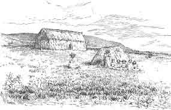

  
[Intangible Textual Heritage](../../index)  [Pacific](../index.md) 
[Index](index)  [Previous](ei05)  [Next](ei07.md) 

------------------------------------------------------------------------

  
*Te Pito Te Henua, or Easter Island*, by William J. Thompson, \[1891\],
at Intangible Textual Heritage

------------------------------------------------------------------------

### VILLAGES AND HABITATIONS.

The Catholic missionaries built at Vaihu, on the south coast, near Cape
Koe Koe, a commodious and substantial church, a parsonage containing
three rooms, and several outbuildings. The house is now the residence of
Mr. Salmon, the outbuildings are occupied by his employés, and the
church has degenerated into a storehouse for wool. The principal native
settlement is at Mataveri, on the southwest coast, and about a mile
distant, at Hanga Roa, a small neat church has been erected. Here the
islanders assemble on Sundays and other occasions to hear the service
read by one of their number, who was ordained especially to take charge
of this congregation upon the departure of the French missionaries. At
the southwest end of the island, and near the base of Rana Kas, is the
residence of Mr. Brander.

The house is of modern structure, with large and convenient rooms, but
is in a state of bad repair, and is more attractive when viewed from a
distance, surrounded by the shrubbery and vines that have been Planted
about it, than it is upon close inspection.

p. 454

The native priest and a few of his connections reside at Hanga Roa, only
those in the employ of Mr. Salmon live at Vaihu, and the only settlement
on the island that may be termed a village is the one at Mataveri. The
primitive huts formerly used by the natives (Fig. 1) have

 

   
FIG. 1. NATIVE HOUSES BUILT OF BULRUSHES.

 

been abandoned for more comfortable dwellings constructed under the
direction of a Danish carpenter out of material obtained from the
wreckage of several vessels loaded with Oregon lumber. These buildings
are of a style of architecture commonly met with in small cheap barns
and stables, but to the simple-minded islanders they supply all the
comforts that could be desired.

These houses are usually about 25 feet long and 15 feet wide with
undressed weather-boards and rooted with the same material. Hinged doors
open in the center and admit light and ventilation, though a few of the
more pretentious buildings are furnished with small glazed windows. The
floors are of bare earth strewn with a litter of dried grass, filthy and
vermin-infested from long use. Mats made of bulrushes are spread out for
sleeping; several rough bedsteads and chests were seen, but the majority
of the houses are destitute of furniture or ornament. Several families
occupy the same dwelling, men, women, and children lie down together
like dogs in a kennel, and with about the same ideas of what constitutes
the comforts of life.

------------------------------------------------------------------------

[Next: Flora](ei07.md)
