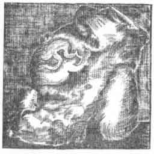
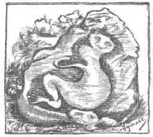
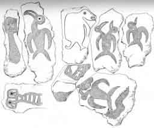

  
[Intangible Textual Heritage](../../index)  [Pacific](../index.md) 
[Index](index)  [Previous](ei35)  [Next](ei37.md) 

------------------------------------------------------------------------

  
*Te Pito Te Henua, or Easter Island*, by William J. Thompson, \[1891\],
at Intangible Textual Heritage

------------------------------------------------------------------------

### SCULPTURED ROCKS.

The most important sculptured rocks on this island (Plate XXII) are in
the immediate vicinity of the stone houses at Orongo (Fig. 7). As

 

   
FIG. 7.  
SCULPTURED ROCKS NEAR ORONGO

 

much time is possible was devoted to examining and sketching these
curious relies. The hard volcanic rock is covered by carvings intended
to represent human faces, birds, fishes, and mythical animals, all very
much defaced by the ravages of time and the elements (Plate XXIII). The
apparent age of some of the rock-carvings antedates the neighboring
stone houses, the images, and other relics of the island except the
ruined village on the bluff west of Kotatake Mountain. Fishes and
turtles appear frequently among these sculptures, but the most common
figure is a mythical animal, half human in form, with bowed back and
long claw-like legs and arms. According to the natives. this symbol was

p. 482

intended to represent the god "Meke Meke," the great spirit of the sea
(Fig. 8). The general outline of this figure rudely carved upon the

 

   
FIG. 8.  
SCULPTURED FIGURES OFTEN REPRODUCED ON ROCKS AT ORONGO: "MEKE MEKE"

 

rocks, bore a striking resemblance to the decoration on a piece of
pottery which I once dug up in Peru, while making excavations among the
graves of the Incas. The form is nearly identical, but, except in this
instance, no similarity was discovered between the relies of Easter
Island and the coast of South America.

 

   
PICTURED SLABS TAKEN FROM THE ANCIENT STONE-HOUSES AT ORONGO  
(Cat No. 128373-128376, U. S. N. M. Easter Island. Collected by
Commander B. F. Day, U. S. N.)

 

------------------------------------------------------------------------

[Next: Ancient Customs in Relation to Gathering the Sea-Birds
Eggs](ei37.md)
