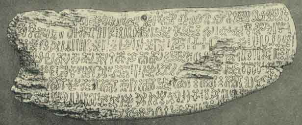
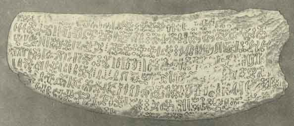

  
[Intangible Textual Heritage](../../index)  [Pacific](../index.md) 
[Index](index)  [Previous](ei49)  [Next](ei51.md) 

------------------------------------------------------------------------

  
*Te Pito Te Henua, or Easter Island*, by William J. Thompson, \[1891\],
at Intangible Textual Heritage

------------------------------------------------------------------------

### TRANSLATION OF THE EASTER ISLAND TABLETS.

ATUA MATARIRI.

(Plates XXXVIII and XXXIX.)

Atua Matariri; Ki ai Kiroto, Kia Taporo, Kapu to Poporo.  
Ahimahima Marao; Ki ai Kiroto, Takihi Tupufema, Kapu te Kihikehi.  
Aoevai; Ki ai Kiroto, Kava Kohe Koe Kapu to Koe.  
Matua anua; Ki ai Kiroto, Kappipiri Haitau, Kapu te Miro.  
Augingieai; Ki ai Kiroto, Kia Humutoti, Kapu to Maluta.  
Hiti; Ki ai Kiroto, Kia Heta Kapu te Ti.  
Atura; Ki ai Kiroto, Katei, Kapa te Monku Uta.  
Ahan; Ki ai Kiroto, Vava, Kapu te Tureme.  
Ahekai; Ki ai Kiroto, Hepeue, Kapu te Mataa  
Viri Koue; Mai Kiroto, Ariugarehe Uruharero, Kapu te Runa.  
Atua Metua; Ki ai Kiroto, Kariritunarai, Kapa te Niu.  
Atua Metua; Ki ai Kiroto, Kite Vuhi o Atua, Kapu te Toromiro.  
Atua Metua; Ki ai Kiroto, Tapuhavaoatua, Kapu te Moana.  
A Heuru; Ki ai Kiroto, Hetomu, Kapu te Marikuru.  
A Taveke; Ki ai Kiroto, Pouhutuhututerevaimangaro, Kapu te Veke,  
A Hahamea; Ki ai Kiroto, Hohio Kapu te Takure.  
Aukia Ki ai Kiroto; Moremanga, Kapu te Ngarava.  
Avia Moko; Ki ai Kiroto, Viatea, Kapu te Kena.  
Tereheue; Ki ai Kiroto, Viaraupa, Kapu te Kaupa.  
A Heroe; Ki ai Kiroto, Unhipura, Mapu te Ro.  
Tahatoi; Ki ai Kiroto, Kateapiairiroro, Kapu te To.  
Irapupue; Ki ai Kiroto, Irakaka, Kapu te Pia.  
Mangeongeo; Ki ai Kiroto, Herakiraki Kapu te Kape.  
A Hen; Ki ai Kiroto Pana Kapu te Hue.  
Heima; Ki ai Kiroto Kairui Kairui-Hakamarui Kapu te Raa.  
Huruan; Ni ai Kiroto Hiuaoio Kapu te Moa.  
A Hikua: Ki ai Kiroto Hinaoioi Kapu te Uruara.  
Tingahae: Ki ai Kiroto Parararahikutea Kapu te Niuki.  
A Hikue: Ki ai Kiroto Hiuaoioi Kapu te Tabraha.

p. 521

Tikitehatu: Ki ai Kiroto Hihohihokiteturu Kapu te Paroko.  
Tikitehatu: Ki ai Kiroto Hiuapopoia Kapu te Hiuakuhara.  
Tikitehatu: Ki ai Kiroto Maea Kapu te Heraherakitomea.  
Tikitehatu: Ki ai Kiroto Ruruatikitehatu Kapu te Teririkatea.  
Atimoterae: mea a mura i hiki te alu mo tunu o te ita, mo haugai it te
ariiki.  
Takoua: Ki ai Kiroto Tukouo, Kapu te Poopoo.  
E. Toto te Efi no Kino no naroko no ngaoreno no nga tokutoko ruapapa.  
Epuoko te nuika no tupa iti no tupa nui.  
Uku Ki ai Kiroto, Karori Kapu te Ngaatu.  
Kuhikia Ki ai Kiroto Taurari Kapu to Ngaatu.  
Kuhikia Ki ai Kiroto Ruperoa Kapu to Turi.  
Taaria Ki ai Kiroto Taaria, Kapu te Taueehu.  
Haiuge Ki ai Kiroto hatukuti, Kapu te Evea.  
Pauaroroko Ki ai Kiroto Hakukuti, Kapu te Taerongoveteve.  
Hiuitirerire Ki ai Kiroto Kanohotatataporo Kapu te Roporo.  
Numia a Tangaire Turuhirohero te toto o te o korare.  
Kamau te Korare taratara te Korare.  
Turuki te Ua Maanau Manavai roa.  
Kaunuku raituahea anakihorou eaa e to e tua tanu to tana moko eaha
Uaugai e to e ufi e Kumara.

### ENGLISH TRANSLATION OF THE ABOVE TABLET.

#### EASTER ISLAND TRADITION.

The origin of inanimate things is believed to be the result of the
marriage of certain gods and goddesses in accordance with the following
table.

God Atua Matariri and goddess Taporo produced thistle.  
God Ahimahima Marao and goddess Takihi Tupufema produced rocks.  
God Aoevai and goddess Kava Kohekoe produced medicine.  
God Matua anua and goddess Kappipiri Aaitau produced the Miro, tree.  
God Augingieai and goddess Kia Humutoti produced the paper-mulberry
tree.  
God Hiti and goddess Kia heta produced the tea plant.  
God Atura and goddess Katei produced bunch grass.  
God Ahen and goddess Vaua produced fine grass.  
God Agekai and goddess Hepeue produced obsidian.  
God Viri Kone and goddess Ariugarehe Uruharero produced the
morning-glory plant.

p. 522

God Atua Metua and goddess Kariritunaria produced cocoanuts.  
God Atua Metua and goddess Ki to Vuhi o Atua produced the toromiro
tree.  
God Atua Metua and goddess Tapuhavaoatua produced Hibiscus.  
God A Heuru and goddess Hetomu produced the blue leaf plant.  
God A Taveke and goddess Pouhutuhututerevaimangaro produced the white
ash.  
God A Hahamea and goddess Hohio produced flies.  
God Aukia and goddess Moremanga produced roaches.  
God A Via Moko and goddess Viatea produced boobies.  
God Tereheue and goddess Viaraupa produced leaves.  
God A Heroe and goddess Unhipura produced ants.  
God Tahatoi and goddess Kateapiairiroro produced sugar-cane.  
God Irapupue and goddess Irakaka produced arrowroot.  
God Mangeongeo and goddess Herakiraki produced yams.  
God Ahen and goddess Pana produced calabash.  
God Heima and goddess Kairui-hakamarui produced stars.  
God Huruan and goddess Hiuaoioi produced fowls.  
God A Hikua and goddess Hiuaoioi produced vermilion.  
God Tingahae and goddess Pararahikutea produced sharks.  
God A Hikue and goddess Hiuaoioi produced porpoise.  
God Tikitehatu and goddess Hihohihokiteturu produced rock-fish.  
God Tikitehatu and goddess Hiuapopoia produced life.  
God Tikitehatu and goddess Maea produced luck.  
God Tikitehatu and goddess Ruruatikitehatu produced man.  
Atimoterae created brook-fish and established them as the chosen food of
the gods.  
God Takoua and goddess Tukouo produced milk-thistle.  
E Toto discovered the sweet taste of the yam and made it the principal
food of the people.  
Epuoko created the delicious banana food for the kings.  
God Uku and goddess Karori produced bullrushes.  
God Kuhikia and goddess Taurari produced small birds.  
God Kuhikia and goddess Ruperoa produced sea-gulls.  
God Taaria and goddess Taaria produced white gulls.  
God Haiuge and goddess Hakukuti produced wind.  
God Pauaroroko and goddess Hakukuti produced pain.  
God Hiuitirerire and goddess Kanohotatataporo produced creeping vines.  
Numia a Tangaire Turuhirohero was the founder of all things unpleasant
and bad smells.  
Turuki was the first builder of rock fences and barriers.  
Kuanuku created death by drowning, death in warfare, death by accident,
and death by disease.

 

   
PLATE XXXVIII.  
OBVERSE OF EASTER ISLAND TABLET, "A TUA MATARIRI."  
(Cat No. 129773, U. S. N. M. Easter Island. Collected and deposited by
Paymaster W. J. Thompson, U. S. N.)

 

   
PLATE XXXIX.  
REVERSE OF EASTER ISLAND TABLET, "A TUA MATARIRI."  
(Cat No. 129773, U. S. N. M. Easter Island. Collected and deposited by
Paymaster W. J. Thompson, U. S. N.)

 

 

------------------------------------------------------------------------

[Next: Text of the Easter Island Tablet: Eaha To Ran Ariiki Kete](ei51.md)
