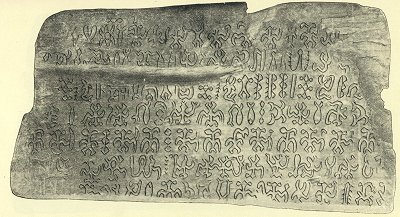
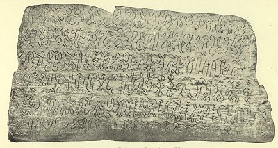

  
[Intangible Textual Heritage](../../index)  [Pacific](../index.md) 
[Index](index)  [Previous](ei51)  [Next](ei53.md) 

------------------------------------------------------------------------

  
*Te Pito Te Henua, or Easter Island*, by William J. Thompson, \[1891\],
at Intangible Textual Heritage

------------------------------------------------------------------------

p. 525

### TRANSLATION OF EASTER ISLAND TABLETS.

#### FATHER MOURNING THE LOSS OF HIS CHILD.

(Plates XLII and XLIII.)

Ka ihi uiga ---- te ki ati ----  
       Auwe te poki, e ----  
Ite maki tana ---- Rii te hiva ina.  
Ka ihi uiga ---- mai.

2\.

Ka ihi uiga ---- te ki ati ----  
       Auwe te poki, e ----  
Ite maki tana ---- Honiti ina.  
Ka ihi uiga ---- moa mai.

3\.

Ha imu, ---- poki ---- e ----;  
       Ta auwe rai ---- e;  
Viviri rai, inage ---- o;  
       I ----- ruga ---- i;  
       Te papare hinua  
Viviri rai ---- inage ---- o!

4\.

Haki ---- e!  
Avahinua ---- ki tagu atu.  
       Auwe poki ---- e!  
Ava rai ----  
Ava mata ---- Ina hiva  
              Auwe poki ---- e!  
Ite renia o parapa moni  
              Auwe poki ---- e!

This is an old song, supposed to have descended from the time the first
inhabitants arrived on the island. The father is believed to mourn for
his child left in that eastern land, from which tradition states the
People migrated.

#### ENGLISH TRANSLATION.

The sail of my daughter,  
  Never broken by the force of foreign clans!  
The sail of my daughter,  
  Unbroken by the conspiracy of Honiti!  
Ever victorious in all her fights  
  She could not be enticed to drink poison waters  
In the cup of obsidian glass.  
  Can my sorrow ever be appeased  
While we are divided by the mighty seas?  
  Oh my daughter, oh my daughter!  
It is a vast and watery road  
  Over which I look toward the horizon,  
My daughter, oh my daughter!  
  I'll swim over the deep to meet you,  
My daughter, oh my daughter!

 

   
OBVERSE OF EASTER ISLAND WOODEN TABLET "KA IHI UIGA"  
(From photographs presented by George Davidson to the California Academy
of Sciences)

   
REVERSE OF EASTER ISLAND WOODEN TABLET "KA IHI UIGA"  
(From photographs presented by George Davidson to the California Academy
of Sciences)

 

------------------------------------------------------------------------

[Next: Text of the Easter Island Tablet: Ate-a-renga-hokan iti
Poheraa](ei53.md)
