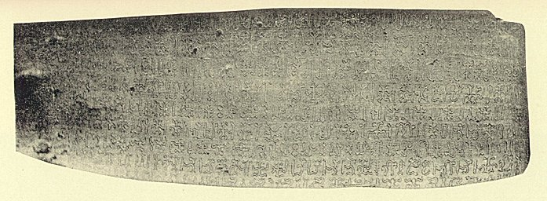
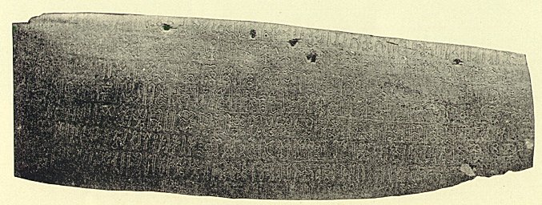
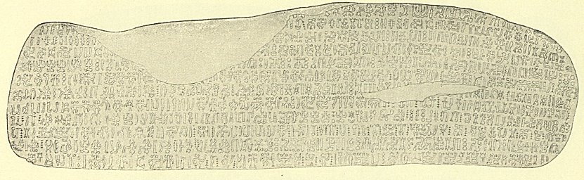
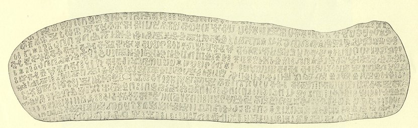
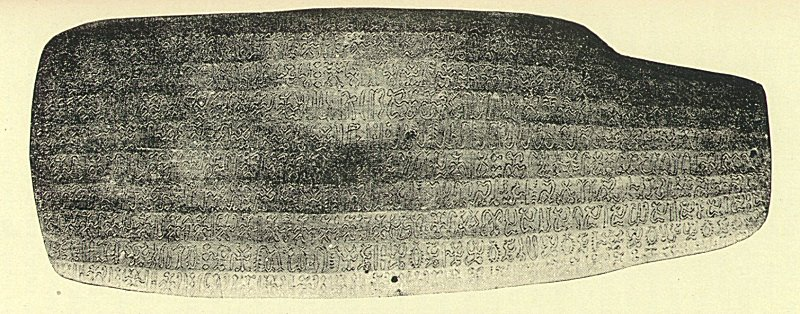
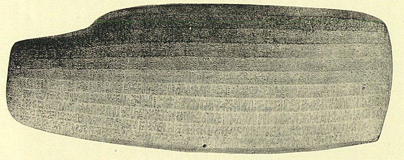

  
[Intangible Textual Heritage](../../index)  [Pacific](../index.md) 
[Index](index)  [Previous](ei53)  [Next](ei55.md) 

------------------------------------------------------------------------

  
*Te Pito Te Henua, or Easter Island*, by William J. Thompson, \[1891\],
at Intangible Textual Heritage

------------------------------------------------------------------------

 

   
   
OBVERSE AND REVERSE OF EASTER ISLAND TABLET.  
(From a cast lent by Parke, Davis & Co.)

   
REVERSE OF EASTER ISLAND TABLET, OBTAINED BY THE CHILIAN CORVETTE
"O'HIGGINS"  
(Original in Santiago Museum, Chili)

   
OBVERSE OF EASTER ISLAND TABLET, OBTAINED BY THE CHILIAN CORVETTE
"O'HIGGINS"  
(Original in Santiago Museum, Chili)

   
   
OBVERSE AND REVERSE OF EASTER ISLAND TABLET, OBTAINED BY THE CHILIAN
CORVETTE "O'HIGGINS"  
(Original in Santiago Museum, Chili)

 

------------------------------------------------------------------------

[Next: Tradition in Regard to the Origin of The Islanders.](ei55.md)
