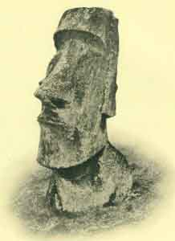

  
[Intangible Textual Heritage](../../index)  [Pacific](../index) 

------------------------------------------------------------------------

<table width="75%">
<colgroup>
<col style="width: 50%" />
<col style="width: 50%" />
</colgroup>
<tbody>
<tr class="odd">
<td width="50%" data-valign="TOP"></td>
<td width="50%" data-valign="CENTER"><h1 id="te-pito-te-henua-or-easter-island" data-align="CENTER">Te Pito Te Henua, Or Easter Island</h1>
<h3 id="by-william-j.-thomson" data-align="CENTER">by William J. Thomson</h3>
<h5 id="section" data-align="CENTER">[1891]</h5></td>
</tr>
</tbody>
</table>

------------------------------------------------------------------------

[Contents](#contents)    [Start Reading](ei00)    [Page
Index](pageidx)    [Text \[Zipped\]](eitxt.zip)

------------------------------------------------------------------------

Easter Island is a surreal landscape, with its giant stone heads and
undeciphered rongo-rongo script--the only writing system invented in the
Pacific islands. This account of an expedition to Easter Island in the
late nineteenth century will have modern social scientists (as well as
indigenous rights activists) gritting their teeth. The adventurers
engage in tomb-raiding from one end of Easter Island to the other,
shredding priceless archeological contexts without remorse. The text
describes bones turning into dust on touch; they loot gravesites, and
tear up ruins of villages. When one of the Easter Islanders complains
that they are taking his ancestors' remains, they offer him two dollars
for the bones.

The one redeeming feature of this expedition was the desperate attempt
to prompt one of the last remaining indigenous bards to relate the
rongo-rongo texts and other legends. The circumstances of this recital
are greatly suspect. The informant had been indoctrinated by
missionaries that reciting from the tablets was a mortal sin. After the
expedition attempted to bribe the informant, he fled into the
hinterlands. A rainstorm forced him to return to his house. On the last
evening before the expedition set sail, they cornered him in his hut and
got him drunk, after convincing him that reciting from a photograph was
not the same as reciting from the original tablet. To further confuse
matters, at one point they switched photographs on him mid-recital...

The monograph has slighly retouched photographs of several of the
tablets, reproduced here, which will be very useful to anyone interested
in attempting to decipher rongo-rongo. The 'translations', such as they
are, remain a key piece of data in any investigation of the script. Also
of interest is the version of the Easter Island migration legend quoted
here, which claims that they came from the direction of the rising sun.
This has been used subsequently to justify a South American origin, most
notably by Thor Heyerdal; however it has been contradicted by other
accounts, so it should not be treated as absolutely authoritative. This
document also has a sketchy vocabulary of the language of Easter Island
(Rapanui).

------------------------------------------------------------------------

[Title Page](ei00)  
[The Discovery of Easter Island](ei01)  
[Sailing Directions](ei02)  
[Geological Features](ei03)  
[Various Names of the Island](ei04)  
[Climate](ei05)  
[Villages and Habitations](ei06)  
[Flora](ei07)  
[Mammals](ei08)  
[Birds](ei09)  
[Fishes](ei10)  
[Reptiles and Insects](ei11)  
[Nets and Ropes](ei12)  
[Natives](ei13)  
[Personal Appearance of the Natives](ei14)  
[Brutal Treatment of Natives by Early Voyagers](ei15)  
[Thieving](ei16)  
[Tattooing](ei17)  
[Salutation](ei18)  
[Dress](ei19)  
[Mats](ei20)  
[Amusements](ei21)  
[The Native Dance](ei22)  
[Religion](ei23)  
[Superstitions](ei24)  
[Sacrificial Stones](ei25)  
[Diseases and Their Treatment.](ei26)  
[Fire](ei27)  
[Cannibalism](ei28)  
[Government](ei29)  
[Burial of the Dead](ei30)  
[Boats](ei31)  
[Weapons and War](ei32)  
[Exploration of the Island](ei33)  
[Reconnaisance to Rana Kao](ei34)  
[The Ancient Stone House At Orongo](ei35)  
[Sculptured Rocks](ei36)  
[Ancient Customs in Relation to Gathering the Sea-Birds Eggs](ei37)  
[Employment of Natives](ei38)  
[Cave and Tomb Near Ahuakapu Point](ei39)  
[Ruins of the Oldest Habitation on the Island](ei40)  
[Natural Caves](ei41)  
[Anakena Bay](ei42)  
[The Poike Plains](ei43)  
[Tongariki](ei44)  
[Rana Roraka](ei45)  
[Skulls Showing Peculiar Marks](ei46)  
[Platforms and Images](ei47)  
[Language](ei48)  
[Translation of the Easter Island Tablet, Apai](ei49)  
[Text of the Easter Island Tablet: Atua Matariri](ei50)  
[Text of the Easter Island Tablet: Eaha To Ran Ariiki Kete](ei51)  
[Text of the Easter Island Tablets: Father Mourning the Loss of His
Child](ei52)  
[Text of the Easter Island Tablet: Ate-a-renga-hokan iti
Poheraa](ei53)  
[More Rongo-rongo plates](ei54)  
[Tradition in Regard to the Origin of The Islanders.](ei55)  
[Tradition Regarding Obsidian Spear-points](ei56)  
[Tradition Regarding Fish Hooks.](ei57)  
[Genealogy of the Kings of Easter Island](ei58)  
[List of Ethnographic Specimens Obtained at Easter Island](ei59)  
[Polynesian Archaeology](ei60)  
[Language--Vocabulary](ei61)  
[Vocabulary](ei62)  
[Numerals](ei63)  
