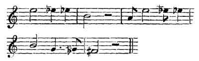

  
[Intangible Textual Heritage](../../index)  [Pacific](../index) 
[Index](index)  [Previous](grey25) 

------------------------------------------------------------------------

p. 227

# APPENDIX

### ON THE NATIVE SONGS OF NEW ZEALAND

AND A COMPARISON OF THE INTERVALS DISCERNIBLE IN THEM WITH THE INTERVALS
STATED TO HAVE BEEN PERFORMED BY THE ANCIENT GREEKS IN SOME OF THEIR
DIVISIONS OF THE MUSICAL SCALE, CALLED γένοσ ἐναρμονικὸν {Greek *génos
e?narmonikòn*}, on BY OTHERS ἁρμονία {Greek *a!rmonía*}.

ALL nations, perhaps, without excepting any, have some method of
expressing the more energetic emotions beyond mere speaking or acting; a
sense of joy or pain, naturally calling forth ejaculations and
vociferations exceeding in limit the tone of voice used in ordinary
discourse. The cry of war, the encouraging to battle, the shout of
victory, or the lament of the vanquished, the wailing over a deceased
friend, grief at the departure of a lover, each in its turn has prompted
or suggested some modification of sound beyond the ordinary range of
mere tame every-day discourse; and this modification of voice we may
call, in a wide sense, *natural music*.

But as the highest art is to conceal the art, [1](#fn_24) and to imitate nature, that mighty nation,
the Greeks, with an art almost peculiarly their own, having observed
these expressions of sentiment, thence deduced certain laws [2](#fn_25) of interval, by which, while they kept
within the limits of art, they took care not to transgress those of
nature, but judiciously to

p. 228

adopt, and as nearly as possible to define, with mathematical exactness,
those intervals which the uncultured only approach by the irregular
modulation of natural impulses; so their art was the schooling of nature
by the more exact observance of her laws, and by training nature by
perfect art, they made art like nature, and corrected nature by art, as
the sculptor or painter gives the classic embodiment or personification,
not the commonplace, and often defective representation of an object.

This I opine to have been the real nature of the enharmonic scale of the
Greeks; and hence I conceive the reason of the remnant of that scale
being found among most of those nations who have been left to the
impulses of a 'nature-taught' song rather than been cramped by the
trammels of a conventional system--the result of education and
civilisation.

It may not he amiss, before going farther into this analogy of nature,
and of an art reciprocally reflecting back that nature, to endeavour to
give the uninitiated an idea of what is meant by the 'enharmonic: genus
' of the Greeks.

I must first remark that while we have, properly speaking, only one
scale of musical notes and two genera, the Greeks had three scales and
five genera. For we have only the diatonic scale, but by a certain
introduction of one or more semitones, we make what is called the
chromatic.

Whereas, the Greeks had three scales, comprising five genera, or,
according to some, nine [1](#fn_26), all
differing not only, as ours do, in the position of intervals, but in the
intervals themselves; this difference of interval (rather than position
of interval) gave rise to the expression '*genera of a*

p. 229

*system*', and depended on the distribution of two intermediate sounds
in the tetrachord or 4th.

The principal scales and genera were three; the diatonic, the chromatic,
and the enharmonic. The *diatonic* (genus) consisted of a limma or minor
half tone, a major tone, and a major tone ascending, this had another
modification, by which, while it retained the same semitone, it
contracted the next tone, and extended the last; the latter was called
soft diatonic.

The *chromatic*, which consisted of semitone, semitone, one tone and a
half interval, or nearly our minor third, was called tonaæon, and had
two modifications, one called hemiolion, and the other malakon; these
shades or modifications seem of later invention, and soon to have fallen
into disuse.

The enharmonic consisted of a quarter tone, a quarter tone and an
interval of two tones, an interval somewhat greater than our third
major.

Wallis says that we have no idea of these intervals at the present day,
as in any way connected with a scale, since they amount to little more
than an imperfect elevation or depression of the voice within the limits
of what we call a sound or harmonic note; though a certain use is made
of the term enharmonic, and the existence of the interval is admitted in
the higher researches on music, and said to be apparent in the so-called
tierce wolf of the organ, in untempered instruments, and in the systems
of equal temperament.

Writers of the present day, greatly differ as to the existence or use of
these χρόαι {Greek *xróai*}, or shades of distinction, some wishing to
modify them by a modern application of the term, amounting to those
shades, 'nuances' or slurs, which the best vocalists or performers are
sometimes heard to introduce [1](#fn_27); others
again [2](#fn_28) declaring them to be in
practice

p. 230

impossible; and all for the most part alleging that, whatever might have
been the case in former times, no such modifications do exist in
practice at the present day.

Now, with regard to the existence of them in ancient times, innumerable
authorities might be quoted; but, not to exceed a reasonable limit, I
shall only cite one or two testimonies, and shall confine myself to
those referring to the enharmonic.

Vitruvius (lib. v, c. 5) says: '*Diatonic vero quod naturalis est
facilior est intervallorum distantia*'; of the enharmonic he says: '*Est
autem harmonia, modulatio ab arte concepta et ea re cantio ejus maxime
gravem et egregiam habet auctoritatem*.' The graveness and seriousness
are given as the striking characteristics of this genus.

We may here incidentally remark that. though he says 'ab arte concepta',
it does not prove that it might not have been art imitating nature; and
more, it is not impossible that these, at present so-called uncivilised
and savage nations, might have retained this character of song from a
period of the highest state of civilisation, at an epoch of great
antiquity.

Plutarch (Περὶ Μουσικῆσ {Greek *Perì Mousikh^s*}) remarks, that the most
beautiful of the musical genera is the enharmonic, on account of its
grave and solemn character, and that it was formerly most in esteem.

Aristides Quintilian tells us it was the most difficult of all, and
required a most excellent ear.

Aristoxenus observes that it was so difficult, that no one could sing
more than two dieses consecutively, and yet the perceptions of a Greek
audience wore fully awake to, and their judgment could appreciate, a
want of exactness in execution; for Dionysius of Halicarnassus says, he
himself has been in the most crowded theatre, where, if a singer or
citharoedist mistook the smallest interval (presumed to

p. 231

be the enharmonic diesis), he was hissed off the stage.

Isaac Vossius [1](#fn_29), from a multitude of
authorities, has established, that transitions were made by ancient
singers and performers, from the diatonic to the chromatic and
enharmonic, with the greatest facility; and he adds: '*which, because
the moderns cannot do, they even positively and seriously assert that
the ancients could not sing the enharmonic*.' Whereas, continues he:
'*not only did they sing it, but accompanied it with instruments*.'

So *Plutarch* (Περὶ Μουσικῆσ {Greek *Perì Mousikh^s*}), who adds a
remark, the purport of which is, such persons (who affirm that the
ancients could not accompany the enharmonic) forget that if they can
accompany greater intervals which were composed of less, there can be no
reason why the scale of an instrument might not be so adjusted as to
accompany the less intervals which compose those greater.

The doubt of the possibility of using the enharmonic as a scale is not
confined to our own day, for Plutarch, as we have seen (and in other
places also), speaks of the decline of it; and Athenæus speaks of
certain Greeks who, from time to time, retired by themselves to keep up
the recollection of the good old music, since the art had become so
corrupted.

In *Plutarch's* time (*De Musica*) he bitterly complains that certain
people '*affirmed the enharmonic diesis to be absolutely
undistinguishable*,' and that, therefore, it had no place in the scales
of nature, and that those who attempted to prove it were mere triflers
(pefluarhké?nai)  [2](#fn_30)

p. 232

He then makes the remark about the possibility of accompanying the
enharmonic intervals with instruments, and adds: 'and these very people
who talk about the enharmonic having no foundation in nature, have an
extraordinary attachment to dissonances and irrational intervals'
(περιττά · · · ῆ ἄλογα {Greek *perittá . . . h^ á?loga*}), which have no
existence in the real science of the proportions of natural intervals,
and may be compared to certain irregular tenuities or awkward
excrescences on what should be a beautiful tree or other object. For
whatever reason, it appears it was wholly laid aside in Plutarch's time,
which he attributes to the dulness of the ears of those of his day.

Wallis supposes the genera of the chromatic and enharmonic to have
fallen into disuse for many ages; Scaliger, not till Domitian: the
enharmonic, because of the extreme difficulty; the chromatic, on account
of its softness and effeminacy. Dr Wallis adds: 'modern music never
affected to appreciate such subtilty and delicate nicety, for neither
voice could execute, nor ear easily distinguish so minute differences,
at least so we suppose now-a-days.'

Dr Burney, in his *History of Music* (i. 433), from various authorities,
concludes, that this genus (the *close* enharmonic) was almost
exclusively in use before Aristoxenus (about the time of Alexander the
Great), and we gather from Aristoxenus that there were exercises in it
for practice, and this observation is corroborated in the Notices of
*Extraits des MSS*., t. xvi., in a most elaborate and clever paper, by
Mr Vincent, from certain MSS. in the King of France's library.

Dr Burney, in common with most other modern

p. 233

writers on the subject, says. 'intervals of the close enharmonic
tetrachord

 

 

 

appear wholly strange and unmanageable', and hence it has been concluded
that the enharmonic was impossible in practice.

Dr Burney, however, one day received a letter from his friend Dr
Russell, regarding the ' state of music in Arabia, and to the Doctor's
utter astonishment, he learnt from that letter that the Arabian scale of
music was divided into quarter tones; and that an octave, which, upon
our keyed instruments is only divided into 12 semitones, *in the Arabian
scale* contained 24, *for all of which they had particular
denominations*.

This latter observation would seem to tally very well with what Mr
Lane [1](#fn_31) says of the canoon (κάνων
{Greek *kánwn*}) of the present Arabs, which, he says, has 24 treble
notes. Only, that he adds, each note has *three* strings to it, which
(later, as we shall see) he affirms to have been *thirds of tones*. If
so, the system is a shade of the chromatic; and if Mr Lane is right (and
he gives a drawing of the instrument), Dr Russell must err, or speak of
another instrument. I should be inclined to give preference to Lane,
because of the great pains he has taken in describing the instrument.

Mr Lay Tradescant [2](#fn_32), speaking of the
Chinese intervals, says that 'it is impossible to obtain the intervals
of their scale on our keyed instruments, but they may be perfectly
effected on the violin.'

p. 234

Mr Vincent [1](#fn_33) gives a most scientific
description of an elaborate instrument made at Paris, exhibited at the
Institut, on which the quarter tones were most correctly illustrated,
and observes, that a much less interval than the quarter-tone, perhaps
eight or ten times less, is discernible, as proved by a M.
Delezenne [2](#fn_34), 1827; and our own ears
attest that universally in the modulations of the voice of the so-called
savage tribes, and in the refined and anomalously-studied Chinese, there
are intervals which do not correspond to any notes on our keyed
instruments, and which to an untrained ear appear almost monotonous.

There is another matter with which incidentally we have to do, namely,
an apparent difference of opinion between ancient authors themselves
about the enharmonic. Plutarch [3](#fn_35) says
that Aristoxenus (in a book not now extant) informs us that Olympus was
the inventor of an enharmonic, but of a kind consisting of a scale in
which certain notes, the 'lichani' or 'indicatrices', were omitted, and
that the airs of Olympus were so simple and beautiful, that there was
nothing like them.

 

 

 

This Scale would approximate to the Scotch, or rather to that given as
Chinese by Dr Russell. [4](#fn_36) But there is
nothing repugnant in this, to the division of the intermediate half-note
between this saltus; and, as here, it is the division of the halfnote
interval with which we have to do;

p. 235

 

 

 

the discussion as to the variety or difference introduced by
Olympus--(as to whether he made use of this design or not)--is not of
any importance to our subject, our object being merely to show that the
smaller interval, called a quarter tone, has its representative in
modern times.

Suffice it to say, that many Chinese airs, of which I have two, show the
diesic modulations and the saltus combined; but the majority of the New
Zealand airs which I have heard are softer and more '*ligate*', and have
a great predominance of the diesic element.

It may not be amiss to define in what sense we wish '*diesis*' to be
understood, for sometimes, by modern writers especially, it is used for
the simple minor half-tone of 24/25 in contradistinction to the major of
15/16. In Dr Smith's Harmonies it is the limma of equal temperament.
Sometimes the moderns use the term for the *double sharp*. It was
Rameau's these major; Henfling's Harmonia; Boyce's quarter-note; the
Earl of Stamford's tierce wolf; observed in the tuning of an organ. Dr
Maxwell makes 2025/2048 the maj. diesis, and 32768/32805 the min. But
the sense in which I shall use it is that of the ancient quarter-tone,
being an approach to the quarter of a tone major, or rather the division
of the limma 243/256 into two unequal parts; this is called the
Aristoxenian *diesis* quadrantalis; which is represented nearly by 120
being the lowest note; then 116.60: 113.39.

p. 236

I shall not trouble the reader with chronological or scholastic
differences; the diesis of Archytas; that of being given by Vincent as
115 5/7: 112½, Eratosthenes as 117: 114, for keen indeed must be the ear
that could discern between 15/16 and 24/25 (except in harmony); much
more difficult still would it be to discover a difference between
116.60. 113.39 and 115 5/7 / 112 ½ or 117/114.

If any wish to examine this matter more closely, they can consult the
Treatises on Harmonies. Mr Vincent has calculated these differences by
logarithms to the 60 root of 2.

My point is, to prove that the ancients did possess and practise a
modulation which contained much less intervals than ours, and that such,
or an approach to such, modulation (though probably but imperfect) is
still retained among some people, and that the principles on which the
Greeks founded their enharmonic genus, still survive in natural song,
though I will not be bold enough to assert that sometimes these songs
may not change into one of the chromatic Χρόαι {Greek *Xróai*}, which,
for want of practice, I might not be able to decide. One thing, however,
is certain, that, as Aristoxenus tells us, no perfect ear could modulate
more than *two* dieses at a time (and then there was a '*saltus*' or
interval of two tones), and as the New Zealand songs frequently exhibit
more than *two* close intervals together, it is more than probable that
many of these songs are a chromatic, represented by 120, 114 or 108, or
120, 112½, 108; but it will not be worth while for the present purpose
to discuss this nicety, as all we want is a practical approximation.

In proof that a system, of modulation like the above still survives, I
shall produce, as nearly as my ear could discern, the modulation of some
of

p. 237

the New Zealand melodies; and shall show a still nearer approach to the
system of the real Greek enharmonic, in a Chinese air which I heard and
noted.

A few remarks on the *system* itself, the *intervals*, and the
*notation*.

SYSTEM

First, that an enharmonic modulation might; exist is admitted by many
modern writers. Mr Donkin, for instance, author of the able article on
Ancient Music in Dr W. Smith's *Dictionary of Greek and Roman
Antiquities*, observes (under the title of Music) of the different
genera less frequently named [1](#fn_37), 'that
it would be wrong to conclude hastily, that the others would he
*impossible* in practice, or *necessarily* unpleasing'; and of the
enharmonic he says: 'but it is impossible to form a judgment of its
merits without a much greater knowledge of the rules of composition than
seems now attainable.'

Mr Lay Tradescant having shown the differences of interval of the
Chinese instruments from the intervals generally in use in Europe, adds:
'It will therefore very readily appear from the respective rules, that
the character of the music, or, if you please, the mood (he should have
said genus), must be very different from our own, and that none of our
instruments (he should have said keyed or bored) are capable of doing
justice to any air that is played on the kin' (or scholar's lute). He
subjoins: 'In my travels I sometimes *wrote down* the airs that I had
heard among the natives, but though I took much pains to learn them
accurately,

p. 238

\[paragraph continues\] I always found they had lost something of their
peculiarity when played upon the violin.

'The reason of this defect seems to have been that the *intervals* of
the Indian music did not agree with those of Europe.' [1](#fn_38)

Mr Tradescant might have added, that there will always be some
difference in an air played on the guitar and on the violin, though the
intervals used axe esteemed the same; and, again, perhaps the learned
traveller did not take care to divide the scale of his violin
mathematically, like that of the kin, before he tried the effect,; he
might also riot have noted the right interval. He concludes: 'There is,
however, a connection between the Chinese and old Scotch music, so that
when any highly-admired airs of Scotland happen to fall within the
compass of the kin, they seem at home when played upon this instrument.'

Mr Lane says the 'canoon' of the Arabians had twenty-four notes. Dr
Russell to Burney says that the Arab scale of *twenty-four* notes was
equal to one octave. But Mr Lane adds that 'the most remarkable
peculiarity in the Arab system of music is the division of tones into
*thirds*.' Hence, from the system of thirds of tones, I have heard the
Egyptian musicians urge against the European systems of music that they
are deficient in the *number of sounds*.

The same remark was made to me by Selim Agar, a Nubian, when singing
some Amharic songs: 'Your instrument' (piano), said he, 'is very much
out of tune, and *jumps very much*.'

Mr Lane adds: 'These small and delicate gradations of sound give a
peculiar softness to the performances of the Arab musicians, which are
generally of a *plaintive character*; but they are difficult to
discriminate with exactness, and therefore seldom

p. 239

observed in the vocal and instrumental music of those persons who have
not made a regular study of the art.'

Had Mr Lane been describing the character and difficulties of the
ancient Greek enharmonic or chromatic, he could not have used other
terms; they are almost the words of Aristoxenus, Vitruvius, Plutarch,
and other ancient writers on these genera; and yet, he adds: 'he took
great delight in the more refined kind of music', and found 'the more he
became habituated to the style the more he was pleased with it.' He
continues: 'He was perfectly charmed with the performance of some female
singers, and that the natives are so fascinated as to lavish
considerable sums on them.'

Precisely so the Greeks of old.

INTERVALS

We must not suppose that the Greek enharmonic was a consecutive gamut of
quarter-tones--no; we are told distinctly by all authors (except,
perhaps, Salinas), that there was a quarter-tone, then another
quarter-tone, then a great interval completing the fourth; or reversely,
a great interval of two major tones, or about our third major, the
quarter-tone, mother quarter-tone, thus completing the *fourth*.

So with these nations, and especially in the Chinese airs I have heard,
there is either the two quarter-tones, then an interval of about a
third, or, the interval of the third, and then the two dieses or
quarter-tones, or it is a mixed genus, and adds a tone or half-tone at
either extreme.

I here beg to state that, though with great care and the assistance of a
graduated monochord, and an instrument divided like the intervals of the
Chinese kin, I have endeavoured to give an idea of those airs of New
Zealand which I heard, yet so

p. 240

difficult is it to discover the exact interval, that I will not vouch
for the *mathematical* exactness: neither will I pledge myself not to
have written a chromatic for an enharmonic interval, or *vice versa*.

I must also, in justice to myself, add, that the singer did not always
repeat the musical phrase with precisely the same modulation, though,
without a very severe test, this would not have been discernible, nor
then to many ears; the general effect being to an European ear very
monotonous.

But I may say that, when I sang them from my notation, they were
recognised and approved of by competent judges; and that the New
Zealander himself said he should 'soon make a singer of me'.

I may also add that I have studied the subject for more than twenty
years, and have read something out of almost every book of note that has
been written on it; but yet I only offer these airs as an approximation,
and if anyone shall be found who may do more justice to them, I shall be
delighted to hear of the result.

NOTATION

The notation that I have adopted is, for the enharmonic diesis, the St
Andrew's cross or saltier 
, quarter tone or half sharp; the usual   for the sharp; and for   three-quarter sharp. In like
manner, the   for quarter
tone or half flat;   for
the flat; and   (or I
might have said:  ) for
the three-quarter flat.

In the Arab ternal division I should use-one third sharp,  ; two-third sharp,  ; one-third flat,  ; two-third flat,  .

p. 241

In my notation, also, it must be observed, that a sign   or   never conveys its influence
beyond the note to which it is attached; thus

 

 

 

would read E half-flat, E natural, E half-sharp, E natural; and is a
delicate expression of the chromatic

 

 

 

or of the diatonic

 

 

 

I now give the airs as best I can.

One word as to *time*. Though I have timed the airs I have given, I am
free to confess there was neither metre nor rhythm of any marked
character discernible in them; and even in the divisions of the lines or
verses, the singer seemed to stop indifferently now at one, now at
another word. I have, however, followed in my divisions those given in
the book, taking it for granted that the learned author, who has given
himself so much pains about the matter, will have chosen the most
authentic.

James A. DAVIES  [1](#fn_39)

Formerly of Trin. Coll., Camb.

Late Private See. to H.R.H. Prince Leopold,

Count of Syracuse, Naples.

17, Great Ormond Street, Queen Square,

September, 1854.

p. 242

Mr MeGregor gives the following specimens of Arabian Music (see his
*Eastern Music*)

 

 

 

Which I represent thus:

 

 

 

or thus, perhaps clearer:

 

 

 

The run at the end is also met with in the New Zealand songs. The
cadence is mixed, *i.e.* enharmonic and diatonic.

The Chinese Air sung under my window in London:

 

 

 

p. 243

No. 1

THE WAIATA AROHA: OR, THE BRIDE'S COMPLAINT

*Reduced by James Davies*. Page 30  [1](#fn_40)

 

 

 

p. 244

 

 

This last bar would perhaps be better written:

 

 

 

p. 245

but I have avoided as much as possible 
 or   as
being so very unusual, and it is evident to the musician that D
three-quarters sharp is equal to E quarter flat, at least sufficiently
near in practice.

No. 2

A LAMENTATION

 

p. 246

 

NO. 3

WHAKARONGO

 

 

p. 247

 

NO. 4

CHILD'S SONG, TO TEACH SINGING

 

------------------------------------------------------------------------

### Footnotes

[227:1](grey26.htm#fr_24) Cicero.

[227:2](grey26.htm#fr_25) Cicero, *Orat*.

[228:1](grey26.htm#fr_26) Ptolomæus the Magian,
Mr. Vincent's paper in *Notices et Extraits des MSS.*, tom. xvi, Paris.

[229:1](grey26.htm#fr_27) Smith.

[229:2](grey26.htm#fr_28) Burney.

[231:1](grey26.htm#fr_29) *De Poematum Cantu*.

[231:2](grey26.htm#fr_30) That the enharmonic
has no foundation in nature is false, for what tree tapers 'per
saltum?'--'what river flows in heaps?--this gradation is p. 232 nature's life-stream; the other scales may
be compared to the proportional parts, the enharmonic to the continuous
procession.

[233:1](grey26.htm#fr_31) Lane's *Modern Egypt*.

[233:2](grey26.htm#fr_32) Lay Tradescant's
*Chinese as they Are*.

[234:1](grey26.htm#fr_33) *Notices et Extraits
des MSS*., tom. xvi.

[234:2](grey26.htm#fr_34) Memoire de la Societe
Royale de Lille.

[234:3](grey26.htm#fr_35) Περὶ Μουσικῆσ {Greek
*Perì Mousikh^s*}.

[234:4](grey26.htm#fr_36) Burney, vol. i.

[237:1](grey26.htm#fr_37) As the soft diatonic,
the hemiolion chromatic, the soft chromatic.

[238:1](grey26.htm#fr_38) Lay Tradescant's
*Chinese as they Are*.

[241:1](grey26.htm#fr_39) Author of the Papers
on the Rhythm of the p. 242 Ancient Greek
Orators of the Psalms, Selah, the Evil Eye, read before the Royal
Society Of Literature; and of Papers on Accent and Quantity, discovering
their true and real difference, from authentic sources. See *English
Journal of education*, February, March, April, June, July, and August;
G. Bell, 186, Fleet Street.

[243:1](grey26.htm#fr_40) The pages refer to Sir
George Grey's collection of New Zealand Songs, Mau Konga moteatea, me
nga Haki rara.
