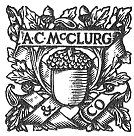

  
[Intangible Textual Heritage](../../index)  [Pacific](../index) 
[Index](index)  [Next](hft01) 

------------------------------------------------------------------------

[Buy this Book at
Amazon.com](https://www.amazon.com/exec/obidos/ASIN/B0024FAHH0/internetsacredte)

------------------------------------------------------------------------

  
*Hawaiian Folk Tales*, by Thomas G. Thrum, \[1907\], at Intangible
Textual Heritage

------------------------------------------------------------------------

# HAWAIIAN FOLK TALES

### A COLLECTION

### OF NATIVE LEGENDS

###### COMPILED BY

## THOS. G. THRUM

 

#### Chicago: A.C. McClurg & Co.

#### \[1907\]

Scanned at Intangible Textual Heritage, July 2006. Proofed and formatted
by John Bruno Hare. This text is in the public domain in the United
States because it was published prior to 1923.

------------------------------------------------------------------------

[Next: Preface](hft01)
