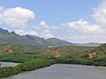

  
[Intangible Textual Heritage](../../index)  [Pacific](../index) 
[Index](index)  [Previous](hft28) 

------------------------------------------------------------------------

[Buy this Book at
Amazon.com](https://www.amazon.com/exec/obidos/ASIN/B0024FAHH0/internetsacredte)

------------------------------------------------------------------------

  
*Hawaiian Folk Tales*, by Thomas G. Thrum, \[1907\], at Intangible
Textual Heritage

------------------------------------------------------------------------

p. 275 p. 276
p. 277

### GLOSSARY OF HAWAIIAN WORDS

#### AAH

*aaho*, sticks for thatching, [p. 142](hft16.htm#page_142).

*ahaaina*, feast, [p. 150](hft17.htm#page_150).

*aheahea*, an edible plant, [p. 135](hft15.htm#page_135).

*aholehole*, a species of fish.

*ahos*, small sticks used in thatching, [p. 245](hft25.htm#page_245).

*Ahu o Kakaalaneo*, the name given to the original feather cloak, [p.
155](hft17.htm#page_155).

*ahupuaa*, a small division of a country under the care of a head man.

*ahuula*, a feather cloak, [p. 155](hft17.htm#page_155).

*Ai Kanaka*, man eater, [p. 191](hft20.htm#page_191).

*aikane*, an intimate friend of the same sex, [p.
264](hft27.htm#page_264).

*Aina-i ka-kaupo-o-Kane* (the land in the heart of Kane), the primeval
home of mankind, [p. 17](hft04.htm#page_17).

*Aina kumupuaa a Kane*, see *Kanaka-maoli*.

*Aina lauena a Kane*, [p. 24](hft04.htm#page_24)

*Aina-wai-akua-a-Kane* (the land of the divine water of Kane), the
primeval home of mankind, [p. 17](hft04.htm#page_17).

*aipuupuu*, chief cook or steward, [p. 141](hft16.htm#page_141).

*akaaka*, laughter, [p. 118](hft14.htm#page_118).

*aku*, a species of fish, the bonito.

*akua*, a deity, [p. 184](hft19.htm#page_184).

#### A-PE

*akule*, a species of fish.

*ala*, a smooth, round stone.

*alae*, mud-hens, [p. 33](hft05.htm#page_33).

*alaea*, red earth, of which the body of the first man was made, [p.
16](hft04.htm#page_16).

*Alehe-ka-l*a, sun snarer, [p. 32](hft05.htm#page_32).

*alii*, chief.

*Alii aimoku*, sovereign of the land. aloha, a word betokening greeting
or farewell.

*Aloha ino oe, eia ihonei paha oe e make ai, ke ai mainei Pele*,
Compassion great to you! Close here, perhaps, is your death; Pele comes
devouring, [p. 40](hft07.htm#page_40).

*Aloha oe!* Alas for you! [p. 45](hft08.htm#page_45).

*anaana*, prayer of a Kahuna to accomplish one's death, [p.
169](hft18.htm#page_169).

*anae-holo*, a species of fish, [p. 270](hft28.htm#page_270).

*anahulu*, a period of ten days.

*Ana puhi*, eel's cave, [p. 188](hft20.htm#page_188).

*ano akua nae*, but godlike, [p. 55](hft09.htm#page_55).

*Aole!* no! [p. 40](hft07.htm#page_40).

*ao poko*, short cloud, [p. 207](hft23.htm#page_207).

*apapani* (or *apapane*), a scarlet bird, [p. 182](hft19.htm#page_182).

*a-pe*, a plant having broad leaves of an acrid taste, like kalo, but
stronger.

p. 278

#### AUK

*auki*, the ki leaf (*Dracæna terminalis*), [p.
119](hft14.htm#page_119).

*Aumakua*, ancestral shades, [p. 93](hft12.htm#page_93); god, [p.
220](hft24.htm#page_220).

*aupehu*, famine swollen, [p. 220](hft24.htm#page_220).

*auwai*, watercourse, [p. 110](hft13.htm#page_110).

*Auwe ka make!* alas, he is dead! [p. 176](hft18.htm#page_176).

*awa*, the name of a plant of a bitter, acrid taste, from which an
intoxicating drink is made; also the name of the liquor itself,
expressed from the root of the plant. (*Piper methysticum*).

*aweoweo*, a species of reddish fish.

 

E*ia o Hana la he aina aupehu; o Hana keia i ka ia iki; ka ia o Kama; ka
ia o Lanakila*, [p. 220](hft24.htm#page_220).

*Elepaio*, a small green bird (*Chasiempis sandwichensis*), [p.
125](hft14.htm#page_125).

 

*ha*, the lower stem of leaves when cut from the root, [p.
114](hft13.htm#page_114).

*haawe*, back-load, [p. 126](hft14.htm#page_126).

*haka*, a medium devoted to the cult of a god, [p.
263](hft27.htm#page_263).

*hala*, tree (Pandanus odoratissimus), [p. 121](hft14.htm#page_121).

*halau*, shed, [p. 113](hft13.htm#page_113).

*hau*, a forest tree--a species of hibiscus.

*he ekolu ula o ka la*, the third brightness of the sun, [p.
204](hft23.htm#page_204).

*hee kupua*, wonderful octopus, [p. 234](hft25.htm#page_234).

*heiau*, temple.

#### IKI

*he keehina honua a Kane*, [p. 15](hft04.htm#page_15).

*he’lii kahuli, a fallen chief*, [p. 19](hft04.htm#page_19).

*He Lualoa no Na’lii*, a deep pit for the chiefs, [p.
241](hft25.htm#page_241).

*he mau anahulu*, several ten day periods.

*He po hookahi, a ao ua pau*, in one night, and by dawn it is finished,
[p. 109](hft13.htm#page_109).

*He waa halau Alii a ka Moku*, the royal vessel, the ark, [p.
20](hft04.htm#page_20).

*hiaku*, name of a place in the sea beyond the kaiuli, and inside the
kohola, [p. 242](hft25.htm#page_242).

*Hi-ka-po-loa*, a name for the godhead, [p. 15](hft04.htm#page_15).

*Hilo*, the first day (of the new moon), [p. 75](hft12.htm#page_75).

*hilu*, a species of fish, spotted with various colors, [p.
273](hft28.htm#page_273).

*hinahina*, leaves of a gray or withered appearance, [p.
98](hft12.htm#page_98).

*hinalea*, a species of wrasse-fish. hokeo, a fisherman's gourd.

*hoku kaolele*, a meteor, [p. 253](hft26.htm#page_253).

*holua*, sled.

*honu*, sea turtle, [p. 183](hft19.htm#page_183).

*hou*, a species of fish, [p. 274](hft28.htm#page_274).

*hula*, a dance.

 

*ieie*, a decorative vine. (*Freyoinetia arnotti*).

*iiwi*, a small red bird.

*i ka muli o Hea* at the rear of Hea, [p. 24](hft04.htm#page_24).

*Ikiki*, a summer month--July or August, [p. 74](hft12.htm#page_74).

*i kini akua*, spirits, angels.

p. 279

#### IKU

*Ikua*, a winter month--December or January, [p. 74](hft12.htm#page_74).

*i kuhaia*, from spittle, [p. 18](hft04.htm#page_18).

*ilalo loa i ka po*, deep down into darkness, [p.
18](hft04.htm#page_18).

*hau*, the bark of the hau tree from which ropes are made, [p.
218](hft24.htm#page_218).

*ilio*, dog.

*i mea ole*, as nothing.

*imu*, oven.

*iwi kuamoo*, the backbone.

 

*ka aina i ka haupo a Kane*, [p. 24](hft04.htm#page_24).

*ka aina momona a Kane*, the fruitful land of Kane, [p.
24](hft04.htm#page_24).

*kaao*, legend, [p. 108](hft13.htm#page_108).

*ka holua ana o Kahawali*, Kahawali's sliding-place, [p.
39](hft07.htm#page_39).

*kahu*, keeper, [p. 188](hft20.htm#page_188).

*Kahunas*, priests, [p. 203](hft23.htm#page_203).

*kahuna lapaau*, medical priest, [p. 53](hft09.htm#page_53).

*Kaiakahinalii*, the Flood, [p. 20](hft04.htm#page_20).

*Kai a Kahinalii*, Sea of Kahinalaa, [p. 37](hft06.htm#page_37).

*kai-ula-a-Kane*, the Red Sea of Kane, [p. 24](hft04.htm#page_24).

*kaiuli*, the deep sea.

*kai waena*, middle post (of a house), [p. 223](hft24.htm#page_223).

*Kakelekele*, hydropathic cure, [p. 126](hft14.htm#page_126).

*kala*, a species of fish.

*Ka lae o ka ilio*, the dog's forehead, [p. 240](hft25.htm#page_240).

*Ka lae a ka laau*, [p. 240](hft25.htm#page_240).

*Kalana-i hau-ola* (Kalana with the life-giving dew), the primeval home
of mankind, [p. 17](hft04.htm#page_17).

#### KAU

*kalo*, the well-known vegetable of Hawaii, a species of *Arum
esculentum;* *Colocasia antiquorum*, [p. 131](hft14.htm#page_131).

*kamaainas*, original inhabitants, or long residents, [p.
140](hft16.htm#page_140).

*kamani* tree, *Calophyllum inophyllum*, [p. 72](hft11.htm#page_72).

*kanaka*, a man; the general name of men, women, and children of all
classes, in distinction from animals.

*Kanaka-maoli*, the people living on the mainland of Kane (*Aina
kumupuaa a Kane*), [p. 22](hft04.htm#page_22).

*Kane*, sunlight, one of the three supreme gods, [p.
15](hft04.htm#page_15).

*kanekoa*, a deity, [p. 184](hft19.htm#page_184).

*Kane-laa-uli*, the fallen chief, he who fell on account of the tree,
[p. 17](hft04.htm#page_17).

*Kanikau*, lamentation, p.,[81](hft12.htm#page_81).

*ka one lauena a Kane*, [p. 24](hft04.htm#page_24).

*kapa*, the cloth beaten from the bark of the paper mulberry, also from
the bark of several other trees; hence, cloth of any kind; clothing
generally.

*Kapapahanaumoku*, the island bearing rock or stratum, [p.
49](hft08.htm#page_49).

*ka poe keokeo maoli*, [p. 22](hft04.htm#page_22).

*kapu*, sacred.

*kapu-hoano*, sacred or holy days, [p. 24](hft04.htm#page_24).

*kapuku*, the restoration to life of the dead, [p.
151](hft17.htm#page_151).

*Ka Punahou*, the new spring, [p. 37](hft06.htm#page_37).

*Kauakiowao*, Mountain Mist, [p. 133](hft15.htm#page_133).

p. 280

#### KAU

*Kauawaahila*, Waahila Rain, [p. 133](hft15.htm#page_133).

*kau i ka lele*, placed on the altar, [p. 209](hft23.htm#page_209).

*ka-wai-ola-loa-a-Kane*, water of everlasting life, [p.
23](hft04.htm#page_23).

*kawelewele*, guiding-ropes, [p. 115](hft13.htm#page_115).

*Keakeomilu*, the liver of Milu, [p. 56](hft09.htm#page_56).

*keawemauhili*, a deity, [p. 184](hft19.htm#page_184).

*Keinohoomanawanui*, a sloven, one persistently unclean, [p.
88](hft12.htm#page_88).

*Ke po-lua ahi*, the pit of fire, inferno, [p. 18](hft04.htm#page_18).

*Ke ue nei au ia olua*, I grieve for you two, [p.
45](hft08.htm#page_45).

*ki*, a plant having a saccharine root, the leaves of which are used for
wrapping up bundles of food; the leaves are also used as food for cattle
and for thatching.

*kihei*, a mantle worn over the shoulders.

*kilu*, play, or game, [p. 127](hft14.htm#page_127).

*koa* tree, Acacia koa.

*ko’ a aina aumakua*, fishing-station, [p. 229](hft24.htm#page_229).

*ko’ a ia*, fishing-station.

*ko’ a ku-ula*, a temple to [Ko-ula](errata.htm#3), [p.
227](hft24.htm#page_227).

*ko’ a lawaia*, fishing-station, [p. 222](hft24.htm#page_222).

*koali*, same as *kowali*.

*koas*, fighting men, [p. 157](hft18.htm#page_157).

*koele*, a small division of land; hence, a field planted by the tenants
for a landlord; a garden belonging to the chief, but cultivated by his
people, [p. 260](hft27.htm#page_260).

*kohola*, a reef.

#### LAK

*kolea*, plover, [p. 71](hft11.htm#page_71).

*kona*, a severe storm that comes up from the equator, [p.
183](hft19.htm#page_183).

*konane*, a game like checkers.

*Konohiki*, feudal lord, a head man with others under him.

*kou*, a large shade tree growing mostly near the sea, [p.
161](hft18.htm#page_161).

*kowali*, convolvulus vine, a swing made of these vines, [p.
46](hft08.htm#page_46).

*Ku*, Substance; one of the three supreme gods.

*ku*, arise, stand, [p. 24](hft04.htm#page_24).

*kuaha*, a stone-paved platform, [p. 156](hft18.htm#page_156).

*Ku-Kaua-Kaki*, a triad--the Fundamental Supreme Unity, [p.
15](hft04.htm#page_15).

*kukini*, trained runner.

*kuko*, to wish, to lust, [p. 89](hft12.htm#page_89).

*kukui* tree, Aleurites molluccana, [p. 88](hft12.htm#page_88).

*Kulu-ipo*, the fallen chief, he who fell on account of the tree, [p.
17](hft04.htm#page_17).

*kumukahi*, east wind, [p. 41](hft07.htm#page_41).

*Kumu-uli*, the fallen tree, he who fell on account of the tree, [p.
17](hft04.htm#page_17).

*kupa*, native born person, [p. 271](hft28.htm#page_271).

*Kupapau o Puupehe*, Tomb of Puupehe, [p. 181](hft19.htm#page_181).

*kupua*, demigod, [p. 43](hft08.htm#page_43).

*ku-ula*, the fish god of Hawaiians.

 

*Lae*, cape (of land), [p. 148](hft17.htm#page_148).

*la-i* leaves, dracæna leaves.

*laka loa*, very tame, [p. 216](hft24.htm#page_216).

p. 281

### LAL

*lalo puhaka*, [p. 16](hft04.htm#page_16).

*lama*, a forest tree (*Maba sandwicensis*) which has very hard wood,
[p. 258](hft27.htm#page_258).

*lana*, floating, [p. 20](hft04.htm#page_20).

*lanai*, arbor, [p. 150](hft17.htm#page_150).

*lau*, four hundred, [p. 190](hft20.htm#page_190).

[*laulele*](errata.htm#4), a species of turnip. ([p.
135](hft15.htm#page_135) --JBH)

*lawalu*, to cook meat on the coals wrapped in ki leaves, [p.
147](hft17.htm#page_147).

*leho*, cowry shell.

*lehoula*, a species of cowry of a red color.

*lehua* tree, *Metrosideros polymorpha*.

*leiomano*, shark's tooth weapon, [p. 203](hft23.htm#page_203).

*leis*, wreaths.

*lele*, a variety of banana, [p. 150](hft17.htm#page_150).

*lelekawa*, to jump from a height into deep water, [p.
256](hft27.htm#page_256).

*lele kowali*, swinging, [p. 46](hft08.htm#page_46).

*Lelepua*, arrow flight, [p. 88](hft12.htm#page_88).

*lepo ula*, red earth, of which the body of the first man was made, [p.
16](hft04.htm#page_16).

*lilo ai kona ola a make iho la*, his life was taken, so death ensued,
[p. 55](hft09.htm#page_55).

*limu*, sea-moss, [p. 242](hft25.htm#page_242).

*Lo Aikanaka*, the last of the man-eating chiefs.

*lomilomi*, to rub or chafe the body.

*Lono*, Sound; one of the three Supreme gods.

*lua*, killing by breaking the bones, [p. 142](hft16.htm#page_142).

*Lua o Milu*, the nether world, [p. 46](hft08.htm#page_46).

#### MAN

*luau*, the kalo leaf; boiled herbs; young kalo leaves gathered and
cooked for food.

*ma*, a syllable signifying accompanying, together, etc., p
[54](hft09.htm#page_54).

*maika*, the name of a popular game; also, the stone used for rolling in
that game, [p. 157](hft18.htm#page_157).

*mai ka po mai*, from the time of night, darkness, chaos, [p.
55](hft09.htm#page_55).

*mai*, *komo mai*, come, come in, [p. 78](hft12.htm#page_78).

*maile*, *Alyxia olivæformis*, [p. 120](hft14.htm#page_120); fine-leaved
variety, *Maile laulii*, [p. 95](hft12.htm#page_95).

*makaha*, floodgates, [p. 142](hft16.htm#page_142).

*makahelei*, drawn eyes, [p. 120](hft14.htm#page_120).

*makahiki*, year, [p. 270](hft28.htm#page_270).

*makai*, seaward, [p. 217](hft24.htm#page_217).

*Makakehau*, Misty Eyes, [p. 182](hft19.htm#page_182).

*malailua*, goats without horns, such as were found on Mauna Loa, [p.
24](hft04.htm#page_24).

*malau*, a place in the sea where the water is still and quiet; a place
where the bait for the *aku* or bonito is found, [p.
246](hft25.htm#page_246).

*malos*, girdles worn by the males.

*mamani*, or mamane (*Sophora chrysophylla)*, a hard wood tree, [p.
173](hft18.htm#page_173).

*manaiaakalani*, [p. 218](hft24.htm#page_218).

*mana kupua*, miraculous power, [p. 215](hft24.htm#page_215).

*manawa ole*, in no time, [p. 110](hft13.htm#page_110); in a short time,
[p. 113](hft13.htm#page_113).

*manienie-akiaki*, a medicinal grass of the olden time, [p.
135](hft15.htm#page_135).

p. 282

#### MAN

*manini*, a species of fish caught by diving, [p.
250](hft26.htm#page_250).

*mane*, dam, [p. 110](hft13.htm#page_110); also the general name for
shark.

*manohae*, a ravenous shark, [p. 259](hft27.htm#page_259).

*maoli*, a species of banana; the long, dark-colored plantain, [p.
150](hft17.htm#page_150).

*mauka*, inland.

*Milu*, inferno.

*Moi*, sovereign, [p. 186](hft20.htm#page_186).

*moi*, a species of fish (Threadfin) of a white color.

*moo*, a general name for all lizards, a serpent.

*Moo-kapu*, sacred lands, [p. 210](hft23.htm#page_210).

*mua*, front; the house of a man's outfit (of several) that was Kapu to
all women, even his wife, [p. 258](hft27.htm#page_258).

*Na akua aumakua o ka poe kahuna kalai waa, ancestral gods of the canoe
builders*, [p. 216](hft24.htm#page_216).

*nae*, the farther side, [p. 116](hft13.htm#page_116).

*na-u*, jessamine, gardenia.

*noa*, free of, or released from Kapu, [p. 135](hft15.htm#page_135).

 

*O haehae ka manu, ke ale nei ka wai*, the water is disturbed by action
of the birds, [p. 95](hft12.htm#page_95).

*ohelo*, a species of small reddish berry; the Hawaiian whortleberry,
[p. 182](hft19.htm#page_182).

*ohia*, native apple; also, a forest tree of several varieties.

*ohia hemolele*, the sacred apple-tree, P. [17](hft04.htm#page_17).

#### PAL

*ohiki-makaloa*, long-eyed sand-crabs, [p. 70](hft11.htm#page_70).

*ohua*, the name given to the young of the manini fish.

*Oi-e*, Most Excellent, [p. 15](hft04.htm#page_15).

*Oio*, procession of ghosts, [p. 48](hft08.htm#page_48).

*oio*, a species of fish (Bonefish).

*oo*, digger, [p. 52](hft09.htm#page_52).

*oopu*, a species of small fish living in fresh water rivers and ponds.
opae, a small fish; a shrimp; a crab.

*opihi-koele*, a species of shell-fish, [p. 224](hft24.htm#page_224).

*opihis*, shell-fish, [p. 70](hft11.htm#page_70).

 

*pa*, wall, [p. 157](hft18.htm#page_157).

*pa*, pearl shell, [p. 247](hft25.htm#page_247).

*pa hi aku*, pearl fish-hook.

*pahoa*, stone weapon; dagger.

*pahoehoe*, smooth, shining lava.

*pahonua*, (more correctly *puuhonua*), place of refuge, [p.
156](hft18.htm#page_156).

*pahoola*, a remnant, a healing piece, [p. 56](hft09.htm#page_56).

*pahu kaeke*, a temple drum, [p. 186](hft20.htm#page_186).

*paiula*, the royal red kapa of old, [p. 145](hft16.htm#page_145).

*pakai*, an herb used for food in time of scarcity.

*pakai*, a house joined to a house above--that is, a tower, [p.
158](hft18.htm#page_158).

*pala*, ripe, soft; also, as a noun, a vegetable used as food in time of
scarcity.

*pale*, a director, [p. 115](hft13.htm#page_115).

*pali*, precipice.

p. 283

#### PAL

*Pali-uli* (the blue mountain), the primeval home of mankind, [p.
17](hft04.htm#page_17).

*palolo*, whitish clay, of which the head of the first man was made, [p.
16](hft04.htm#page_16).

*pani*, a stoppage, a closing up, that which stops or closes.

*papa*, a board; a term applied to anything of flat surface.

*papa holua*, a flat sled, [p. 40](hft07.htm#page_40).

*pa-u*, skirt.

*pihoihoi lea*, greatly excited, [p. 206](hft23.htm#page_206).

*pili*, the long, coarse grass used in thatching houses, [p.
158](hft18.htm#page_158).

*pipipi*, a temporary shelter hut, [p. 54](hft09.htm#page_54).

*po*, night, chaos, p[p. 15](hft04.htm#page_15),
[49](hft08.htm#page_49).

*poe poi-uhane*, spirit catchers, [p. 129](hft14.htm#page_129).

*pohaku-ia*, fish stone, [p. 241](hft25.htm#page_241).

*poi*, the paste or pudding which was formerly the chief food of the
Hawaiians, and still is so to a great extent. It is made of kalo, sweet
potatoes, or breadfruit, but mostly of kalo, by baking the above
articles in an underground oven, and then peeling or pounding them,
adding a little water; it is then left in a mass to ferment; after
fermentation, it is again worked over with more water until it has the
consistency of thick paste. It is eaten cold with the fingers.

*Po-ia-milu*, inferno, [p. 18](hft04.htm#page_18).

#### UHA

*Po-kini-kini*, inferno, [p. 18](hft04.htm#page_18).

*Po-kua-kini*, inferno, [p. 18](hft04.htm#page_18).

*po o akua*, a certain night of the month, [p. 205](hft23.htm#page_205).

*Po-papa-ia-owa*, inferno, [p. 18](hft04.htm#page_18).

*Po-pau-ole*, endless night, [p. 18](hft04.htm#page_18).

*popolo*, a plant sometimes eaten in times of scarcity, also used as a
medicine.

*pouhana*, end post (of a house).

*poumanu*, corner post (of a house), [p. 210](hft23.htm#page_210).

*pou o manu*, corner post (of a house), [p. 223](hft24.htm#page_223).

*pu*, head or end of a canoe, or log, on which to fasten the rope to
draw it down out of the river, [p. 115](hft13.htm#page_115).

*puaa*, a hog, [p. 16](hft04.htm#page_16).

*puhala*, the hala tree, [p. 233](hft25.htm#page_233).

*puhi*, eel, sea snake.

*puholoholo*, to cook (food) by rolling with hot stones in a covered
gourd, [p. 135](hft15.htm#page_135).

*puloulou*, sign of kapu, [p. 119](hft14.htm#page_119).

*puni ka hiamoe*, a trance or deep sleep, [p. 81](hft12.htm#page_81).

*puoa*, a burial tower, [p. 148](hft17.htm#page_148).

 

*Reinga*, the leaping place, [p. 50](hft08.htm#page_50).

 

*tapa*, see Kapa, [p. 144](hft16.htm#page_144).

 

*Ua*, rain, [p. 169](hft18.htm#page_169).

*ua haki ka pule*, [p. 208](hft23.htm#page_208).

*ueue*, bait, [p. 225](hft24.htm#page_225).

*uhae ia*, [p. 134](hft15.htm#page_134).

p. 284

### UHU

*uhu*, a species of fish about the size of the salmon, [p.
241](hft25.htm#page_241).

*uki*, a plant or shrub sometimes used in thatching; a species of grass,
[p. 98](hft12.htm#page_98).

*uku*, a species of fish.

*Ulu kapu a Kane*, the breadfruit tabooed for Kane, [p.
57](hft09.htm#page_57).

*uo*, a part of the process of feather cloak making, [p.
155](hft17.htm#page_155).

*uwau*, a species of bird; a kind of waterfowl.

 

*waa*, canoe, [p. 194](hft21.htm#page_194).

*waa halau*, see *He waa halau Alii o ka Moku*.

#### WIL

*Wai a Hiku*, water of Hiku, [p. 44](hft08.htm#page_44).

*Waiakoloa*, [p. 192](hft20.htm#page_192).

*Wai nao*, spittle, [p. 16](hft04.htm#page_16).

*waoke*, or wauke, (*Broussonetia papyrifera*), the plant furnishing
bark for the best Kapa, [p. 79](hft12.htm#page_79).

*Wawa ka Menehune i Puukapele, ma Kauai, [puoho](errata.htm#5) ka manu o
ka loko o Kawainui ma Koolaupoko, Oahu*, the hum of the voices of the
Menehunes at Puukapele, Kauai, startled the birds of the pond of
Kawainui, at Koolaupoko, Oahu, [p. 111](hft13.htm#page_111).

*wiliwili* tree, *Erythrina monosperma*, [p. 121](hft14.htm#page_121).

 
