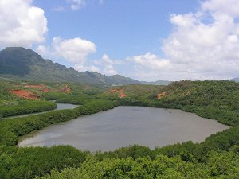

  
[Intangible Textual Heritage](../../index)  [Pacific](../index) 

------------------------------------------------------------------------

[Buy this Book at
Amazon.com](https://www.amazon.com/exec/obidos/ASIN/B0024FAHH0/internetsacredte)

------------------------------------------------------------------------

<table width="75%">
<colgroup>
<col style="width: 50%" />
<col style="width: 50%" />
</colgroup>
<tbody>
<tr class="odd">
<td width="50%" data-valign="TOP"> Photographer, Collin Grady.</td>
<td width="50%" data-valign="CENTER"><h1 id="hawaiian-folk-tales" data-align="CENTER">Hawaiian Folk Tales</h1>
<h2 id="by-thomas-g.-thrum" data-align="CENTER">by Thomas G. Thrum</h2>
<h4 id="section" data-align="CENTER">[1907]</h4></td>
</tr>
</tbody>
</table>

------------------------------------------------------------------------

[Contents](#contents)    [Start Reading](hft00)    [Page
Index](pageidx)    [Text \[Zipped\]](hft.txt.gz)

------------------------------------------------------------------------

|                                                                                                                           |
|---------------------------------------------------------------------------------------------------------------------------|
|  |

This is an anthology of Hawaiian folklore, including pieces by Thomas
Thrum and other writers. This includes many articles which were
originally published in difficult to obtain journals and now-rare books.
All were written in the late 19th or early 20th century, and are mostly
based on first-hand oral traditions. Chapters cover topics such as
resemblances to Biblical stories, myths of the gods and goddesses such
as Maui and Pele, historical legends, topographical folklore, and the
folklore of fishing.

Of interest to the general reader will be [the tales of the
Menehune](hft13), the 'little people' of Hawaii, who resemble in some
aspects the fairies of Europe. The Menehune are credited with numerous
earth-works such as fish ponds and stone platforms. This is reminiscent
of European folklore which attributes the construction of megalithic
monuments to the fairies. Could the Menehune be based on a
short-statured pre-Polynesian indigenous Hawaiian culture? Or, could
this be a post-contact European folklore import, as some recent
researchers have suggested?

Hawaiian Folk Tales is one of a number of excellent period books
available on this subject, and with a few exceptions, does not attempt
to overly romanticize or impose western narrative structure. It makes
entertaining reading both for visitors and residents of the Hawaiian
islands.

------------------------------------------------------------------------

[Title Page](hft00)  
[Preface](hft01)  
[Note](hft02)  
[Contents](hft03)  
[I. Legends Resembling Old Testament History](hft04)  
[II. Exploits of Maui](hft05)  
[III. Pele and the Deluge](hft06)  
[IV. Pele And Kahawali](hft07)  
[V. Hiku and Kawelu](hft08)  
[VI. Lonopuha; Or, Origin of the Art of Healing In Hawaii](hft09)  
[VII. A Visit to the Spirit Land; or, the Strange Experience of a Woman
in Kona, Hawaii](hft10)  
[VIII. Kapeepeekauila; or, The Rocks of Kana](hft11)  
[IX. Kalelealuaka](hft12)  
[X. Stories of the Menehunes](hft13)  
[XI. Kahalaopuna, Princess of Manoa](hft14)  
[XII. The Punahou Spring](hft15)  
[XIII. Oahunui](hft16)  
[XIV. Ahuula: A Legend of Kanikaniaula and the First Feather
Cloak](hft17)  
[XV. Kaala and Kaaialii, A Legend of Lanai](hft18)  
[XVI. The Tomb of Puupehe, A Legend of Lanai](hft19)  
[XVII. Ai Kanaka, A Legend of Molokai](hft20)  
[XVIII. Kaliuwaa, Scene of the Demigod Kamapuaa's Escape From
Olopana](hft21)  
[XIX. Battle of the Owls](hft22)  
[XX. This Land Is the Sea's, Traditional Account of an Ancient Hawaiian
Prophecy](hft23)  
[XII. Ku-ula, The Fish God Of Hawaii](hft24)  
[XXII. Aiai, Son of Ku-Ula, Part II of the Legend of Ku-Ula, the Fish
God of Hawaii](hft25)  
[XXIII. Kaneaukai, A Legend of Waialua](hft26)  
[XXIV. The Shark-Man, Nanaue](hft27)  
[XXV. Fish Stories and Superstitions](hft28)  
[Glossary of Hawaiian Words](hft29)  
