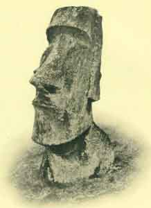

# Pacific Islander Religions

[General](#general)  [Easter Island](#easter)  [New Zealand](#maori.md) 
[Hawaii](#hawaii)  [Samoa](#samoa)  [Tahiti](#tahiti.md) 
[Melanesia](#melanesia.md)

------------------------------------------------------------------------

|                                                                                   |                                                             |
|-----------------------------------------------------------------------------------|-------------------------------------------------------------|
|  | Pacific Islander Religions |

------------------------------------------------------------------------

This section has texts relating to the religion and mythology of the
Pacific Islanders.

------------------------------------------------------------------------

### General

 [Oceanic
Mythology](om/index.md)   by Roland B.
Dixon \[1916\].   A
highly readable and scholarly cross-cultural study of Pacific mythology
and folklore, covering Polynesia, Micronesia, Melanesia,
Indonesia and Australia. It includes summaries of material only
available in obscure 19th Century scholarly journals. 

### Easter Island

 [Te Pito Te Henua, Or Easter
Island](ei/index.md)   by William J.
Thomson \[1891\]   Includes images of the famous rongo-rongo tablets and one of
the few attested translations available. 

### Maori

 [Polynesian
Mythology](grey/index.md)  
by Sir George Grey \[1854\]   A primary source for the
myths and legends of the Maori people of New Zealand. 

 [Maori Religion and
Mythology](mrm/index.md)   by Edward
Shortland \[1882\]  

 [The Lore of the
Whare-Wananga](lww/index.md)  
S. Percy Smith \[1913\]  

### Hawaii

 [Hawaiian
Mythology](hm/index.md)   by Martha Warren
Beckwith \[1940\]   An
extensive critical study of Hawaiian mythology, with parallels to
other Pacific islander cultures and numerous variations on each text.

 [The Kumulipo, A Hawaiian Creation
Chant](ku/index.md)  
translated with commentary by Martha Warren
Beckwith \[1951\]   The Kumulipo is the Royal Hawaiian Creation chant,
describing the emergence of life from the ocean and listing hundreds of
generations of descendants from the primal gods and goddesses. 

 [The Kumulipo](lku/index.md)  
translated by Queen Liliuokalani \[1897\]   A translation of the
Kumulipo by the last Queen of Hawaii. 

 [Unwritten Literature of Hawaii:
The Sacred Songs of the Hula](ulh/index.md)   by Nathaniel B. Emerson \[1909\] 

 [Hawaiian Folk
Tales](hft/index.md)   by Thomas G. Thrum
\[1907\]   An anthology of
classic Hawaiian folklore, including tales of Menehunes and
Kahunas. 

------------------------------------------------------------------------

The following is a series of books of Hawaiian mythology, folkore, and
legends by W.D. Westervelt from the turn of the 20th Century. Although
Westervelt often wrote in a romanticized style, the folklore is genuine.

 [Legends of
Maui](maui/index.md)   by W.D. Westervelt
\[1910\]   A collection of
Hawaiian and Polynesian legends about the culture hero, Maui.

 [Hawaiian Legends of Old
Honolulu](hloh/index.md)   by W.D.
Westervelt \[1915\]   Of all of the sacred landscapes of the Pacific, the area
around Honolulu is rich in lore. 

 [Hawaiian Legends of
Volcanoes](hlov/index.md)   by W.D.
Westervelt \[1916\]   The Fire Goddess Pele, her deeds, family and loves.

 [Hawaiian Legends of Ghosts and
Ghost-Gods](hlog/index.md)   by W.D.
Westervelt \[1916\]   Tales of the Hawaiian afterlife, and those who returned from
it by magic or cunning. 

 [Hawaiian Historical
Legends](hhl/index.md)   by W.D. Westervelt
\[1923, no renewal\]   Stories from Hawaii during the period of European
contact. 

### Samoa

 [The Samoan Story of
Creation](jpolys/ssc.md)   by John Fraser
(Journal of the Polynesian Society, Vol. 1
164-88) \[1891\]. 

### Tahiti

 [Noa Noa](noa/index.md)   by
Paul Gauguin, translated from the French by
Otto Frederick Theis \[1919\]   Gauguin came to Tahiti to
find the primitive, but was amazed by the advanced knowledge embedded in
their mythology. 

### Melanesia

 [Baloma; the Spirits of the Dead in
the Trobriand Islands](baloma/index.md)   by Bronislaw Malinowski \[1916\]   A classic ethnographic
monograph. 
