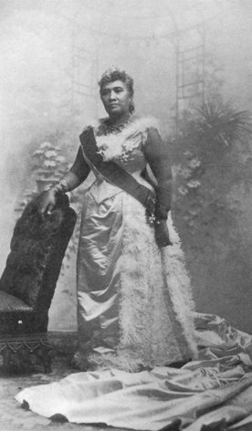

  
[Intangible Textual Heritage](../../index)  [Pacific](../index) 

------------------------------------------------------------------------

<table width="50%">
<colgroup>
<col style="width: 50%" />
<col style="width: 50%" />
</colgroup>
<tbody>
<tr class="odd">
<td width="50%"></td>
<td width="50%"><h1 id="the-kumulipo" data-align="CENTER">The Kumulipo</h1>
<h3 id="translated-by-queen-liliuokalani" data-align="CENTER">Translated by Queen Liliuokalani</h3>
<h4 id="section" data-align="CENTER">[1897]</h4></td>
</tr>
</tbody>
</table>

------------------------------------------------------------------------

This is Queen Liliuokalani's translation of the Hawaiian Creation chant,
the Kumulipo. She translated this while under house arrest at Iolani
Palace, and it was subsequently published in 1897. This is an extremely
rare book which was republished (in a very scarce edition) by Pueo Press
in 1978.

The Kumulipo's composition is attributed to one of Liliuokalani's
eighteenth century ancestors, Keaulumoku, just prior to European
contact. It is a sophisticated epic which describes the origin of
species in terms that Darwin would appreciate. The Kumulipo moves from
the emergence of sea creatures, to insects, land plants, animals, and
eventually human beings. It describes a complicated web of
interrelationships between various plants and animals. The most massive
part of the chant is a genealogy which enumerates thousands of ancestors
of the Hawaiian royal family.

The Kumulipo is also available at this site in [the 1951 translation of
Martha Warren Beckwith](../ku/index), with comprehensive analysis and
[the complete Hawaiian text](../ku/ku31). However Liliuokalani's version
is of some historical significance. The last Queen of Hawaii,
Liliuokalani was extremely literate, and steeped in Hawaiian tradition.
She was the author of the well-known Hawaiian anthem, Aloha 'Oe as well
as a Hawaiian history book, Hawai'i's Story by Hawai'i's Queen.

------------------------------------------------------------------------

[Title Page](lku00)  
[Introduction](lku01)  
[The First Era](lku02)  
[Second Era](lku03)  
[The Third Era](lku04)  
[The Fourth Era](lku05)  
[The Fifth Era](lku06)  
[The Sixth Era](lku07)  
[The Seventh Era](lku08)  
[The Eighth Era](lku09)  
[The Ninth Era](lku10)  
[The Tenth Era](lku11)  
[The Eleventh Era](lku12)  
[The Twelfth Era](lku13)  
[A Branch of the Twelfth Era](lku14)  
[The Fourteenth Era](lku15)  
[The Fifteenth Era](lku16)  
[The Sixteenth Era](lku17)  
[Kalakaua And Liliuokalani's Genealogy](lku18)  
