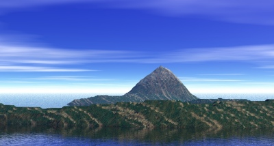

  
[Intangible Textual Heritage](../../index)  [Pacific](../index) 

------------------------------------------------------------------------

[Buy this Book at
Amazon.com](https://www.amazon.com/exec/obidos/ASIN/B0024FAHBQ/internetsacredte)

------------------------------------------------------------------------

<table width="75%">
<colgroup>
<col style="width: 50%" />
<col style="width: 50%" />
</colgroup>
<tbody>
<tr class="odd">
<td width="50%" data-valign="TOP"></td>
<td width="50%" data-valign="CENTER"><h1 id="legends-of-maui" data-align="CENTER">Legends of Maui</h1>
<h4 id="a-demi-god-of-polynesia-and-his-mother-hina" data-align="CENTER">--A Demi-God of Polynesia and His Mother Hina</h4>
<h2 id="by-w.-d.-westervelt" data-align="CENTER">by W. D. Westervelt</h2>
<h4 id="section" data-align="CENTER">[1910]</h4></td>
</tr>
</tbody>
</table>

------------------------------------------------------------------------

[Contents](#contents)    [Start Reading](maui00)    [Text
\[Zipped\]](maui.txt.gz)

------------------------------------------------------------------------

|                                                                                                                           |
|---------------------------------------------------------------------------------------------------------------------------|
|  |

This is a collection of lore related to the Polynesian culture-hero,
Maui, particularly his labors in creating the world. The book also
includes some myths about Hina, Maui's mother, and several tales local
to the Hawaiian islands.

------------------------------------------------------------------------

 [Title Page](maui00)  
[Contents](maui01)  
[Helps to Pronunciation](maui02)  
[Preface](maui03)  
[I. Maui's Home](maui04)  
[II. Maui the Fisherman](maui05)  
[III. Maui Lifting the Sky](maui06)  
[IV. Maui Snaring the Sun](maui07)  
[V. Maui Finding Fire](maui08)  
[VI. Maui the Skillful](maui09)  
[VII. Maui and Tuna](maui10)  
[VIII. Maui and His Brother-In-Law](maui11)  
[IX. Maui's Kite Flying](maui12)  
[X. The Oahu Legends Of Maui](maui13)  
[XI. Maui Seeking Immortality](maui14)  
[XII. Hina of Hilo](maui15)  
[XIII. Hina and the Wailuku River](maui16)  
[XIV. Ghosts of the Hilo Hills](maui17)  
[XV. Hina, the Woman In the Moon](maui18)  
