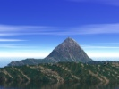

  
[Intangible Textual Heritage](../../index)  [Pacific](../index.md) 
[Index](index)  [Previous](maui04)  [Next](maui06.md) 

------------------------------------------------------------------------

[Buy this Book at
Amazon.com](https://www.amazon.com/exec/obidos/ASIN/B0024FAHBQ/internetsacredte.md)

------------------------------------------------------------------------

  
*Legends of Maui, A Demi-God of Polynesia*, by W. D. Westervelt,
\[1910\], at Intangible Textual Heritage

------------------------------------------------------------------------

# II.

### MAUI THE FISHERMAN

"Oh the great fish hook of Maui!  
Manai-i-ka-lani 'Made fast to the heavens'--its name;  
An earth-twisted cord ties the hook.  
Engulfed from the lofty Kauiki.  
Its bait the red billed Alae,  
The bird made sacred to Hina.  
It sinks far down to Hawaii,  
Struggling and painfully dying.  
Caught is the land under the water,  
Floated up, up to the surface,  
But Hina hid a wing of the bird  
And broke the land under the water.  
Below, was the bait snatched away  
And eaten at once -by the fishes,  
The Ulua of the deep muddy places."

--Chant of Kualii, about A. D. 1700.

ONE of Maui's homes was near Kauiki, a place well known throughout the
Hawaiian Islands because of its strategic importance. For many years it
was the site of a fort around which fierce battles were fought by the
natives of the island Maui, repelling the invasions of their neighbors
from Hawaii.

Haleakala (the House of the Sun), the mountain from which Maui the
demi-god snared the sun, looks down ten thousand feet upon the Kauiki
headland. Across the channel from Haleakala rises Mauna Kea, "The White
Mountain"-the snow-capped-which almost all the year round rears its
white head in majesty among the clouds.

In the snowy breakers of the surf which washes the beach below these
mountains, are broken coral reefs-the fishing grounds of the Hawaiians.
Here near Kauiki, according to some Hawaiian legends, Maui's mother Hina
had her grass house and made and dried her kapa cloth. Even to the
present day it is one of the few places in the islands where the kapa is
still pounded into sheets from the bark of the hibiscus and kindred
trees.

Here is a small bay partially reef-protected, over which year after year
the moist clouds float and by day and by night crown the waters with
rainbows-the legendary sign of the home of the deified ones. Here when
the tide is out the natives wade and swim, as they have done for
centuries, from coral block to coral block, shunning the deep resting
places of their dread enemy, the shark, sometimes esteemed divine. Out
on the edge of the outermost reef they seek the shellfish which cling to
the coral, or spear the large fish which have been left in the beautiful
little lakes of the reef. Coral land is a region of the sea coast
abounding in miniature lakes and rugged valleys and steep mountains.
Clear waters with every motion of the tide surge in and out through
sheltered caves and submarine tunnels, according to an ancient Hawaiian
song-

"Never quiet, never failing, never sleeping,  
Never very noisy is the sea of the sacred caves."

Sea mosses of many hues are the forests which drape the hillsides of
coral land and reflect the colored rays of light which pierce the
ceaselessly moving waves. Down in the beautiful little lakes, under
overhanging coral cliffs, darting in and out through the fringes of
seaweed, the purple mullet and royal red fish flash before the eyes of
the fisherman. Sometimes the many-tinted glorious fish of paradise
reveal their beauties, and then again a school of black and gold
citizens of the reef follow the tidal waves around projecting crags and
through the hidden tunnels from lake to lake, while above the fisherman
follows spearing or snaring as best he can. Maui's brothers were better
fishermen than he. They sought the deep sea beyond the reef and the
larger fish. They made hooks of bone or of mother of pearl, with a
straight, slender, sharp-pointed piece leaning backward at a sharp
angle. This was usually a consecrated bit of bone or mother of pearl,
and was supposed to have peculiar power to hold fast any fish which had
taken the bait.

These bones were usually taken from the body of some one who while
living had been noted for great power or high rank. This sharp piece was
tightly tied to the larger bone or shell, which formed the shank of the
hook. The sacred barb of Maui's hook was a part of the magic bone he had
secured from his ancestors in the under-world-the bone with which he
struck the sun while lassooing him and compelling him to move more
slowly through the heavens.

"Earth-twisted"-fibres of vines-twisted while growing, was the cord used
by Maui in tying the parts of his magic hook together.

Long and strong were the fish lines made from the olona fibre, holding
the great fish caught from the depths of the ocean. The fibres of the
olona vine were among the longest and strongest threads found in the
Hawaiian Islands.

Such a hook could easily be cast loose by the struggling fish, if the
least opportunity were given. Therefore it was absolutely necessary to
keep the line taut, and pull strongly and steadily, to land the fish in
the canoe.

Maui did not use his magic hook for a long time. He seemed to understand
that it would not answer ordinary needs. Possibly the idea of making the
supernatural hook did not occur to him until he had exhausted his lower
wit and magic upon his brothers.

It is said that Maui was not a very good fisherman. Sometimes his end of
the canoe contained fish which his brothers had thought were on their
hooks until they were landed in the canoe.

Many times they laughed at him for his poor success, and he retaliated
with his mischievous tricks.

"E!" he would cry, when one of his brothers began to pull in, while the
other brothers swiftly paddled the canoe forward. "E!" See we both have
caught great fish at the same moment. Be careful now. Your line is
loose. Look out! Look out!"

All the time he would be pulling his own line in as rapidly as possible.
Onward rushed the canoe. Each fisherman shouting to encourage the
others. Soon the lines by the tricky manipulation of Maul would be
crossed. Then as the great fish was brought near the side of the boat
Maui the little, the mischievous one, would slip his hook toward the
head of the fish and flip it over into the canoe-causing his brother's
line to slacken for a moment. Then his mournful cry rang out: "Oh, my
brother, your fish is gone. Why did you not pull more steadily? It was a
fine fish, and now it is down deep in the waters." Then Maui held up his
splendid catch (from his brother's hook) and received somewhat
suspicious congratulations. But what could they do, Maui was the smart
one of the family.

Their father and mother were both members of the household of the gods.
The father was "the supporter of the heavens" and the mother was the
guardian of the way to the invisible world," but pitifully small and
very few were the gifts bestowed upon their children. Maui's brothers
knew nothing beyond the average home life of the ordinary Hawaiian, and
Maui alone was endowed with the power to work miracles. Nevertheless the
student of Polynesian legends learns that Maui is more widely known than
almost all the demi-gods of all nations as a discoverer of benefits for
his fellows, and these physical rather than spiritual. After many
fishing excursions Maui's brothers seemed to have wit enough to
understand his tricks, and thenceforth they refused to take him in their
canoe when they paddled out to the deep-sea fishing grounds. Then those
who depended upon Maui to supply their daily needs murmured against his
poor success. His mother scolded him and his brothers ridiculed him.

In some of the Polynesian legends it is said that his wives and children
complained because of his laziness and at last goaded him into a new
effort.

The ex-Queen Liliuokalani, in a translation of what is called "the
family chant," says that Maui's mother sent him to his father for a hook
with which to supply her need.

"Go hence to your father,  
'Tis there you find line and hook.  
This is the hook-'Made fast to the heavens-'  
'Manaia-ka-lani'--'tis called.  
When the hook catches land  
It brings the old seas together.  
Bring hither the large Alae,  
The bird of Hina.

When Maui had obtained his hook, he tried to go fishing with his
brothers. He leaped on the end of their canoe as they pushed out into
deep water. They were angry and cried out: "This boat is too small for
another Maui." So they threw him off and made him swim back to the
beach. When they returned from their day's work, they brought back only
a shark. Maui told them if he had been with them better fish would have
been upon their hooks--the Ulua, for instance, or, possibly, the
Pimoe-the king of fish. At last they let him go far out outside the
harbor of Kipahula to a place opposite Ka Iwi o Pele, "The bone of
Pele," a peculiar piece of lava lying near the beach at Hana on the
eastern side of the island Maui. There they fished, but only sharks were
caught. The brothers ridiculed Maui, saying: "Where are the Ulua, and
where is Pimoe?"

Then Maui threw his magic hook into the sea, baited with one of the Alae
birds, sacred to his mother Hina. He used the incantation, "When I let
go my hook with divine power, then I get the great Ulua."

The bottom of the sea began to move. Great waves arose, trying to carry
the canoe away. The fish pulled the canoe two days, drawing the line to
its fullest extent. When the slack began to come in the line, because of
the tired fish, Maui called for the brothers to pull hard against the
coming fish. Soon land rose out of the water. Maui told them not to look
back or the fish would be lost. One brother did look back-the line
slacked, snapped, and broke, and the land lay behind them in islands.

One of the Hawaiian legends also says that while the brothers were
paddling in full strength, Maui saw a calabash floating in the water. He
lifted it into the canoe, and behold! his beautiful sister Hina of the
sea. The brothers looked, and the separated islands lay behind them,
free from the hook, while Cocoanut Island--the dainty spot of beauty in
Hilo harbor--was drawn up-a little edge of lava-in later years the home
of a cocoanut grove.

The better, the more complete, legend comes from New Zealand, which
makes Maui so mischievous that his brothers refuse his companionship-and
therefore, thrown on his own resources, he studies how to make a hook
which shall catch something worth while. In this legend Maui is
represented as making his own hook and then pleading with his brothers
to let him go with them once more. But they hardened their hearts
against him, and refused again and again.

Maui possessed the power of changing himself into different forms. At
one time while playing with his brothers he had concealed himself for
them to find. They heard his voice in a corner of the house-but could
not find him. Then under the mats on the floor, but again they could not
find him. There was only an insect creeping on the floor. Suddenly they
saw their little brother where the insect had been. Then they knew he
had been tricky with them. So in these fishing days he resolved to go
back to his old ways and cheat his brothers into carrying him with them
to the great fishing grounds.

Sir George Gray says that the New Zealand Maui went out to the canoe and
concealed himself as an insect in the bottom of the boat so that when
the early morning light crept over the waters and his brothers pushed
the canoe into the surf they could not see him. They rejoiced that Maui
did not appear, and paddled away over the waters.

They fished all day and all night and on the morning of the next day,
out from among the fish in the bottom of the boat came their troublesome
brother.

They had caught many fine fish and were satisfied, so thought to paddle
homeward, but their younger brother plead with them to go out, far out,
to the deeper seas and permit him to cast his hook. He said he wanted
larger and better fish than any they had captured.

So they paddled to their outermost fishing grounds -but this did not
satisfy Maui-

"Farther out on the waters,  
O! my brothers,  
I seek the great fish of the sea."

It was evidently easier to work for him than to argue with him-therefore
far out in the sea they went. The home land disappeared from view; they
could see only the outstretching waste of waters. Maui urged them out
still farther. Then he drew his magic hook from under his malo or
loin-cloth. The brothers wondered what he would do for bait. The New
Zealand legend says that he struck his nose a mighty blow until the
blood gushed forth. When this blood became clotted, he fastened it upon
his hook and let it down into the deep sea.

Down it went to the very bottom and caught the under world. It was a
mighty fish-but the brothers paddled with all their might and main and
Maui pulled in the line. It was hard rowing against the power which held
the hook down in the sea depths-but the brothers became enthusiastic
over Maui's large fish, and were generous in their strenuous endeavors.
Every muscle was strained and every paddle held strongly against the sea
that not an inch should be lost. There was no sudden leaping and darting
to and fro, no "give" to the line; no "tremble" as when a great fish
would shake itself in impotent wrath when held captive by a hook. It was
simply a struggle of tense muscle against an immensely heavy dead
weight. To the brothers there came slowly the feeling that Maui was in
one of his strange moods and that something beyond their former
experiences with their tricky brother was coming to pass.

At last one of the brothers glanced backward. With a scream of intense
terror he dropped his paddle. The others also looked. Then each caught
his paddle and with frantic exertion tried to force their canoe onward.
Deep down in the heavy waters they pushed their paddles. Out of the
great seas the black, ragged head of a large island was rising like a
fish-it seemed to be chasing them, through the boiling surf. In a little
while the water became shallow around them, and their canoe finally
rested on a black beach.

Maui for some reason left his brothers, charging them not to attempt to
cut up this great fish. But the unwise brothers thought they would fill
the canoe with part of this strange thing which they had caught. They
began to cut up the back and put huge slices into their canoe. But the
great fish--the island--shook under the blows and with mighty earthquake
shocks tossed the boat of the brothers, and their canoe was destroyed.
As they were struggling in the waters, the great fish devoured them. The
island came up more and more from the waters--but the deep gashes made
by Maui's brothers did not heal--they became the mountains and valleys
stretching from sea to sea.

White of New Zealand says that Maui went down into the underworld to
meet his great ancestress, who was one side dead and one side alive.
From the dead side he took the jaw bone, made a magic hook, and went
fishing. When he let the hook down into the sea, he called:

"Take my bait. O Depths!  
Confused you are. O Depths!  
And coming upward."

Thus he pulled up Ao-tea-roa--one of the large islands of New Zealand.
On it were houses, with people around them. Fires were burning. Maui
walked over the island, saw with wonder the strange men and the
mysterious fire. He took fire in his hands and was burned. He leaped
into the sea, dived deep, came up with the other large island on his
shoulders. This island he set on fire and left it always burning, It is
said that the name for New Zealand given to Captain Cook was Te ika o
Maui, "The fish of Maui." Some New Zealand natives say that he fished up
the island on which dwelt "Great Hina of the Night," who finally
destroyed Maui while he was seeking immortality.

One legend says that Maui fished up apparently from New Zealand the
large island of the Tongas. He used this chant:

O Tonga-nui!  
why art Thou  
Sulkily biting, biting below!  
Beneath the earth  
The power is felt,  
The foam is seen,  
Coming.  
O thou loved grandchild  
Of Tangaro a-meha. "

This is an excellent poetical description of the great fish delaying the
quick hard bite. Then the island comes to the surface and Maui, the
beloved grandchild of the Polynesian god Kanaloa, is praised.

It was part of one of the legends that Maui changed himself into a bird
and from the heavens let down a line with which he drew up land, but the
line broke, leaving islands rather than a mainland. About two hundred
lesser gods went to the new islands in a large canoe. The greater gods
punished them by making them mortal.

Turner, in his book on Samoa, says there were three Mauis, all brothers.
They went out fishing from Rarotonga. One of the brothers begged the
"goddess of the deep rocks" to let his hooks catch land. Then the island
Manahiki was drawn up. A great wave washed two of the Mauis away. The
other Maui found a great house in which eight hundred gods lived. Here
he made his home until a chief from Rarotonga drove him away. He fled
into the sky, but as he leaped he separated the land into two islands.

Other legends of Samoa say that Tangaroa, the great god, rolled stones
from heaven. One became the island Savaii, the other became Upolu. A god
is sometimes represented as passing over the ocean with a bag of sand.
Wherever he dropped a little sand islands sprang up.

Payton, the earnest and honored missionary of the New Hebrides Islands,
evidently did not know the name Mauitikitiki, so he spells the name of
the fisherman Ma-tshi-ktshi-ki, and gives the myth of the fishing up of
the various islands. The natives said that Maui left footprints on the
coral reefs of each island where he stood straining and lifting in his
endeavors to pull up each other island. He threw his line around a large
island intending to draw it up and unite it with the one on which he
stood, but his line broke. Then he became angry and divided into two
parts the island on which he stood. This same Maui is recorded by Mr.
Payton as being in a flood which put out one volcano-Maui seized
another, sailed across to a neighboring island and piled it upon the top
of the volcano there, so the fire was placed out of reach of the flood.

In the Hervey Group of the Tahitian or Society Islands the same story
prevails and the natives point out the place where the hook caught and a
print was made by the foot in the coral reef. But they add some very
mythical details. Maui's magic fish hook is thrown into the skies, where
it continuously hangs, the curved tail of the constellation which we
call Scorpio. Then one of the gods becoming angry with Maui seized him
and threw him also among the stars. There he stays looking down upon his
people. He has become a fixed part of the scorpion itself.

The Hawaiian myths sometimes represent Maui as trying to draw the
islands together while fishing them out of the sea. When they had pulled
up the island of Kauai they looked back and were frightened. They
evidently tried to rush away from the new monster and thus broke the
line. Maui tore a side out of the small crater Kaula when trying to draw
it to one of the other islands. Three aumakuas, three fishes supposed to
be spirit-gods, guarded Kaula and defeated his purpose. At Hawaii
Cocoanut Island broke off because Maui pulled too hard. Another place
near Hilo on the large island of Hawaii where the hook was said to have
caught is in the Wailuku river below Rainbow Falls.

Maui went out from his home at Kauiki, fishing with his brothers. After
they had caught some fine fish the brothers desired to return, but Maui
persuaded them to go out farther. Then when they became tired and
determined to go back, he made the seas stretch out and the shores
recede until they could see no land. Then drawing the magic hook, he
baited it with the Alae or sacred mud hen belonging to his Mother Hina.
Queen Liliuokalani's family chant has the following reference to this
myth:

"Maui longed for fish for Hina-akeahi (Hina of the fire, his mother),  
Go hence to your father,  
There you will find line and hook.  
Manaiakalani is the book.  
Where the islands are caught,  
The ancient seas are connected.  
The great bird Alae is taken,  
The sister bird,  
Of that one of the hidden fire of Maui."

Maui evidently had no scruples against using anything which would help
him carry out his schemes.

He indiscriminately robbed his friends and the gods alike.

Down in the deep sea sank the hook with its struggling bait, until it
was seized by "the land under the water."

But Hina the mother saw the struggle of her sacred bird and hastened to
the rescue. She caught a wing of the bird, but could not pull the Alae
from the sacred hook. The wing was torn off. Then the fish gathered
around the bait and tore it in pieces. If the bait could have been kept
entire, then the land would have come up in a continent rather than as
an island. Then the Hawaiian group would have been unbroken. But the
bait broke-and the islands came as fragments from the under world.

Maui's hook and canoe are frequently mentioned in the legends. The
Hawaiians have a long rock in the Wailuku river at Hilo which they call
Maui's canoe. Different names were given to Maui's canoe by the Maoris
of New Zealand. "Vine of Heaven," "Prepare for the North," "Land of the
Receding Sea." His fish hook bore the name "Plume of Beauty."

On the southern end of Hawke's Bay, New Zealand, there is a curved ledge
of rocks extending out from, the coast. This is still called by the
Maoris "Maui's fish-hook," as if the magic hook had been so firmly
caught in the jaws of the island that Maui could not disentangle it, but
had been compelled to cut it off from his line.

There is a large stone on the sea coast of North Kohala on the island of
Hawaii which the Hawaiians point out as the place where Maui's magic
hook caught the island and pulled it through the sea.

In the Tonga Islands, a place known as Hounga is pointed out by the
natives as the spot where the magic hook caught in the rocks. The hook
itself was said to have been in the possession of a chief-family for
many generations.

Another group of Hawaiian legends, very incomplete, probably referring
to Maui, but ascribed to other names, relates that a fisherman caught a
large block of coral. He took it to his priest. After sacrificing, and
consulting the gods, the priest advised the fisherman to throw the coral
back into the sea with incantations. While so doing this block became
Hawaii-loa. The fishing continued and blocks of coral were caught and
thrown back into the sea until all the islands appeared. Hints of this
legend cling to other island groups as well as to the Hawaiian Islands.
Fornander credits a fisherman from foreign lands as thus bringing forth
the Hawaiian Islands from the deep seas. The reference occurs in part of
a chant known as that of a friend of Paao--the priest who is supposed to
have come from, Samoa to Hawaii in the eleventh century. This priest
calls for his companions:

"Here are the canoes. Get aboard.  
Come along, and dwell on Hawaii with the green back.  
A land which was found in the ocean,  
A land thrown up from the sea--  
From the very depths of Kanaloa,  
The white coral, in the watery caves,  
That was caught on the hook of the fisherman."

The god Kanaloa is sometimes known as a ruler of the under-world, whose
land was caught by Maui's hook and brought up in islands. Thus in the
legends the thought has been perpetuated that some one of the ancestors
of the Polynesians made voyages and discovered islands.

In the time of Umi, King of Hawaii, there is the following record of an
immense bone fish-hook, which was called the "fish-hook of Maui:"

"In the night of Mukti (the last night of the month), a priest and his
servants took a man, killed him, and fastened his body to the hook,
which bore the name Manai-a-ka-lani, and dragged it to the heiau
(temple) as a 'fish,' and placed it on the altar."

This hook was kept until the time of Kamehameha I. From time to time he
tried to break it, and pulled until he perspired.

Peapea, a brother of Kaahumanu, took the hook and broke it. He was
afraid that Kamehameha would kill him. Kaahumanu, however, soothed the
King, and he passed the matter over. The broken bone was probably thrown
away.

------------------------------------------------------------------------

[Next: III. Maui Lifting the Sky](maui06.md)
