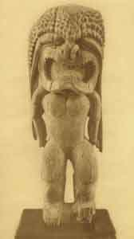

  
[Intangible Textual Heritage](../../index)  [Pacific](../index.md) 
[Index](index)  [Next](om01.md) 

------------------------------------------------------------------------

# OCEANIC MYTHOLOGY

## BY ROLAND B. DIXON, PH.D.

##### PROFESSOR OF ANTHROPOLOGY HARVARD UNIVERSITY

##### VOLUME IX OF THE MYTHOLOGY OF ALL RACES IN THIRTEEN VOLUMES

##### LOUIS HERBERT GRAY, A.M., PH.D., EDITOR GEORGE FOOT MOORE, A.M., D.D., LL.D., CONSULTING EDITOR,

#### BOSTON

#### MARSHALL JONES COMPANY

#### M DCCCC XVI

###### COPYRIGHT, 1916, By MARSHALL JONES COMPANY

###### Entered at Stationers' Hall, London

###### All rights reserved

###### Printed September, 1916

###### PRINTED IN THE UNITED STATES OF AMERICA BY THE UNIVERSITY PRESS CAMBRIDGE, MASSACHUSETTS

###### BOUND BY THE BOSTON BOOKBINDING COMPANY

Scanned at Intangible Textual Heritage, May, 2002, John B. Hare
redactor.

 

Image of Kuila-moku, one of the Hawaiian patron deities of medicine.
Prayers and offerings were made to him by the Kahuna, or shamans, when
trying to cure patients. Peabody Museum, Massachusetts

------------------------------------------------------------------------

[Next: Author's Preface](om01.md)
