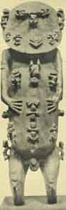
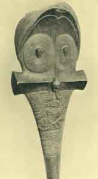
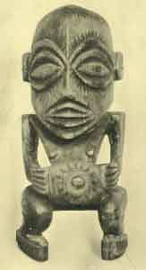
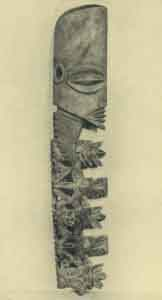
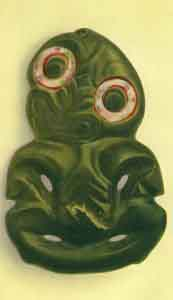

  
[Intangible Textual Heritage](../../index)  [Pacific](../index.md) 
[Index](index)  [Previous](om05)  [Next](om07.md) 

------------------------------------------------------------------------

p. 4

# CHAPTER I

### MYTHS OF ORIGINS AND THE DELUGE

IN considering the mythology of these peoples it will be most convenient
to begin with the cosmogonic myths, for these are not only in themselves
very interesting, as presenting unusual features, but also show, in an
unmistakable manner, the composite character of the mythology as a
whole. It is usual to speak of the Polynesian origin-myths as if they
formed a substantially uniform system, to comment on their rather
surprisingly philosophic aspect, and to indulge in somewhat vague
theorizing in an attempt to explain conditions and the peculiar
resemblances to the myths of other parts of the world. When, however,
careful study and comparison of the available material are made, it is
clear that the problem is by no means as simple as it looks at first
sight, and that we have here one of the most interesting of all fields
for mythologic investigations.

Comparing the various myths and myth fragments in which the cosmogonic
ideas of the Polynesians have been preserved, it appears that these may
be separated quite easily into two types: one (usually assumed to be the
normal or only form) in which we have what may be called a genealogical
or evolutionary development of the cosmos and the gods from an original
chaos; the other, in which there is a more or less definite act of
creation by a deity or deities. To make clear the differences between
these two types and to define the problem raised by the presence of
these two contrasted sets of beliefs, it will be advisable to consider
the two groups of myths separately.

 

 

PLATE II

Wooden figure of Tangaroa Upao Vahu, a sea-deity, represented in the act
of creating other gods and men. From a temple in Rurutu Island, Austral
Group. British Museum.

 

p. 5

*The Genealogical or Evolutionary Type*.--Omitting for the moment such
variations as exist between the versions current in the different
islands, the essential elements of this form of the myth may be stated
as follows. In the beginning there was nothing but Po, a void or chaos,
without light, heat, or sound, without form or motion. Gradually vague
stirrings began within the darkness, moanings and whisperings arose, and
then at first, faint as early dawn, the light appeared and grew until
full day had come. Heat and moisture next developed, and from the
interaction of these elements came substance and form, ever becoming
more and more concrete, until the solid earth and overarching sky took
shape and were personified as Heaven Father and Earth Mother. At this
point, as a rule, the evolutionary sequence stops and all further
things, both natural phenomena and all the myriad gods, are the
offspring of bright Heaven by Earth or some other female principle.

This conception of a self-evolving cosmos, of a universe declared by
some to be only the body or shell of a great primal cause, is a most
surprising one to find among a people upon the plane of culture in which
the Polynesians were living at the time of their discovery. As an
explanation of the riddle of the universe, and as a philosophic system,
it would seem far more appropriate to early Greek or Hindu speculation;
and indeed, in the form which was preserved in Hawaii, we really find an
extraordinary echo of the doctrines of early Hellas and India; while the
resemblances to Scandinavian mythology are also striking. Before
attempting, however, to discuss the origin of these beliefs in
Polynesia, it will be necessary to consider somewhat more in detail the
varied forms which they take in the different island groups within the
Polynesian area.

As pointed out above, [1](om29.htm#fn_0.md) New
Zealand presents us with what is, in many respects, one of the oldest
and simplest forms of Polynesian culture, and we may, therefore, well
begin a consideration

p. 6

of the origin-myths. by examining those found in this extreme
south-western corner of the Polynesian area. From New Zealand a number
of versions have been recorded, the forms, traditional among different
tribes being often quite variable. A comparatively brief account is
given by the Nga-i-tahu of the South Island. "Po begat Te-ao (light),
who begat Ao-marama (daylight), who begat Ao-tu-roa (long-standing
light), who begat Kore-te-whiwhia (did not possess), who begat
Kore-te-rawea (was not pleased with), who begat Kore-te-tamaua (was not
held), who begat Kore-te-matua (without parent), who begat Maku (damp).
Maku took to wife Ma-hora-nui-a-tea (great spreading out of light) and
begat Raki (Rangi)." After this Rangi, by various wives (whose origins
are seldom recorded), begat a great number of descendants, many of them
deities; and one of these spouses was originally the wife of Tangaroa,
the sea-god of whose provenance little is said. Angered by her
faithlessness, Tangaroa attacked Rangi and wounded him in the thigh with
a spear. [2](om29.htm#fn_1.md)

It will be seen at once why the term "genealogical" has been applied to
this class of origin-myths, the successive stages in the development of
the cosmos being individualized and personified and each being regarded
as the offspring of the next preceding. A different, and in some ways
more interesting, version of creation recorded from the New Zealand
region is as follows: [3](om29.htm#fn_2.md)

|                               |                                                               |
|-------------------------------|---------------------------------------------------------------|
| "Te Kore                      | The Void                                                      |
| Te Kore-tua-tahi              | The First Void                                                |
| Te Kore-tua-rua               | The Second Void                                               |
| Te Kore-nui                   | The Vast Void                                                 |
| Te Kore-roa                   | The Far-Extending Void                                        |
| Te Kore-para                  | The Sere Void                                                 |
| Te Kore-whiwhia               | The Unpossessing Void                                         |
| Te Kore-rawea                 | The Delightful Void [4](om29.htm#fn_3.md) |
| Te Kore-te-tamaua             | The Void Fast Bound                                           |
| Te Po                         | The Night                                                     |
| Te Po-teki                    | The Hanging Night                                             |
| Te Po-terea                   | The Drifting Night                                            |
| p. 7 |                                                               |
| Te Po-whawha                  | The Moaning Night                                             |
| Hine-maki-moe                 | The Daughter of Troubled Sleep                                |
| Te Po                         | The Night                                                     |
| Te Ata                        | The Dawn                                                      |
| Te Ao-tu-roa                  | The Abiding Day                                               |
| Te Ao-marama                  | The Bright Day                                                |
| Whai-tua                      | Space."                                                       |

 

In Whai-tua two existences without shape were formed: Maku ("Moisture"),
a male; and Mahora-nui-a-rangi ("Great Expanse of Heaven"), a female;
and from these sprang Rangi-potiki ("The Heavens"), who took to wife
Papa ("Earth") and begat the gods. The sequence here, leading from the
original undifferentiated void through -various stages of darkness and
light to space, in which the parents of the bright sky took form,
illustrates at once the dual character of this type of myth; for here we
find both the idea of progressive development and the individualization
of the successive stages in this evolution as a genealogic series.

One more example of this type may be given: [5](om29.htm#fn_4.md)

"From the conception the increase  
From the increase the swelling  
From the swelling the thought  
From the thought the remembrance  
From the remembrance the consciousness, the desire.  
The word became fruitful:  
It dwelt with the feeble glimmering  
It brought forth night;  
The great night, the long night,  
The lowest night, the loftiest night,  
The thick night, the night to be felt,  
The night touched, the night unseen.  
The night following on,  
The night ending in death.  
From the nothing, the begetting,  
From the nothing the increase  
From the nothing the abundance,  
The power of increasing, the living breath;  
It dwelt with the empty space,  
It produced the atmosphere which is above us.  
The atmosphere which floats above the earth, p.
8  
The great firmament above us,  
The spreadout space dwelt with the early dawn,  
Then the moon sprang forth;  
The atmosphere above dwelt with the glowing sky,  
Forthwith was produced the sun,  
They were thrown up above as the chief eyes of Heaven:  
Then the Heavens became light, the early dawn, the early day,  
The mid-day. The blaze of day from the sky.  
The sky which floats above the earth  
Dwelt with Hawaiki."

From these came various lands and gods. [6](om29.htm#fn_5.md)

Apparently it has been generally assumed that this evolutionary,
genealogical myth was entirely typical of Maori mythology; but in
reality the matter is far from being so simple, for the New Zealand
beliefs appear to be somewhat confused on the subject of the origin of
Rangi and Papa. The version just outlined ascribes to Rangi a long
ancestry and development, but other legends [7](om29.htm#fn_6.md) allude to a primeval sea, out of
which the earth (Papa) grew, later to be taken to wife by Rangi, the Sky
Father. Other myths, [8](om29.htm#fn_7.md) again,
omit all reference to an original chaos, and without attempting to
account for Rangi and Papa simply assume their existence, and then go on
in much detail to describe the birth of Rangi's various progeny by a
series of wives, who are usually given as six. [9](om29.htm#fn_8.md) By the first, Poko-ha-rua-te-po
("Pit of the Breath of Night"), he had as offspring Ha-nui-o-rangi
("Great Breath of Heaven"), Ta-whiri-ma-tea ("Beckoned and Desired"),
and a whole series of winds, as well as rites and incantations, all
personified. By the second, Papa-tu-a-nuku ("Flat, Resembling the
Earth"), he was the parent of Rehua, Tane, Paia, Tu, Rongo, Ru, and a
host of other minor deities. Now Papa-tu-a-nuku was the wife of
Tangaroa, but had deserted him, coming to Rangi while Tangaroa was away.
When the latter returned and learned of his wife's faithlessness, he
attacked Rangi and speared him in the thigh; and during the time that
the Sky Father was thus wounded, he begat another series of deities.

p. 9

\[paragraph continues\] Rangi's third wife was Heke-heke-i-papa ("Coming
Down to Earth"), by whom he had many children, the most important being
Tama-nui-a-rangi ("Great Son of Heaven"). By his fourth wife, Hotu-papa
("Sobbing Earth"), he was the father of a host of children, for the most
part of little note, though Tu and Rongo again appear among them. The
offspring of the fifth and sixth wives were unimportant. Although Rangi
is thus said to have had various wives, a comparison of the different
accounts would seem to emphasize the pre-eminent importance in the Maori
mind of the Heaven Father and Earth Mother pair; and, indeed, some
versions [10](om29.htm#fn_9.md) do not seem to
recognize any other. This conception, familiar in classical mythology
and elsewhere, seems very characteristic of New Zealand, and apparently
reached a higher development there than elsewhere in Polynesia. For the
Sky Father an origin from the primeval night or chaos is, as we have
seen, sometimes asserted; but no explanation of the origin of the Earth
Mother is usually thought necessary. New Zealand thus exhibits, a type
of cosmogony in which the evolutional element, although sometimes well
marked, is not invariably present; and in which the belief in the Sky
Father and the Earth Mother seems especially strong. The general
character of the variants found in different versions suggests that
these may bee the result of the blending of several sets of beliefs.

It is pretty well established that when New Zealand was discovered, its
inhabitants were composed of two main elements: first, the descendants
of the great influx of the fourteenth century, who formed the bulk of
the population; and second, some remnants of older immigrants more or
less mixed with the earliest dwellers found there by these original
invaders. Unfortunately, little attempt has been made to recover the
undoubtedly older mythology of these "aborigines," so that we have
little evidence as to what their beliefs may have been. Some light may
be thrown on the question, however, by the fragments recovered from the
Moriori of the

p. 10

Chatham Islands, [11](om29.htm#fn_10.md) which were
colonized from New Zealand before the coming of the historic
immigration. Unhappily, the actual cosmogonic myths recorded from the
Moriori are very brief, but, so far as they go they make little mention
of the evolutionary theme, ascribing the beginning of all things to
Rangi and Papa, of whose origin almost nothing is said. [12](om29.htm#fn_11.md) We may, perhaps, regard this as a
survival of the older New Zealand belief, which would thus seem to have
lacked the evolutionary element, and we should thus be led tentatively
to assume that this latter and more philosophic feature represents a
later development.

Leaving Maori mythology and turning to the other island groups in
Polynesia it is apparent that the cosmogonic myths current in the
Marquesas present striking analogies to some of those in New Zealand.
Here, again, in the beginning is the primeval void in which "arises a
swelling, a seething, a dark surging, a whirling, a bubbling, and a
swallowing--there arises a whole series of supports or posts, the great
and the small, the long and the short, the crooked and the bent--there
arise innumerable and endless supports. They riot in such contrasts and
synonyms. There arises in particular the foundation--the firmness--there
arises space and light and cliffs of various sorts." [13](om29.htm#fn_12.md) The evolutionary or genealogical
character is here strongly emphasized, both in its extent and intricacy,
and the series of personified abstract qualities and contrasts rivals,
and even exceeds, the similar examples from New Zealand. In comparison
with New Zealand, accordingly, there seems to be a much greater
development of the evolutional, or, as it might perhaps more accurately
be termed, the developmental, theme. The antecedents of the existing
universe comprise a bewildering series of abstract and partially
personified, contrasted qualities; and there is an evident attempt to
carry these, on the one hand, backward to an original, negative void,
and on the other, forward to an ultimate, primitive substance. In other
words, we have here more of a philosophic

 

 

PLATE III

Club from the Marquesas Islands. The decoration of heads and faces in
various combinations is unquestionably symbolic, but the precise meaning
of the various figures is unknown. Peabody Museum, Cambridge,
Massachusetts.

 

p. 11

system: in New Zealand the briefer developmental series led only to the
personified Sky Father; here it is the origin of all substance and of
solid matter itself which is sought.

Another version [14](om29.htm#fn_13.md) serves as a
transition to the forms found in the Society Group. According to this,
Tanaoa and Mutuhei ("Darkness" and "Silence") ruled supreme in the
primeval Po. In the course of time Atea ("Light") evolved or separated
himself from Tanaoa, and drove him away; and after this, Ono ("Sound")
evolved himself from Atea and destroyed Mutuhei. From these two
struggles arose Atanua ("Dawn"), whom Atea took to wife, and so begat a
host of deities, besides creating the heavens and the earth. This second
version introduces a new factor in the suggestion of a primeval deity,
Tangaroa. This feature is usually regarded as foreign to New Zealand
mythology, [15](om29.htm#fn_14.md) yet in a recent
and most important contribution to our knowledge of Maori
mythology [16](om29.htm#fn_15.md) there seems to be
a clearly expressed idea of a supreme, primeval deity, Io, who was
before all things, and who is in the ultimate analysis the origin and
creator of the universe and all the gods. [17](om29.htm#fn_16.md)

The versions given from the Society Islands accord with that from the
Marquesas in which Tanaoa ( = Tangaroa = Taaroa = Kanaloa) is regarded
as a deity existent from the beginning, but carry this ascendancy of
Tanaoa considerably further. One text [18](om29.htm#fn_17.md) recounts the origin as follows:

"He existed. Taaroa was his name.  
In the immensity  
There was no earth, there was no sky,  
There was no sea, there was no man.  
Taaroa calls, but nothing answers.  
Existing alone, he became the universe.  
Taaroa is the root, the rocks (foundation).  
Taaroa is the sands.  
It is thus that he is named.  
Taaroa is the light.  
Taaroa is within.  
Taaroa is the germ.  
Taaroa is the support.  
Taaroa is enduring. p. 12  
Taaroa is wise.  
He erected the land of Hawaii,  
Hawaii, the great and sacred,  
As a body or shell for Taaroa.  
The earth is moving.  
O, Foundations, O, Rocks,  
O, Sands, hither, hither,  
Brought hither, pressed together the earth.  
Press, press again.  
They do not unite.  
Stretch out the seven heavens, let ignorance cease.  
Create the heavens, let darkness cease.

Let immobility cease.  
Let the period of messengers cease.  
It is the time of the speaker.  
Completed the foundations,  
Completed the rocks,  
Completed the sands,  
The heavens are enclosing,  
The heavens are raised.  
In the depths is finished the land of Hawaii."

A second version [19](om29.htm#fn_18.md) is
interesting in comparison with this. "Taaroa (whose origin is not
described) embraced a rock, the imagined foundation of all things, which
afterward brought forth the earth and sea. . . . Soon after this, the
heralds of day, the dark and light blue sky, appeared before Taaroa, and
solicited a soul for his offspring--the then inanimate universe. The
foundation of all replied, 'It is done,' and directed his son, the
Sky-producer, to accomplish his will. In obedience to the mandate of
Taaroa, his son looked up into the heavens, and the heavens received the
power of bringing forth new skies, and clouds, sun, moon, and stars,
thunder and lightning, rain and wind. He then looked downwards, and the
unformed mass received the power to bring forth earth, mountains, rocks,
trees, herbs, and flowers, beasts, birds, and insects, fountains,
rivers, and fish. Rai-tubu, or Sky-producer, then looked to the abyss,
and imparted to it the power to bring forth the purple water., rocks and
corals, and all the inhabitants of the ocean."

p. 13

It is obvious that we are now dealing with quite a different aspect from
that with which we started. Tangaroa is here a sort of world soul; a
self-evolving, self-existent, creative deity, who alone is ultimately
responsible for the origin of the universe. The idea of a primeval,
creative deity is, however, not wholly absent from New Zealand, as is
shown by the following: [20](om29.htm#fn_19.md)

"Io dwelt within the breathing-space of immensity.  
The Universe was in darkness, with water everywhere,  
There was no glimmer of dawn, no clearness, no light.  
And he began by saying these words,--  
*That He might cease remaining inactive*:  
    'Darkness! become a light-possessing darkness.'  
And at once light appeared.  
(He) then repeated those self-same words in this manner,  
*That He might cease remaining inactive*:  
    'Light! become a darkness-possessing light.'  
And again an intense darkness supervened,  
And a third time He spake, saying:  
    'Let there be one darkness above,  
    Let there be one darkness below (alternate),  
    Let there be a darkness unto Tupua,  
    Let there be a darkness unto Tawhito,  
    It is a darkness overcome and dispelled.  
    Let there be one light above,  
    Let there be one light below (alternate),  
    Let there be a light unto Tupua,  
    Let there be a light unto Tawhito,  
    A dominion of light,  
    A bright light.'  
And now a great light prevailed.  
(Io) then looked to the waters, which compassed him about,  
And spake a fourth time, saying:  
    'Ye waters of Tai-kama be ye separate  
    Heaven, be formed' Then the sky became suspended.  
    'Bring-forth, thou, Tupua-horo-riuku.'  
And at once the moving earth lay stretched abroad."

The cosmogonic ideas of the inhabitants of the Cook or Hervey Group are
not clear. The form in which they are given is quite divergent from that
in other islands, but the account [21](om29.htm#fn_20.md) really gives no true cosmogony,
for it describes only the origin

p. 14

of several deities. The universe, of whose beginning nothing is said, is
pictured as a hollow shell, in form like a beet, at the lower extremity
of which is "The Root of All Existence," above which comes "Breathing
All Life" and the "Long-Lived." Next above, where the walls of the shell
come together, is Vari-ma-te-takere ("The Very Beginning"), a female
deity who creates six other deities--Vatea (called Atea in the
Marquesas, and Wakea in Hawaii), Tinirau ("Innumerable "), Tango ("
Support "), Tu-mute-anaoa (" Echo "), Raka ("Trouble"), and Tu-metua
("Stick by the Parent"). Vatea, whose abode was "The Thin Land,"
espoused Papa (" Foundation" or "Earth"), the daughter of Tima-te-kore
("Nothing More"), and became the parent of the five great deities,
Tangaroa, Rongo, Tonga-iti, Tangiia, and Tane. The account does not
harmonize well with any of the preceding beliefs, almost its only point
of contact being the union of Vatea (associated with the light or bright
sky) and Papa, and their consequent begetting of the gods. It seems very
probable that the real cosmogonic myths of this group have not been
recorded.

Summing up the material thus far presented, it may be said that we have
in New Zealand one form of cosmogonic myth which indicates a belief in
the origin, from an initial chaos, of a Sky-God, Rangi, who, in
conjunction with Papa ("The Earth") and other female powers, becomes the
father of gods and men. The accounts, as we have them, give the
impression of being somewhat fragmentary, as well as composite, and they
represent, it may be suggested, the overlaying of an older stratum by
the type of origin-myth which was current in the Cook and Society Groups
in the fourteenth century--the time of the historic emigration from this
portion of central Polynesia which brought to New Zealand the ancestors
of the great bulk of the population found there at the period of its
discovery. This central Polynesian form of myth appears to be strongly
developed in the Marquesas also, though with some modifications, notably
in tracing the origin of Papa more

p. 15

definitely. [22](om29.htm#fn_21.md) Here, however,
this type appears itself to be strongly modified in some versions by
still another class of myth, that, namely, in which Tangaroa plays the
part of a real creator. In the Society Group this feature is still more
pronounced, and we have Tangaroa treated almost as a world soul, a deity
of whom the cosmos is only a manifestation.

One of the most curious and interesting of Polynesian cosmogonic myths
is that found in Hawaii, which, although differing in several important
particulars from those just outlined, must yet be considered as
belonging to the same general type. [23](om29.htm#fn_22.md) In the very beginning, however, a
striking variation occurs, in that although we have the source of all
things from chaos, it is a chaos which is simply the wreck and ruin of
an earlier world. "And so, creation begins in the origin of a new world
from the shadowy reflex of one that is past. . . .

"Unsteadily, as in dim moon-shimmer,  
From out Makalii's night-dark veil of cloud  
Thrills, shadow-like, the prefiguration of the world to be." [24](om29.htm#fn_23.md)

The drama of creation, according to the Hawaiian account, is divided
into a series of stages, and in the very first of these life springs
from the shadowy abyss and dark night. There is here, however, no long
series of antecedent, vaguely personified entities ranged in
genealogical sequence, but the immediate appearance of living things. At
first the lowly zoophytes and corals come into being, and these are
followed by worms and shellfish, each type being declared to conquer and
destroy its predecessor, a struggle for existence in which the strongest
survive. Parallel with this evolution of animal forms, plant life begins
on land and in the sea--at first with the algae, followed by seaweeds
and rushes. [25](om29.htm#fn_24.md) As type follows
type, the accumulating slime of their decay raises the land above the
waters, in which, as spectator of all, swims the octopus, the lone
survivor from an earlier world. In the next Period Black Night and
Wide-Spread Night give birth to leafy plants and to insects and birds,
while in the darkness the first faint glimmering

p. 16

of day appears. The sea brings forth its higher forms, such as the
medusae, fishes, and whales; and in the dim twilight monstrous forms
creep in the mud. Food plants come into existence while all nature is
thrown into an uproar under the stress of its birth-pains. The fifth
period sees the emergence of swine (the highest mammal known to the
Hawaiian), and night becomes separated from day. In the sixth, mice
appear on land, and porpoises in the sea; the seventh period witnesses
the development of various abstract psychic qualities, later to be
embodied in man; while in the eighth, the turmoil and uproar having
subsided, from peace and quiet, fructified by the light, which is now
brilliant, woman is born, and also man, together with some of the higher
gods.

The principal difference between this conception--which is truly
remarkable for a savage people--and the myths previously outlined are
fivefold: first, the derivation of the present world from the wreck of
an earlier; second, the omission of much of the cosmic development, if
it may so be called; third, the ascription of the origins of life to the
earliest period of creation and the tracing of its evolution from lower
to higher forms; fourth, the suggestion, at least, of the building up of
the solid earth as due to the gradual accumulation of the products of
decay of the first life; and, lastly, the absence of the Heaven Father
and Earth Mother, figures which form so characteristic a part of the New
Zealand myths. In spite of these divergencies, however, the fundamental
idea of evolutionary sequence, as opposed to creation, is clearly
marked; and here, as in the New Zealand myths, the gods; are a product
of, or an emanation from, the universe, rather than the preexistent germ
of all development. Nevertheless here, as in other Polynesian groups,
there were several conflicting versions of the origin-myth; and we find,
among others, one [26](om29.htm#fn_25.md) in which
a triad of gods (not including Tangaroa, however) is said to have
"existed from and before chaos." [27](om29.htm#fn_26.md) The evolutionary myth, moreover,
which has been outlined. above,

p. 17

itself shows indications of a complex origin; so that in Hawaii, as
elsewhere in Polynesia, there is evidence that the beliefs of the people
in regard to origins are far from presenting a uniform type.

The evolutionary motive has been shown to be well developed both in New
Zealand and in Hawaii as well as in the Marquesas; but in the West it
appears to survive only in more or less fragmentary form, being largely
overlaid and supplanted by other themes. In Samoa one version [28](om29.htm#fn_27.md) of the origin-myth begins with a
genealogical series of rocks or cliffs, [29](om29.htm#fn_28.md) from which at length arises the
octopus, whose children are fire and water. Between their descendants
arises a mighty conflict, in which water wins and the world is destroyed
by a flood only to be recreated by Tangaloa. This element of
world-destruction and re-creation suggests the Hawaiian myth already
outlined, but the evolutionary feature is here reduced to a mere
fragment. Another version, [30](om29.htm#fn_29.md)
in giving the genealogy of the Malietoa, or ruling chief, carries the
ancestors back through a long series of pairs of deities or natural
phenomena to "The High Rocks" and the "Earth Rocks," as follows:

|                     |                                |                     |
|---------------------|--------------------------------|---------------------|
| *Male*              | *Female*                       | *Progeny*           |
| "The high rocks     | The earth rocks                | The earth           |
| The earth           | High winds                     | Solid clouds        |
| Solid clouds        | Flying clouds                  | Confused winds      |
|                     |                                | Quiet winds         |
|                     |                                | Boisterous winds    |
|                     |                                | Land beating winds  |
|                     |                                | Dew of life         |
| Dew of Life         | Clouds clinging to the heavens | Clouds flying about |
| Clouds flying about | Clear heavens                  | Shadow              |
|                     |                                | Twilight            |
|                     |                                | Daylight            |
|                     |                                | Noonday             |
|                     |                                | Afternoon           |
|                     |                                | Sunset              |
| Quiet winds         | Beautiful clouds               | Cloudless heavens   |
| Cloudless heavens   | Spread-out heavens             | Tangaloa            |

 

p. 18

In these forms we see very clearly the genealogical impulse and the
developmental idea, but here the primeval pair is the solid rock rather
than the formless chaos and silence of Marquesan and New Zealand myths.
Another version [31](om29.htm#fn_30.md) recalls
more strongly the Hawaiian type, since it presents a succession of forms
of vegetable life following each other as offspring and parent, although
the elaborateness and coherence of the Hawaiian evolution of life forms
is far from being equalled. In the few fragments of the Tongan mythology
which have been preserved [32](om29.htm#fn_31.md)
no trace of this evolutionary theme appears.

*The Creative Type*.--Turning to the second of the main themes shown in
the origin-myths, namely, that characterized by belief in a more or less
definite creation, notable differences in distribution are at once
apparent. In outline the legends of this class recount that in the
beginning the gods dwelt in an upper sky-world, below which there was
nothing but a wide-spread sea. Into this a deity cast a stone, which
ultimately became the world, where, after some of the heavenly beings
had descended, mankind later appeared. For the fullest versions of this
myth we must turn to Samoa, [33](om29.htm#fn_32.md)
on the western verge of the Polynesian area, where, it will be
remembered, only fragments of the evolutionary theme still survive. From
the high heavens Tangaloa saw a stone floating in the boundless sea
beneath, and this he brought up to the skies, where he shaped it into
human form, inspired it with life, and took it to wife. [34](om29.htm#fn_33.md) She bore him a bird, which he
sent down from the sky-world, casting into the sea a great rock to serve
it for a home. After a while the bird returned to Tangaloa, complaining
of the shadeless character of the land, and so the god cast down a vine
which grew and gave shadow, but afterward Tangaloa in anger sent worms,
which fed upon the vines and killed them, and from the worms or maggots,
developed from the rotting vines, man was later made. In this and in
other versions from Samoa there is, as a rule, little of an actual
fashioning or shaping of the world, although this element appears in

 

 

PLATE IV

Figure of Taria-nui, "Big Ears," a fishing god, venerate by fishermen
and prayed to for success. Rarotonga, Cook Group. Peabody Museum,
Cambridge Massachusetts.

 

p. 19

one or two cases. [35](om29.htm#fn_34.md) The
important feature is the belief in a pre-existing world of the gods
above, whence something from which the world is ultimately to be made is
cast down into the universal sea below; and a further element is the
appearance of the bird, who is the messenger or offspring of the
sky-deity. A similar version is (or was) current in Tonga. [36](om29.htm#fn_35.md) Tama-pouli-alamafoa ("King of
Heaven"), Tangaloa-eiki ("Celestial Chief "), Tangaloa-tufuga ("
Celestial Artisan "), and Tangaloa-atu-logo-logo ("Celestial Messenger")
dwelt in the heavens. Tangaloa, the divine messenger, was ordered to
descend to this world to see if he could find any land, wherefore he
departed on a bird, and after flying about for a long time descried a
sandbank on which the waves broke. Returning to the skies, he reported
that he could find no dry land, but the lords of heaven said to him,
"Wait for seven days, and then go back and look again." He did so and
found the land already risen above the waters. Bringing back tidings of
his discovery, he was again instructed to wait and to look once more,
for this dry land which he had seen was indeed the earth. Tangaloa, the
divine messenger, then complained that there was no place below where he
could rest and was told to ask Tangaloa, the divine artificer, to cast
down chips and shavings from his work. This he did, and the island of
Eua arose. The divine messenger again descended and lo, there was land
which thus had fallen from the skies. The lords of heaven now ordered
him to go and live upon this land, but when he had visited it he
returned again to heaven and said, "It is a great land that I have seen,
but there is in it no plant or tree." Then the divine chief gave him a
seed, ordering him to plant it, and when he had done so, the seed
germinated and grew, and a great vine arose, spreading until it covered
all the land.

Outside of Samoa and Tonga this form of origin-myth scarcely occurs,
except in so far as one may perhaps detect an echo of it in the
statement that in the beginning there was nothing but a wide-extending
sea, on which a deity floated

p. 20

or over which he flew. Thus, in the Society Group, a myth fragment
states: [37](om29.htm#fn_36.md) "In the beginning
there was only the god Ihoiho. [38](om29.htm#fn_37.md) Afterward there was an expanse of
waters that covered the abyss; and the god Timo-taata floated on the
surface." Similarly, in the Marquesas we find it stated [39](om29.htm#fn_38.md) that "In the beginning there was
only the sea, on which Tiki, a deity existing from the first, floated in
a canoe, and afterward fished up the land from the bottom of the ocean."
These-suggest the Samoan versions, [40](om29.htm#fn_39.md) according to which Tangaroa, in
the beginning, flew far and wide over the boundless waters, seeking a
place to rest. The theme is, perhaps, still more clearly recognizable in
another version from the Society Group, [41](om29.htm#fn_40.md) according to which Taaroa existed
alone in the heavens, where he created his daughter with whom, on the
foundation of a rock in the sea, he made the earth, the sky, and the
sea. Tongan mythology also refers to the primeval sea and to the realm
of the gods far away, whence Maui sails to fish up the land of
Tonga. [42](om29.htm#fn_41.md) This latter episode
seems to represent a different element almost throughout Polynesia and
probably should not be regarded as belonging to this theme. [43](om29.htm#fn_42.md)

Still another origin-myth, which is particularly interesting because of
its similarities, is that of the cosmic egg. A fragment of a myth from
the Society Group [44](om29.htm#fn_43.md) states,
"In the beginning, Taaroa existed in an egg, in darkness, from which he
later burst forth." In Hawaii another version appears, according to
which a bird laid an egg upon the primeval waters, and this afterward
burst of itself and produced the world. [45](om29.htm#fn_44.md) A somewhat similar tale has been
reported from New Zealand also, [46](om29.htm#fn_45.md) according to which a great bird
flew over the primeval sea and dropped into it an egg, which burst after
floating for some time. An old man and an old woman emerged with a
canoe, and after they had entered it--together with a boy and a girl,
one carrying a dog, the other a pig--it drifted to land in New Zealand.
The resemblance shown to Hindu cosmogonic ideas is not a little
striking, and leads to possible conclusions

p. 21

of importance regarding the period of Polynesian migrations, since, if
this similarity be regarded as too great to be explained otherwise than
by actual transmission, we should have evidence that the last wave of
Polynesian immigrants must have left the Indonesian area at least as
late as the first or second century A. D., by which time Indian
civilization had become established in Java. Such a migration, coming
into central Polynesia, might have brought this, together with other
elements, which later were distributed north to Hawaii and south to New
Zealand before the period of wide contact came to an end in the twelfth
or thirteenth centuries.

The simple statement that the heavens and the earth, sun, moon, plants,
and animals were all made or created by some deity is found in one form
or other in every Polynesian group, [47](om29.htm#fn_46.md) and while such a declaration is
not so significant as the more detailed forms, yet it serves to indicate
a distinctly different conception from what has been called the
"evolutionary" theme.

From the materials at present available it would appear that we may with
reasonable certainty draw the conclusion that the cosmogonic myths of
the Polynesian people are based on at least two themes, one of which may
be called the evolutionary or genealogical, and the other the creative.
The relative importance and geographic distribution of these two
contrasted themes have, moreover, been shown to differ in that the
former seems best developed in New Zealand and Hawaii and is largely
modified or overlaid by the second in central and western Polynesia.
This latter, although it is found almost everywhere in its simple
contrast of creation as opposed to evolution, presents an altogether
special form in Samoa, and perhaps also in the Marquesas and Society
Groups. The evolutionary or genealogical element in Polynesian legends
has always attracted attention, and to a certain extent the inborn
interest in genealogy shown by all Polynesians is probably responsible
for the growth of this side of the mythology.

p. 22

\[paragraph continues\] Everywhere chiefs, as well as common people,
preserved lists of their ancestors extending back for many generations,
and in the case of the chiefs a divine descent was claimed. To a people
so infused with this genealogical habit the ascription of an ancestry
not only to the gods, but to the world and to all natural phenomena, was
not an illogical step. Other factors, however, also entered into the
problem, for from the character of most of these primitive ancestral
pairs it is clear that the Polynesian mind had something of a
philosophic turn, and that it groped about for a real cause or
beginning, seeking to derive the concrete and tangible from the abstract
and intangible.

It has been most ingeniously suggested [48](om29.htm#fn_47.md) that the peculiar environment of
the Polynesians had much to do with the development of their special
type of cosmogony. Living, as they did, isolated on small islands in the
midst of a wide-reaching expanse of ocean--with the contrast between the
immobility and changelessness of their little lands and the ever-moving,
ever-changing sea always before them--it would not be surprising if they
were led to try to account for this stability in the midst of universal
flux on some such basis as that which we actually find. On that theory
it is evident that this type of cosmogonic myth would be said to be a
strictly local product of the environment in which the Polynesians
dwelt; but, on the other hand, there is not a little evidence that the
germs, at least, of this type were present among the original
immigrants. Theoretically, a quite different solution of the problem
might be proposed, based on real or fancied resemblance to Hindu
speculation. On this basis it might be argued, as previously in regard
to the cosmic egg, that the last immigrant groups to reach Polynesia
from the West did not leave the Indonesian region until after this had
been influenced by Indian culture, already strong in south-eastern Asia
at the beginning of our era; and although this theory meets with several
serious difficulties, it must, nevertheless, be taken into
consideration.

p. 23

Further discussion of the question of possible Indian influence in
Polynesia may, however, best be reserved for the final estimate of
Oceanic mythology as a whole. Critical consideration and comparison of
the creation theme must also be left until the Indonesian myths have
been discussed, for this type, especially in the particular form in
which it appears in Samoa and Tonga, is widely distributed in the more
westerly area--a region in which, moreover, the proximate origin of the
Polynesian peoples must be sought.

The myths thus far considered have been those which were concerned only
with the source of the world; we have now to deal with those which
describe the origin of man. As before, we may recognize more than one
type of myth. There is, first, the form according to which the ancestors
of mankind were directly created by one or other of the deities. A
second type is that where the first human being, a woman, was thus
immediately created by a deity and subsequently taken to wife by him, so
that man, as his descendant, is thus in origin half divine. Related to
this is a third form, where man is said to be the direct offspring of
the deities, and so wholly divine. Lastly, we have the types in which
human beings are thought to be the result of a sort of evolutionary
process, developing from worms, which are shaped and moulded into human
form.

Maori mythology offers examples of the type which ascribes the origin of
man to direct creation. According to one version, [49](om29.htm#fn_48.md) Tane desired to make man, so he
formed a model of earth. "The arms stood forth, and the head, and the
feet, and the thighs, and the whole body; and all were fashioned to the
design he had formed in his mind--made to resemble the body of man. He
patted it with his hands into form from the soil of Hawaiki. When he had
completed it, he raised it up and stood it erect . . . Tiki or
Tiki-au-a-ha was the name Tane gave to the form he made of the earth,
which was the first inhabitant of the world." Tane next meditated how he
could make a woman who should be a companion to Tiki-au-a-ha,

p. 24

so he again modelled the soil of Hawaiki and prayed, and Io-wahine was
produced. Then he ordered her to live with Tiki as his wife, and by them
all the world was peopled. [50](om29.htm#fn_49.md)
According to other versions, however, it was Tiki himself who, as a
deity, made the first man of red clay or of clay mixed with his own
blood. [51](om29.htm#fn_50.md)

In Hawaii we also find the myth of the direct creation of man. Here it
was said [52](om29.htm#fn_51.md) that the three
great gods, Kane, Ku, and Lono, formed man of red earth and the spittle
of the gods, shaping him in the likeness of Kane; and having made the
image, they breathed into it, calling on it to rise, and it became
alive. The ensuing episode of the creation of the first woman from one
of the man's ribs is clearly the result of missionary contact. A similar
tale is given from Tahiti, [53](om29.htm#fn_52.md)
where, however, Taaroa is the creative deity.

The second type of myth, that, namely, which recounts the creation of a
female human being and her marriage to her creator, is found in numerous
versions. One from New Zealand runs thus: [54](om29.htm#fn_53.md) "Some time after this Tane
desired to have his mother Papa for his wife. But Papa said, 'Do not
turn your inclination towards me, for evil will come to you. Go to your
ancestor Mumuhango.' So Tane took Mumuhango to wife, who brought forth
the *totara*-tree. Tane returned to his mother dissatisfied, and his
mother said, 'Go to your ancestor Hine-tu-a-maunga (= the mountain
maid).' So Tane took Hine-tu-a-maunga to wife, who conceived, but did
not bring forth a child. Her offspring was the rusty water of mountains,
and the monster reptiles common to mountains. Tane was displeased, and
returned to his mother. Papa said to him, 'Go to your ancestor
Ranga-hore.' So Tane went, and took that female for a wife, who brought
forth stone. This greatly displeased Tane, who again went back to Papa.
Then Papa said, 'Go to your ancestor Ngaore (= the tender one).' Tane
took Ngaore to wife. And Ngaore gave birth to the *toetoe* (a species of
rush-like grass). Tane returned to his mother in displeasure. She next
advised

p. 25

him, 'Go to your ancestor Pakoti.' Tane did as he was bid, but Pakoti
only brought forth *harekeke* (= *Phormium tenax*). Tane had a great
many other wives at his mother's bidding, but none of them pleased him,
and his heart was greatly troubled, because no child was born to give
birth to Man; so he thus addressed his mother--'Old lady, there will
never be any progeny for me.' Thereupon Papa said, 'Go to your ancestor,
Ocean, who is grumbling there in the distance. When you reach the beach
at Kura-waka, gather up the earth in the form of man.' So Tane went and
scraped up the earth at Kura-waka. He gathered up the earth, the body
was formed, and then the head, and the arms; then he joined on the legs,
and patted down the surface of the belly, so as to give the form of man;
and when he had done this, he returned to his mother, and said, 'The
whole body of the man is finished.' . . . Then he named this female form
Hine-ahu-one (= the earth formed maid)."

Tane took Hine-ahu-one to wife. She first gave birth to Tiki-tohua--the
egg of a bird from which have sprung all the birds of the air. After
that, Tiki-kapakapa was born--a female. Then first was born for Tane a
human child.

From another of the Maori tribes a briefer form is given. [55](om29.htm#fn_54.md) Tane took a tree to wife, but his
offspring were trees, not men. He went, therefore, and took mud, and
mixing it with sand upon the beach of Hawaiki, he made a figure of a
woman from it. When he had formed her, he laid her down, covered her
with garments, breathed into her mouth and left her; but after a while
he returned, and found her moving and shaking and gazing on this side
and on that to observe all that she could see. Looking behind her, she
beheld Tane and laughed, so he put out his hand and took her, and made
her his wife. [56](om29.htm#fn_55.md) A similar
tale is found in the Society Group, [57](om29.htm#fn_56.md) according to Which Tii made a
woman from the earth at Ati-auru and dwelt with her, thus becoming the
parent of a daughter, from whom and Tii-maaraatai all men are descended.
Some form of this

p. 26

story seems also to have been current in the Marquesas, [58](om29.htm#fn_57.md) where again it is Tiki who thus
creates a wife for himself from the sands of the shore.

A belief in the direct descent of man from the gods seems not to be so
clearly or explicitly stated in the Maori myths, although references to
this type do occur. [59](om29.htm#fn_58.md) In the
Cook Group, [60](om29.htm#fn_59.md) three sons of
Rongo are said to be the ancestors of all the peoples of Mangaia, though
we are not told of the divine origin of their wives. The
Marquesans [61](om29.htm#fn_60.md) appear also to
have had a similar belief, since mankind was derived from Tii-tapu (the
son of Tii, who was a descendant of Atea and Atanua) and Hina-ua.

Legends of this sort were current in Hawaii as well. [62](om29.htm#fn_61.md) In the long cosmogonic myth or
chant already mentioned in speaking of the evolutionary type of
creation-myths in Hawaii, mankind, like the greater gods themselves, is
the direct offspring of the Bright Light and Pleasant Quiet, [63](om29.htm#fn_62.md) for the female being of cosmic
origin thus engendered is the parent both of gods and of Kii (= Tii =
Tiki), the ancestor of all men by incestuous union with his mother.
Another version [64](om29.htm#fn_63.md) of what is
apparently the same myth states that La'i-la'i, the first female being,
was begotten of Po or Chaos. "The King who Opens the Heavens" (evidently
a sky-deity), looking down, beheld her, and descending, took her to
wife, and from these two all men are derived. [65](om29.htm#fn_64.md)

The most detailed form of the myth is, however, that from Tahiti. [66](om29.htm#fn_65.md) Hina, the daughter-wife of Taaroa
said to him, "'What shall be done, how shall man be obtained? Behold,
classed or fixed are the gods of the *po*, or state of night, and there
are no men.' Taaroa . . . answered, 'Go on the shore to the interior, to
your brother.' Hina answered, 'I have been inland, and he is not.'
Taaroa then said, 'Go to the sea, perhaps he is on the sea; or if on the
land, he will be on the land.' . . . When the goddess had departed,
Taaroa ruminated within himself as to the means by which man should be
formed, and went to the

 

 

PLATE V

Carved end of a long staff, once wrapped in a great roll of *tapa*, or
bark-cloth, and representing one of the great gods of Rarotonga, Cook
Group. It is probable that the deity is Rongo and his three sons.
Peabody Museum, Cambridge, Massachusetts.

 

p. 27

land, where he assumed the appearance and substance which should
constitute man. Hina, returning from her unsuccessful search . . . met
him, but not knowing him said, 'Who are you?' 'I am Tii-maaraatai,' he
replied. 'Where have you been?' said the goddess. 'I have sought you
here, and you were not; I went to the sea to look for Tii-maaraatai, and
he was not.' 'I have been here in my house, . . . 'answered
Tii-maaraatai, 'and, behold you have arrived, my sister, come to me.'
Hina said, 'So it is you who are my brother; let us live together.' They
became man and wife, and the son that Hina afterward bore they called
Tii. He was the first-born of mankind."

A comparison of these various myths of the origin of mankind shows the
presence of no little confusion. Tiki or Tii is at once the first man,
and the creator or progenitor of man; other myths do not speak of the
first woman made by Tane as human, but as a deity, whose descendant,
Hine-nui-a-te-po, becomes the guardian and goddess of the underworld;
and many or most of the characters in the myths are nothing more than
thinly disguised personifications of natural phenomena. All this
obviously implies a confusion of the human and the divine--theories of
actual creation, influenced by the deep-seated desire to trace ancestry
back to a divine source.

A transition to the last type of myths explaining the origin of the
human race is afforded, in some senses, by a legend from New Zealand
which apparently ascribes an independent origin to man. According to
this, [67](om29.htm#fn_66.md) "an aquatic plant
growing in swamps was the male procreating power which engendered the
red clay seen in landslips, whence came the first man. This man was
discovered by one of the gods before light had dawned on this world."

"Seeking, earnestly seeking in the gloom.  
Searching--yes, on the coastline--  
On the bounds of light of day.  
Looking into night  
Night had conceived  
The seed of night. p. 28  
The heart, the foundation of night,  
Had stood forth self-existing  
Even in the gloom.  
It grows in gloom--  
The sap and succulent parts,  
The life pulsating,  
And the cup of life.  
The shadows screen  
The faintest gleam of light.  
The procreating power,  
The ecstasy of life first known,  
And joy of issuing forth,  
From silence into sound.  
Thus the progeny  
Of the Great extending  
Filled the heaven's expanse;  
The chorus of life  
Rose and swelled  
Into ecstasy,  
Then rested in  
Bliss of calm and quiet." [68](om29.htm#fn_67.md)

Inasmuch as the "man" thus discovered was the grandfather of him who
separated heaven and earth, it is obvious that here again we have a
confusion of terms, and that this man was not regarded as an ordinary
human being in any sense, for his exploits are those of gods--exploits,
indeed, expressly attributed to Tane and other deities in variant myths.

In the comparison of the legends of the origin of the world it has been
seen that Samoa presented special features, and in its most generally
received version of the provenance of man it shows a similar
individuality and offers the best form of the last of the types of myths
relating to human origins. According to the Samoan tale, after Tangaroa
had created the world by casting down a rock from heaven and had sent
earth and creeping plants to cover it and give it shade, these vines
died or were killed, and from the worms which killed them or into which
their rotting stalks were changed man either developed or was
made. [69](om29.htm#fn_68.md)

"The earliest traditions of the Samoans describe a time when

p. 29

the heavens alone were inhabited, and the earth covered over with water.
Tangaloa, the great Polynesian Jupiter, then sent down his daughter in
the form of a bird called the *turi* (a snipe), to search for a
resting-place. After flying about for a long time, she found a rock
partially above the surface of the water. . . . Turi went up and told
her father that she had found but one spot on which she could rest.
Tangaloa sent her down again to visit the place. She went to and fro
repeatedly, and every time she went up reported that the dry surface was
extending on all sides. He then sent her down with some earth and a
creeping plant, as all was barren rock. She continued to visit the earth
and return to the skies. Next visit, the plant was spreading. Next time,
it was withered and decomposing. Next visit, it swarmed with worms. And
the next time, the worms had become men and women!"

It should be noted that, according to one of these versions, when man
was first made or evolved from the worms, he was "formless," the meaning
apparently being that he did not yet have human shape. Outside of Samoa
this myth does not occur in just this form, but in Tonga we find a
tale [70](om29.htm#fn_69.md) describing the origin
of man from worms scratched out of the sand by the sandpiper and left to
rot in the sun. It was this bird which was the daughter of Taaroa in the
Samoan myths, and which, in one version, brought to Taaroa the worms
developed from the rotting vines that he might make them into man.
Elsewhere in Polynesia we find little trace of this story, unless the
fact that in the Society Group [71](om29.htm#fn_70.md) the first men were said to have
been originally like a ball, their legs and arms being afterward pulled
out, may be taken as comparable to the Samoan idea of an originally
formless being. [72](om29.htm#fn_71.md) We shall
see later that this conception of an amorphous being, afterward becoming
human in shape, was also characteristic in parts of Indonesia and
Australia.

Reference must be made to one other myth of the origin of mankind which,
like the last, is confined to narrow limits,

p. 30

but whose affiliations run in quite a different direction. In the
Chatham Islands (whose population, it will be remembered, represents
largely a pre-Maori people) a myth has been recorded [73](om29.htm#fn_72.md) which states that man originated
miraculously from a clot of blood placed by two deities in a hollow
tree. Elsewhere in Polynesia mankind is not ascribed to such a
provenance, but in Samoa [74](om29.htm#fn_73.md) it
is given in several myths as the mode of origin of minor deities. It is,
however, a wide-spread myth of the source of mankind or of individual
human beings in various parts of Melanesia [75](om29.htm#fn_74.md) and would thus seem to suggest an
early Melanesian element in western Polynesia and the Chatham Islands.
An origin-myth of a still different sort is that found in the little
island of Nieue, which lies between Tonga and the Cook Group, according
to which the first man was born from a tree; [76](om29.htm#fn_75.md) and perhaps a trace of this same
idea may be seen in the New Zealand myth [77](om29.htm#fn_76.md) of Tane marrying a tree which
gave birth to living beings and minor deities.

In discussing the legends relating to the origin of the world it has
already been pointed out that analysis reveals complexity, and that
comparison suggests relationship beyond the limits of Polynesia. It is
equally clear that in the accounts given of the origin of man there is
an equally complex series with similar suggestions of affiliation far
afield. This diversity in type within the Polynesian area, and the wide
ramification of similarities in the areas lying farther west, will, as
we proceed, be found to be no less characteristic of almost all portions
of Polynesian mythology.

In a previous section it has been shown how, among the Maori, an
evolutionary or genealogical type of cosmogonic myth led up to the
conception of a Sky Father and Earth Mother who were the parents of a
great group of deities and even (in some versions) of man himself. We
must follow this concept onward and trace the further experiences of the
divine pair. According to the New Zealand belief, Rangi, the Sky Father,
felt love for Papa-tu-a-nuku ("The Earth"), who lay beneath

p. 31

him, so he came down to Papa. At that time "absolute and complete
darkness prevailed; there was no sun, no moon, no stars, no clouds, no
light, no mist--no ripples stirred the surface of ocean; no breath of
air, a complete and absolute stillness." [78](om29.htm#fn_77.md) And Rangi set plants and trees to
cover the nakedness of Papa, for her body was bare, placing insects of
all kinds appropriate to the various sorts of vegetation, and giving
their stations to the shellfish and the crabs and various sorts of
living things. Then Rangi clave unto Papa, the Earth Mother, and held
her close in his embrace, and as he lay thus prone upon Papa, all his
offspring of gods which were born to him, both great and small, [79](om29.htm#fn_78.md) were prisoned beneath his mighty
form and lived cramped and herded together in darkness. "Because
Rangi-nui over-laid and completely covered Papa-tua-nuku, the growth of
all things could not mature, nor could anything bear fruit; . . . they
were in an unstable condition, floating about the Ao-pouri \[the world
of darkness\], and this was their appearance: some were crawling, . . .
some were upright with arms held up, . . . some lying on their sides, .
. . some on their backs, some were stooping, some with their heads bent
down, some with legs drawn up . . . . some kneeling. . . . some feeling
about in the dark . . . . they were all within the embrace of Rangi and
Papa." [80](om29.htm#fn_79.md) So for a long time
the gods dwelt in darkness, but at last the desire came to them to
better their condition, and for this purpose they planned to lift Rangi
on high. The version of this myth of the raising of the sky, given by
Sir George Grey, [81](om29.htm#fn_80.md) is one of
the classics of Polynesian mythology, and deserves to be quoted almost
in full.

"Darkness then rested upon the heaven and upon the earth, and they still
both clave together, for they had not yet been rent apart; and the
children they had begotten were ever thinking amongst themselves what
might be the difference between darkness and light; they knew that
beings had multiplied and increased, and yet light had never broken upon
them,

p. 32

but it ever continued dark.... At last the beings who had been begotten
by Heaven and Earth, worn out by the continued darkness, consulted among
themselves, saying, 'Let us now determine what we should do with Rangi
and Papa, whether it would be better to slay them or to rend them
apart.' Then spake Tu-matauenga, the fiercest of the children of Heaven
and Earth, 'It is well, let us slay them.'

"Then spake Tane-mahuta, the father of forests and of all things that
inhabit them, or that are constructed from trees, 'Nay, not so. It is
better to rend them apart, and to let the heaven stand far above us, and
the earth lie under our feet. Let the sky become a stranger to us, but
the earth remain close to us as our nursing mother.'

"The brothers all consented to this proposal, with the exception of
Tawhiri-ma-tea, the father of winds and storms, and he, fearing that his
kingdom was about to be overthrown, grieved greatly at the thought of
his parents being torn apart. Five of the brothers willingly consented
to the separation of their parents, but one of them would not agree to
it. . . .

But at length their plans having been agreed on, lo, Rongo-ma-tane, the
god and father of the cultivated food of man, rises up, that he may rend
apart the heavens and the earth; he struggles, but he rends them not
apart. Lo, next Tangaroa, the god and father of fish and reptiles rises
up, that he may rend apart the heavens and the earth, but he rends them
not apart. Lo, next Haumia-tikitiki, the god and father of the food of
man which springs up without cultivation, rises up and struggles, but
ineffectually. Lo, then, Tu-matauenga, the god and father of fierce
human beings, rises up and struggles, but he, too, fails in his efforts.
Then, at last, slowly uprises Tane-mahuta, the god and father of
forests, of birds, and of insects, and he struggles with his parents; in
vain he strives to rend them apart with his hands and arms. Lo, he
pauses; his head is now firmly planted on his mother the earth, his feet
he raises up and rests against his father the skies, he strains his back
and

p. 33

limbs with mighty effort. Now are rent apart Rangi and Papa, and with
cries and groans of wo they shriek aloud, 'Wherefore slay you thus your
parents? Why commit you so dreadful a crime as to slay us, as to rend
your parents apart?' But Tane-mahuta pauses not, he regards not their
shrieks and cries; far, far beneath him he presses down the earth; far,
far above him, he thrusts up the sky. . . .

Up to this time, the vast Heaven has still ever remained separated from
his spouse the Earth. Yet their mutual love still continues--the soft
warm sighs of her loving bosom still ever rise up to him, ascending from
the woody mountains and valleys, and men call these mists; and the vast
Heaven, as he mourns through the long nights his separation from his
beloved, drops frequent tears upon her bosom, and men seeing these, term
them dewdrops."

Another Maori version [82](om29.htm#fn_81.md)
introduces several other elements. "Raki, though speared by Takaroa,
still adhered to the top of Papa; and Raki said to Tane and his younger
brothers, 'Come and kill me, that men may live.' Tane said, 'O old man!
how shall we kill you?' Raki said, 'O young man! lift me up above, that
I may stand separate; that your mother may lie apart from me, that light
may grow on you all.' Then Tane said to Raki, 'O old man! Rehua shall
carry you.' Raki answered Tane and his younger brothers, 'O young men!
do not let me be carried by your elder brothers only, lest my eyes
become dim. Rather all of you carry me above, that I may be elevated',
that light May dawn on you.' Tane said to him, 'Yes, O old man! your
plan is right--that light may grow into day.' Raki said to Tane, 'It is
right, O Tane! that I be taken and killed (separated from my wife), that
I may become a teacher to you and your younger brothers, and show you
how to kill. If I die, then will light and day be in the World.' Tane
was pleased with the reasons why his father wished them to kill him; and
hence Tane said to another branch of the offspring of Raki . . . 'Tread
on Papa, tread her down;

p. 34

and prop up Raki, lift him up above . . . that the eyes of Raki, who is
standing here, may be satisfied.' . . . Now, this was the origin of the
heaven. It was made by Tane and admired by him, and he uttered the words
of his prayer to aid Rehua to carry their father above. . . . Tane now
took Raki on his back; but he could put Raki no higher. Raki said to
Tane, 'You too, you and your younger brother (Paia) carry me.' Then Paia
prayed his prayer, and said:

'Carry Raki on the back.  
Carry Papa.  
Strengthen, O big back of Paia,  
Sprained with the leap at Hua-rau.'

Now, Raki was raised with the aid of this prayer, and spoke words of
poroporoaki (farewell) to Papa, and said, 'O Papa! O! you remain here.
This will be the (token) of my love to you; in the eighth month I will
weep for you.' Hence the origin of the dew, this; being the tears of
Raki weeping for Papa. Raki again said to Papa, 'O old woman! live where
you are. In winter I will sigh for you.' This is the origin of ice. Then
Papa spoke words of farewell to Raki, and said, 'O old man! go, O Raki!
and in summer I also will lament for you.' Hence the origin of mist, or
the love of Papa for Raki.

"When the two had ended their words of farewell, Paia uplifted Raki, and
Tane placed his toko (pole) . . . between Papa and Raki. Paia did
likewise with his toko . . . . Then Raki floated upwards, and a shout of
approval was uttered by those up above, who said, 'O Tu of the long
face, lift up the mountain.' Such were the words shouted by the
innumerable men (beings) from above in approval of the acts of Tane and
Paia; but that burst of applause was mostly in recognition of Tane's
having disconnected the heaven, and propped up its sides, and made them
stable. He had stuffed up the cracks and chinks, so that Raki was
completed and furnished, light arose and day began." [83](om29.htm#fn_82.md)

Similar but briefer versions of this same myth are found

p. 35

in the Chatham Islands, [84](om29.htm#fn_83.md)
where the raising of the heavens was done by a being called
"Heaven-Propper," the sky being lifted upon ten pillars, set one above
the other. In the Cook Group, [85](om29.htm#fn_84.md) the raiser of the heavens was Ru.
Originally the heavens were low, so low that they rested on the broad
leaves of certain plants, and in this narrow space all the people of
this world were pent up, but Ru sent for the gods of night and the gods
of day to assist him in his work of raising the sky. He prayed to them,
"Come, all of you, and help me to lift up the heavens." And when they
came in answer to his call, he chanted the following song:

"O Son! O Son! Raise my son  
Raise my son!  
Lift the Universe! Lift the Heavens!  
The Heavens are lifted,  
It is moving!  
It moves,  
It moves!"

The heavens were raised accordingly, and Ru then chanted the following
song to secure the heavens in their place:

"Come, O Ru-taki-nuhu,  
Who has propped up the Heavens.  
The Heavens were fast, but are lifted.  
The Heavens were fast, but are lifted.  
Our work is completed." [86](om29.htm#fn_85.md)

This conception, that the sky was originally low, resting on the leaves
of plants, is also found in the Society Group, [87](om29.htm#fn_86.md) where Ruu is again the deity by
whose aid the task of raising the heavens was accomplished. It likewise
occurs in Samoa, [88](om29.htm#fn_87.md) and in
somewhat similar form in the Union Group, [89](om29.htm#fn_88.md) whereas in Hawaii the incident of
the separation of heaven and earth is referred to but vaguely and seems
to play a very insignificant part in the beliefs of the people. [90](om29.htm#fn_89.md)

It will be observed that the idea of a Sky Father and Earth Mother, so
characteristic in New Zealand, is lacking in central Polynesia. What is
said is merely that once the sky was

p. 36

very low, and that one of the deities raised it to its present position.
Now this form of the myth appears in the New Hebrides, [91](om29.htm#fn_90.md) where the heaven was said
originally to have been so low that a woman struck it with her pestle as
she was pounding food, whereupon she angrily told the sky to rise
higher, and it did so. Almost identically the same type appears in the
Philippines, [92](om29.htm#fn_91.md) and the simple
theme of raising the heavens, which once were low, is frequent in
several other parts of Indonesia [93](om29.htm#fn_92.md) as well as in the intervening
area of Micronesia. [94](om29.htm#fn_93.md) It
would seem, therefore, that the Maori form of the myth represents a
special or locally developed form of this widespread theme, which
reaches back almost without a break from central Polynesia to Indonesia.

In the foregoing legends of the raising of the sky this is accomplished
by one or other of the gods, and it is clearly a cosmogonic feature,
especially well brought out in New Zealand, as will be shown presently
when the myths of the origin of the sun, moon, and stars are considered.
The episode, however, appears in parts of Polynesia in quite another
aspect, i. e. as one of the exploits of the hero Maui, [95](om29.htm#fn_94.md) but since the Maui cycle will be
treated in a special chapter, discussion of the place of this episode in
it may best be postponed for the present. Nevertheless, it should here
be noted that whereas in Hawaii the theme occurs only in connexion with
Maui, in New Zealand it is known solely as a cosmogonic myth, while both
forms are found in central Polynesia.

The myths of origin relating to the heavens and the earth having been
outlined, there remain those regarding the provenance of the sun, moon,
and stars, the sea, and other natural features. Turning again to the
Maori account of the separation of Rangi and Papa, it appears that
Tane's efforts did not cease with the parting of his parents, but that
he sought to clothe and beautify them. "Tane saw that his father Raki
was naked; so he went and obtained *kura* (red) to make his father look
comely; but this did not suffice. He then went to bring

 

 

PLATE VI

Nephrite ornament and amulet, known as Hei-tiki. It is supposed to
represent a human foetus and is worn to preserve the wearer against
attacks of the spirits of still-born children, who are supposed to be
especially malicious because they regard themselves as cheated out of
the chance of life. Maori of New Zealand. Peabody Museum, Salem,
Massachusetts.

 

p. 37

the stars from . . . 'The Mat of Dread' and 'The Mat of the Sacred
Holding'. . . stars were the fastenings of these mats. . . . Tane placed
the stars on Raki in the daytime, but they were not beautiful; but at
night his father Raki looked grand." [96](om29.htm#fn_95.md)

The sun and moon in the Maori myth seem generally to be regarded as
Rangi's offspring [97](om29.htm#fn_96.md) who were
later placed for eyes in the sky, [98](om29.htm#fn_97.md) and similar beliefs prevailed in
the Society Group [99](om29.htm#fn_98.md) and in
Samoa. [100](om29.htm#fn_99.md) In the Cook Group
the sun and moon were said to be eyes of Vatea, [101](om29.htm#fn_100.md) and other versions [102](om29.htm#fn_101.md) from this area give further
details. According to these, Vatea and Tonga-iti (or Tangaroa, by one
version) quarrelled as to the parentage of the first-born of Papa, each
claiming to be the father, and to settle the dispute the child was cut
in two, half being given to Vatea and half to Tonga-iti. Vatea took the
upper portion, which was his, and threw it into the sky, where it became
the sun, while Tonga-iti allowed his share, the lower half, to remain on
the ground. Later, imitating Vatea, he also tossed his portion into the
heavens, where it became the moon, but, owing to the fact that the blood
had drained out of it and that it had partly decomposed, it shone with a
paler light. [103](om29.htm#fn_102.md) The simple
statement that the sun and moon were made by the deity is found in the
Society Group, [104](om29.htm#fn_103.md) and
little more seems to be recorded from Hawaii. [105](om29.htm#fn_104.md)

The origin of the sea, a feature of the environment of necessity
particularly prominent for an island people, has already been mentioned
in passing, but a few further points may well be added here. The
conception of a primeval sea has been shown to be especially prevalent
in central and western Polynesia, where we also find belief in the
origin of the ocean from the sweat of Taaroa in his labours of
creation. [106](om29.htm#fn_105.md) A variant
appears in Samoa, where the sea is; said to have arisen from the
bursting of the ink-sack of the primeval octopus, [107](om29.htm#fn_106.md) but in the Marquesas, [108](om29.htm#fn_107.md) on the other hand, it is
stated that the ocean was derived from the amniotic liquor when Atanua,
the wife of the Heaven-Deity Atea, suffered a miscarriage. One other

p. 38

Samoan myth fragment relating to the origin of the sea is of interest as
evidencing the Melanesian influence to be found on this western margin
of Polynesia. According to this tale, the sea was originally concealed
and kept shut up, but was later let out, the result being a flood. [109](om29.htm#fn_108.md) More detailed versions of this
incident are wide-spread in Melanesia, [110](om29.htm#fn_109.md) whence this Samoan fragment
was probably derived.

The evolutionary growth and origin of plants and trees in Hawaiian
mythology has already been outlined, and Rangi's setting of plants and
trees upon Papa in the Maori myth has also been noted, [111](om29.htm#fn_110.md) but some versions include a
curious incident. According to these forms of the myth, [112](om29.htm#fn_111.md) Tane planted trees upon his
mother, Earth, after the raising of Rangi. At first he set them with
their heads (i. e. their roots) up and their feet down, but since he did
not like their appearance he reversed them, and placed them with their
heads in the earth and their feet up. With this he was much pleased, and
so they grow to this day. The unusual idea of trees having formerly been
upside down may perhaps be connected with the frequent Indonesian [113](om29.htm#fn_112.md) and Micronesian [114](om29.htm#fn_113.md) theme of the great tree
hanging upside down in the sky, by whose branches men passed back and
forth to the upper world.

The importance of flood-myths in Polynesia was apparently not very
great. Deluge-episodes, of course, do occur; but so far as the published
material goes, the floods referred to are merely incidents--and, as a
whole, minor incidents--in other stories. For instance, Tawhaki [115](om29.htm#fn_114.md) is said to have caused a
deluge by stamping on the floor of heaven, which cracked so that the
waters flowed through and covered the earth; [116](om29.htm#fn_115.md) or, again, his mother is
recorded to have wept at the actions of her son, her tears falling to
earth and flooding it, thus overwhelming all men; [117](om29.htm#fn_116.md) while another version [118](om29.htm#fn_117.md) declares that Tawhaki, wishing
to be avenged for the attempt to kill him, called upon the gods to send
a deluge to overwhelm the world after he and his friend had taken refuge
on the top of a

p. 39

mountain. Of a similar type are the references in Hawaiian mythology to
the "Sea of Kahinalii." According to this tale, [119](om29.htm#fn_118.md) Pele, the fire-goddess, once
lived far to the south-west, but when her husband deserted her, she set
out to try to find him. To aid her in the search, her parents gave her
the sea to go with her and bear her canoes, and as she journeyed she
poured forth the sea from her head, the waters rising until only the
tops of the highest mountains were visible, but later retiring to their
present level.

A somewhat more elaborate flood-myth is reported from Raiatea in the
Society Group. [120](om29.htm#fn_119.md) According
to this version, a fisherman once got his hook entangled in the hair of
Rua-haku, a sea-god, who war, asleep at the bottom of the sea, but when
the man tried to pull in what he fancied to be a great fish, he so
enraged the deity that he was about to destroy his disturber. The
fisherman, however, begged for mercy, and the god finally agreed to
spare him, but insisted on revenging himself upon the rest of the world.
By Rua-haku's advice, the fisherman took refuge on an islet with a
friend, a hog, a dog, and a couple of hens, and the sea then began to
rise, continuing so to do until all the world was overflowed, and all
the people had perished, after which the waters retired to their former
level.

In Mangaia, in the Cook Group, a tale is told [121](om29.htm#fn_120.md) of a conflict between Aokeu
and Ake, a sea-deity. The two quarrelled as to which was the more
powerful, and Ake, to show his might, caused the sea to rise and dash
upon the land in great waves, while Aokeu made rain to fall in floods,
so that, between the two, the island was covered, except for a small bit
which protruded. Rangi (not the deity, apparently), the first king of
Mangaia, took refuge on this fragment of dry land, and, alarmed lest he
should be drowned, prayed to Rongo to aid him, whereupon the latter
deity forced the two contestants to cease their display of power, and
the deluge subsided. [122](om29.htm#fn_121.md)

The two legends which have been recorded from Samoa are

p. 40

of a somewhat different type in that they are more a part of the
cosmogonic tales. According to one version, [123](om29.htm#fn_122.md) in early times there was a
flood which destroyed all beings, except one man, Pili, and his wife,
who took refuge on a rock, these survivors subsequently becoming the
ancestors of mankind. Another form of the myth [124](om29.htm#fn_123.md) states that when the flood
came, Seve and a man called Pouniu alone saved themselves by swimming.
Tangaloa saw them from the sky, and pitying their plight sent down two
men from the heavens with hooks, who drew Samoa from under the sea to
serve as a refuge for the two who were thus rescued.

Although there may be some question whether the end of the Raiatea story
shows traces of missionary influence, all these flood-tales are probably
aboriginal. As much cannot be said, however, for the versions from New
Zealand, [125](om29.htm#fn_124.md) the
Marquesas, [126](om29.htm#fn_125.md) and
Hawaii, [127](om29.htm#fn_126.md) in all of which
the Biblical parallel, extending even to names and details, is far too
close to permit us to regard the tales as other than local adaptations
of missionary teaching.

------------------------------------------------------------------------

[Next: Chapter II. The Maui Cycle](om07.md)
