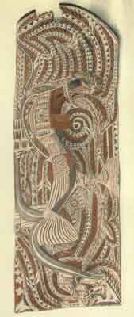

  
[Intangible Textual Heritage](../../index)  [Pacific](../index) 
[Index](index)  [Previous](om09)  [Next](om11) 

------------------------------------------------------------------------

p. 103

# PART II

### MELANESIA

GEOGRAPHICALLY Melanesia naturally falls into two divisions: New Guinea
with the smaller adjacent islands forming one, and the long series of
islands lying to the north and east of it, from the Admiralty Group to
New Caledonia and Fiji, constituting the other. From the anthropological
point of view the population of the Melanesian area is exceedingly
complex, being composed of a number of different racial types. While
detailed knowledge of the area is still too fragmentary to render
conclusions other than tentative, it may be said that at least three
groups can be recognized. Presumably most ancient and underlying all
others, though now confined to certain of the more inaccessible parts of
the interior of New Guinea and possibly to some few islands of the
Eastern Archipelago, are a number of Negrito or Negrito-like tribes in
regard to which we thus far have only the scantiest details. The bulk of
the population of the interior of New Guinea, of considerable stretches
of its southern, south-western, and northern coasts, and of portions of
other islands forms a second stratum known as Papuan. Mythological
material from them is exceedingly scanty. The third type is that which
occupies much of south-eastern New Guinea, together with part of its
northern and north-western coasts, and forms the majority of the
inhabitants of the islands reaching from the Admiralty Islands to Fiji.
Strictly speaking, the term Melanesian should be applied to this group
only; and from it and the Papuo-Melanesian mixtures the greater part of
the myth material at present available has been derived.

p. 104

It is quite evident that no adequate presentation of the mythology of
the whole Melanesian area, using the term in its broader geographical
sense, can as yet be made; the most that can be done is to present an
outline of the material derived from what is clearly the latest stratum
of the population and to supplement this, when possible, by such
fragmentary information as we possess from the older Papuan Group. Of
Negrito mythology, here, as in the case of Indonesia, absolutely nothing
is known.

 

 

PLATE XII

Carved and painted board with figures of a bird and of fish. These
figures refer to guardian spirits or clan totems, the boards being used
for the decoration of the mask-houses, in which the sacred masks used in
ceremonials are kept, and where many of the ceremonies themselves are
held. New Ireland. Original in American Museum of Natural History, New
York City.

 

------------------------------------------------------------------------

[Next: Chapter I. Myths of Origins and the Deluge](om11)
