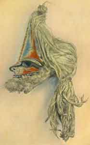

  
[Intangible Textual Heritage](../../index)  [Pacific](../index) 
[Index](index)  [Previous](om11)  [Next](om13) 

------------------------------------------------------------------------

p. 122

# CHAPTER II

### CULTURE HERO TALES

ONE of the most noteworthy features of Melanesian mythology is the
prominence of tales relating either to two culture heroes, one of whom
is, as a rule, wise and benevolent, while the other is foolish and
malicious; or to a group of brothers, usually ten or twelve in number,
two of whom, one wise and one foolish, are especially outstanding. Thus
a rudimentary sort of dualism is developed which stands in rather marked
contrast to Indonesian mythology, while showing points of contact with
Polynesian and Micronesian ideas. [1](om33.htm#fn_373)

In New Britain we have already seen how To-Karvuvu unsuccessfully
imitated To-Kabinana in the making of woman; and in the local forms of
the myth of the origin of death it was To-Karvuvu who cried and refused
to recognize his mother when she had shed her skin and become
rejuvenated, so that he was thus directly responsible for the entrance
of death into the world. A few other examples of his foolishness may be
given from the same region. According to one of these tales, [2](om33.htm#fn_374) To-Kabinana and To-Karvuvu were
one day walking in the fields when the former said to the latter, "Go,
and look after our mother." So To-Karvuvu went, filled a bamboo vessel
with water, poured it over his mother, heated stones in the fire, killed
her, and laid her in the oven to roast, after which he returned to
To-Kabinana, who asked him how their parent was and if he had taken good
care of her. To-Karvuvu replied, "I have roasted her with the hot
stones," whereupon his brother demanded, "Who told you to do that?"
"Oh"," he answered, "I thought you said to kill her!" but To-Kabinana

p. 123

declared, "Oh, you fool, you will die before me. You never cease doing
foolish things. Our descendants now will cook and eat human
flesh." [3](om33.htm#fn_375)

On another occasion To-Kabinana said to his brother, "Come, let us each
build a house," and accordingly each constructed a dwelling, but
To-Kabinana roofed his house outside, while his foolish brother covered
his on the inside. Then To-Kabinana said, "Let us make rain!" so they
performed the proper ceremony, and in the night it rained. The darkness
pressed heavily on To-Karvuvu so that he sat up, and the rain came
through the roof of his house and fell upon him, and he wept. In the
morning he came to his brother, saying, "The darkness pressed upon me,
and the rain-water wet me, and I cried." But when To-Kabinana asked,
"How did you build your house?" the other replied, "I covered it with
the roof covering inside. It is not like yours." Then they both went to
look at it, and To-Karvuvu said, "I will pull it down and build like
yours." But his brother had pity on him and said, "Do not do that. We
will both of us live together in my house." [4](om33.htm#fn_376)

Many of the evil or harmful things in the world were the work of the
foolish brother. One day To-Kabinana carved a *Thum*-fish out of wood
and let it float on the sea and made it alive so that it might always be
a fish; and the *Thum*-fish drove the *Malivaran*-fish ashore in great
numbers so that they could be caught. Now To-Karvuvu saw them, and asked
his brother where were the fish that forced the *Malivaran*-fish ashore,
saying that he also wished to make some. Accordingly, To-Kabinana told
him to make the figure of a *Thum*-fish, but instead the stupid fellow
carved the effigy of a shark and put it in the water. The shark,
however, did not drive the other fish ashore, but ate them all up, so
that To-Karvuvu went crying to his brother and said, "I wish I had not
made my fish, for he eats all the others"; whereupon To-Kabinana asked,
"What kind of a fish did you make?" and he replied, "A

p. 124

shark." Then To-Kabinana said, "You are indeed a stupid fellow. You have
brought it about that our descendants shall suffer. That fish will eat
all the others, and he will also eat people as well." [5](om33.htm#fn_377)

The characters of the two brothers are seen to be quite clearly
distinguished, To-Karvuvu being in these tales (as in many others from
this same area [6](om33.htm#fn_378)) foolish or
stupid rather than designedly malicious, although his follies are
usually responsible for the troubles and tribulations of human life;
whereas To-Kabinana, on the other hand, appears as actively benevolent,
his well-intentioned deeds in behalf of mankind being frustrated by his
brother. Tales of a similar type have been collected at one or two
points on the German New Guinea shore, [7](om33.htm#fn_379) but appear to be much less
common than among the coast population of New Britain. From British New
Guinea few tales of this sort seem to have been collected [8](om33.htm#fn_380) although stories of the wise and
foolish brothers are very prevalent in the Solomon, Santa Cruz, and
Banks Islands and the New Hebrides, where they are of the second type,
in that, instead of the usual two brothers, we have a group of ten or
twelve. [9](om33.htm#fn_381)

In the Banks Islands [10](om33.htm#fn_382) Qat
is the great hero, and many tales are told of him and his eleven
brothers, all of whom were named Tagaro, one being Tagaro the Wise, and
one Tagaro the Foolish. [11](om33.htm#fn_383)
In the stories told in Mota, all seem to have combined against Qat and
endeavoured to kill him; but in Santa Maria, another island of the
group, Qat has his antithesis in Marawa, the Spider, [12](om33.htm#fn_384) a personage who in Mota seems
to become Qat's friend and guide. Thus, according to one tale, [13](om33.htm#fn_385) when Qat had finished his work
of creation, he proposed to his brothers, Tagaro, that they make canoes
for themselves. Qat himself cut down a great tree and worked secretly at
it every day, but made no progress, for each morning, when he came back
to his task, he found that all that had been done the previous day was
undone, and the tree-trunk made solid again. On finishing work one
night, he determined to watch,

 

 

Plate XIV

Mask, made in part of a human skull, partly filled out with plastic
material and painted. These masks are used in religious ceremonials and
are thought to be connected with an ancestral cult. New Hebrides,
Peabody Museum, Cambridge, Massachusetts.

 

p. 125

and accordingly, making himself of very small size, he hid under a large
chip which he carried away from the pile that he had made during the
day. By and by a little old man appeared from a hole in the ground and
began to put the chips back, each in the place from which it had been
cut, until the whole tree-trunk was almost whole once more, only one
piece being lacking, namely, that under which Qat had hidden himself.
Finally the old man found it, but just as he was about to pick it up,
Qat sprang out, grew to his full size, and raised his axe to kill the
old man who had thus interfered with his work. The latter, however, who
was Marawa in disguise, begged Qat to spare his life, promising to
complete the canoe for him if he would do so. So Qat had mercy on
Marawa, and he finished the boat, using his nails to scoop and scrape it
out. [14](om33.htm#fn_386) When the canoes were
finished, Qat told his brothers to launch theirs, and as each slipped
into the water, he raised his hand, and the boat sank; whereupon Qat and
Marawa appeared, paddling about in their canoe and surprising the other
brothers, who had not known that Qat was at work.

After this, the brothers tried to destroy Qat in order that they might
possess his wife and canoe. "One day they took him to the hole of a
land-crab under a stone, which they had already so prepared by digging
under it that it was ready to topple over upon him. Qat crawled into the
hole and began to dig for the crab; his brothers tipped over the stone
upon him, and thinking him crushed to death, ran off to seize Ro Lei and
the canoe. But Qat called on Marawa by name, 'Marawa! take me round
about to Ro Lei,' and by the time that his brothers reached the village,
there was Qat to their astonishment sitting by the side of his
wife." [15](om33.htm#fn_387) They tried to kill
him in many other ways, [16](om33.htm#fn_388)
but Qat was always the victor, and their plans were frustrated.

The element of the opposition of the wise and foolish brothers is better
brought out, it seems, in the New Hebrides, where [17](om33.htm#fn_389) Tagaro becomes the chief actor
and is pitted against Suqe-matua.

p. 126

\[paragraph continues\] "Tagaro wanted everything to be good, and would
have no pain or suffering; Suqe-matua would have all things bad. When
Tagaro, made things, he or Suqe-matua tossed them up into the air; what
Tagaro caught is good for food, what he missed is worthless." In a
neighbouring island [18](om33.htm#fn_390)
Tagaro is one of twelve brothers, as in the Banks Islands, and usually
another of them is Suqe-matua, who continually thwarts him. In Lepers
Island [19](om33.htm#fn_391) Tagaro, and
Suqe-matua shared the work of creation, but whatever the latter did was
wrong. Thus when they made the trees, the fruit of Tagaro's were good
for food, but Suqe-matua's were bitter; when they created men, Tagaro
said they should walk upright on two legs, but Suqe-matua said that they
should go like pigs; Suqe-matua wanted to have men sleep in the trunks
of sago palms, but Tagaro said they should work and dwell in houses. So
they always disagreed, but the word of Tagaro prevailed. [20](om33.htm#fn_392) In this latter feature we have
the exact opposite of the conditions in New Britain. Tagaro was said to
be the father of ten sons, the cleverest of whom was Tagaro-Mbiti. [21](om33.htm#fn_393)

In another portion of this island Tagaro's opponent, here known as
Meragbuto, again becomes more of a simple fool, and many are the tricks
that Tagaro plays upon him. [22](om33.htm#fn_394) One day Meragbuto saw Tagaro,
who had just oiled his hair with coco-nut oil, and admiring the effect
greatly, asked how this result had been produced. Tagaro, asked him if
he had any hens, and when Meragbuto answered that he had many, Tagaro
said: "Well, when they have roosted in the trees, do you go and sit
under a tree, and anoint yourself with the ointment which they will
throw down to you." Meragbuto carried out the instructions exactly and
rubbed not only his hair, but his whole body with the excrement of the
fowls. On the following day he went proudly to a festival, but as soon
as he approached every one ran away, crying out at the intolerable
odour; only then did Meragbuto realize that he had been tricked, and
washed himself in the sea.

p. 127

Another time Tagaro, placed a tabu upon all coco-nuts so that no one
should eat them; but Meragbuto paid no attention to this prohibition,
eating and eating until he had devoured nearly all of them. Thereupon
Tagaro, took a small coco-nut, scraped out half the meat, and leaving
the rest in the shell, sat down to await the coming of Meragbuto, who
appeared by and by, and seeing the coco-nut, asked Tagaro if it was his.
"Yes," said Tagaro, "if you are hungry, eat it, but only on condition
that you eat it all." So Meragbuto sat down and scraped the remainder of
the nut and ate it; but though he scraped and scraped, more was always
left, and so he continued eating all day. At night Meragbuto, said to
Tagaro, "My cousin, I can't eat any more, my stomach pains me." But
Tagaro answered, "No. I put a tabu on the coco-nuts, and you disregarded
it; now you must eat it all." So Meragbuto continued to eat until
finally he burst and died. If he had not perished, there would have been
no more coco-nuts, for he would have devoured them all. [23](om33.htm#fn_395)

At last Tagaro determined to destroy Meragbuto, and accordingly he said,
"Let us each build a house." This they did, but Tagaro secretly dug a
deep pit in the floor of his house and covered it over with leaves and
earth; after which he said to Meragbuto: "Come, set fire to my house, so
that I and my wife and children may be burned and die; thus you will
become the sole chief." So Meragbuto came and set fire to Tagaro's
house, and then went to his own and lay down and slept. Tagaro and his
family, however, quickly crawled into the pit which he had prepared, and
so they escaped death; and when the house had burned, they came up out
of their hiding-place and sat down among the ashes. After a time
Meragbuto awoke, and saying, "Perhaps my meat is cooked," he went to
where Tagaro's house had been, thinking to find his victims roasted.
Utterly amazed to see Tagaro and his family safe and sound, he asked how
this had happened, and Tagaro replied that the flames had not harmed him
at all. "Good!"

p. 128

said Meragbuto, "when it is night, do you come and set fire to my house
and burn me also." So Tagaro, set fire to Meragbuto's house, but when
the flames began to burn him, Meragbuto cried out, "My cousin! It hurts
me. I am dying." Tagaro, however, replied, "No, you will not die; it was
just that way in my case. Bear it bravely; it will soon be over." And so
it was, for Meragbuto was burned up and entirely destroyed. [24](om33.htm#fn_396)

Two points of special interest in connexion with these tales deserve
brief discussion. One of the most characteristic features of Polynesian
mythology is the prominence of the Maui cycle; and if we compare these
Polynesian tales with the Melanesian stories of the wise and foolish
brothers, there is a suggestion of some sort of relationship between
them. To be sure, the similarity lies mainly in the fact that in both
regions there is a group of brothers, one of whom is capable, the others
incapable or foolish, whereas the actual exploits of the two areas are
different. Again, it is only in New Zealand that even this slight amount
of correspondence is noticeable. In spite, however, of this very slender
basis for comparison, it seems, in view of the relative absence of this
type of tale from the rest of the Pacific area, that the suggestion of
connexion between the two groups of myths is worth further
investigation. This is especially evident in view of the second of the
two points to which reference has been made, i. e. the similarity
between Tagaro, the name of the Melanesian brothers in the New Hebrides,
and the Polynesian deity Tangaroa, who appears in several guises, i. e.
as a simple god of the sea in New Zealand, as the creator in the Society
and Samoan Groups, and as an evil deity in Hawaii. It is not yet
possible to determine the exact relationship between the Polynesian
Tangaroa and the New Hebridian Takaro, but it is probable that there is
some connexion between them. It may be that the use of the name in the
New Hebrides is due wholly to borrowing during the comparatively recent
Polynesian contact; [25](om33.htm#fn_397) but
on the other hand, it is possible that Tangaroa is a Polynesian
modification

p. 129

of the Melanesian Tagaro. The general uniformity of the conceptions of
Tagaro in Melanesia, contrasted with the varied character of Tangaroa in
Polynesia, adds considerable difficulty to the problem. The final
elucidation of the puzzle must wait, however, for the materials at
present available are not sufficiently complete to enable us to draw any
certain conclusions.

------------------------------------------------------------------------

[Next: Chapter III. Miscellaneous Tales](om13)
