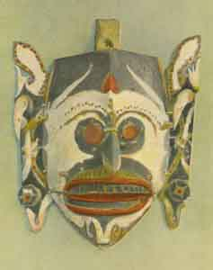
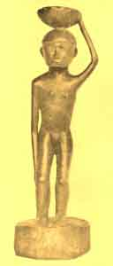
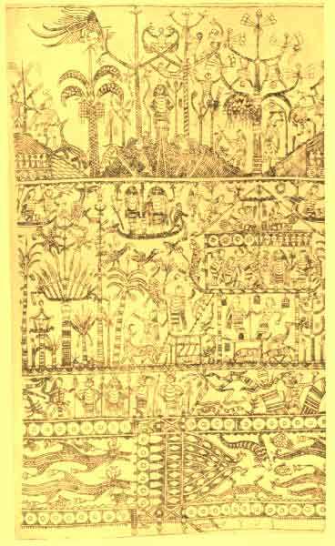

  
[Intangible Textual Heritage](../../index)  [Pacific](../index.md) 
[Index](index)  [Previous](om15)  [Next](om17.md) 

------------------------------------------------------------------------

p. 155

# CHAPTER I

### MYTHS OF ORIGINS AND THE DELUGE

AMONG all the peoples of Indonesia, the mountain tribes of northern
Luzon in the Philippines seem to stand alone in respect to cosmogonic
myths in that, so far as material now at our command is concerned, they
lack entirely, or almost entirely, any myths of the origin of the
universe. [1](om35.htm#fn_430.md) The world,
according to their belief, has always existed, although perhaps not in
its present form, as has also the upper or sky-world. Of the creation of
the earth or of mankind, of animals or of plants, little or nothing is
said. All of these tribes, as will be seen later, possess deluge-myths,
but of tales relating to the preceding period there are few if any.

The apparent absence of cosmogonic myths among these tribes is
suggestive, for these peoples constitute, so far as can be determined,
one of the purest remnants of the earliest non-Negrito stratum of
Indonesia and have been practically uninfluenced by Indian and Islamic
cultures, to which most of the other Indonesian peoples have been
directly or indirectly exposed. In view of the affiliation of the
earliest non-Negrito Population of Indonesia with the Môn-Hkmêr peoples
of southeast Asia, which has recently been suggested on linguistic
grounds, [2](om35.htm#fn_431.md) it is perhaps
significant that this same trait of the absence of true cosmogonic tales
and the importance of deluge-myths is found among them also, so far as
is indicated by the very scanty material that is as yet available. [3](om35.htm#fn_432.md)

Some of the tribes in Celebes are also characterized by the absence of
any myths referring to the creation of the world or of the gods, though
they are unlike the type to which reference

p. 156

has just been made in that they have tales which account for the origin
of mankind. The Bugi and the people of Makassar in the south-western
part of the island state that in the beginning the son of the sky-deity
was sent down to earth on the rainbow that he might organize and prepare
the world for mankind. This task accomplished, he took to wife six
female deities, three of whom had descended with him from the sky-world,
and three of whom were derived from the earth or from the underworld,
and thus he became the ancestor of all mankind. [4](om35.htm#fn_433.md)

A more circumstantial myth is recorded from the Kei Islands in the
extreme south-east of the Indonesian area. According to this tale, [5](om35.htm#fn_434.md) there were three brothers and
two sisters in the upper sky-world. While fishing one day, Parpara, the
youngest of the brothers, lost a fish-hook which he had borrowed from
Hian, his oldest brother, who, angered by the loss of the hook, demanded
that it be found and returned to him. After much fruitless search, the
culprit met a fish who asked him what his trouble was, and who, on
learning the facts, promised to aid in the search, at length discovering
another fish who was very ill because of something stuck in its throat.
The object proved to be the long-lost hook, which the friendly fish
delivered to Parpara, who thus was able to restore it to its owner.
Parpara, however, determined to have his revenge upon his brother, and
so he secretly fastened a bamboo vessel full of palm liquor above Hian's
bed in such a way that when the latter rose, he would be almost certain
to upset it. The expected happened, and Parpara then demanded of his
brother that he return to him the spilled liquor. Hian endeavoured, of
course fruitlessly, to gather it up, and in his efforts dug so deeply
into the ground that he made an opening clear through the sky-world.
Wondering what might lie below, the brothers determined to tie one of
their dogs to a long rope and lower him through the aperture; and when
they had done this, and the dog had been drawn up again, they found

p. 157

white sand sticking to his feet, whereupon they resolved to go down
themselves, although the other inhabitants of the heaven-world refused
to accompany them thither. Sliding down the rope, the three brothers and
one of the sisters, together with their four dogs, safely reached the
world which lay below, and which was thus discovered for the first time.
As the second sister was descending, however, one of the brothers
chanced to look up, at which his sister was so ashamed that she shook
the rope and was hauled up by the other sky-people. In this way the
three brothers with their sister were the first occupants of the world
and became the ancestors of the human race. [6](om35.htm#fn_435.md)

Although the existence of the earth is postulated in Minahassa, in the
extreme north-east of Celebes, we find an origin given for some of the
gods and for mankind. [7](om35.htm#fn_436.md) In
the beginning the wind blew over the sea, and raising great waves, drove
upon the shore the spume which their beating caused, the mass of foam
being in the shape of an egg. The sun shone upon this, and from it was
born a boy, who grew miraculously. One day, as he wandered along the
shore, he saw a girl sitting upon a rock from which she had just been
born, and taking her to wife, he thus became the parent of mankind. This
and the preceding type, in which the cosmogonic element was wholly
lacking, are, however, not common in Indonesia, and it is only when we
turn to the next category that we find one current over large areas.

This more wide-spread class assumes the existence of a sky-world or
upper realm, and of a primeval sea below it in which or on which the
world is made. We may begin with the outline of a myth told in Minahassa
which is a variant off the one just given. According to this form, [8](om35.htm#fn_437.md) in the beginning there were only
the sea and a great rock which was washed by the waves, and which, after
first giving birth to a crane, sweated, from the sweat being produced a
female deity called Lumimu-ut. [9](om35.htm#fn_438.md) Advised by the crane of the
existence of the "original

p. 158

land," she got from thence two handfuls of earth which she spread upon
the rock, and so she created the world, on which she planted the seeds
of all plants and trees, obtaining them from the same "original
land." [10](om35.htm#fn_439.md) Having thus made
the earth, Lumimu-ut ascended a mountain, where the west wind blew upon
her and made her fruitful. In due time she bore a son, and when he had
grown to manhood his mother advised him to seek a wife, but though he
sought far and wide, he could find none. So Lumimu-ut gave him a staff,
whose length was equal to her own stature, bidding him to seek for a
woman who should be less tall than the staff, and telling him that when
he should find such a person he would know that she was the one he was
destined to marry. Mother and son then separated, one going to the right
and one to the left, and travelled around the whole world until at last
they met again, without recognizing each other, and lo! when he set the
staff beside her, its length was greater than her stature, for without
his knowledge the rod had increased in height. Believing, therefore,
that the woman, who was indeed his own mother, was she of whom he had
been told, he married her, and she bore him many children who became
gods. This form of myth does not, indeed, directly refer to the
sky-world, but speaks of the "original land" from which Lumimu-ut
obtained earth and seeds for the construction of the world. It is
interesting to compare the incident of the birth of Lumimu-ut from the
rock, which alone broke the surface of the primeval sea, with the
Tongan [11](om35.htm#fn_440.md) and Samoan [12](om35.htm#fn_441.md) myths of the origin of the
first beings and of the world from a stone which split open; and a
similar idea also occurs in Melanesia. [13](om35.htm#fn_442.md) Perhaps more characteristic of
this type of origin-myths are the legends of the Kayan, Kenyah, and
Bahau of central Borneo. According to the Kayan, [14](om35.htm#fn_443.md) originally there was nothing
but the primeval sea and over-arching sky; but from the heavens there
fell into the sea a great rock, upon whose barren surface, in course of
time, slime collected, from which were bred worms

 

 

PLATE XVI

Wooden mask representing a spirit or ghost. Worn in dances by the tribes
of Sarawak and central Borneo. Peabody Museum, Cambridge, Massachusetts.

 

p. 159

that bored into the rock. The sand produced by this boring collected,
eventually covering the rock with soil, and after many years there fell
from the sun upon this land the wooden handle of a sword which, taking
root, grew into a great tree; while from the moon fell a vine which
clung to the tree and rooted itself in the rock. From this mating of the
tree and vine were born two beings, a boy and a girl, who wedded in
their turn and became the ancestors of the Kayan. [15](om35.htm#fn_444.md) Another version [16](om35.htm#fn_445.md) varies somewhat in its details.
In the beginning a spider descended from the sky [17](om35.htm#fn_446.md) and spun a web, into which fell
a tiny stone that grew and grew until it filled all the space under the
horizon. A lichen fell from heaven upon this rock, to which it adhered,
and then came a worm, from whose excrement the first soil was formed.
This covering of earth gradually spread over all the rock; and next
there fell upon the ground so made a tree, which at first was tiny in
size, but which took root and grew great. A crab now dropped down to the
earth and with its claws dug and scratched in the ground, thus forming
the mountains and valleys. Plants grew upon the earth, and a vine,
winding itself about the tree, mated with it. Finally, two beings, one
male and one female, descended from heaven upon the tree, the male
dropping a sword-handle and the female a spindle. Mating, these objects
bore a child which had only head and body, but no arms or legs; and this
monster in its turn produced two children, a boy and girl, who united
and gave birth to offspring, which from generation to generation became
more and more human in form until finally they were wholly so. These and
their descendants then became deities of various sorts. [18](om35.htm#fn_447.md)

With them we may compare the origin-myths of several of the tribes of
south-eastern Borneo. One version states [19](om35.htm#fn_448.md) that in the beginning there
were only the sky and sea, in which swam a great serpent upon whose head
was a crown of gold set with a shining stone. [20](om35.htm#fn_449.md) From the sky-world the deity
threw earth upon the serpent's head, thus building an island in the

p. 160

midst of the sea; and this island became the world. [21](om35.htm#fn_450.md) A slightly variant
account [22](om35.htm#fn_451.md) declares that the
deity sent down a messenger or servant to report upon conditions, and
that it was this servant who spread the earth on the serpent's head.
Still another version from this same region is interesting in that it
serves as a transition to those found in Sumatra. According to this
tale, [23](om35.htm#fn_452.md) in the world of the
gods there were two trees, one of which bore a bud or sprout in the form
of a ball. By the motions of a bird, which sat on this tree, the bud was
shaken off and fell into the Spirit River, in which a great serpent
dwelt; but though the latter tried to swallow the mysterious object, it
escaped him, and drifting to the shore, was metamorphosed into a woman.
Marrying a man who was developed from a tree-trunk floating in the sea,
she gave birth, first, to six streams of blood from which all evil
spirits came; and finally to two sons, one of whom, taking with him the
seeds of all plants and animals, was lowered from the sky-world, where
all these events occurred, to the earth (of whose origin nothing is
said) that he might prepare it for men.

Deferring for the moment any discussion of these tales, we may turn to a
third group of myths, i. e. those of the Battak of Sumatra. The Toba
Battak (who of all the Battak tribes are probably the least influenced
by Muhammadan or Indian culture) account for the origin of things as
follows. [24](om35.htm#fn_453.md) Mula Dyadi, the
highest deity, dwelt in the uppermost of the seven heavens and had two
birds as his servants. Having created three male beings, he caused a
tree to exist in one of the lower heavens, its branches reaching to the
sky; next he made a hen, which perched on the tree and later laid three
eggs, from which came three maidens whom Mula Dyadi gave as wives to his
three sons. [25](om35.htm#fn_454.md) The daughter
of one of these sons refused to marry a cousin of hers because he had a
face like a lizard and a skin like a chameleon, and devoted her time to
spinning. One day she dropped her spindle, which fell down from the
sky-world. On the thread so unrolled she then descended to

p. 161

the surface of the sea which stretched everywhere below. In this
primeval ocean swam or lay a great serpent on whose head the heavenly
maiden spread a handful of earth brought down at her request from Mula,
Dyadi by one of his bird servants; and thus she formed the world. The
serpent, however, disliked the weight upon his head, and turning over,
caused this newly made world to be engulfed by the sea. Thereupon Mula
Dyadi created eight suns, whose heat should dry up the sea, and this
being done in part, the divine maiden thrust a sword into the body of
the serpent, revealed by the shrinking sea, and fastened his body firmly
in an island block that he might never again thus destroy the world.
With more soil she then re-founded the earth; but after this, having
questioned her as to what was to be done with the youth whom she
refused. as husband, Mula Dyadi declared that she now must marry him,
and wrapping the unwelcome suitor together with a blowgun in a mat, he
threw him down upon the earth. Unharmed by his fall, and feeling hungry,
he shot at a dove which escaped unwounded, but caught the arrow
dexterously and flew with it to the village where the heavenly maiden
dwelt. Following in pursuit, the youth discovered the girl who had
before refused him, found her more tractable, and married her; and so
they became the ancestors of mankind.

The Dairi Battak, who live to the north of the Toba and are more or less
in contact with the Muhammadanized Garo, have a version [26](om35.htm#fn_455.md) which presents interesting
differences. Batara Guru (Sanskrit Bha<u>tt</u>ara Guru), the highest of
the gods, once sent a servant to get some venison, which was greatly
desired by the deity's wife, who was about to give birth to a child. The
hunt being unsuccessful, the divinity then sent the raven on the same
quest, but he also could find no such food anywhere in the realms of the
gods. In the course of his search, however, he discovered a cave, in
which was a pit whose bottom he could not discern. The longest vine was
too short to measure its depth, and a stick thrown down the opening
disappeared

p. 162

without a sound to indicate that it reached bottom. Determined to solve
the mystery, the raven flew down into the opening, and after a long
journey in complete darkness at last reached the surface of a
wide-extending sea. After exploring in vain, the raven wished to return
in order that he might report his discovery, but could not retrace his
way to the opening through which he had come, though luckily he found
floating upon the sea the bamboo which he had thrown down the hole, and
on this he rested.

Meanwhile Batara Guru became impatient, and accompanied by several
attendants, he flew down the dark opening in the cave, taking with him
from the sky-world a handful of earth, seven pieces of wood, a chisel, a
goat, and a bumblebee; and reaching the surface of the sea, he built a
raft from the pieces of wood. The raven now appeared, sitting upon the
floating piece of bamboo, and at his request Batara Guru called to the
eight wind-directions, whereupon darkness at once gave place to light.
By his command the goat, accompanied by the bee, went down under the
raft to support it on his horns; but in finishing the raft the chisel
broke, and the handle hit the goat upon the head, which made him shake
it violently, and the raft with it, for which the deity chided him and
ordered him to keep still. Then taking the earth which he had brought
with him, Batara Guru spread it upon the raft, thus making the world,
and gave this to the raven for a dwelling-place.

One more version may be given, that from the Karo Battak, who, like the
Dairi, live north of the Toba. According to this, [27](om35.htm#fn_456.md) Batara Guru, the heaven deity,
and his wife, who was the daughter of the divinity of the underworld,
full of sorrow at their childlessness, determined to try the effect of
penance in poverty and seclusion, and accordingly went to live in a
little hut by the sea. Here they planted a small garden, which was
destroyed by a great serpent that came out of the water, but when Batara
Guru went to drive it away, the monster

p. 163

demanded that he put food into its mouth. Fearing lest his hand be
bitten off, Batara Guru wedged open the mouth of the serpent with his
sword, and withdrawing his hand, found upon his finger a magic ring
which would grant his every wish. The serpent then returned to the sea,
and in due course of time, aided by the ring, the wife of Batara Guru
presented him with three sons and three daughters. One of these sons
created the world in the space between the upper world and the
underworld) making it with seven handfuls of soil sent him-by his
father, who, when the earth was finished, suspended it from the sky by
seven silken cords. The newly created world caused the underworld to be
darkened, which aroused anger in that one of the three sons who had
taken up his residence there. Therefore he shook the world so violently
that it was destroyed. Seven times this was repeated, the earth being
made anew each time, until the world-maker besought his father to aid
him, and this Batara Guru did, setting up an iron pillar which supported
four cross-beams, upon which the world was then founded. After this the
underworld-brother could shake the world (as indeed he does to this
day), but was unable to destroy it.

Taking this whole group of myths together, there are a number of points
which will repay brief discussion. The concept of an original sea, above
which lies the sky-world of the gods, is common to all, and is likewise
characteristic, it will be remembered, of the cosmogonic myths of
central and western Polynesia. [28](om35.htm#fn_457.md) The origin of the world,
moreover, from a rock thrown down from the sky, or from materials
brought or sent down from thence, appears not only in the portions of
Indonesia from which the foregoing myths are derived, but also in the
Philippines, [29](om35.htm#fn_458.md) and is
further characteristic of Samoa [30](om35.htm#fn_459.md) and Tonga, [31](om35.htm#fn_460.md) while it is likewise known from
Micronesia. [32](om35.htm#fn_461.md) The prominent
part taken by birds, either as the original beings who flew over the
primeval sea, or as the messengers and helpers of the deity in the task
of creation, is also a feature

p. 164

of the mythology of Samoa [33](om35.htm#fn_462.md)
and Tonga. [34](om35.htm#fn_463.md) Again, the
idea that the first beings, whether gods; or men, were undeveloped,
having merely bodies destitute of arms and legs, is found not only in
Borneo, but also in the island of Nias, [35](om35.htm#fn_464.md) and recurs in Samoa and the
Society Group; [36](om35.htm#fn_465.md) while the
incident of the mating of tree and vine, characteristic of central
Borneo, is known in Samoa as well. [37](om35.htm#fn_466.md)

From the foregoing it would seem, therefore, that we were justified in
the conclusion that the cosmogonic myths of central and western
Polynesia show similarity to the type of origin-myths just described in
Indonesia--a similarity so striking, indeed, that a genetic relationship
seems almost the only explanation. It has already been shown [38](om35.htm#fn_467.md) that this type of myth is
unknown elsewhere in Polynesia, and that there is reason to regard it as
a comparatively late introduction into the Polynesian area.

In one of the Minahassa myths which has been given, an important
incident is that of the incest of mother and son, the tale describing
the two as separating, meeting without recognition after a lapse of
time, [39](om35.htm#fn_468.md) then marrying when
a test had been applied which showed that the two were destined to
become man and wife. The episode is known in practically the same form
from the island of Lombok, [40](om35.htm#fn_469.md) and also from Nias, [41](om35.htm#fn_470.md) except that the staff is
replaced by a ring as the test; and the essential element of mother-son
incest is likewise found in the Philippines. [42](om35.htm#fn_471.md) A modification of the original
theme, by which the close relationship is discovered in time to prevent
incest, is known among the Bantik of north Celebes [43](om35.htm#fn_472.md) and also in west Borneo [44](om35.htm#fn_473.md) though here the *motif* occurs
in other than cosmogonic tales. Brother-sister incest is, moreover, a
wide spread incident in Philippine myths [45](om35.htm#fn_474.md) of the origin of mankind, as
will be seen in more detail later. With this far-reaching element of
incest in Indonesia it is interesting and perhaps significant to
compare, on the one hand, the frequent appearance of father-daughter
incest in Maori mythology, [46](om35.htm#fn_475.md) where

p. 165

\[paragraph continues\] Tane marries his daughter, Hine-a-tauira, who
flees to the underworld in fear and anger when she discovers who her
husband is. (It may be added that in one of the Philippine versions we
again find this same flight of the injured wife to the underworld.) On
the other hand, the incest theme as developed in Indonesia may be
compared with its occurrence among the Môn-Hkmêr and other tribes of
south-eastern Asia. [47](om35.htm#fn_476.md) As
already pointed out, suggestions of this *motif* are found in the
Society Group in Polynesia; and in the same connexion we may, perhaps,
compare the incident of Lumimu-ut's fertilization by the wind [48](om35.htm#fn_477.md) with the similar action of the
sun's rays in Samoa [49](om35.htm#fn_478.md) and
Fiji. [50](om35.htm#fn_479.md)

The origin-legends of the north-west Borneo tribes are related to the
type of cosmogonic myth which has just been considered in that they set
forth belief in a primeval sea and in the important part played by
birds, although they imply something more of a direct creation.
According to one of these, [51](om35.htm#fn_480.md) in the beginning there was
nothing but a wide-spread sea, over which flew two birds, who, diving,
brought up two objects like eggs in size and shape, from one of which
one bird made the sky, while from the other his fellow created the
earth. As the size of the latter exceeded that of the former, it was
pressed together in order that it might fit, its resultant crumples and
folds producing the mountains and valleys. Other versions [52](om35.htm#fn_481.md) speak of an original deity
without legs or arms, who seems to have been supported upon an
animal, [53](om35.htm#fn_482.md) and who by an act
of will created two birds, which then formed heaven and earth.

The cosmogonic myths thus far discussed are derived from western and
central Indonesia; and we may now turn to the eastern portion of this
area, where another type appears, albeit the available material is
exceedingly scanty. Indeed, of true myth-material we have only fragments
from the small islands north-east of Timor (the Sermata and Leti
Islands). [54](om35.htm#fn_483.md) These seem to
indicate a belief in a sky-world and a world below, of whose origins,
however, nothing is said. [55](om35.htm#fn_484.md)
On the

p. 166

other hand, it may be noted that in all of the islands, from and
including Timor to the Kei Islands, there is a belief in a male deity
living in the sky and associated chiefly with the sun, and a female
deity dwelling in or regarded as one with the earth, these being
described as husband and wife, and being supposed to mate annually at
the time of the monsoon, while it was also believed that the sky once
was closer to the earth. [56](om35.htm#fn_485.md)
In Ceram, Buru, and Amboina, the definiteness of this concept of the
heaven father and earth mother becomes clearer; but we have no myths,
not even fragments, regarding them. In view of the almost total lack of
cosmogonic myth material from this region, as well as from Halmahera and
the other islands of the Moluccas, it is premature to draw any
conclusions from the resemblance of this concept to the similar, but
much more highly developed, ideas in Polynesia; yet it is difficult to
avoid the impression that the strength of the belief here in the extreme
eastern portion of Indonesia, which is geographically nearest to the
Polynesian area, and its apparent absence elsewhere farther west, are
significant. Further material, however, alone can settle the question.

In the Polynesian area one of the most characteristic and interesting
types of cosmogonic myths was that which explained the origin of the
universe as due to a sort of evolutionary development from an original
chaos or nothingness; and, at least in central Polynesia, this assumed a
genealogical form. This evolutionary genealogical type of origin-myths
seems, so far as available material goes, to be lacking in Indonesia,
except in one very restricted region, the island of Nias, lying off the
western coast of Sumatra. According to myths from this island, there was
in the beginning only darkness and fog, which condensed and brought
forth a being without speech or motion, without head, arms, or
legs; [57](om35.htm#fn_486.md) and in its turn
this being gave existence to another, who died, and from whose heart
sprang a tree which bore three sets of three buds. From the first two
sets six beings were produced, two of whom

p. 167

made from the third set of buds a man and a woman--the ancestors of
mankind. [58](om35.htm#fn_487.md) The several
variants of the myth differ in details, but all agree in tracing the
origin of things to a primeval chaos, from which after several
generations was developed a tree that in turn gave rise to gods and men.
Although lacking the details and development found in Polynesia, these
Nias myths seem to show the same fundamental conception.

Thus far we have mainly been concerned with the myths concerning the
origin of the world; but now we may devote some consideration to those
accounting for the origin of mankind. Two main types may be
distinguished: one comprising those in which man is not thought of as
created or made, but as either (*a*) derived from a sky-world, (*b*) the
offspring of the gods, or (*c*) of miraculous origin; and those
characterized by a definite account of the actual making of the first
man by some deity. The belief in a sky-world origin for mankind is in
the main confined to the extreme eastern part of Indonesia--Ceram, [59](om35.htm#fn_488.md) the Kei Islands, [60](om35.htm#fn_489.md) and the Tenimber Group. [61](om35.htm#fn_490.md) Only in the Kei Islands do we
have a detailed myth; [62](om35.htm#fn_491.md) in
the other instances it is simply stated that the ancestors came down
from the sky, which was formerly nearer to the earth, by means of a tree
or vine. The idea of a heavenly origin also appears in the extreme west,
for among the various conflicting myths from the island of Nias [63](om35.htm#fn_492.md) one gives the sky-world as the
ultimate origin of mankind, whereas others [64](om35.htm#fn_493.md) describe this as a proximate
source, the ultimate and earliest human ancestors being derived from
trees. A direct divine ancestry appears comparatively seldom. Among the
Toba Battak mankind is descended from the divine maiden who came down to
earth, and from the heavenly hero who followed her; in the southern
Celebes the Bugi of Macassar believe themselves to be derived from the
son of the heaven deity and his six wives; while in Nias [65](om35.htm#fn_494.md) and among the Ifugao in
Luzon [66](om35.htm#fn_495.md) we also find the
belief in a direct descent from deities.

p. 168

By far the most common, however, are those myths which trace mankind to
some miraculous source, an origin from plants or trees being perhaps the
most frequent of these. For the most part we have from the eastern and
south-eastern islands only the statement that the ancestor or ancestors
of mankind burst from a bamboo or tree, [67](om35.htm#fn_496.md) although in some instances the
tales are more precise. Thus in the Ceram-laut and Gorrom Islands it is
said [68](om35.htm#fn_497.md) that in the
beginning a woman of great beauty, called Winia, came out of a tree
together with a white hog, the woman climbing into a tall tree, while
the hog remained at its foot. After a time a raft floated ashore, on
which was another woman, Kiliboban by name, who had drifted here from
New Guinea and who became the comrade of the hog. Later a man (of whose
origin nothing is said) came by and took off his clothing to go in
fishing, but the two women saw him and laughed at him, whereupon,
surprised that any one else was in the vicinity, the man sought for the
source of the laughter and found Kiliboban, whom he straightway asked to
be his wife. She, however, refused, but directed him to the tree in
whose top Winia was concealed; so he climbed the tree forthwith, found
the lovely damsel there, and taking her to be his wife, became by her
the ancestor of mankind.

In Amboina [69](om35.htm#fn_498.md) and Buru [70](om35.htm#fn_499.md) the first human beings came
from a tree after a bird had sat upon it and fructified it. In the
latter island, according to one myth, the first to appear was a woman,
who built a fire near the base of the tree, which it warmed, whereupon
the tree split in two, and a man came forth who married the woman. A
variant makes the man the first to appear. In Wetar [71](om35.htm#fn_500.md) the first woman came from the
fruit of a tree; and far to the north, among the Ami, one of the wild
tribes of Formosa, [72](om35.htm#fn_501.md) we
find the same belief, for it is said that in the beginning a being
planted in the ground a staff, which took root and became a bamboo on
which two shoots developed, a man issuing from one of them and a woman
from the other. Coming farther west to Celebes, traces of the idea

p. 169

are found in Minahassa, [73](om35.htm#fn_502.md)
where, according to one myth, a tree-trunk floated ashore, and from it,
when it was broken open by a deity, a man (in reality a god) came forth.
A similar tale from the Tagalog, in the Philippines, is reported [74](om35.htm#fn_503.md) in which two hollow bamboos
floated ashore on the first land; these were pecked open by a bird,
whereupon a man issued from the one and a woman from the other, the two
thus becoming the ancestors of mankind. The belief appears again in
Borneo in a tale from the Kayan [75](om35.htm#fn_504.md) where the tree and vine of
miraculous origin produce the ancestors of the different tribes; and a
variant also occurs in south-east Borneo. [76](om35.htm#fn_505.md) Lastly we find in Nias [77](om35.htm#fn_506.md) that man originated from the
fruit of the tree, *tora'a*, which grew, according to one account, upon
the back of one of the first beings derived from original chaos; or
according to another, from his heart after his death.

That the first men were derived from worms or came out of the ground as
larvae is an idea apparently confined to the easterly islands [78](om35.htm#fn_507.md) although little more is given
than the mere statement of their origin. Perhaps related to this belief
is that held in Watubela [79](om35.htm#fn_508.md)
and the Kei Islands, [80](om35.htm#fn_509.md) that
the first men arose out of the ground. [81](om35.htm#fn_510.md) Among the Battak in Sumatra one
myth [82](om35.htm#fn_511.md) tells of the birth
of the first man from a featherless bird, which was sent down from the
sky.

Quite widely distributed, on the other hand, is the belief that mankind
originated from eggs. In the Philippines [83](om35.htm#fn_512.md) a bird laid two eggs, one at
the source of a river and one at its mouth, a woman coming from the
first and a man from the second. For long years the man lived alone,
until one day when he was bathing, a long hair, floating in the water,
entangled his legs so that he reached the bank with difficulty.
Examining the hair, he at once determined to find its owner, and so
travelled up-stream until he met the woman, whom he then married. From
south-eastern Borneo [84](om35.htm#fn_513.md)
comes a different tale. After the world had been made by spreading earth
on the head of the great serpent which swam in the primeval sea,

p. 170

a deity descended upon it and discovered seven eggs formed of earth.
Taking two of these, he found in one a man, and in the other a woman,
but both lifeless; whereupon, returning to the upper world, he asked the
creator for breath, that the pair might become alive. While he was gone
upon his errand, however, another deity came down and blew into the
mouths of the two lifeless forms and vivified them, so that when the
first deity returned, he found himself forestalled, and mankind, which
he had intended to make immortal, was now subject to decay and death.
Another version speaks of only two eggs, from which a human pair came
forth and bore seven sons and seven daughters, who were, however,
without life. At the command of the deity the husband went to get for
them the germs of life, bidding his wife in his absence on no account to
stir outside her mosquito-curtains; but she failed to obey, and as she
looked out a blast of wind came and blew into the children, so that they
breathed and became alive; whence man is mortal, and wind (or breath) is
his only life. Another tale of the origin of mankind from eggs is found
among the Battak of Sumatra. [85](om35.htm#fn_514.md) In Celebes we have already
seen [86](om35.htm#fn_515.md) how the first divine
being was born miraculously from the rock or from the sweat which formed
upon it; and an actual origin of mankind from a rock, which split open
of itself, appears in Formosa. [87](om35.htm#fn_516.md)

In the consideration of the cosmogonic myths the frequency of the incest
incident has already been pointed out. In most of these cases the
offspring of the incestuous union are divine or semi-divine beings, who
may or may not be the ultimate ancestors of mankind; but the belief in a
direct origin of man from such brother-sister or mother-son marriages
seems especially characteristic of the Philippine area, where it follows
the flood-episode. As an example of these myths we may take the version
given by the central Ifugao. [88](om35.htm#fn_517.md) As the waters rose, people
sought refuge on the mountains, until at last only two survived, a
brother and sister, Wigan and Bugan, one of them

 

 

PLATE XVII

Image of Bugan, the wife of Wigan. She appears prominently in the myths,
and all prayers for women are said to her, though no petitions are
addressed to her image. She is regarded as the perfect woman. Ifugao
tribe, Luzon, Philippine Islands. Peabody Museum, Cambridge,
Massachusetts.

 

p. 171

Mt. Amuyao and the other on Mt. Kalauitan. Bugan had a fire, which at
night lit up the peak of Kalauitan, and Wigan then knew that someone
else beside himself was alive. "As soon as the earth was dry, Wigan
journeyed to Kalauitan where he found his sister Bugan, and their
reunion was most joyous. They descended the mountain and wandered about
until they came to the beautiful valley that is today the dwelling-place
of the Banauol clan--and here Wigan built a house. When the house was
finished, Bugan dwelt in the upper part and Wigan slept beneath.

"Having provided for the comfort of his sister, Wigan started out to
find if there were not other people left alive in the Earth World. He
travelled about all the day and returned to the house at night to sleep.
He did this for three days, and then as he was coming back on the third
evening he said to himself that there were no other people in the world
but themselves, and if the world was to be re-populated it must be
through them . . . At last Bugan realized that she was pregnant. She
burst into violent weeping, and heaping reproaches on his head, ran
blindly away. After travelling a long way, and being overcome with grief
and fatigue, Bugan sank down upon the bank of the river and lay there
trembling and sobbing. After having quieted herself somewhat, she arose
and looked around her, and what was her surprise to see sitting on a
rock near her an old man with a long white beard! He approached her and
said: 'Do not be afraid, daughter! I am Maknongan, and I am aware of
your trouble, and I have come to tell you that it is all right.' While
he was speaking, Wigan, who had followed his sister, appeared on the
scene. Then Maknongan placed the sanction and blessing of the gods upon
their marriage, assuring them that they had done right, and that through
them the world must be repeopled. He told them to return to their house,
and whenever they were in trouble. to offer sacrifices to the gods. . .
. In the course of time nine children were born to Wigan and Bugan, five
sons and four daughters. The

p. 172

four oldest sons married the four daughters, and from them are descended
all the people of the earth-world." Here the actors are treated frankly
as human beings, as they are by the Igorot [89](om35.htm#fn_518.md) and Mandaya, [90](om35.htm#fn_519.md) although in another Ifugao
version (from the Kiangan) [91](om35.htm#fn_520.md) they are really divine. In
Nias [92](om35.htm#fn_521.md) we again see this
distinctly human character emphasized. In these Philippine versions the
unintentional character of the incest, as recorded in the cosmogonic
tales and in those from Nias, does not appear, though it does come to
the fore in stories from other Philippine tribes which do not relate to
the origin of mankind, such as the Tagalog, [93](om35.htm#fn_522.md) and in variants from western
Borneo [94](om35.htm#fn_523.md) and Celebes, [95](om35.htm#fn_524.md) where the relationship is
discovered in time and incest is avoided. Thus, in a legend from the
first area, a man deserts his wife and son, the latter of whom, when he
has grown up, goes in search of his father, returning only after many
years. In the meanwhile his mother has kept her youthful appearance, and
unrecognized by the son, who is captivated by her beauty, is wooed by
him. She, in her turn, does not recognize her son, but just as they are
about to marry, a scar on his head reveals his identity to her. At first
dismayed, the pair finally resolve to carry out their plans, but are
suddenly turned to stone.

We have thus far dealt only with those myths of the origin of mankind in
which the element of an actual creation does not enter. There remain to
be considered those in which this creative theme occurs, the most widely
spread form of the myth being that in which man is made from earth or
clay. Thus, beginning in the east, we find that in Halmahera [96](om35.htm#fn_525.md) man was made by a servant of
the deity, who formed two figures from earth, one male and one female.
When these were finished, he ascended to the sky-world to get the breath
of life for them, but while he was gone, an evil deity destroyed the
images. The divine messenger made the figures a second time, but when
they were again demolished, he took the faeces of the evil beings, and
from it shaped the figures of two dogs, which

p. 173

he endued with life and ordered to guard the two new images of human
beings which he made. This time his efforts were successful; for when
the evil being came, he was driven away by the dogs, and the divine
messenger bringing the breath of life, vivified the two human effigies
so that they became the first of mankind.

In Minahassa [97](om35.htm#fn_526.md) the deity
makes two images of earth, one male and one female, whom he vivifies by
blowing powdered ginger into their heads and ears. The Bagobo of
Mindanao say [98](om35.htm#fn_527.md) that after
the creation of the sea and land, and the planting of trees of many
kinds, the creator took two lumps of earth, and shaping them like two
human figures, he spat on them, whereupon they became "man and woman."
In Sumatra the Dairi Battak say [99](om35.htm#fn_528.md) that after the deity, Batara
Guru, had finished the earth, he desired to people it and accordingly
first sent down a swallow, which returned, however, saying that it did
not like the dwelling assigned to it. Batara Guru then wished one of his
children to descend, but none of them were willing to exchange their
heavenly for an earthly home. Determined to succeed, the deity himself
came down to earth, bidding the swallow return to the sky to bring
thence some earth from which he might shape man. With the material so
provided, Batara Guru made two images, one male and one female, and set
them in the sun to dry. After they had become hard, he muttered a magic
formula over them seven times, and when they then began to breathe, he
repeated another formula with which one may force another to speak. Then
the two images spoke and said, "What do you wish of us, Grandfather,
that you cry thus loudly in our ears?" and he replied: "I have called to
you so loudly because I have created you in order that you might speak.
Never forget that I am your grandfather. Obey my commands and never
refuse to follow them." This the newly created pair promised to do.

An interesting variant of ordinary creation-myths occurs in
south-eastern Borneo. [100](om35.htm#fn_529.md)
Here the two wonder-trees on the

p. 174

new-formed earth mated and produced an egg, from which a phantom maiden
came. A divine being descended to earth, and seeing the lifeless and
intangible character of the maiden, went to get what was necessary to
give her life and substance; but while he was away another deity became
active, and gathering earth for her body, rain for her blood, and wind
for her breath, made the beautiful shade alive and tangible. When the
first deity returned and discovered what had happened, in anger he broke
the vessel that he had brought; and the water of life which it contained
flew. in every direction and watered all plants, which thus acquired the
power of springing up after having been cut down; but man did not
receive any of the precious fluid and so failed to acquire immortality.
The use of stone as a material, instead of earth, occurs among the
Toradja in Celebes. [101](om35.htm#fn_530.md) The
heaven father and earth mother having made two stone figures, one male
and one female, the heaven deity returned to the skies to procure the
breath of immortality with which to infuse life into the images; but in
his absence the wind blew into them and vivified them, and on this
account man is mortal. Another version [102](om35.htm#fn_531.md) omits the attempt to secure
immortality. A somewhat different form of origin-myth describes a series
of attempts at creation in which different materials are tried, the
first trials being failures, although success is finally achieved. Thus
the Dyaks of the Baram and Rejang district in Borneo say [103](om35.htm#fn_532.md) that after the two birds, Iri
and Ringgon, had formed the earth, plants, and animals they decided to
create man. "At first, they made him of clay, but when he was dried he
could neither speak nor move, which provoked them, and they ran at him
angrily; so frightened was he that he fell backward and broke all to
pieces. The next man they made was of hard wood, but he, also, was
utterly stupid, and absolutely good for nothing. Then the two birds
searched carefully for a good material, and eventually selected the wood
of the tree known as *Kumpong*, which has a strong fibre and exudes a
quantity of deep red sap,

p. 175

whenever it is cut. Out of this tree they fashioned a man and a woman,
and were so well pleased with this achievement that they rested for a
long while, and admired their handiwork. Then they decided to continue
creating more men; they returned to the Kumpong tree, but they had
entirely forgotten their original pattern, and how they executed it, and
they were therefore able only to make very inferior creatures, which
became the ancestors of the *Maias* (the Orang Utan) and monkeys."

A similar tale is found among the Iban [104](om35.htm#fn_533.md) and Sakarram Dyaks, [105](om35.htm#fn_534.md) only reversing the order, so
that after twice failing to make man from wood, the birds succeeded at
the third trial when they used clay. Farther north, among the Dusun of
British North Borneo, [106](om35.htm#fn_535.md)
the first two beings "made a stone in the shape of a man but the stone
could not talk, so they made a wooden figure and when it was made it
talked, though not long after it became worn out and rotten; afterwards
they made a man of earth, and the people are descended from this till
the present day." The Bilan of Mindanao [107](om35.htm#fn_536.md) have a similar tale. After the
world had been formed and was habitable, one of the deities said, "Of
what use is land without people?" So the others said, "Let us make wax
into people," and they did so; but when they put the wax near the fire,
it melted. Seeing that they could not create man that way, they next
decided to form him out of dirt, and Melu and Finuweigh began the task.
All went well until they were ready to make the nose, when Finuweigh,
who was shaping this part, Put it on upside down, only to have Melu tell
him that people would drown if he left it that way, for the rain would
run into it. At this Finuweigh became very angry and refused to change
it, but when he turned his back, Melu seized the nose quickly and turned
it as it now is; and one may still see where, in his haste, he pressed
his fingers at the root. Another account says that the images made of
earth were vivified by whipping them. [108](om35.htm#fn_537.md) In a few cases we find that
man was supposed to have

p. 176

been made of other materials. Thus the Ata in Mindanao declare [109](om35.htm#fn_538.md) that grass was the substance
used, whereas the Igorot in Luzon say [110](om35.htm#fn_539.md) that the ancestors of all
others than themselves were made from pairs of reeds. In Nias one
version states [111](om35.htm#fn_540.md) that man
was formed from the fruits or buds of the tree which grew from the heart
of one of the earliest beings, while various gods developed from the
buds on the upper part of the tree. "When these two lowest fruits were
still very small, Latoere said to Barasi-loeloe and Balioe, 'The lowest
fruits are mine.' But Balioe answered, 'See, then, if you can make man
of them. If you can do that, they belong to you; otherwise, not.'
Latoere being unable to form men from them, Lowalangi sent Barasi-loeloe
thither; but he could shape nothing more than the bodies of men,
although he made one male and one female. Then Lowalangi took a certain
weight of wind, gave it to Balioe, and said, 'Put all of this in the
mouth of the image for a soul. If it absorbs all of it, man will attain
to a long life; otherwise, he will die sooner, just in proportion to the
amount which is left over of the soul that is offered him.' Balioe did
what Lowalangi had told him, and then he gave the people names." In a
few instances still other substances are said to have been used from
which to make man. [112](om35.htm#fn_541.md)

Myths relative to the creation of animals ascribe various origins to
them. Some of the Kayan in Borneo say [113](om35.htm#fn_542.md) that two of the descendants of
the armless and legless monster derived from the sword-handle and
spindle that fell from heaven, cast pieces of bark upon the ground, and
that these turned into swine, fowl, and dogs; while others declare [114](om35.htm#fn_543.md) that all the birds, beasts,
and fish were derived from the leaves and the twigs of the wonder-tree.
In south-eastern Borneo [115](om35.htm#fn_544.md)
serpents, tigers, and all noxious animals were formed from the body of
Angoi, the deity who had provided humankind with breath. When the other
divinity, who had wished to bring man immortal life from heaven, found
his endeavours forestalled, in

p. 177

his anger he attacked Angoi and killed him, after which he cut up the
body and scattered it far and wide, and from these fragments came all
the harmful animals. [116](om35.htm#fn_545.md)
From the Ifugao in the Philippines [117](om35.htm#fn_546.md) we have a more detailed
account. The child of a sky-maiden and a mortal was cut in two, the
mother returning to the heavens with her half and the husband retaining
the other portion. Unable to restore this moiety to life, the father
left it to decay; but learning of this fact, the mother descended and
from it made various animals, birds, and the like--from the head, the
owl; from the ears, a certain tree fungus; from the nose, a mollusc;
from the bones of the breast, a serpent; from the heart, the rainbow;
from the hair, worms and maggots; from the skin, a bird; from part of
the blood, bats; and from the intestines, several sorts of animals. The
Mandaya in Mindanao state [118](om35.htm#fn_547.md) that "the sun and moon were
married and lived happily together until many children had been born to
them. At last they quarrelled and the moon ran away from her husband. .
. . After the separation of their parents the children died, and the
moon gathering up their bodies cut them into small pieces and threw them
into space. Those fragments which fell into the water became fish, those
which fell on land were converted into snakes and animals, while 'those
which fell upward' remained in the sky as stars."

Of the origin of the sun and moon several accounts are given. According
to the Kayan of central Borneo, [119](om35.htm#fn_548.md) the moon, at least, was one of
the descendants of the armless and legless being sprung from the
sword-handle and spindle which fell from heaven; but in Celebes [120](om35.htm#fn_549.md) sun, moon, and stars were made
from the body of a celestial maiden; [121](om35.htm#fn_550.md) while in Nias [122](om35.htm#fn_551.md) sun and moon were shaped from
the eyes [123](om35.htm#fn_552.md) of the armless
and legless being, out of whose heart grew the tree from the buds of
which men and gods originated. Elsewhere in Indonesia the sun and moon
are either said to have been created, or nothing is stated regarding
their origin. In Polynesia a theme which has been shown to be
wide-spread is that of the separation of

p. 178

heaven and earth and the raising of the heavens; or the belief that
formerly the sky was low and close to the earth, and that a deity or a
demigod later uplifted it to its present place. The same concept appears
also in the Indonesian area. Among the Ifugao, in the Philippines, it is
said [124](om35.htm#fn_553.md) that the sky was
once so very near to the earth that it interfered with the plying of the
spear, while its cannibalistic propensities were causing the
extermination of mankind. [125](om35.htm#fn_554.md) The aid of the gods was
accordingly invoked, whereupon one of them, who had always remained in a
sitting position, suddenly rose and with his head and shoulders thrust
the heavens far above. The Tagalog also state [126](om35.htm#fn_555.md) that the sky was once so low
that it could be touched with the hand, and when men were playing, they
would strike their heads against it, whence they became angry and threw
stones at it, so that a deity withdrew it to its present position. The
Manobo of Mindanao say [127](om35.htm#fn_556.md)
that the sky was so close to the earth that a woman hit it with her
pestle while pounding rice, whereupon the heavens ascended to a great
height. A similar tale is known also to the Bagobo in the same
island. [128](om35.htm#fn_557.md) The theme of
raising the sky is well known in Borneo. In the north-west the deed was
accomplished by the daughter of the first man [129](om35.htm#fn_558.md) while the Dusun of British
North Borneo declare that the sky, originally low, retreated when six of
the seven original suns were killed. [130](om35.htm#fn_559.md) Similar tales are told in the
south-east and elsewhere in the island, [131](om35.htm#fn_560.md) and also occur in Nias [132](om35.htm#fn_561.md) Rotti, and
Loeang-sermata. [133](om35.htm#fn_562.md)

Deluge-myths appear to be fairly well developed in Indonesia and show
some features of interest; while in the Philippines, as already pointed
out, the origin-legends in many instances begin with such a tale. As
told by the Ifugao of Kiangan, the story runs as follows. [134](om35.htm#fn_563.md) "The first son of Wigan,
called Kabigat, went from the sky-region, Hudog, to the Earth World to
hunt with dogs. As the earth was then entirely level, his dogs ran much
from one side to another, pursuing their quarry, and this they did
without Kabigat hearing their barking. In consequence

p. 179

of which, it is reported that Kabigat said: 'I see that the earth is
completely flat, because there does not resound the echo of the barking
of the dogs.' After becoming pensive for a little while he decided to
return to the heights of the Sky World. Later on he came down again,
with a very large cloth, and went to close the exit to the sea of the
waters of the rivers, and so it remained closed. He returned again to
Hudog, and went to make known to Bongabong that he had closed the outlet
of the waters. Bongabong answered him: 'Go thou to the house of the
Cloud and of the Fog, and bring them to me.' For this purpose he had
given permission beforehand to Cloud and Fog, intimating to them that
they should go to the house of Baiyuhibi, and so they did. Baiyuhibi
brought together his sons . . . and bade them to rain without ceasing
for three days. Then Bongabong called . . . and so they ceased. Wigan
said, moreover, to his son Kabigat, 'Go thou and remove the stopper that
thou hast placed on the waters,' and so he did. And in this manner, when
the waters that had covered the earth began to recede, there rose up
mountains and valleys formed by the rushing of the waters. Then
Bongabong called Mumba'an that he might dry the earth, and so he did."

The central Ifugao have a different version. [135](om35.htm#fn_564.md) According to this, "One year
when the rainy season should have come it did not. Month after month
passed by and no rain fell. The river grew smaller and smaller day by
day until at last it disappeared entirely. The people began to die, and
at last the old men said: 'If we do not soon get water, we shall all
die. Let us dig down into the grave of the river, for the river is dead
and has sunk into his grave, and perhaps we may find the soul of the
river and it will save us from dying.' So they began to dig, and they
dug for three days. On the third day the hole was very large, and
suddenly they struck a great spring, and the water gushed forth. It came
so fast that some of them were drowned 'before they could get out of the
pit.

"Then the people were happy, for there was plenty of water;

p. 180

and they brought much food and made a great feast. But while they were
feasting it grew dark and began to rain. The river also kept rising
until at last it overflowed its bank. Then the people became frightened
and they tried to stop up the spring in the river, but they could not do
so. Then the old men said, 'We must flee to the mountains, for the river
gods are angry and we shall all be drowned.' So the people fled toward
the mountains and all but two of them were overtaken by the water and
drowned. The two who escaped were a brother and sister named Wigan and
Bugan--Wigan on Mt. Amuyao and Bugan on Kalauitan. And the water
continued to rise until all the Earth World was covered excepting only
the peaks of these two mountains.

"The water remained on the earth for a whole season, or from rice
planting to rice harvest. . . . At last the waters receded from the
earth and left it covered with the rugged mountains and deep valleys
that exist today."

More or less fragmentary versions of similar tales have been given from
the Igorot, [136](om35.htm#fn_565.md) and it is
probable that they also exist among the Tinguian. [137](om35.htm#fn_566.md) In Mindanao [138](om35.htm#fn_567.md) the Ata tell how in very early
times the earth was covered with water, and all people were drowned,
except two men and a woman, who were carried away and would have been
lost, had they not been rescued by an eagle, who carried one man and the
woman to their home. The Mandaya [139](om35.htm#fn_568.md) in the same island have a
still different account, according to which all the inhabitants of the
world were once destroyed by flood, except one woman. When the waters
had subsided, she gave birth to a son, who, when he grew up, married his
mother, thus re-peopling the world.

The Borneo versions are quite different. The Iban, or Sea Dyaks of
Sarawak say [140](om35.htm#fn_569.md) that once,
just as the harvest was ripe, it was found that a large part of the
fields had been despoiled during the night. Since no tracks could be
found, watch was kept, and a huge serpent was seen to lower itself

p. 181

from the sky and to feed upon the rice, whereupon one of the watchers,
rushing up, cut off the snake's head and in the morning proceeded to
cook some of the flesh from it for his breakfast. Hardly had he eaten,
however, before the sky was overcast, dark clouds rolled up, and a
terrible rain-storm caused a flood from which only those few persons
escaped alive who succeeded in reaching the highest hills. The
Dusun [141](om35.htm#fn_570.md) of British North
Borneo have a picturesque variant. "Long ago some men of Kampong Tudu
were looking for wood to make a fence, and while they were searching
they came upon what appeared to be a great tree-trunk, which was lying
on the ground. They began to cut it with their parangs, intending to
make their fence from it, but to their surprise blood came from the
cuts. So they decided to walk along to one end of the trunk and see what
it was. When they came to the end they found that they had been cutting
into a great snake and that the end of the 'trunk' was its head. They
therefore made stakes and driving them into the ground bound the snake
to them and killed it. Then they flayed the skin from the body and
taking it and the meat home they made a great feast from its flesh. The
skin of the snake they made into a great drum, and while they were
drinking they beat the drum to try its sound, but for a long time the
drum remained silent. At last, in the middle of the night, the drum
began to sound of its own accord, 'Duk Duk Kagu; Duk Duk Kagu.' Then
came a great hurricane and swept away all the houses in the kampong;
some of them were carried out to sea together with the people in them,
others settled down at what is now Kampong Tempassuk and other places,
and from them arose the present villages." [142](om35.htm#fn_571.md) In Nias [143](om35.htm#fn_572.md) the flood-myth takes a still
different form. According to this, "once there was strife between the
mountains, each one desiring to be the highest. This angered one of the
deities, who, saying, 'Ye mountains! I shall cover you all,' took a
golden comb and threw it into the ocean, where it was changed into a
mighty crab, which

p. 182

stopped up the overflow of the sea. Then came a great rain, and these
causes generated a vast quantity of water, which rose higher and higher
until three mountains alone remained uncovered. All the people who fled
to these with their animals were saved, but all others were drowned."

Very commonly in savage mythology we find the idea that death was not
originally intended to be the inevitable fate of mankind. In Polynesia,
as has been shown, [144](om35.htm#fn_573.md) death
was due to Maui's failure to pass through the body of Hine-nui-te-po, or
to the express decree of some deity who wished man to die, in opposition
to another divinity's wish that he should be immortal. In Indonesian
tales immortality is lost, in many cases, by an error. Thus, the
Dusun [145](om35.htm#fn_574.md) in British North
Borneo say that "When Kenharingan had made. everything he said, 'Who is
able to cast off his skin? If anyone can do so, he shall not die.' The
snake alone heard and said, 'I can.' And for this reason, till the
present day, the snake does not die unless killed by man. (The Dusun did
not hear or they would also have thrown off their skins and there would
have been no death.)" [146](om35.htm#fn_575.md)

The Nias myths [147](om35.htm#fn_576.md) ascribe
mortality to a mistake. When the earth was finished and complete, the
divine being who had spread it out and shaped it fasted for many days,
after which he received nine plates, each filled with a different sort
of food. Choosing that with the ripe bananas, he threw away the plate on
which were some shrimps, and in consequence of his having eaten the
easily perishable food man perishes and decays, but the snake who ate
the shrimps became immortal. In Celebes, Borneo, and elsewhere we have
already seen [148](om35.htm#fn_577.md) that the
immortality designed for man by his creator was lost through the fact
that while the creator had gone to secure the breath of life, the image
made by him was vivified by the wind or by some other deity; hence man's
life is as unstable as the winds.

Myths of the origin of fire present a number of different

 

 

PLATE XVIII

Dyak drawing on bamboo representing mythological scenes in the
sprit-world. In the upper row are seen the "soul trees" with the souls
ready to be reborn; in the central section, among other things, is the
boat in which the souls of the dead are ferried across to the
spirit-island. The lowest band shows figures of serpents, fishes, and
crocodiles. Ethnographische Rijksmuseum, Leyden, Netherlands.

 

p. 183

forms in Indonesia. According to the Igorot, [149](om35.htm#fn_578.md) only two persons survived
after the flood, a brother and sister who had taken refuge on Mt. Pokis.
"Lumawig descended and said: 'Oh, you are here!' And the man said: 'We
are here, and here we freeze!' Then Lumawig sent his dog and his deer to
Kalauwitan to get fire. They swam to Kalauwitan, the dog and the deer,
and they got the fire. Lumawig awaited them. He said: 'How long they are
corning!' Then he went to Kalauwitan and said to his dog and deer: 'Why
do you delay in bringing the fire? Get ready! Take the fire to Pokis;
let me watch you!' Then they went into the middle of the flood, and the
fire which they had brought from Kalauwitan was put out! Then said
Lumawig: 'Why do you delay the taking? Again you must bring fire; let me
watch you!' Then they brought fire again, and he observed that that
which the deer was carrying was extinguished, and he said: 'That which
the dog has yonder will surely also be extinguished.' Then Lumawig swam
and arrived and quickly took the fire which his dog had brought. He took
it back to Pokis and he built a fire and warmed the brother and sister."
This theme of the fire being brought from another country by animals is
also found in Melanesia, [150](om35.htm#fn_579.md)
while the Ifugao of Kiangan have still another version. [151](om35.htm#fn_580.md) After Bugan, who was the
sister-wife of Kabigat, had become reconciled to her marriage by the
praise of Muntalog, Kabigat's father, "Kabigat requested leave to
return, but Muntalog answered: 'Wait one day more, until I in my turn go
to my father Mumbonang.' Muntalog found his father and mother seated
facing each other; and, upon his arrival, his mother, Mumbonang, came
forward and asked him: 'What news do you bring from those lower regions,
and why do you come?' The father . . . inquired likewise as to the
reason of his coming. Muntalog answered: 'I have come, father, to ask
thee for fire for some Ifugaos who remain in the house of Ambumabbakal.'
'My son,' the father replied, 'those Ifugaos of yours could not arrive
at (or, come to) Mumbonang

p. 184

without danger of being burned to cinders.' Then he continued: 'It is
well! Approach me! . . . Seize hold of one of those bristles that
standout from my hair,' and so Muntalog did. . . . Then Mumbonang said
to him again: 'Come nigh! Take this white part, or extremity, of the eye
that looks toward the north-east.' . . . And he took it and placed it in
his hand. And Mumbonang said to him once more: 'Come near again, and
take the part black as coal, the dirt of my ear which is as the foulness
of my ear.' And so he did. Then Mumbonang said to Muntalog: 'Take these
things and bring them to thy son Ambumabbakal and to Ngilin, in order
that the latter may give them to the Ifugaos.' And he said again to
Muntalog: 'Take this white of my eye (flint), this wax from my ear
(tinder), and this bristle or point like steel for striking fire, in
order that thou mayest have the wherewith to attain what thou seekest.'"
In this tale we have a closer approach to the various Polynesian myths
of Maui and of his securing the fire from the fire-deity. [152](om35.htm#fn_581.md)

From central Celebes [153](om35.htm#fn_582.md) a
different type is recorded. Fire was given by the deity to the first
men; but they allowed it to go out, and since they did not know the
secret of how to make it, they sent a man named Tamboeja to the sky
(which at that time was near the earth) to get flame. The inhabitants of
the sky-world told him that they would give him fire, but that he must
cover his eyes with his hands so that he would not see how it was made.
They did not know, however, that he had eyes under his arm-pits also,
which enabled him to watch their actions and see how they made fire with
flint and steel; and this secret, together with the fire itself, he took
back to earth and gave to men.

Bornean myths of the origin of fire are as follows. According to the
Kayan [154](om35.htm#fn_583.md) fire was invented
by an old man, named Laki Oi, who discovered the method of making it by
pulling a strip of rattan back and forth under a piece of wood. The
Dyaks [155](om35.htm#fn_584.md) of the Baram
District describe the origin of fire as

p. 185

due to an accident. "One day when the man and the dog were in the jungle
together, and got drenched by rain, the man noticed that the dog warmed
himself by rubbing against a huge creeper (called the *Aka Rawa*),
whereupon the man took a stick and rubbed it rapidly against the Aka
Rawa, and to his surprise obtained fire." Later some food was
accidentally dropped near the fire, and the man, finding it thus
rendered more agreeable to the taste, discovered the art of
cooking. [156](om35.htm#fn_585.md)

------------------------------------------------------------------------

[Next: Chapter II. Trickster Tales](om17.md)
