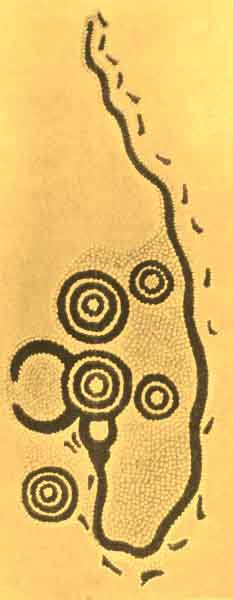
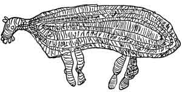
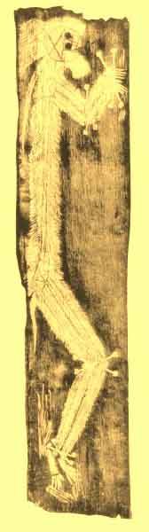

  
[Intangible Textual Heritage](../../index)  [Pacific](../index.md) 
[Index](index)  [Previous](om24)  [Next](om26.md) 

------------------------------------------------------------------------

p. 270

# CHAPTER I

### MYTHS OF ORIGINS AND THE DELUGE

MYTHS of the origin of the world are largely lacking in Australia as in
Melanesia. With few exceptions the existence of the earth and sky seems
to have been assumed, and apart from certain special mountains, rocks,
rivers, and other natural features, no account is given of their
origin. [1](om41.htm#fn_731.md) In a number of
cases, [2](om41.htm#fn_732.md) mainly in the
south-east of the continent, we find the general assertion that "all
things were made in the beginning by a deity or supernatural being"; but
in the absence of any specific myths it has been pointed out [3](om41.htm#fn_733.md) that these statements may not
necessarily mean all that seems to be implied. Had we anything more in
the way of information than these brief statements of early missionaries
and others, it is probable that the real belief would be found to be
that only certain special features of the landscape were regarded as
having been so made. In one case--the Arunta of central Australia--the
belief in an original sea appears; and according to this account, [4](om41.htm#fn_734.md) in the beginning the world was
covered with salt water, though gradually the sea was withdrawn by the
people living to the north, and thus the land appeared.

Although native speculation as to the beginning of the world seems
undeveloped, the same cannot be said with regard to the origin of
mankind, for on that point there are many different beliefs. The myths
relating to this topic may be divided into three groups, according as
they ascribe to man (*a*) a wholly independent origin, (*b*) an
independent origin as incomplete beings, who are then finished or
completed; or (*c*) describe a definite making or creation by some
deity. The

 

 

PLATE XXII

Ground-painting, made with coloured sands, representing a mythical
snake, which is shown descending into a hole in the ground. The other
series of concentric circles stand for trees and bushes; the footprints
are those of a man who followed the snake. The paintings are used in
connexion with ceremonials of the snake-totem clan. Australia. After
Spencer and Gillen, *Northern Tribes of Central Australia*, p. 740, Fig.
312.

 

p. 271

first of these types seems to be mainly restricted to a series of tribes
stretching from Lake Eyre northward through the central section of the
country to the Gulf of Carpentaria. [5](om41.htm#fn_735.md) Among all these tribes the
belief is held that the totem ancestors of the various clans "came up
out of the ground," some being in human and some in animal shapes. They
travelled about the country, usually leaving offspring here and there by
unions with women of the people (of whose origin nothing is said) whom
they either met or made; and ultimately journeyed away beyond the
confines of the territory known to the particular tribe, or went down
into the ground again, or became transformed into a rock, tree, or some
other natural feature of the landscape. These spots then became centres
from which spirit individuals, representing these ancestors, issued to
be reincarnated in human beings. Strictly speaking, although in some
instances they begat direct descendants, these totemic ancestors should
perhaps not be regarded as human creatures, for often they were
themselves the fashioners of men from the incomplete forms in which they
originated. As an example of the myths of this type (which are usually
very trivial), we may take one from the Kaitish tribe. [6](om41.htm#fn_736.md) In the past a Euro man arose out
of the ground as a child, and was found by a woman belonging to the
Lizard clan, who gave it milk. Every day she went to gather berries for
her husband, who was a Wild Turkey man; and every day she gave milk to
the Euro child, who, when he grew larger, ran away and met a number of
Iguana Women, who tried to fight him with lightning. They could not
catch him, however; and so, after killing and eating them, he travelled
on and met a man from the Wren totem, whom he also killed. Then he
climbed a hill, scratching the sand with his fingers as he went, and
travelling on all fours, he came to the camp of some Rain women. They
offered him food, but he grew angry when they would not yield to all his
demands, refused to eat the food, and threw it away; whereupon the women
killed him, after which he went down into the ground.

p. 272

In general the myths of these beings seem to be independent in origin
and unrelated, and are mainly concerned with recounting the way in which
they taught certain ceremonies and customs to the people with whom they
came in contact in their wanderings; so that they present few details of
value for our purposes. Differing in some respects from these myths, yet
on the whole belonging to this class, is the account given by one of the
tribes from Victoria, [7](om41.htm#fn_737.md)
according to whom the first man originated from the gum of the
wattle-tree, and issuing from a knot upon its trunk, entered into the
body of a woman and was born as a male child.

The second class of tales relates more directly to the origin of human
beings. Myths of this type are apparently confined to the series of
tribes just mentioned as having legends of the first category, but in
this instance the area seems to extend as far as Tasmania. As an
illustration we may take the version given by the Arunta. [8](om41.htm#fn_738.md) At the time of the retreat of
the original sea to the northward there were in the western sky two
beings who were self-existing and of whose origin nothing is stated.
From their lofty position they saw far to the east a number of
Inapertwa, "rudimentary human beings or incomplete men, whom it was
their mission to make into men and women." These Inapertwa were of
various shapes and lived along the edges of the sea. "They had no
distinct limbs or organs of sight, hearing or smell, and did not eat
food, and presented the appearance of human beings all doubled up into a
rounded mass in which just the outline of the different parts of the
body could be vaguely seen." The two sky-beings came down, therefore,
from the sky and armed with large stone knives, set to work to make
these amorphous objects into men. "First of all the arms were released,
then the fingers were added by making four clefts at the end of each
arm; then legs and toes were added in the same way. The figure could now
stand, and after this the nose was added and the nostrils bored with the
fingers. A cut with the knife made the

p. 273

mouth. . . . A slit on each side separated the upper and lower eyelids,
hidden behind which the eyes were already present, another stroke or two
completed the body and thus, out of the *Inapertwa*, men and women were
formed." Closely similar tales are told by many other tribes of the
central area [9](om41.htm#fn_739.md) and the
south-east, [10](om41.htm#fn_740.md) as well as in
Tasmania. [11](om41.htm#fn_741.md)

Myths of the third type are, on the other hand, characteristic of the
south-easterly portion of the continent. Although in many cases [12](om41.htm#fn_742.md) there are no detailed stories
of the creation of mankind, the statement being merely that the first
men were created, more definite myths do occur. Thus, the tribes in the
vicinity of Melbourne say [13](om41.htm#fn_743.md)
that in the beginning Pundjel made two males from clay. "With his big
knife he cut three large sheets of bark. On one of these he placed a
quantity of clay, and worked it into a proper consistence with his
knife. When the clay was soft, he carried a portion to one of the other
pieces of bark, and he commenced to form the clay into a man, beginning
at the feet; then he made the legs, then he formed the trunk and the
arms and the head. He made a man on each of the two pieces of bark. He
was well pleased with his work, and looked at the men a long time, and
he danced round about them. He next took stringybark from a tree, . . .
made hair of it, and placed it on their heads--on one straight hair and
on the other curled hair. Pundjel again looked at his work, much pleased
. . . and once more he danced round about them. . . . After again
smoothing with his hands their bodies, from the feet upwards to their
heads, he lay upon each of them, and blew his breath into their mouths,
into their noses, and into their navels; and breathing very hard, they
stirred. He danced round about them a third time. He then made them
speak, and caused them to get up, and they rose up, and appeared as full
grown young men." Some of the Queensland tribes declare [14](om41.htm#fn_744.md) that the moon created the first
man and woman, the former being made from stone and rubbed all over with
white and black ashes, while the latter was shaped

p. 274

from a box-tree and rendered soft and supple by rubbing with yams and
mud. In South Australia, [15](om41.htm#fn_745.md)
on the other hand, there is apparently a belief in the creation of men
from excrement which was moulded and then tickled, this causing the
image to laugh and become alive.

Another tale from Victoria records the origin of woman as follows. [16](om41.htm#fn_746.md) One day Pallyan, the brother
(or son?) of Pundjel, the maker of man, was playing in a deep water-hole
and in so doing he thumped and thrashed the water with his hands until
it became thick and muddy. At length he saw something, and parting the
mass with a branch, he discovered hands and then two heads, and at last
extricated two female forms, which were the first women and were given
as wives to the two men whom Pundjel had already made. An origin of
mankind from the sky is given by one of the tribes of the Northern
Territory, [17](om41.htm#fn_747.md) who state that
Atnatu, a self-created deity in the heavens, being angry at some of his
children, threw them down to earth through a hole in the sky, and that
these became the ancestors of the tribe. The dispersion of mankind was
explained as follows by these same tribes. After men had multiplied,
they became wicked; and thereupon Pundjel, coming down in anger from the
skies, whither he and Pallyan had been carried by a whirlwind shortly
after they had made the first human beings, with a great knife cut the
people into small bits which moved and crawled about like worms. Then a
great wind arose and scattered the pieces like flakes of snow far and
wide over the world; and wherever they fell, they developed again into
men and women. [18](om41.htm#fn_748.md) Although
presenting some obvious features of missionary influence, the tale
probably contains a nucleus of aboriginal thought.

Myths of the origin of the sun fall into two contrasted groups.
According to the tribes of the South-East, the sun was made by throwing
an emu's egg into the sky; and as told by the Euahlayi, the story runs
as follows. [19](om41.htm#fn_749.md) In the
beginning there was no sun, only the moon and the stars;

p. 275

but one day Dinewan, the emu, and Bralgah, the native companion,
quarrelled and fought. In rage the latter ran to the nest of Dinewan,
took one of the large eggs, and threw it with all her strength into the
sky, where it broke upon a pile of firewood which was there and which
immediately burst into flame. This greatly astonished the beings in this
world, who had been used to semi-darkness, and consequently almost
blinded them; but the deity in the sky, seeing how fine a thing this
fire was in the world, determined to have it lit every day and has done
so ever since. Each night he and his assistants gather wood and pile it
up and then send the morning star to, inform people that the fire will
soon be lit. Since, however, the sky-deity found this notification
insufficient, as those who slept did not see the star, he ordered a
bird, the Gourgourgahgah, to laugh every dawn as soon as the morning
star paled and thus wake up the world; and the bird has done so ever
since. Similar tales are told in every portion of this region. [20](om41.htm#fn_750.md)

Another series of myths from the eastern and north-eastern parts of the
continent describe the sun as a woman. Among the Arunta and related
tribes of central Australia, [21](om41.htm#fn_751.md) she, like many of the original
totem ancestors, arose out of the ground, and later, carrying a
fire-brand, ascended to the sky, though every night she descends into
the earth, again to emerge in the morning. In some instances there are
said to be several suns, who go up into the sky in turn. [22](om41.htm#fn_752.md) Among the Narrinyeri of South
Australia [23](om41.htm#fn_753.md) the sun is also
considered to be a woman, who nightly visits the land of the dead,
although nothing is said of her origin. "As she approaches, the men
assemble and divide into two bodies, leaving a row for her to pass
between. them. They invite her to stay with them, which she can do only
for a short time, as she must be ready for her journey the next day. For
favours granted to some one among them, she receives a present of a red
kangaroo skin, and therefore in the morning, when she rises, appears in
her red dress."

p. 276

In Queensland [24](om41.htm#fn_754.md) the sun (a
woman) was made by the moon, and although given but two legs in the
common manner of mankind, was provided with many arms, which may be seen
extending like rays when she rises and sets. Some of the Victoria tribes
say that in the beginning the sun did not set, but since people grew
weary of the continual day, at length the creator deity ordered the sun
to set, and thus day and night originated. [25](om41.htm#fn_755.md)

In regard to the moon two classes of tales are also found. According to
the Arunta of central Australia, [26](om41.htm#fn_756.md) in the mythological period a
man of the Opossum totem carried the moon about with him in a shield,
keeping it hidden in a cleft in the rocks all day long. One night,
however, another man of the Grass Seed totem chanced to see a light
shining on the ground, this being the moon lying in the man's shield;
whereupon the Grass-Seed man at once picked up the shield with the moon
in it and ran away. The Opossum man, discovering his loss, gave chase,
but being unable to catch the thief, he called out to the moon to rise
into the sky and give every one light during the night; and the moon
accordingly went up into the sky, where it has remained ever since [27](om41.htm#fn_757.md)

Elsewhere the moon is regarded as a man who rose into the sky. In
Queensland it is said [28](om41.htm#fn_758.md)
that once two Sparrow-Hawk brothers were out hunting for honey, and that
one of them in trying to extract a comb from a hollow tree in which he
had made a hole, caught his arm and could not get it out. His brother
went to get aid, but all whom he asked to help refused, except the moon.
The latter, however, went willingly, climbed the tree, and putting his
head well down into the hollow, sneezed violently, the resultant sudden
pressure of the air enabling the captive to withdraw his arm. The
Sparrow-Hawk determined to be revenged on those who had denied him aid;
and so, first burying the moon in the ground to get him out of harm's
way, he set fire to the grass, intending to burn up the whole camp.
Since, however, some persons were

p. 277

not destroyed, he started another blaze, this time putting the moon into
the top of a tall tree; but again some of his victims escaped, and
accordingly, having this time placed the moon high in the sky, he
kindled a third conflagration and finally succeeded in destroying all
his enemies.

Quite a different tale, embodying several incidents valuable for
comparative purposes, is found in New South Wales. [29](om41.htm#fn_759.md) According to this, the moon was
an old man, very corpulent and very lazy, who lived with two young men
who were his relatives. They aided him and did most of the hunting, but
since he treated them very badly, taking for himself all the choice
portions of meat and giving them only what was left, after a while they
decided that they could no longer stand this and determined to leave. In
camp they were accustomed to sit or lie behind him, and as he could not
easily turn over, he used from time to time to call to them to see if
they were there. When their plans were ready they started off secretly
instructing some rubbish, which they left behind them, to answer for
them if the old man should call. [30](om41.htm#fn_760.md) After they had travelled some
distance, they were fortunate enough to kill an emu, and taking the bird
with them to a large flat rock, they prepared to cook and eat it; but
when the food was about ready, they remembered that emu flesh was still
tabu to them as young men and that they could not have it until they
received some at the hands of an older man. They therefore determined to
use a stratagem and accordingly called out to the old man, who thus for
the first time realized their absence. He hastened toward them, but
before he arrived, they caused the rock on which they were to grow tall,
so that he could not reach them. When he had come, they showed him the
emu, and he at once demanded that they throw some of the meat to him,
whereupon they tossed down a piece of the fat, which he, not liking,
hurled back at them; and thus the tabu was broken, for they had received
emu flesh at his hands. Since he was desirous of ascending to them, they
told him to get a sapling

p. 278

and lean it against the rock so that he might climb; but while he had
gone to fetch it, they caused the rock to grow still higher, so that his
pole was not sufficiently long to reach the top. Accordingly he went
again, and this time bringing a stick which was long enough, he started
to, climb up carrying his two dogs with him. His hands, however, were
greasy from handling the emu fat, and when he was near the top, the two
boys twisted and shook the stick so that Gina, the old man, lost his
hold and fell to the ground, his two dogs being killed, and his back so
injured that he had to walk much bent over. For this reason the new moon
has a bent back when it appears each month. [31](om41.htm#fn_761.md)

In central Australia the Arunta say [32](om41.htm#fn_762.md) that in the beginning a man of
the Opossum clan died and was buried, but shortly afterward came to life
again as a boy. The people saw him rising and ran away in fear, but he
followed them, saying, "Do not be frightened! Do not run away, or you
will die altogether. I shall die, but shall rise again in the sky." He
later grew up to be a man and then died once more, reappearing as the
moon, and has ever since continued to die periodically and come to life
again; but the people who ran away died altogether.

The northern tribes seem to have only a few myths relating to the moon.
The Warramunga [33](om41.htm#fn_763.md) however,
tell that the moon came up out of the ground as a man and was one day
walking about when he saw the tracks of a woman. Following these and
finally catching sight of her, he called out, whereupon she replied; and
when he then shouted, "Don't talk so far away! I want to have you come
near," she came to him, and they sat talking. Meanwhile two hawks had
discovered the art of making fire, but unfortunately they lost control
of it, and thus started a conflagration. The woman, seeing the flames
approaching, said, "Look out, the fire is close up now"; but the
moon-man answered, "No hurry, it is quite a long way off yet." They
were, however, suddenly surrounded by it, and the woman was badly
burned, whereupon the man cut open one

p. 279

of his veins, drew some blood, and sprinkled it over the woman, who was
thus restored to life. Then both of them went up into the sky. [34](om41.htm#fn_764.md)

Several accounts are given of the origin of the sea or of lakes and
waters; and in parts of the south-east of the continent a tale is found
which recalls a type widely spread in Melanesia. [35](om41.htm#fn_765.md) Thus, in western Victoria it is
said [36](om41.htm#fn_766.md) that originally
water was kept concealed under a stone. Some birds, however, spied upon
the jealous owner, thus discovering where the precious substance was
hid; and in the man's absence one day they removed the stone which
covered the opening, so that the water immediately flowed out and became
a great lake. [37](om41.htm#fn_767.md) The
east-coast tribes have quite a different story. According to this, [38](om41.htm#fn_768.md) once upon a time there was no
water, for a great frog had swallowed it all. At this the people were
much distressed, and holding a council to determine what to do, they
agreed that if only the frog could be made to laugh, he would disgorge
the water. [39](om41.htm#fn_769.md) Accordingly
several animals danced before him in ludicrous postures, but in vain,
for the frog remained as solemn as before. Finally the eel tried, and at
his wriggling and writhing the frog first smiled and then laughed; and
as he opened his mouth, the waters burst forth and caused a great flood
by which many were drowned. [40](om41.htm#fn_770.md) The few survivors, comprising
two or three men and one woman, took refuge on a small island; and by
and by a pelican, coming along in his canoe, carried the men to the
mainland, one by one, leaving the woman until the last, because he
wanted her for a wife. She, however, was frightened, and wrapping a log
in her skin rug to look as though she were sleeping, she swam away to
the shore. When the pelican returned, he called to her, but got no
reply; so he came and kicked the skin rug, and finding that it had only
a log within it and that he had been tricked, he was very angry. Now at
that time all pelicans were black, and accordingly he began to paint
himself with pipe-clay before going to fight those whom he had saved;

p. 280

but just as he was half painted, another pelican came by, and not
knowing what such a queer looking thing was, struck him with his beak
and killed him. Since that day all pelicans have been part black and
part white.

Several other myths of a deluge or great flood have been recorded. Thus,
according to one account, [41](om41.htm#fn_771.md)
a party of men were once fishing in a lake, when one man baited his hook
with a piece of flesh and soon felt a tremendous bite. Hauling in his
line, he found that he had caught a young *bunyip*, a

 

 

FIG. 3. NATIVE DRAWING OF A "BUNYIP"

This drawing was made by a Murray River aboriginal in 1848. The *bunyip*
is a mythical animal, living in deep pools or streams, and attacking
men, whom it eats. It was greatly feared by the natives. After Brough
Smyth, *The Aborigines of Victoria*, i. 437, Fig. 245.

 

water monster of which the people were much afraid; but though his
companions begged him to let it go, because the water monsters would be
angry if it were killed, he refused to listen to them and started to
carry the young *bunyip* away. The mother, however, flew into a great
rage and caused the waters of the lake to rise and follow the man who
had dared to rob her of her young. The deluge mounted higher and higher,
until all the country was covered, and the people, fleeing in terror,
took refuge upon a high hill; but as the flood increased, gradually
surmounting it and touching the people's feet, they were all turned into
black swans and have remained so ever since.

p. 281

Myths of the origin of fire are generally known and of several different
types. Most widely spread, apparently, are tales which declare fire to
have been originally owned by certain birds or animals from whom the
secret was then stolen. The version of one of the Victorian (?) tribes
runs as follows. [42](om41.htm#fn_772.md) The
bandicoot was once the sole owner of fire, and cherishing his
fire-brand, which he carried with him wherever he went, he obstinately
refused to share the flame with any one else. Accordingly the other
animals held a council and determined to get fire either by force or by
stratagem, deputing the hawk and the pigeon to carry out their purpose.
The latter, waiting for a favourable moment when he thought to find it
unguarded, made a dash for it; but the bandicoot saw him in time, and
seizing the brand, he hurled it toward the river to quench it. The sharp
eyes of the hawk saw it falling, and swooping down, with his wing he
knocked it into the long dry grass, which was thus set alight so that
the flames spread far and wide, and all people were able to procure
fire. A New South Wales version is somewhat different. [43](om41.htm#fn_773.md) According to this, fire was
originally owned by two women (Kangaroo-Rat and Bronze-Winged Pigeon)
who kept it concealed in a nutshell. For a long time the other animals
could not discover how these women were able to cook their food; but at
last they set spies to watch them and so learned the secret, whereupon,
resolving to secure fire by a ruse, they arranged a dance and invited
the two women to be present. One after another the different animals
danced in ludicrous positions in an attempt to make the women laugh; and
at length one performer succeeded so that the women, convulsed with
merriment, rolled upon the ground. This was just what the conspirators
had been waiting for, and rushing up, they seized the bag in which was
the nut that contained the fire. Opening this and scattering the flame
about, they set the grass alight, and in this way fire was caught in the
trees, whence ever since it can be procured from their wood by means of
friction. [44](om41.htm#fn_774.md)

p. 282

A different mode of origin is found in another series of tales which is
also wide-spread; and in some instances this second type is combined
with the first. Thus, a tribe in the vicinity of Melbourne say [45](om41.htm#fn_775.md) that once two women were
cutting a tree to get ants' nests when they were attacked by snakes. The
women fought them for some time, but at last one of them broke her
fighting stick, whereupon fire came out of the end of it, and the crow,
seizing this, flew away with it. Pursued by two men, it let the fire
fall, thus starting a conflagration. These two men were set by Pundjel
in the sky as stars, and he told all the people to be careful not to
lose fire, now that they had it; but after a time they let it go out,
and mankind was again fireless, while snakes became abundant everywhere.
At length Pallyang sent his sister Karakarook down from the sky to guard
the women, and she went about everywhere with a great stick, killing
snakes; but in dispatching one, her stick broke and fire came from it.
The crow once more seized this and flew away with it, but the two men
who had followed him before descended from the sky, and going to the
high mountain where the crow had hidden the fire, brought it back again
safely to mankind. Karakarook, the sister, had told the women to examine
carefully her broken stick from which the fire had come and never to
lose the secret; but since this was not enough, one of those who had
rescued the fire from the crow took the men to a mountain where grew the
proper sort of wood to make fire-sticks, and showed them how to
manufacture and use them, so that ever afterward they should have fire
whenever they needed it.

A somewhat different element appears in another small group of tales.
The Arunta in central Australia say [46](om41.htm#fn_776.md) that in mythical times a euro
carried fire in its body. A man pursued the animal in the hopes of
getting possession of the precious object, but for a long time he was
unable to catch up with the euro, and although he tried to make fire
with fire-sticks, he did not succeed. After many days, however, he
finally caught

p. 283

the animal and killed it, and on examining the body, found fire
concealed within. This he took and used to cook his food; and when the
fire went out, he tried again to make it with his fire-sticks, and now
was successful. A variant of this type is found in Queensland [47](om41.htm#fn_777.md) where fire was originally
thought to have been contained in the body of a snake. As in the case of
some of the tales of the origin of water and the sea, the other animals
decided that the only way to get what they wanted was to make the
possessor laugh; and when a bird succeeded in doing this by its comical
gyrations, the fire issued from the snake's mouth, thus becoming the
common property of all. The belief that fire was primarily contained in
the body of its owner is one widely distributed both in Melanesia [48](om41.htm#fn_778.md) and in Polynesia. [49](om41.htm#fn_779.md)

That fire was originally obtained from the sky is also an idea found in
Australia. Thus, one of the tribes from Victoria declares [50](om41.htm#fn_780.md) that a man threw a spear upward
to the sky, into which it stuck; but since he had tied a string to the
spear, he was able to climb up to the sun and to bring fire down to men.
In Queensland [51](om41.htm#fn_781.md) the details
differ. In the beginning there was no fire on earth, and so the wren
volunteered to fly up to the sky to get some; but though he succeeded in
his quest, he hid the fire under his tail-feathers in order that others
might not get the benefit of his discovery. When he returned and was
asked how he had fared, he replied that he had failed in his attempt;
but as he suggested the advisability of attempting to get fire from
different sorts of wood, other people tried, only to make their hands
sore and to abandon the task in disgust. Turning around suddenly,
however, one of them burst out laughing, for he saw the fire as a red
spot on the tail of the deceitful wren. The latter then admitted that he
had been successful, and showed the people how to make fire properly;
but ever since he has had a red spot on his tail-feathers.

Still another form of legend of the origin of fire, in which the method
of making is discovered by accident or is invented,

p. 284

is shown in a myth from New South Wales. [52](om41.htm#fn_782.md) Once there was no fire in the
world, and all people had to eat their food raw or dried in the sun; but
one day, when the crane, Bootoolgah, was rubbing two pieces of wood
together, he saw a faint spark and a slight smoke, whereupon he called
out to Goonur, the kangaroo-rat, "See, smoke comes when I rub these
pieces of wood! Would it not be fine, if we could make fire for
ourselves and cook our food without waiting for the sun to dry it?"
"Yes," said his wife, "it would indeed be good. Split your stick and put
dried grass in the cleft, so that even one spark may kindle it." He did
so, and behold! after much rubbing, there came a tiny flame. Though they
had now discovered the art of making fire, they resolved to keep it
secret; and accordingly, the next time that fish were caught, the two
took theirs aside and cooked them. When they brought them back to camp,
the other people saw that they looked and tasted differently, and asked
what they had done to them; at which the two declared that they had only
dried them in the sun as always. The others, however, did not believe
this; so they spied and at last discovered the secret. It was then
resolved to steal the fire, and this was accomplished, as already stated
in previous tales, by making the stingy owners laugh and then seizing
the precious receptacle containing fire while they were still overcome
with merriment. A variant occurs in Queensland. [53](om41.htm#fn_783.md) In the beginning fire and its
uses were accidentally discovered by lightning setting fire to the dry
grass and thus partly roasting a kangaroo which had been killed. A woman
was sent to get a fire-brand, of which she was put in charge to see that
the fire should never go out; but one day it was extinguished through
her carelessness, and to punish her for her negligence she was sent out
to find fire again and bring it back. Her search was fruitless, however,
and in her anger at failure she took two sticks and rubbed them together
until fire was produced, the secret of its making thus being found [54](om41.htm#fn_784.md)

One of the very few myth fragments from Tasmania relates

 

 

PLATE XXIII

Native drawing of a sort of ghoulish spirit called Auuenau. They are
thought to be very thin and hairy. From their wrists, elbows, knees,
etc., hang human bones taken from the dead, whom they seek to devour.
The tail-like appendage is supposed to be the summer lightning, which is
a sign of their presence. Geimbio tribe, Northern Territory, Australia.
After Spencer, Native Tribes of the Northern Territory of Australia,
Fig. 80.

 

p. 285

to the origin of fire. According to this, [55](om41.htm#fn_785.md) two men once appeared standing
on the top of a hill, whence they threw fire like a star, which fell
among the people and frightened them so that they ran away. Apparently
this started a conflagration, and on their return the people were able
to get the fire which they had previously lacked. [56](om41.htm#fn_786.md)

One account of the origin of death has already been cited, [57](om41.htm#fn_787.md) but another version from New
South Wales [58](om41.htm#fn_788.md) may be given
for comparison. Baloo, the moon, one night seeing some men fording a
stream, called out to them to stop and carry his dogs (which were really
snakes) across for him. They, however, were afraid of these creatures,
for sometimes they bit and killed men when he brought them to earth; and
for this reason they refused to do what they had been asked, saying, "We
are too frightened. Your dogs might bite us." Then Baloo replied, "If
you do what I ask you, when you die you shall come to life again; not
die, and stay always where you are put, when you are dead. See this
piece of bark? I throw it into the water, it comes to the top again and.
floats. That is what would happen to you, if you would do what I ask
you. First down when you die, and then up again. If you will not take my
dogs over, you will die like this." Thereupon he threw a stone into the
water, and as it sank to the bottom, he said, "If you will not do as I
tell you, you will be like that stone." But the men answered, "We cannot
do it. We are too frightened of your dogs." So Baloo came down with his
dogs and himself carried them over to show how harmless they were; and
then he picked up a stone and threw it into the stream, saying, "Now as
you would not do what I ask you to, you have forever lost the chance of
rising again after you die--now you will only be black-fellows while you
live, and bones when you are dead."

From a consideration of the cosmogonic myths of Australia here outlined
it would appear that a number of conclusions are justified. It has
already been pointed out that a broad

p. 286

distinction may be drawn on linguistic grounds between the northern and
central tribes on the one hand and those of the remainder of Australia
on the other. Unfortunately, we have no myth material from western
Australia, so that nothing can be said of its relations to the remainder
of the continent. It is fairly clear, however, that the linguistic
divergencies between the northern and central portions as contrasted
with the southern and eastern districts are paralleled by differences in
mythology. In the former region we find scarcely a trace of any myths of
the source of the world or of a creator deity. The origin of mankind is
either a coming up out of the ground or a spontaneous beginning as
embryonic or amorphous beings, who are made human by one or another
group of totem ancestors. The sun and moon are regarded as persons who,
like other early mythical beings, emerged from the ground and later
ascended to the sky, and knowledge of fire is said to have been taught
to the ancestors in the underworld. [59](om41.htm#fn_789.md) In the southern and eastern
portions of the continent we find, on the other hand, more or less
definite tales of a creator-being and of a creation, together with myths
of the origin of mankind. Here the sun is often regarded as an actual
fire kindled by an egg cast into space; here the sea (or water) is said
to have been in the beginning either concealed or swallowed; and here a
variety of origins are given for fire, its ownership by, and theft from,
animals or birds being perhaps the most characteristic. Comparison with
adjacent areas leads to rather contradictory results. In some
particulars the northern and central type shows relationship to the
largely hypothetical Papuan stratum in Melanesia, although some of its
most characteristic elements, such as the origin of man from embryonic
beings, have thus far not been reported from the Melanesian area. [60](om41.htm#fn_790.md) On the other hand, the
southern, and eastern type reveals points of similarity with the
Melanesian stratum in Melanesia, although from the geographical
standpoint, and known historical relations this would hardly be

p. 287

expected. On the basis of the cosmogonic myths alone these suggested
resemblances are uncertain at the best; and we may, therefore, turn to
the remainder of the mythology and see whether the same cleavage and the
same affiliations occur there also.

------------------------------------------------------------------------

[Next: Chapter II. Animal and Miscellaneous Tales](om26.md)
