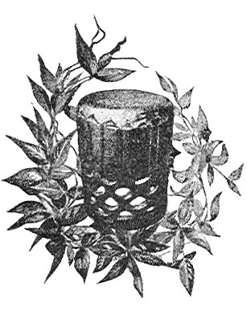

  
[Intangible Textual Heritage](../../index)  [Pacific](../index) 
[Index](index)  [Next](ulh01) 

------------------------------------------------------------------------

[Buy this Book at
Amazon.com](https://www.amazon.com/exec/obidos/ASIN/B0024FAH3E/internetsacredte)

------------------------------------------------------------------------

  
*Unwritten Literature of Hawaii*, by Nathaniel B. Emerson, \[1909\], at
Intangible Textual Heritage

------------------------------------------------------------------------

  [  
Click to enlarge](img/pl01.jpg)  
FEMALE DANCING IN HULA COSTUME  

# UNWRITTEN LITERATURE OF HAWAII

#### The Sacred Songs of the Hula

###### collected and translated, with notes and an account of the Hula

## by Nathaniel B. Emerson, A.M., M.D.

#### Smithsonian Institution

#### Bulletin of the Bureau of American Ethnology, no. 38

 

#### Washington, D.C.

#### Government Printing Office

#### \[1909\]

  [  
Click to enlarge](img/title.jpg)  
Title Page  

Scanned, proofed and formatted at Intangible Textual Heritage by John
Bruno Hare, February 2003 and May 2005. This text is in the public
domain in the United States because it was published prior to 1923

------------------------------------------------------------------------

[Next: Prefatory Note](ulh01)
