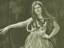

  
[Intangible Textual Heritage](../../index)  [Pacific](../index.md) 
[Index](index)  [Previous](ulh12)  [Next](ulh14.md) 

------------------------------------------------------------------------

[Buy this Book at
Amazon.com](https://www.amazon.com/exec/obidos/ASIN/B0024FAH3E/internetsacredte.md)

------------------------------------------------------------------------

  
*Unwritten Literature of Hawaii*, by Nathaniel B. Emerson, \[1909\], at
Intangible Textual Heritage

------------------------------------------------------------------------

p. 57

# IX.--THE HULA ALA'A-PAPA

Every formal hula was regarded by the people of the olden time as a
sacred and religious performance (*tabu*); but all hulas were not held
to be of equal dignity and rank (*hanohano*). Among those deemed to be
of the noblest rank and honor was the *ala’a-papa*. In its best days
this was a stately and dignified performance, comparable to the
old-fashioned courtly minuet.

We shall observe in this hula the division of the performers into two
sets, the *hoopa’a* and the *olapa*. Attention will naturally bestow
itself first on the olapa, a division of the company made up of splendid
youthful figures, young men, girls, and women in the prime of life. They
stand a little apart and in advance of the others, the right hand
extended, the left resting upon the hip, from which hangs in swelling
folds the pa-ú. The time of their waiting for the signal to begin the
dance gives the eye opportunity to make deliberate survey of the forms
that stand before us.

The figures of the men are more finely proportioned, more statuesque,
more worthy of preservation in marble or bronze than those of the women.
Only at rare intervals does one find among this branch of the Polynesian
race a female shape which from crown to sole will satisfy the canons of
proportion--which one carries in the eye. That is not to say, however,
that the artistic eye will not often meet a shape that appeals to the
sense of grace and beauty. The springtime of Hawaiian womanly beauty
hastes away too soon. Would it were possible to stay that fleeting
period which ushers in full womanhood!

One finds himself asking the question to what extent the responsibility
for this overthickness of leg and ankle exaggerated in appearance, no
doubt, by the ruffled anklets often worn--this pronounced tendency to
the growth of that degenerate weed, fat, is to be explained by the
standard of beauty which held sway in Hawaii's courts and for many ages
acted as a principle of selection in the physical molding of the
Hawaiian female.

The prevailing type of physique among the Hawaiians, even more marked in
the women than in the men, is the short and thick, as opposed to the
graceful and slender. One does occasionally find delicacy of modeling in
the young and immature; but with adolescence fatness too often comes to
blur the outline.

The hoopa’a, who act as instrumentalists, very naturally maintain a
position between sitting and kneeling, the better to enable them to

p. 58

handle that strangely effective drumlike instrument, the *ipu*, the one
musical instrument used as an accompaniment in this hula. The, ipu is
made from the bodies of two large, pear-shaped calabashes of unequal
sizes, which are joined together at their smaller ends in such a manner
as to resemble a figure-of-eight. An opening is left at the top of the
smaller calabash to increase the resonance. In moments of calm the
musicians allow the body to rest upon the heels: as the action warms
they lift themselves to such height as the bended knee will permit.

The ala’a-papa is a hula of comparatively moderate action. While the
olapa employ hands, feet, and body in gesture and pose to illustrate the
meaning and emotion of the song, the musicians mark the time by lifting
and patting with the right hand the ipu each holds in the left hand. If
the action of the play runs strong and stirs the emotions, each hoopa’a
lifts his ipu wildly, fiercely smites it, then drops it on the padded
rest in such manner as to bring out its deep mysterious tone.

At a signal from the kumu, who sits with the hoopa’a, the *poo-pua’a*,
leader of the olapa, calls the mele (*kahea i ka mele*)--that is, he
begins its recitation--in a tone differing but little from that of
ordinary conversation, a sing-song recitation, a vocalization less
stilted and less punctilious than that usually employed in the utterance
of the oli or mele. The kumu, the leader of the company, now joins in,
mouthing his words in full observance of the mele style. His manner of
cantillation may be either what may he called the low relief, termed
*ko’i-honua*, or a pompous alto-relievo style, termed *ai-ha’a*. This is
the signal for the whole company to chime in, in the same style as the
kumu. The result, as it seems to the untutored ear, is a confusion of
sounds like that of the many-tongued roar of the ocean.

The songs cantillated for the hula ala’a-papa were many and of great
variety. It seems to have been the practice for the kumu. to arrange a
number of mele, or poetical pieces, for presentation in the hula in such
order as pleased him. These different mele, thus arranged, were called
*pale*, compartments, or *mahele*, divisions, as if they were integral
parts of one whole, while in reality their relation to one another was
only that of the juxtaposition imposed upon them by the kumu.

The poetical pieces first to be presented were communicated to the
author as *mahele*, divisions--hardly cantos--in the sense above
defined. They are. however, distinct poems, though there chances to run
through them all a somewhat similar motive. The origin of many of these
is referred to a past so remote that tradition assigns them to what the
Hawaiians call the *wa po*, the night of tradition, or they say of them,
*no ke akua mai*, they are from the gods. It matters not

p. 59

how faithful has been the effort to translate these poems, they will not
be found easy of comprehension. The local allusions, the point of view,
the atmosphere that were in the mind of the savage are not in our minds
to-day, and will not again be in any mind on earth; they defy our best
efforts at reproduction. To conjure up the ghostly semblance of these
dead impalpable things and make them live again is a problem that must
be solved by each one with such aid from the divining rod of the
imagination as the reader can summon to his help.

Now for the play, the song:

*Mele no ka Hula Alá’a-papa*

MAHELE-HELE I

PAUKU I

A Koolau wau, ike i ka ua,  
E ko-kolo la-lepo ana ka ua,  
E ka’i ku ana, ka’i mai ana ka ua,  
E nu mai ana ka ua i ke kuahiwi,  
5 E po’i ana ka ua me he nalu la.  
E puka, a puka mai ka ua la.  
Waliwali ke one i ka hehi’a e ka ua;  
Ua holo-wai na kaha-wai;  
Ua ko-ká wale na pali.  
10 Aia ka wai la i ka ilina, [a](#fn_125.md) he
ilio,  
He ilio hae, ke nahu nei e puka.

\[Translation\]

*Song for the Hula Alá’a-papa*.

CANTO I

STANZA 1

’Twas in Koolau I met with the rain:  
It comes with lifting and tossing of dust,  
Advancing in columns, dashing along.  
The rain, it sighs in the forest;  
5 The rain, it beats and whelms, like the surf;  
It smites, it smites now the land.  
Pasty the earth from the stamping rain;  
Full run the streams, a rushing flood;  
The mountain walls leap with the rain.  
10 See the water climbing its bounds like a dog,  
A raging dog, gnawing its way to pass out.

This song is from the story of Hiiaka on her journey to Kauai to bring
the handsome prince, Lohiau, to Pele. The region is that on the
windward, *Koolau*, side of Oahu.

p. 60

PAUKU 2

Hoopono oe, he aina kai Waialua i ka hau;  
Ke olelo [a](#fn_126.md) wale no la i ka lani.  
Lohe ka uka o ka pehu i Ku-kani-loko. [b](#fn_127.md)  
I-loko, i-waho kaua la, e ka hoa,  
5 I kahi e pau ai o ka oni?  
Oni ana i ka manawa o ka lili,  
Pee oe, pee ana iloko o ka hilahila.  
I hilahila wale ia no e oe;  
Nou no ka hale, [c](#fn_128.md) komo mai maloko.

The lines from the fourth to the ninth in this stanza (*pauku*)
represent a dialogue between two lovers.

\[Translation\]

STANZA 2

Look now, Waialua, land clothed with ocean-mist--  
Its wilderness-cries heaven's ear only hears,  
The wilderness-gods of Ku-kani-loko.  
Within or without shall we stay, friend,  
5 Until we have stilled the motion?  
To toss is a sign of impatience.  
You hide, hiding as if from shame.  
I am bashful because of your presence:  
The house is yours, you've only to enter.

PAUKU 3

(Ko’i-honua)

Pakú Kea-au [d](#fn_129.md) lulu, Wai-akea; [e](#fn_130.md)  
Noho i ka la’i loa o Hana-kahi, [f](#fn_131.md)  
O Hilo, i olokea [g](#fn_132.md) ia, i au la, e, i
kai,  
O Lele-iwi, [h](#fn_133.md) o Maka-hana-loa. [i](#fn_134.md)  
5 Me he kaele-papa [j](#fn_135.md) la Hilo, i lalo
ka noho.  
Kaele [k](#fn_136.md) wale Hilo i ke alai ia e ka
ua.  
Oi ka niho o ka ua o Hilo i ka lani;  
Kua-wa’a-wa’a Hilo i eli ’a e ka wai;  
Kai-koo, haki na nalu, ka ua o Hilo;

p. 61

10 Ha’i lau-wili mai ka nahele.  
Nanalu, kahe waikahe o Wai-luku;  
Hohonu Waiau, [a](#fn_137.md) nalo ke poo o ka lae
o Moku-pane; [b](#fn_138.md)  
Wai ulaula o Wai-anue-nue; [c](#fn_139.md)  
Ka-wowo nui i ka wai o Kolo-pule-pule; [d](#fn_140.md)  
15 Halulu i ha-ku’i, ku me he uahi la  
Ka puá o ka wai ua o-aka i ka lani.  
Eleele Hilo e, pano e, i ka ua;  
Okakala ka hulu o Hilo i ke anu;  
Pili-kau [e](#fn_141.md) mai Hilo ia ua loa.  
20 Pali-ku laau ka uka o Haili, [f](#fn_142.md)  
Ka lae ohi’a e kope-kope,  
Me he aha moa la, ka pale pa laau,  
Ka nahele o Pa-ie-ie, [g](#fn_143.md)  
Ku’u po'e lehua iwaena konu o Mo-kau-lele; [h](#fn_144.md).  
25 Me ka ha’i laau i pu-kaula hala’i i ka ua.  
Ke nana ia la e la’i i Hanakahi.  
Oni aku Hilo, oni ku’u kai lipo-lipo,  
A Lele-iwi, ku’u kai ahu mimiki a ka Malua. [i](#fn_145.md)  
Lei kahiko, lei nalu ka poai.  
30 Nana Pu’u-eo, [j](#fn_146.md) e! makai ka
iwi-honua, [k](#fn_147.md) e!  
Puna-hoa la, ino, ku, ku wan a Wai-akea la.

\[Translation\]

STANZA 3

(With distinct utterance)

Kea-au shelters, Waiakea lies in the calm,  
The deep peace of King Hana-kahi.  
Hilo, of many diversions, swims in the ocean,  
’Tween Point Lele-iwi and Maka-hana-loa;  
5 And the village rests in the bowl,  
Its border surrounded with rain--  
Sharp from the sky the tooth of Hilo's rain.  
Trenched is the land, scooped out by the downpour--  
Tossed and like gnawing surf is Hilo's rain--  
10 Beach strewn with a tangle or thicket growth;  
A billowy freshet pours in Wailuku;  
Swoll’n is Wai-au, flooding the point Moku-pane;  
And red leaps the water of Anue-nue.  
A roar to heaven sends up Kolo-pule,

p. 62

15 Shaking like thunder, mist rising like smoke.  
The rain-cloud unfolds in the heavens;  
Dark grows Hilo, black with the rain.  
The skirt of Hilo grows rough from the cold;  
The storm-cloud hangs low o’er the land.  
20 A rampart stand the woods of Haili;  
Ohi’as thick-set must be brushed aside,  
To tear one's way, like a covey, of fowl,  
In the wilds of Pa-ie-ie--  
Lehua growths mine--heart of Mokau-lele.  
25 A breaking, a weaving of boughs, to shield from rain;  
A look enraptured on Hana-kahi,  
Sees Hilo astir, the blue ocean tossing  
Wind-thrown-spray--dear sea--’gainst Point Lele-iwi--  
A flute-worn foam-wreath to encircle its brow.  
30 Look, Pu’u-eo! guard ’gainst the earth-rib!  
It's Puna-hoa reef; halt!  
At Waiakea halt!

PAUKU 4

(Ai-ha' a)

Kua loloa Kea-au i ka nahele;  
Hala kua lulu-hulu Pana-ewa i ka laau;  
Inoino ka maha o ka ohia o La’a.  
Ua ku kepakepa ka maha o ka lehua;  
5 Ua po-po’o-hina i ka wela a ke Akua.  
Ua u-ahi Puna i ka oloka’a pohaku,  
I ka huna pa’a ia e ka wahine.  
Nanahu ahi ka papa o Olu-ea;  
Momoku ahi Puna hala i Apua;  
10 Ulu-á ka nahele me ka laau.  
Oloka’a kekahi ko’i e Papa-lau-ahi;  
I eli ’a kahi ko’i e Ku-lili-kaua.  
Kai-ahea a hala i Ka-li’u;  
A eu e, e ka La, ka malama-lama.  
15 O-na-naka ka piko o Hilo ua me ke one,  
I huli i uka la, i hulihia i kai;  
Ua wa-wahi ’a, ua na-ha-há,  
Ua he-hele-lei!

\[Translation\]

STANZA 4

(Bombastic style)

Ke’-au is a long strip of wildwood;  
Shag of pandamus mantles Pan’-ewa;  
Scraggy the branching of Laa's ohias;  
The lehua limbs at sixes and sevens--  
5 They are gray from the heat of the goddess. p.
63  
Puna smokes mid the bowling of rocks--  
Wood and rock the She-god heaps in confusion,  
The plain Oluea's one bed of live coals;  
Puna is strewn with fires clean to Apua,  
10 Thickets and tall trees a-blazing.  
Sweep on, oh fire-ax, thy flame-shooting flood!  
Smit by this ax is Ku-lili-kaua.  
It's a flood tide of lava clean to Kali’u,  
And the Sun, the light-giver, is conquered.  
15 The bones of wet Hilo rattle from drought;  
She turns for comfort to mountain, to sea.  
Fissured and broken, resolved into dust.

This poem is taken from the story of Hiiaka. On her return from the
journey to fetch Lohiau she found that her sister Pele had treacherously
ravaged with fire Puna, the district that contained her own dear
woodlands. The description given in the poem is of the resulting
desolation.

PAUKU 5

No-luna ka Hale-kai, [a](#fn_148.md) no ka
ma’a-lewa, [b](#fn_149.md)  
Nana ka maka ia Moana-nui-ka-lehua. [c](#fn_150.md)  
Noi au i ke Kai, e mali’o. [d](#fn_151.md)  
Ina ku a’e la he lehua [e](#fn_152.md) ilaila!  
5 Hopoe-lehua [f](#fn_153.md) kiekie.  
Maka’u ka lehua i ke kanáka, [g](#fn_154.md)  
Lilo ilalo e hele ai, e-e,  
A ilalo hoi.  
O Kea-au [h](#fn_155.md) ili-ili nehe ke kai,

p. 64

10 Hoo-lono [a](#fn_156.md) ke kai o Puna  
I ka ulu hala la, e-e,  
Kai-ko’o Puna.  
Ia hooneenee ia pili mai [b](#fn_157.md) kaua, e
ke hoa.  
Ke waiho e mai la oe ilaila.  
15 Eia ka mea ino la, he anu,  
A he anu me he mea la iwaho kaua, e ke hoa;  
Me he wai la ko kaua ili.

The author of this poem of venerable age is not known. It is spoken of
as belonging to the *wa po*, the twilight of tradition. It is
represented to be part of a mele taught to Hiiaka by her friend and
preceptress in the hula, Hopoe. Hopoe is often called *Hopoe-wahine*,
[from](errata.htm#0.md) internal evidence one can see that it can not be in
form the same as was given to Hiiaka by Hopoe; it may have been founded
on the poem of Hopoe. If so, it has been modified.

\[Translation\]

STANZA 5

From mountain retreat and root-woven ladder  
Mine eye looks down on goddess Moana-Lehua;  
I beg of the Sea, Be thou calm;  
Would there might stand on thy shore a lehua--  
5 Lehua-tree tall of Ho-poe.  
The Lehua is fearful of man;  
It leaves him to walk on the ground below,  
To walk the ground far below.  
The pebbles at Ke’-au grind in the surf.  
10 The sea at Ke’-au shouts to Puna's palms,  
"Fierce is the sea of Puna."  
Move hither, snug close, companion mine;  
You lie so aloof over there.  
Oh what a bad fellow is cold!  
15 ’Tis as if we were out on the wold;  
Our bodies so clammy and chill, friend!

The last five verses, which sound like a love song, may possibly be a
modern addition to this old poem. The sentiment, they contain is
comparable to that expressed in the Song of Welcome on page
[39](ulh10.htm#page_39.md):

Eia ka pu’u nui o waho nei, he anu.  
The hill of Affliction out there is the cold.

p. 65

MAHELE-HELE II

Hi’u-o-lani, [a](#fn_158.md) kii ka ua o
Hilo [b](#fn_159.md) i ka lani;  
Ke hookiikii mai la ke ao o Pua-lani; [c](#fn_160.md)  
O mahele ana, [d](#fn_161.md) pule Hilo i ka
ua--  
O Hilo Hana-kahi. [e](#fn_162.md)

5 Ha’i ka nalu, wai kaka lepo o Pii-lani;  
Hai’na ka iwi o Hilo,  
I ke ku ia e ka wai.  
Oni’o lele a ka ua o Hilo i ka lani.

Ke hookiikii mai la ke ao o Pua-lani,  
10 Ke holuholu a’e la e puke,  
Puke e nana ke kiki a ka ua,  
Ka nonoho a ka ua i ka hale o Hilo.

Like Hilo me Puna ke ku a mauna-ole, [f](#fn_163.md)  
He ole ke ku a mauna Hilo me Puna.  
15 He kowa Puna mawaena Hilo me Ka-ú;  
Ke pili wale la i ke kua i mauna-ole;  
Pili hoohaha i ke kua o Mauna-loa.

He kuahiwi Ka-ú e pa ka makani.  
Ke alai ia a’e la Ka-ú e ke A’e; [g](#fn_164.md)  
20 Na-u ku ke ehu lepo ke A’e;  
Ku ke ehu-lepo mai la Ka-ú i ka makani.  
Makani Kawa hu’a-lepo Ka-ú i ke A’-e.

p. 66

Kahiko mau no o Ka-ú i ka makani.  
Makani ka Lae-ka-ilio i Unu-lau,  
25 Kaili-ki’i [a](#fn_166.md) a ka lua a
Kaheahea, [b](#fn_167.md)  
I ka ha’a nawali ia ino.

Ino wa o ka [makani](errata.htm#1.md) o Kau-na.  
Nana aku o ka makani ma malaila!  
O Hono-malino, malino i ka la’i o Kona.  
30 He inoa la!

\[Translation\]

CANTO II

Heaven-magic, fetch a Hilo-pour from heaven!  
Morn's cloud-buds, look! they swell in the East.  
The rain-cloud parts. Hilo is deluged with rain,  
The Hilo of King Hana-kahi.

5 Surf breaks, stirs the mire of Pii-lani;  
The bones of Hilo are broken  
By the blows of the rain.  
Ghostly the rain-scud of Hilo in heaven;

The cloud-forms of Pua-lani grow and thicken.  
10 The rain-priest bestirs him now to go forth,  
Forth to observe the stab and thrust of the rain.  
The rain that clings to the roof of Hilo.

Hilo, like Puna, stands mountainless;  
Aye, mountain-free stand Hilo and Puna.  
15 Puna ’s a gulf ’twixt Ka-ú and Hilo:  
Just leaning her back on Mount Nothing.  
She sleeps at the feet of Mount Loa.

A mountain-back is Ka-ú which the wind strikes,  
Ka-ú, a land much scourged by the A’e.  
20 A dust-cloud lifts in Ka-ú as one climbs.  
A dust-bloom floats, the lift of the wind:  
’Tis blasts from fountain-walls piles dust, the A’e.

Ka-ú was always tormented with wind.  
Cape-of-the-Dog feels Unulau's blasts;  
25 They turmoil the cove of Ka-hea-hea,  
Defying all strength with their violence.

There's a storm when wind blows at Kau-na.  
Just look at the tempest there raging!  
Hono-malino sleeps sheltered by Kona.  
30 A eulogy this of a name.

"What name?" was asked of the old Hawaiian.

"A god," said he.

"How is that? A mele-inoa celebrates the name and glory of a king, not
of a god."

p. 67

His answer was, "The gods composed the mele; men did not compose it."

Like an old-time geologist, he solved the puzzle of a novel phenomenon
by ascribing it to God.

MAHELE III

(A i-ha’a)

A Koa’e-kea, [a](#fn_168.md) i
Pueo-hulu-nui, [a](#fn_168.md)  
Neeu a’e la ka makahiapo o ka pali;  
A a’e, a a’e, a’e [b](#fn_169.md) la iluna  
Kaholo-kua-iwa, ka pali o Ha’i. [c](#fn_170.md)  
5 Ha’i a’e la ka pali;  
Ha-nu’u ka pali;  
Hala e Malu-ó;  
Hala a’e la Ka-maha-la’a-wili,  
Ke kaupoku hale a ka ua.  
10 Me he mea i uwae’na a’e la ka pali;  
Me he hale pi’o ka lei na ka manawa o ka pali Halehale-o-ú;  
Me he aho i hilo ’a la ka wai o Wai-hi-lau;  
Me he uahi pulehu-manu la ke kai o ka auwala hula ana.  
Au ana Maka’u-kiu [d](#fn_171.md) iloko o ke
kai;  
15 Pohaku lele [e](#fn_172.md) o Lau-nui,
Lau-pahoehoe.  
Ka eku’na a ke kai i ka ala o Ka-wai-kapu--  
Eku ana, me he pua’a la, ka lae Makani-lele,  
Koho-lá-lele.

\[Translation\]

CANTO III

(Bombastic style)

Haunt of white tropic-bird and big ruffled owl,  
Up rises the first-born child of the pali.  
He climbs, he climbs, he climbs up aloft,  
Kaholo-ku’-iwa, the pali of Ha’i.  
5 Accomplished now is the steep,  
The ladder-like series of steps.  
Malu-ó is left far below.

p. 68

Passed is Ka-maha-la’-wili,  
The very ridge-pole of the rain--  
10 It's as if the peak cut it in twain--  
An arched roof the peak's crest Hale-hale-o-ú.  
A twisted cord hangs the brook Wai-hilau;  
Like smoke from roasting bird Ocean's wild dance;  
The shark-god is swimming the sea;  
15 The rocks leap down at Big-leaf [a](#fn_173.md)
and Flat-leaf-- [a](#fn_173.md)  
See the ocean charge ’gainst the cliffs,  
Thrust snout like rooting boar against Windy-cape,  
Against Koholá-lele.

MAHELE IV

Hole [b](#fn_174.md) Waimea i ka ihe a ka
makani,  
Hao mai na ale a ke Ki-pu’u-pu’u; [c](#fn_175.md)  
He luau kala-ihi ia na ke anu,  
I o’o i ka nahele o Mahiki. [d](#fn_176.md)  
5 Ku aku la oe i ka Malanai [e](#fn_177.md) a ke
Ki-puu-puu;  
Nolu ka maka o ka oha-wai [f](#fn_178.md) o Uli;  
Niniau, eha ka pua o Koaie, [g](#fn_179.md)  
Eha i ke anu ka nahele o Wai-ka-é,  
A he aloha, e!  
10 Aloha Wai-ká ia’u me he ipo la;  
Me he ipo la ka maka lena o ke Koo-lau, [h](#fn_180.md)  
Ka pua i ka nahele o Mahule-i-a,  
E lei hele i ke alo o Moo-lau. [i](#fn_181.md)  
E lau lea huaka’i-hele i ka pali loa;  
15 Hele hihiu, pili, [j](#fn_182.md) noho i ka
nahele.  
O ku’u noho wale iho no i kahua, e-e.  
A he aloha, e-e!  
O kou aloha ka i hiki mai i o’u nei.  
Mahea la ia i nalo iho nei?

This mele, *Hole Waimea*, is also sung in connection with the hula
*ipu*.

p. 69

The song above given, the translation of which is to follow, belongs to
historic times, being ascribed to King Liholiho--Kamehameha II--who died
in London July 13, 1824, on his visit to England. It attained great
vogue and still holds its popularity with the Hawaiians. The reader will
note the comparative effeminacy and sentimentality of the style and the
frequent use of euphemisms and double-entendre. The double meaning in a
Hawaiian mele will not always be evident to one whose acquaintance with
the language is not intimate. To one who comes to it from excursions in
Anglo-Saxon poetry, wandering through its "meadows trim with daisies
pied," the sly intent of the Hawaiian, even when pointed out, will, no
doubt, seem an inconsequential thing and the demonstration of it an
impertinence, if not a fiction to the imagination. Its euphemisms in
reality have no baser intent than the euphuisms of Lyly, Ben Jonson, or
Shakespeare.

\['Translation\]

*Song--Hole Waimea*

PART IV

Love tousled Waimea with shafts of the wind,  
While Kipuupuu puffed jealous gusts.  
Love is a tree that blights in the cold,  
But thrives in the woods of Mahiki.  
5 Smitten art thou with the blows of love;  
Luscious the water-drip in the wilds;  
Wearied and bruised is the flower of Koaie;  
Stung by the frost the herbage of Wai-ka-é,:  
And this--it is love.  
10 Wai-ka loves me like a sweetheart.  
Dear as my heart Koolau's yellow eye,  
My flower in the tangled wood, Hole-f-a,  
A travel-wreath to lay on love's breast,  
A shade to cover my journey's long climb.  
15 Love-touched, distraught, mine a wilderness-home;  
But still do I cherish the old spot,  
For love--it is love.  
Your love visits me even here:  
Where has it been hiding till now?

PAUKU 2

Kau ka ha-é-a, kau o ka hana wa ele,  
Ke ala-ula ka makani,  
Kulu a e ka ua i kou wahi moe.  
Palepale i na auwai o lalo;  
5 Eli mawaho o ka hale o Koolau, e.  
E lau Koolau, he aina ko'e-ko'e;  
Maka’u i ke anu ha uka o ka Lahuloa.  
Loa ia mea, na’u i waiho aku ai.

p. 70

\[Translation\]

STANZA 2

A mackerel sky, time for foul weather;  
The wind raises the dust--  
Thy couch is a-drip with the rain:  
Open the door, let's trench about the house:  
5 Koolau, land of rain, will shoot green leaves.  
I dread the cold of the uplands.  
An adventure that of long ago.

The poem above given from beginning to end is figurative, a piece of
far-fetched, enigmatical symbolism in the lower plane of human nature.

PAUKU 3

Hoe Puna i ka wa’a po-lolo’ [a](#fn_183.md) a ha
ino;  
Ha-uke-uke i ha wa o Koolau:  
Eha e! eha la!  
Eha i ku’i-ku’i o ha Ulu-mano. [b](#fn_184.md),  
5 Hala ’e ka walu-ihe a ke A’e, [c](#fn_185.md)  
Ku iho i ku’i-ku’i a ka Ho-li’o; [d](#fn_186.md)  
Hana ne’e ke kikala o ko Hilo Kini.  
Ho’i lu’u-lu’u i ke one o Hana-kahi. [e](#fn_187.md)  
I ka po-lolo’ ua wahine o ka lua:  
10 Mai ka lua no, e!

\[Translation\]

STANZA 3

Puna plies paddle night-long in the storm;  
Is set back by a shift in the weather,  
Feels hurt and disgruntled;  
Dismayed at slap after slap of the squalls:  
5 Is struck with eight blows of Typhoon;  
Then smit with the lash of the North wind.  
Sad, he turns back to Hilo's sand-beach:  
He'll shake the town with a scandal--  
The night-long storm with the hag of the pit,  
10 Hag from Gehenna!

p. 71

This is not a line-for-line translation; that the author found
infeasible. Line 8 of the English represents line 7 of the Hawaiian.
Given more literally, it might be, "He'll shake the buttocks of Hilo's
forty thousand."

The metaphor of this song is disjointed, but hot with the primeval
passions of humanity.

PAUKU 4

Ho-ina-inau mea ipo i ka nahele;  
Haa-kokoe ana ka maka i ka Moani,  
I ka ike i na pua i hoomahie ’luna;  
Ua hi-hi-hina wale i ka moe awakea.  
5 Ka ino’ ua poina ia Mali’o.  
Aia ka i Pua-lei o Ha’o.  
I Puna no ka waihona o ka makani;  
Kaela ka malama ana a ka Pu’u-lena,  
I kaki mea ho-aloha-loha, e!  
10 E aloha, e!

\[Translation\]

STANZA 4

Love is at play in the grove,  
A jealous swain glares fierce  
At the flowers tying love-knots,  
Lying wilted at noon-tide.  
5 So you've forgotten Mali’o,  
Turned to the flower of Puna--  
Puna, the cave of shifty winds.  
Long have I cherished this blossom,  
A treasure hid in my heart!  
10 Oh, sweetheart!

The following account is taken from the Polynesian Researches of the
Rev. William Ellis, the well-known English missionary, who visited these
islands in the years 1822 and 1823, and whose recorded observations have
been of the highest value in preserving a knowledge of the institutions
of ancient Hawaii:

In the afternoon, a party of strolling musicians and dancers arrived at
Kairua. About four o'clock they came, followed by crowds of people, and
arranged themselves on a fine sandy beach in front of one of the
governor's houses, where they exhibited a native dance, called *hura
araapapa*.

The five musicians first seated themselves in a line on the ground, and
spread a piece of folded cloth on the sand before them. Their instrument
was a large calabash, or rather two, one of an oval shape about three
feet high, the other perfectly round, very neatly fastened to it, having
also an aperture about three inches in diameter at the top. Each
musician held his instrument before him with both hands, and produced
his music by striking it on the ground, where he had laid a piece of
cloth, and beating it with his fingers, or the palms of his hands. As
soon as they began to sound their calabashes, the dancer, a young man
about the middle stature, advanced through the opening crowd.

p. 72

His jet-black hair hung in loose and flowing
ringlets on his naked shoulders; his necklace was made of a vast number
of strings of nicely braided human hair, tied together behind, while a
*paraoa* (an ornament made of a whale's tooth) hung pendent from it on
his breast; his wrists were ornamented with bracelets formed of polished
tusks of the hog, and his ankles with loose buskins, thickly set with
dog's teeth, the rattle of which, during the dance, kept time with the
music of the calabash drum. A beautiful yellow tapa was tastefully
fastened round his loins, reaching to his knees. He began his dance in
front of the musicians, and moved forward and backwards, across the
area, occasionally chanting the achievements of former kings of Hawaii.
The governor sat at the end of the ring, opposite to the musicians, and
appeared gratified with the performance, which continued until the
evening. (Vol. IV. 100-101, London, Fisher, Son & Jackson, 1831.)

NOTE BY THE AUTHOR.--At the time of Mr. Ellis' visit
to Hawaii the orthography of the Hawaiian language was still in a
formative stage, and it is said that his counsels had influence in
shaping it. His use of *r* instead of *l* in the words *hula*,
*alaapapa*, and *palaoa* may, therefore, be ascribed to the fact of his
previous acquaintance with the dialects of southern Polynesia, in which
the sound of *r* to a large extent substitutes that of *1*, and to the
probability that for that reason his ear was already attuned to the
prevailing southern fashion, and his judgment prepossessed in that
direction.

------------------------------------------------------------------------

### Footnotes

[59:a](ulh13.htm#fr_126.md) *Ilina*. A sink, a
place where a stream sinks into the earth or sand.

[60:a](ulh13.htm#fr_127.md) *Olelo*. To speak, to
converse; here used figuratively to mean that the place is lonely, has
no view of the ocean, looks only to the sky. "Looks that commerce with
the sky."

[60:b](ulh13.htm#fr_128.md) *Ku-kani-loko*. A land
in Waialua, Oahu, to which princesses resorted in the olden times at the
time of childbirth, that their offspring might have the distinction of
being an *alii kapu*, a chief with a tabu.

[60:c](ulh13.htm#fr_129.md) *Hale*. House; a
familiar euphemism of the human body.

[60:d](ulh13.htm#fr_130.md) *Kea-au*. An
*ahu-pua’a*, small division of land, in Puna adjoining Hilo, represented
as sheltering Hilo on that side.

[60:e](ulh13.htm#fr_131.md) *Waiakea*. A river in
Hilo, and the land through which it flows.

[60:f](ulh13.htm#fr_132.md) *Hana-kahi*, A land on
the Hamakua side of Hilo, also a king whose name was a synonym for
profound peace.

[60:g](ulh13.htm#fr_133.md) *Olo-kea*. To be
invited or pulled many ways at once; distracted.

[60:h](ulh13.htm#fr_134.md) *Lele-iwi*. A cape on
the north side of Hilo.

[60:i](ulh13.htm#fr_135.md) *Maka-hana-loa*. A
cape.

[60:j](ulh13.htm#fr_136.md) *Kaele-papa*. A large,
round, hollowed board on which to pound taro in the making of poi. The
poi-board was usually long and oval.

[60:k](ulh13.htm#fr_137.md) *Kaele*. In this
connection the meaning is surrounded, encompassed by.

[61:a](ulh13.htm#fr_138.md) *Waiau*. The name
given to the stretch of Wailuku river near its month.

[61:b](ulh13.htm#fr_139.md) *Moku-pane*. The cape
between the mouth of the Wailuku river and the town of Hilo.

[61:c](ulh13.htm#fr_140.md) *Wai-anue-nue*.
Rainbow falls and the river that makes the leap.

[61:d](ulh13.htm#fr_141.md) *Kolo-pule-pule*.
Another branch of the Wailuku stream.

[61:e](ulh13.htm#fr_142.md) *Pili-kau*. To hang
low, said of a cloud.

[61:f](ulh13.htm#fr_143.md) *Haili*. A region in
the inland, woody, part of Hilo.

[61:g](ulh13.htm#fr_144.md) *Pa-ieie*. A
well-wooded part of Hilo, once much resorted to by bird-hunters; a place
celebrated in Hawaiian song.

[61:h](ulh13.htm#fr_145.md) *Mokau-lele*. A wild,
woody region in the interior of Hilo.

[61:i](ulh13.htm#fr_146.md) *Malua*. Name given to
a wind from a northerly or northwesterly direction on several  of the
islands. The full form is Malua-lua.

[61:j](ulh13.htm#fr_147.md) *Pu’u-eo*. A village
in the Hilo district near Puna.

[61:k](ulh13.htm#fr_148.md) *Iwi-honua*. Literally
a bone of the earth: a projecting rock or a shoal; if in the water, an
object to be avoided by the surf-rider. In this connection see note *o*,
[p. 36](ulh09.htm#page_36.md).

[63:a](ulh13.htm#fr_149.md) *Hale-kai*. A wild
mountain glen back of Hanalei valley, Kauai.

[63:b](ulh13.htm#fr_150.md) *Ma’alewa*. An aerial
root that formed a sort of ladder by which one climbed the mountain
steeps; literally a shaking sling.

[63:c](ulh13.htm#fr_151.md) *Moana-nui-ka-lehua*.
A female demigod that came from the South (*Ku-kulu-o-Kahiki*) at about
the same mythical period as that of Pele's arrival--if not in her
company--and who was put in charge of a portion of the channel that lies
between Kauai and Oahu. This channel was generally termed *Ie-ie-waena*
and *Ie-ie-waho*. Here the name *Moana-nui-ka-lehua* seems to be used to
indicate the sea as well as the demigoddess, whose dominion it was.
Ordinarily she appeared as a powerful fish, but she was capable of
assuming the form of a beautiful woman (mermaid?). The title *lehua* was
given her on account of her womanly charms.

[63:d](ulh13.htm#fr_152.md) *Mali’o*. Apparently
another form of the word *malino*, calm; at any rate it has the same
meaning.

[63:e](ulh13.htm#fr_153.md) *Lehua*. An allusion
to the ill-fated young woman Hopoe, who was Hiiaka's intimate friend.
The allusion is amplified in the next line.

[63:f](ulh13.htm#fr_154.md) *Hopoe-lehua*. The
lehua tree was one of the forms in which Hopoe appeared, and after her
death, due to the jealous rage of Pele, she was turned into a charred
lehua tree which stood on the coast subject to the beating of the surf.

[63:g](ulh13.htm#fr_155.md) *Maka’u ka lehua i ke
kanaka*. Another version has it *Maka’u ke kanaka i ka lehua*; Man fears
the lehua. The form here used is perhaps an ironical allusion to man's
fondness not only to despoil the tree of its scarlet flowers, but
womanhood, the woman it represented.

[63:h](ulh13.htm#fr_156.md) *Kea-au*. Often
shortened in pronunciation to *Ke-au*, a fishing village in Puna near
Hilo town. It now has a landing place for small vessels.

[64:a](ulh13.htm#fr_157.md) *Hoolono*. To call, to
make an uproar, to spread a report.

[64:b](ulh13.htm#fr_158.md) *Ia hoo-nee-nee ia
pili mai*. A very peculiar figure of speech. It is as if the poet
personified the act of two lovers snuggling up close to each other.
Compare with this the expression No huli mai, used by another poet in
the thirteenth line of the lyric given on [p. 204](ulh29.htm#page_204.md).
The motive is the same in each case.

[65:a](ulh13.htm#fr_159.md) *Hi’u-o-lani*. A very
blind phrase. Hawaiians disagree as to its meaning. In the author's
opinion, it is a word referring to the conjurer's art.

[65:b](ulh13.htm#fr_160.md) *Ua o Hilo*. Hilo is a
very rainy country. The name Hilo seems to be used here as almost a
synonym of violent rain. It calls to mind the use of the word Hilo to
signify a strong wind:

Pa mai, pa mai.  
Ka makani a Hilo! [1](#fn_165.md)  
Waiho ka ipu iki,  
Homai ka ipu nui!

\[Translation\]

Blow, blow, thou wind of Hilo!  
Leave the little calabash,  
Bring on the big one!

[65:c](ulh13.htm#fr_161.md) *Pua-lani*. The name
of a deity who took the form of the rosy clouds of morning.

[65:d](ulh13.htm#fr_162.md) *Mahele ana*.
Literally the dividing; an allusion to the fact, it is said, that in
Hilo a rain-cloud, or rain-squall, as it came up would often divide and
a part of it turn off toward Puna at the cape named Lele-iwi, one-half
watering, in the direction of the present town, the land known as
Hana-kahi.

[65:e](ulh13.htm#fr_163.md) *Huna-kahi*. Look at
note f, [p. 60](#page_60.md).

[65:f](ulh13.htm#fr_164.md) *Mauna-ole*. According
to one authority this should be Mauna-Hilo. Verses 13, 14, 16, and 17
are difficult of translation. The play on the words *ku a*, standing at,
or standing by, and *kua*, the back; also on the word *kowa*, a gulf or
strait; and the repetition of the word *mauna*, mountain--all this is
carried to such an extent as to be quite unintelligible to the
Anglo-Saxon mind, though full of significance to a Hawaiian.

[65:g](ulh13.htm#fr_165.md) *A’e*. A strong wind
that prevails in Ka-u. The some word also means to step on, to climb.
This double-meaning gives the poet opportunity for a euphuistic
word-play that was much enjoyed by the Hawaiians. The Hawaiians of the
present day are not quite up to this sort of logomachy.

[65:1](ulh13.htm#fr_166.md) *Hilo*, or Whiro, as
in the Maori, was a great navigator.

[66:a](ulh13.htm#fr_167.md) *Kaili-ki’i*. The
promontory that shelters the cove *Ka-hewa-hewa*.

[66:b](ulh13.htm#fr_168.md) *Ka-hea-hea*. The name
of the cove *Ka-hewa-hewa*, above mentioned, is here given in a softened
form obtained by the elision of the letter *w*.

[67:a](ulh13.htm#fr_170.md) *Koa’e-kea*, *Pueo
hulu-nui*. Steep declivities, *pali*, on the side of Waipio valley,
Hawaii. Instead of inserting these names, which would be meaningless
without an explanation, the author has given a literal translation of
the names themselves, thus getting a closer insight into the Hawaiian
thought.

[67:b](ulh13.htm#fr_171.md) *A’e*. The precipices
rise one above another like the steps of a stairway, climbing, climbing
up, though the probable intent of the poet is to represent some one as
climbing the ascent.

[67:c](ulh13.htm#fr_172.md) *Ha’i*. Short for
*Ha’ina-kolo*; a woman about whom there is a story of tragic adventure.
Through eating when famished of some berries in an unceremonious way she
became distraught and wandered about for many months until discovered by
the persistent efforts of her husband. The pali which she climbed was
named after her.

[67:d](ulh13.htm#fr_173.md) *Maka’u-kiu*. The name
of a famous huge shark that was regarded with reverential fear.

[67:e](ulh13.htm#fr_174.md) *Pohaku lele*. In
order to determine whether a shark was present, it was the custom,
before going into the clear water of some of these coves, to throw rocks
into the water in order to disturb the monster and make his presence
known.

[68:a](ulh13.htm#fr_176.md) *Big-leaf*. A literal
translation of *Lau-nui*. *Laupahoehoe*, Flat-leaf.

[68:b](ulh13.htm#fr_177.md) *Hole*. To rasp, to
handle rudely, to caress passionately. Waimea is a district and village
on Hawaii.

[68:c](ulh13.htm#fr_178.md) *Kipu’u-pu’u*. A cold
wind from Mauna-Kea that blows at Waimea.

[68:d](ulh13.htm#fr_179.md) *Mahiki*. A woodland
in Waimea, in mythological times haunted by demons and spooks.

[68:e](ulh13.htm#fr_180.md) *Mala-nai*. The
poetical name of a wind, probably the trade wind; a name much used in
Hawaiian sentimental poetry.

[68:f](ulh13.htm#fr_181.md) *Oha-wai*. A water
hole that is filled by dripping; an important source of supply for
drinking purposes in certain parts of Hawaii.

[68:g](ulh13.htm#fr_182.md) *Pua o Koaie*. The
koaie is a tree that grows in the wilds, the blossom of which is
extremely fragrant. (Not the same as that subspecies of the *koa*
(Acacia koa) which Hillebrand describes and wrongly spells *koaia*. Here
a euphemism for the delicate parts.)

[68:h](ulh13.htm#fr_183.md) *Koolau*, or, full
form, *Ko-koo-lau*. Described by Doctor Hillebrand as *Kokolau*, a wrong
spelling. It has a pretty yellow flower, a yellow eye--*maka lena*--as
the song has it. Here used tropically. (This is the plant whose leaf is
sometimes used as a substitute for tea.)

[68:i](ulh13.htm#fr_184.md) *Moolau*. An
expression used figuratively to mean a woman, more especially her
breasts. The term *huli-lau* is also used, in a slang way, to signify
the breasts of a woman, the primitive meaning being a calabash.

[68:j](ulh13.htm#fr_185.md) *Pili*. To touch;
touched. This was the word used in the forfeit-paying love game, *kilu*,
when the player made a point by hitting the target of his opponent with
his *kilu*. (For further description see p. 235.)

[70:a](ulh13.htm#fr_186.md) *Po-lolo*. A secret
word, like a cipher, made up for the occasion and compounded of two
words, *po*, night, and *loloa*, long, the final *a* of *loloa* being
dropped. This form of speech was called *kepakepa*, and was much used by
the Hawaiians in old times.

[70:b](ulh13.htm#fr_187.md) *Ulu-mano*. A violent
wind which blows by night only on the western side of Hawaii. Kamehameha
with a company of men was once wrecked by this wind off Nawawa; a whole
village was burned to light them ashore. (*Dictionary of the Hawaiian
Language*, by Lorrin Andrews.)

[70:c](ulh13.htm#fr_188.md) *Walu-ihe a ke A’e*.
The A’e is a violent wind that is described as blowing from different
points of the compass in succession; a circular storm. *Walu-ihe*--eight
spears--was a name applied to this same wind during a certain portion of
its circuitous range, covering at least eight different points, as
observed by the Hawaiians. It was well fitted, therefore, to serve as a
figure descriptive of eight different lovers, who follow each other in
quick succession in the favors of the same wanton.

[70:d](ulh13.htm#fr_189.md) *Ho-li’o*. The name of
a wind, but of an entirely different character from those above
mentioned.

[70:e](ulh13.htm#fr_190.md) *Hana-kahi*. (See note
f, [p. 60](#page_60)..md)

------------------------------------------------------------------------

[Next: X.--The Hula Pa-ípu, Or Kuólo](ulh14.md)
