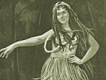

  
[Intangible Textual Heritage](../../index)  [Pacific](../index) 
[Index](index)  [Previous](ulh38)  [Next](ulh40) 

------------------------------------------------------------------------

[Buy this Book at
Amazon.com](https://www.amazon.com/exec/obidos/ASIN/B0024FAH3E/internetsacredte)

------------------------------------------------------------------------

  
*Unwritten Literature of Hawaii*, by Nathaniel B. Emerson, \[1909\], at
Intangible Textual Heritage

------------------------------------------------------------------------

 

  [  
Click to enlarge](img/pl23.jpg)  
PLATE XXIII  
HINANO HALA  
MALE FLOWER OF THE PANDANUS ODORATISSIMUS  

 

p. 235

# XXXV.--THE HULA KILU

The hula *kilu* was so called from being used in a sport bearing that
name which was much patronized by the alii class of the ancient régime.
It was a betting game, or, more strictly, forfeits were pledged, the
payment of which was met by the performance of a dance, or by the
exaction of kisses and embraces. The satisfaction of these forfeits not
unfrequently called for liberties and concessions that could not be
permitted on the spot or in public, but must wait the opportunity of
seclusion. There were, no doubt, times when the conduct of the game was
carried to such a pitch of license as to offend decency; but as a rule
the outward proprieties were seemingly as well regarded as at an
old-fashioned husking bee, when the finding of the "red ear" conferred
or imposed the privilege or penalty of exacting or granting the blushing
tribute of a kiss. Actual improprieties were not witnessed.

The game of *kilu* was played in an open matted space that lay between
the two divisions of the audience--the women being on one side and the
men on the other. Any chief of recognized rank in the *papa alii* was
permitted to join in the game; and kings and queens were not above
participating in the pleasures of this sport. Once admitted to the hall
or inclosure, all were peers and stood on an equal footing as to the
rules and privileges of the game. King nor queen could plead exemption
from the forfeits incurred nor deny to another the full exercise of
privileges acquired under the rules.

The players, five or more of each sex, having been selected by the
president, La *anoano* ("quiet day"), sat facing each other in the space
between the spectators. In front of each player stood a conical block of
heavy wood, broad at the base to keep it upright. The kilu, with which
the game was played, was an oval, one-sided dish, made by cutting in two
an egg-shaped coconut shell. The object of the player was to throw his
kilu so that it should travel with a sliding and at the same time a
rotary motion across the matted floor and hit the wooden block which
stood before the one of his choice on the side opposite. The men and the
women took turns in playing. A successful hit entitled the player to
claim a kiss from his opponent, a toll which was exacted at once.
Success in winning ten points made one the victor in the game, and,
according to some, entitled him to claim the larger forfeit, such as was
customary in the democratic

p. 236

game of *ume*. The payment of these extreme forfeits was delayed till a
convenient season, or might be commuted--on grounds of policy, or at the
request of the loser, if a king or queen--by an equivalent of land or
other valuable possession. Still no fault could be found if the winner
insisted on the strict payment of the forfeit.

The game of kilu was often got up as a compliment, a supreme expression
of hospitality, to distinguished visitors of rank, thus more than making
good the polite phrase of the Spanish don, "all that I have is yours."

The fact that the hula kilu was performed by the alii class, who took
great pains and by assiduous practice made themselves proficient that
they might be ready to exhibit their accomplishment before the public,
was a guarantee that this hula, when performed by them, would be of more
than usual grace and vivacity. When performed in the halau as a tabu
dance, according to some, the olapa alone took part, and the number of
dancers, never very large, was at times limited to one performer.
Authorities differ as to whether any musical instrument was used as an
accompaniment. From an allusion to this dance met with in an old story
it is quite certain that the drum was sometimes used as an
accompaniment.

Let us picture to ourselves the scene: A shadowy, flower-scented hall;
the elite of some Hawaiian court and their guests, gathered, in accord
with old-time practice, to contend in a tournament of wit and grace and
skill, vying with one another for the prize of beauty. The president has
established order in the assembly; the opposing players have taken their
stations, each one seated behind his target-block. The tallykeeper of
one side now makes the challenge. "This kilu," says he, "is a love
token; the forfeit a kiss." An Apollo of the opposite side joyfully
takes up the gauge. His tallykeeper introduces him by name. He plumes
himself like a wild bird of gay feather, standing forth in the decorous
finery of his rank, girded and flower-bedecked after the manner of the
halau, eager to win applause for his party not less than to secure for
himself the loving reward of victory. In his hand is the instrument of
the play, the kilu; the artillery of love, however, with which he is to
assail the heart and warm the imagination of the fair woman opposed to
him is the song he shoots from his lips.

The story of the two songs next to be presented is one, and will show us
a side of Hawaiian life on which we can not afford entirely to close our
eyes. During the stay at Lahaina of Kamehameha, called the Great--whom
an informant in this matter always calls "the murderer," in protest
against the treacherous assassination of Keoua, which took place at
Kawaihae in Kamehameha's very presence--a high chiefess of his court
named Kalola engaged in a love affair with a young man of rank named
Ka’i-áma. He was

p. 237

much her junior, but this did not prevent his infatuation. Early one
morning she rose, leaving him sound asleep, and took canoe for Molokai
to serve as one of the escort to the body of her relative, Keola, on the
way to its place of sepulture.

Some woman, appreciating the situation, posted to the house and waked
the sleeper with the information. Ka’iáma hastened to the shore, and as
he strained his vision to gain sight of the woman of his infatuation the
men at the paddles and the bristling throng on the central platform--the
*pola*---of the craft, vanishing in the twilight, made on his
imagination the impression of a hazy mountain thicket floating on the
waves, but hiding from view some rare flower. He gave vent to his
feelings in song:

*Mele*

Pua ehu kamaléna [a](#fn_450) ka uka o
Kapa’a;  
Luhi-ehu iho la [b](#fn_451) ka pua i
Maile-húna;  
Hele a ha ka iwi [c](#fn_452) a ke Koolau,  
Ke puá mai i ka maka o ka nahelehele,  
5 I hali hoo-muú, [d](#fn_453) hoohalana i
Wailua.  
Pa kahea a Koolau-wahine,  
O Pua-ke’i, e-e-e-e!  
He pua laukona [e](#fn_454) ka moe e aloh’
ai;  
O ia moe la, e kaulele hou, [f](#fn_455)  
10 No ka po i hala aku aku net.  
Hoiho kaua a eloelo, e ka hoa, e,  
A hookahi!

\[Translation\]

*Song*

Misty and dim, a bush in the wilds of Kapa’a,  
The paddlers bend to their work, as the flower-laden  
Shrub inclines to the earth in Maile-húna;  
They sway like reeds in the breeze to crack their bones--  
5 Such the sight as I look at this tossing grove,  
The rhythmic dip and swing on to Wailua.  
My call to the witch shall fly with the breeze,  
Shall be heard at Pua-ke’i, e-he, e-he!  
The flower-stalk Laukóna beguiles man to love,  
10 Can bring back the taste of joys once our own,

p. 238

Make real again the hours that are flown.  
Turn hither, mine own, let's drench us with love--  
Just for one night!

The unchivalrous indiscretion of the youth in publishing the secret of
his amour elicited from Kamehameha only the sarcastic remark, "Couldn't
he eat his food and keep his mouth shut?" The lady herself took the same
view of his action. There was no evasion in her reply; her only reproach
was for his childishness in blabbing.

*Mele*

Kálakálaíhi, kaha [a](#fn_456) ka La ma ke kua
o Lehua;  
Lulana iho la ka pihe a ke Akua; [b](#fn_457)  
Ea mai ka Unulau [c](#fn_458) o Halali’i;  
Lawe ke Koolau-wahine [d](#fn_459) i ka hoa la,
lilo;  
5 Hao ka Mikioi [e](#fn_460) ke kai o Lehua:  
Puwa-i’a na hoa-makani [f](#fn_461) mai lalo,
e-e-e, a.  
I hoonalonalo i ke aloha, pe’e ma-loko;  
Ha’i ka wai-maka hanini;  
I ike aku no i ka uwe ana iho;  
10 Pelá wale no ka hoa kamalii, c-e, a!

\[Translation\]

*Song*

The sun-furrow gleams at the back of Lehua;  
The King's had his fill of scandal and chaff;  
The wind-god empties his lungs with a laugh;  
And the Mikioi tosses the sea at Lehua,  
5 As the trade-wind wafts his friend on her way--  
A congress of airs that ruffles the bay.  
Hide love 'neath a mask--that's all I would ask.  
To spill but a tear makes our love-tale appear;  
He pours out his woe; I've seen it, I know;  
10 That's the way with a boy-friend, heigh-ho!

The art of translating from the Hawaiian into the English tongue
consists largely in a fitting substitution of generic for specific
terms. The Hawaiian, for instance, had at command scores of specific
names for the same wind, or for the local modifications that were
inflicted

p. 239

upon it by the features of the landscape. One might almost say that
every cape and headland imposed a new nomenclature upon the breeze whose
direction it influenced. He rarely contented himself with using a broad
and comprehensive term when he could match the situation with special
form.

The singer restricts her blame to charging her youthful lover with an
indiscreet exhibition of childish emotion. The mere display of emotion
evinced by the shedding of tears was in itself a laudable action and in
good form.

This first reply of the woman to her youthful lover did not by any means
exhaust her armament of retaliation. When she next treats of the affair
it is with an added touch of sarcasm and yet with a sang frond that
proved it had not unsettled her nerves.

*Mele*

Ula Kala’e-loa [a](#fn_462) i ka lepo a ka
makani;  
Hoonu’anu’a na pua i Kalama-ula,  
He hoa i Ra la’i a ka manu-- [b](#fn_463)  
Manu ai ia i ka hoa laukona.  
5 I keke lau-au’a ia e ka moe;  
E kuhi ana ia he kanaka e.  
Oau no keia mai luna a lalo;  
Huná ke aloha, pe’e maloko.  
Ike 'a i ka uwe ana iho.  
10 Pelá ka hoa kamalii--  
He uwe wale ke kamalii.

\[Translation\]

*Song*

Red glows Kala’e through the wind-blown dust  
That defiles the flowers of Lama-ula,  
Outraged by the croak of this bird,  
That eats of the aphrodisiac cane,  
5 And then boasts the privileged bed.  
He makes me a creature of outlaw:  
True to myself from crown to foot-sole,  
My love I've kept sacred, pent up within.  
He flouts it as common, weeping it forth  
10 That is the way with a child-friend;  
A child just blubbers at nothing.

To return to the description of the game, the player, having uttered his
vaunt in true knightly fashion, with a dexterous whirl now sends his
kilu spinning on its course. If his play is successful and the kilu
strikes the target on the other side at which he aims, the

p. 240

audience, who have kept silence till now, break forth in applause, and
his tally-keeper proclaims his success in boastful fashion:

*Oli*

A úweuwé ke kó'e a ke kae;  
Puehuehu ka la, komo inoino;  
Kakía, kahe ka ua ilalo.

\[Translation\]

Now wriggles the worm to its goal;  
A tousling; a hasty encounter;  
A grapple; down falls the rain.

It is now the winner's right to cross over and claim his forfeit. The
audience deals out applause or derision in unstinted pleasure; the
enthusiasm reaches fever-point when some one makes himself the champion
of the game by bringing his score up to ten, the limit. The play is
often kept up till morning, to be resumed the following night. [a](#fn_464)

Here also is a mele, which tradition reports to have been cantillated by
Hiiaka, the sister of Pele, during her famous kilu contest with the
Princess Pele-ula, which took place at Kou--the ancient name for
Honolulu--on Hiiaka's voyage of return from Kauai to her sister's court
at Kilauea. In this affair Lohiau and Wahine-oma’o contended on the side
of Hiiaka, while Pele-ula, was assisted by her husband, Kou, and by
other experts. But on this occasion the dice were cogged; the victory
was won not by human skill but by the magical power of Hiiaka, who
turned Pele-ula's kilu away from the target each time she threw it, but
used her gift to compel it to the mark when the kilu was cast by
herself.

*Mele*

Ku’u hoa mai ka makani kuehu-kapa o Kalalau, [b](#fn_465)  
Mai na pali ku’i [c](#fn_466) o Makua-iki,  
Ke lawe la i ka haka, [d](#fn_467) a lilo!  
A lilo o-e, la!  
5 Ku’u kane i ka uhu ka’i o Maka-pu’u,  
Huki iluna ka Lae-o-ka-laau; [e](#fn_468)  
Oia pali makaa-ole [f](#fn_469) olaila.  
Ohiohi ku ka pali o Ulamao, e-e!  
A lilo oe, la!

p. 241

\[Translation\]

*Song*

Comrade mine in the robe-stripping gusts of Lalau,  
On the up-piled beetling cliffs of Makua,  
The ladder \* \* \* is taken away \* \* \* It is gone!  
Your way is cut off, my man!  
5 With you I've backed the uhu of Maka-pu’u,  
Tugging them up the steeps of Point-o’-woods,  
A cliff that stands fatherless, even as  
Sheer stands the pall of Ula-mao--  
And thus \* \* \* you are lost!

This is but a fragment of the song which Hiiaka pours out in her efforts
to calm the fateful storm which she saw piling up along the horizon. The
situation was tragic. Hiiaka, daring fate, defying the dragons and
monsters of the primeval world, had made the journey to Kauai, had
snatched away from death the life of Lohiau and with incredible
self-denial was escorting the rare youth to the arms of her sister,
whose jealousy she knew to be quick as the lightning, her vengeance hot
as the breath of the volcano, and now she saw this feather-head, with
monstrous ingratitude, dallying with fate, calling down upon the whole
party the doom she alone could appreciate, all for the smile of a siren
whose charms attracted him for the moment; but, worst of all, her heart
condemned her as a traitress--she loved him.

Hiiaka held the trick-card and she won; by her miraculous power she kept
the game in her own hands and foiled the hopes of the lovers.

*Mele*

Ula ka lani ia Kanaloa, [a](#fn_470)  
Ula ma’ema’e ke ahi a ke A’e-loa. [b](#fn_471)  
Pohina iluna i ke ao makani,  
Naue pu no i ka ilikai o Makahana-loa, [c](#fn_472)  
5 Makemake i ka ua lihau. [d](#fn_473)  
Aohe hana i koe a Ka-wai-loa; [e](#fn_474)  
Noho a ka li’u-lá i ke kula.  
I kula oe no ka makemake, a hiki iho,  
I hoa hula no ka la le’ale’a,  
10 I noho pu me ka uahi pohina. [f](#fn_475)

p. 242

Hina oe i ka Naulu, [a](#fn_476) noho pu me ka
Inuwai. [b](#fn_477)  
Akahi no a pumehana ka hale, ua hiki oe:  
Ma’ema’e ka luna i Haupu. [c](#fn_478)  
Upu ka makemake e ike ia Ka-ala.  
15 He ala ka makemake e ike ia Lihu'e; [d](#fn_479)  
Ku’u uka ia noho ia Halemano. [e](#fn_480)  
Maanei oe, pale oe, pale au,  
Hana ne’e ke kikala i ka ha’i keiki.  
Hai'na ka manao--noho i Waimea,  
20 Hoonu’u pu i ka i’a ku o ka aina. [f](#fn_481)  
E kala oe a kala au a kala ia Ku, Ahuena. [g](#fn_482)

\[Translation\]

*Song*

Kanaloa tints heaven with a blush,  
'Tis the flame of the A’e, pure red,  
And gray the wind-clouds overhead.  
We trudge to the waters calm of Kahana--  
5 Heaven grant us a favoring shower!  
The work is all done on the farm.  
We stay till twilight steals o’er the plain  
Then, love-spurred, tramp o’er it again,  
Have you as partner in holiday dance--  
10 We've moiled as one in the gray smoke;  
Cast down by the Naulu, you thirst.  
For once the house warms at your coming.  
How clear glow the heights of you Haupu!  
I long for the sight of Ka-ala,  
15 And sweet is the thought of Lihu'e,  
And our mountain retreat, Hale-mano.  
Here, fenced from each other by tabu,  
Your graces make sport for the crowd.  
What then the solution? Let us dwell  
20 At Waimea and feast on the fish  
That swarm in the neighboring sea,  
With freedom to you and freedom to me,  
Licensed by Ku and by Ahu-éna.

p. 243

The scene of this idyl is laid in the district of Waialua, Oahu, but the
poet gives his imagination free range regardless of the unities. The
chief subjects of interest that serve as a trellis about which the human
sentiments entwine concern the duties of the fisherman, who is also a
farmer; the school for the hula, in which the hero and the heroine are
pupils; and lastly an ideal condition of happiness which the lovers look
forward to under the benevolent dispensation of the gods Ku and Ahuena.

Among the numerous relatives of Pele was one said to be a sister, who
was stationed on a bleak sun-burnt promontory in Koolau, Oahu, where she
supported a half-starved existence, striving to hold soul and body
together by gathering the herbs of the fields, eked out by unsolicited
gifts of food contributed by passing travelers. The pathetic plaint
given below is ascribed to this goddess.

*Mele*

Mao wale i ka lani  
Ka leo o ke Akua pololi.  
A pololi a moe au  
O ku’u la pololi,  
5 A ola i kou aloha;  
I na’i pu no i ka waimaka e uwe nei.  
E uwe kaua, e!

\[Translation\]

*Song*

Engulfed in heaven's abyss  
Is the cry of the famished god.  
I sank to the ground from faintness,  
My day of utter starvation;  
5 Was rescued, revived, by your love:  
Ours a contest of tears sympathetic--  
Let us pour out together our tears.

The Hawaiian thought it not undignified to express sympathy
(*aloha-ino*) with tears.

------------------------------------------------------------------------

### Footnotes

[237:a](ulh39.htm#fr_466) *Pua ehu kamaléna*
(yellow child). This exclamation is descriptive of the man's visual
impression on seeing the canoe with its crowd of passengers and
paddlers, in the misty light of morning, receding in the distance. The
kamaléna is a mountain shrub having a yellow flower.

[237:b](ulh39.htm#fr_467) *Luhi ehu iho la*.
Refers to the drooping of a shrub under the weight of its leaves and
flowers, a figure applied to the bending of the paddlemen to their work.

[237:c](ulh39.htm#fr_468) *Hele a ha ka iwi*.
An exaggerated figure of speech, referring to the exertions of the men
at their paddles (ha, to strain).

[237:d](ulh39.htm#fr_469) *I hali hoomú*. This
refers in a fine spirit of exaggeration to the regular motions of the
paddlers.

[237:e](ulh39.htm#fr_470) *Pua laukona*. A kind
of sugar-cane which was prescribed and used by the kahunas as an
aphrodisiac.

[237:f](ulh39.htm#fr_471) *Kaulele hou*. To
experience, or to enjoy, again.

[238:a](ulh39.htm#fr_472) The picture of the
sun declining, *kaha*, to the west, its reflected light-track, *kala
kalaihi*, furrowing the ocean with glory, may be taken to be figurative
of the loved and beautiful woman, Kalola, speeding on her westward
canoe-flight.

[238:b](ulh39.htm#fr_473) *Akua*. Literally a
god, must stand for the king.

[238:c](ulh39.htm#fr_474) *Unulau*. A special
name for the trade-wind.

[238:d](ulh39.htm#fr_475) *Koolau-wahine*.
Likewise another name for the trade-wind, here represented as carrying
off the (man's) companion.

[238:e](ulh39.htm#fr_476) *Mikioi*. An
impetuous, gusty wind is represented as lashing the ocean at Lehua, thus
picturing the emotional stir attending Kalola's departure.

[238:f](ulh39.htm#fr_477) The words *Puwa-i’a
na hoa makani*, which literally mean that the congress of winds, *na hoa
makani*, have stirred up a commotion, even as a school of fish agitate
the surface of the ocean, *puwa-i’a*, refer to the scandal caused by
Ka’i-ama's conduct.

[239:a](ulh39.htm#fr_478) *Kala’e-loa*. The
full name of the place on Molokai now known as Kala’e.

[239:b](ulh39.htm#fr_479) *La’i a ka manu*.
Some claim this to be a proper name, *La’i-a-ka-manu*, that of a place
near Kala’e. However that may be the poet evidently uses the phrase here
in its etymological sense.

[240:a](ulh39.htm#fr_480) The account above
given is largely based on David Malo's description of the game kilu. In
his confessedly imperfect list of the hulas he does not mention the hula
kilu. This hula was, however, included in the list of hulas announced
for performance in the programme of King Kalakaua's coronation
ceremonies.

[240:b](ulh39.htm#fr_481) *Ka-lalau* (in the
translation by the omission of the article *ka*, shortened to *Lalau*).
A deep cliff-bound valley on the windward side of Kauai. accessible only
at certain times of the year by boats and by a steep mountain trail at
its head.

[240:c](ulh39.htm#fr_482) *Pala ku’i*. *Ku’i*
means literally to join together, to splice or piece out. The cliffs
tower one above another like the steps of a stairway.

[240:d](ulh39.htm#fr_483) *Haka*. A ladder or
frame such as was laid across a chasm or set up at an impassable place
in a precipitous road. The windward side of Kauai about Kalalau abounded
in such places.

[240:e](ulh39.htm#fr_484) *Lae-o-ka-laau*. The
southwest point of Molokai. on which is a light-house.

[240:f](ulh39.htm#fr_485) *Makua-ole*.
Literally fatherless, perhaps meaning remarkable, without peer.

[241:a](ulh39.htm#fr_486) *Kanaloa*. One of the
four great gods of the Hawaiians, here represented as playing the part
of Phœbus Apollo.

[241:b](ulh39.htm#fr_487) *A’e-loa*. The name
of a wind whose blowing was said to be favorable to the fisherman in
this region.

[241:c](ulh39.htm#fr_488) *Makahana-loa*. A
favorite fishing ground. The word *ilikai* ("skin of the sea")
graphically depicts the calm of the region. In the translation the name
aforementioned has been shortened to Kahana.

[241:d](ulh39.htm#fr_489) *Lihau*. A gentle
rain that was considered favorable to the work of the fisherman.

[241:e](ulh39.htm#fr_490) *Ka-wai-loa*. A
division of Waialua, here seemingly used to mean the farm.

[241:f](ulh39.htm#fr_491) *Uahi pohina*.
Literally gray-headed smoke. It is said that when studying together the
words of the mele the pupils and the kumu would often gather about a
fire, while the teacher recited and expounded the text. There is a
possible allusion to this in the mention of the smoke.

[242:a](ulh39.htm#fr_492) *Naulu*. A wind.

[242:b](ulh39.htm#fr_493) *Inu-wai*. A wind
that dried up vegetation, here indicating thirst.

[242:c](ulh39.htm#fr_494) Haupu. A mountain on
Kauai, sometimes visible on Oahu in clear weather. (See note e, [p.
229](ulh37.htm#page_229), on Haupu.)

[242:d](ulh39.htm#fr_495) *Lihu'e*. A beautiful
and romantic region nestled, as the Hawaiians say, "between the thighs
of the mountain," Mount Kaala.

[242:e](ulh39.htm#fr_496) *Hale-mano*.
Literally the multitude of houses: a sylvan region bound to the south
western flank of the Konahuanni range of mountains, a region of legend
and romance, since the coming of the white mau given over to the ravage
and desolation that follow the free-ranging of cattle and horses, the
vaquero, and the abusive use of fire and ax by the woodman.

[242:f](ulh39.htm#fr_497) *I'a ku o ka aina*.
Fish common to a region; in this place it was probably the kala, which
word is found in the next line, though in a different sense. Here the
expression is doubtless a euphemism for dalliance.

[242:g](ulh39.htm#fr_498) *Ku*, *Ahuena*. At
Waimea, Oahu, stood two rocks on the opposite bluffs that sentineled the
bay. These rocks were said to represent respectively the gods Ku and
Ahuena, patrons of the local fishermen.

------------------------------------------------------------------------

[Next: XXXVI.--The Hula Hoo-na-ná](ulh40)
