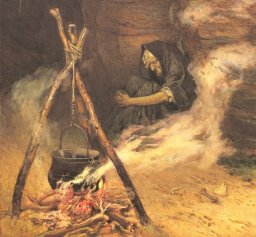

[Intangible Textual Heritage](../../index)  [Paganism](../index.md) 

------------------------------------------------------------------------

<table width="75%">
<colgroup>
<col style="width: 50%" />
<col style="width: 50%" />
</colgroup>
<tbody>
<tr class="odd">
<td width="50%" data-valign="TOP"> 
</td>
<td width="50%" data-valign="TOP"><h1 id="the-book-of-halloween" data-align="CENTER">The Book of Hallowe'en</h1>
<h2 id="by-ruth-edna-kelley" data-align="CENTER">by Ruth Edna Kelley</h2>
<h4 id="section" data-align="CENTER">[1919]</h4></td>
</tr>
</tbody>
</table>

------------------------------------------------------------------------

This is a comprehensive exploration of the Pagan roots of Halloween.  
This text was donated by Eliza from
[sacredspiral.com](https://www.sacredspiral.com/.md). Thanks Eliza!

------------------------------------------------------------------------

[Title Page](boh00.md)  
[Preface](boh01.md)  
[Contents](boh02.md)  
[Chapter I: Sun-Worship. The Sources of Hallowe'en](boh03.md)  
[Chapter II: The Celts: Their Religion and Festivals](boh04.md)  
[Chapter III: Samhain](boh05.md)  
[Chapter IV: Pomona](boh06.md)  
[Chapter V: The Coming of Christianity. All Saints'. All
Souls'](boh07.md)  
[Chapter VI: Origin And Character Of Hallowe'en Omens](boh08.md)  
[Chapter VII: Hallowe'en Beliefs and Customs in Ireland](boh09.md)  
[Chapter VIII: In Scotland and the Hebrides](boh10.md)  
[Chapter IX: In England and Man](boh11.md)  
[Chapter X: In Wales](boh12.md)  
[Chapter XI: In Brittany and France](boh13.md)  
[Chapter XII: The Teutonic Religion. Witches.](boh14.md)  
[Chapter XIII: Walpurgis Night](boh15.md)  
[Chapter XIV: More Hallowtide Beliefs and Customs](boh16.md)  
[Chapter XV: Hallowe'en in America](boh17.md)  
[Four Poems](boh18.md)  
